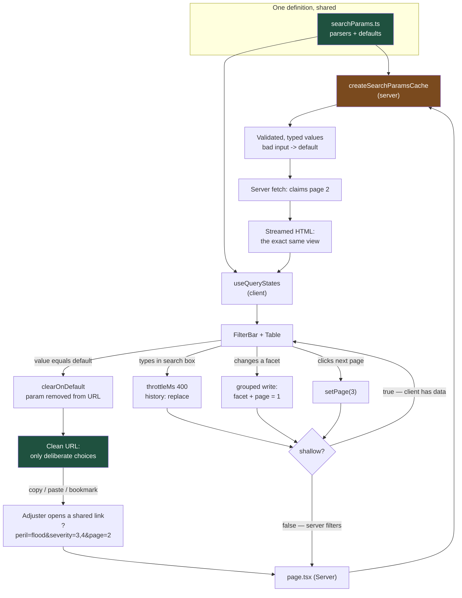

# The URL Is a Feature: Type-Safe Search-Param State with nuqs

If a user cannot send you a link to what they are looking at, your filter state is in the wrong place. The URL is the only piece of application state that is shareable, bookmarkable, back-button-aware, and reproducible by someone who is not sitting at that desk.

## The Real-World Problem

A general insurer's **claims triage console** is where 340 adjusters and team leaders live all day. The queue view filters across nine dimensions: peril, severity band, reserve range, days-since-notification, handler, region, fraud-score threshold, litigation flag, and a free-text search over the loss description. Then it sorts, then it paginates.

Every one of those lived in `useState`.

Three costs, in the order the business noticed them.

**Support could not reproduce anything.** A team leader raised "the queue is showing closed claims in the open bucket." The screenshot showed a table. Support asked what filters were applied. The team leader did not know — they had been clicking for ten minutes. Mean time to reproduce on queue-view tickets was measured at **two days**, almost entirely spent in email reconstructing filter state. The URL for every one of those tickets was `/claims/queue`.

**Adjusters rebuilt the same view every morning.** The nine filters that define "my subrogation candidates over £25,000" took roughly 40 seconds to re-apply. Nobody could bookmark it. Product logged a "saved searches" epic, estimated at six weeks, to build a feature the browser has shipped since 1993.

**Then the audit finding.** An internal review of a claims-handling complaint needed to establish what a specific handler saw at a specific point in a decision. There was no way to reconstruct the view. The team's answer — "we can rebuild it if we know the filters" — was not acceptable evidence, and the finding was written up as an inability to reproduce the operational view presented to a decision-maker.

The back button made it worse rather than better: it navigated away from the queue entirely, discarding ten minutes of filtering, because the browser had no record that anything had changed.

The fix was not a saved-search service. It was moving nine pieces of state twenty characters to the right, into the query string.

## The Concept

### What belongs in the URL

The test is one question: **would a second person, or the same person tomorrow, need this to see what I am seeing?**

| Belongs in the URL | Belongs in `useState` |
|---|---|
| Filters, facets, search text | Is the filter drawer open |
| Sort field and direction | Which row is hovered |
| Page number, page size | Uncommitted text in a dialog before submit |
| Date ranges | Transient toast visibility |
| Selected tab / view mode | Focus position, scroll offset |
| Selected entity id in a master–detail split | Optimistic in-flight indicator |

Two things never belong in the URL: **secrets or PII** (query strings land in access logs, referrer headers, browser history, and pasted Slack messages — never put a national ID or a claimant name in a param), and **large blobs** (the practical limit is a few kilobytes before proxies and mail clients start truncating).

### What nuqs adds over `useSearchParams`

`useSearchParams` gives you `string | null` and a manual `router.replace` with hand-built query strings. That is the whole gap:

| Concern | Raw `useSearchParams` | nuqs |
|---|---|---|
| Types | `string \| null` everywhere, parsed at each call site | Parser returns `number`, `Date`, `boolean`, a union, a typed array |
| Defaults | `?? 'default'` scattered through render | `.withDefault()` once; the hook is non-nullable |
| Writing | Clone params, set, stringify, `router.replace` | `setPage(2)` |
| Batching | Multiple writes race and clobber each other | `useQueryStates` writes one transition |
| Server read | Parse strings again in the Server Component, separately | The same parser via `createSearchParamsCache` |
| Throttling | Hand-written debounce plus a history-entry-per-keystroke | `throttleMs` |

The durable win is the last two rows: **one parser definition, used by the client hook and the server render.** That is what stops the client and server disagreeing about what `?severity=3` means.

### Parsers

```ts
import {
  parseAsString, parseAsInteger, parseAsFloat, parseAsBoolean,
  parseAsStringLiteral, parseAsIsoDate, parseAsArrayOf, parseAsJson,
} from 'nuqs/server'
```

| Parser | Use for | Note |
|---|---|---|
| `parseAsString` | Free-text search, ids | Pair with `throttleMs` for typed input |
| `parseAsInteger` | Page, page size, day counts | Rejects `?page=abc` rather than producing `NaN` |
| `parseAsFloat` | Score thresholds, reserve amounts | Never for money you will compute with |
| `parseAsBoolean` | Flags: litigated, reopened | Serialises as `true`/`false` |
| `parseAsStringLiteral([...])` | Enums: sort direction, view mode | **Invalid values fall back to the default** — this is your input validation |
| `parseAsIsoDate` | Date ranges | `2026-08-10`, sorts and reads legibly in a link |
| `parseAsArrayOf(p, ',')` | Multi-select facets | Keep the separator consistent across the app |
| `parseAsJson(schema.parse)` | A genuinely structured param | Last resort — verbose, unreadable, and easy to overflow |

### Defaults stay out of the URL

A default that serialises produces `?page=1&sort=received&dir=desc&severity=all` on first load: ugly, and worse, indistinguishable from a user's deliberate choice. `.withDefault(x)` makes the hook non-nullable **and** — with `clearOnDefault: true`, the v2 default — removes the param when the value returns to the default. Result: a clean URL where **every param present is a decision someone made.** That is exactly the property that makes a shared link readable and an audit trail meaningful.

### `shallow: false` when the server must re-read

By default nuqs updates the URL **without notifying the server** — no RSC re-render, no `page.tsx` re-execution. That is correct and fast when the client already holds the data (client-side filtering, a TanStack Query key change).

Set `shallow: false` when the param feeds a Server Component or a route handler that must run again: server-side pagination, server-side filtering, `generateMetadata`. The cost is a server round trip per change, which is why you combine it with `throttleMs` on text inputs and why you never set it globally without thinking.

### Grouping, throttling, and the page-reset rule

- **`useQueryStates`** writes all changed params in a single history transition. Nine separate `useQueryState` setters fired in one handler can interleave; one grouped write cannot.
- **`throttleMs`** on a text search caps URL writes (a floor of ~50ms; use 300–500ms for typing). Without it you get one history entry per keystroke and the back button becomes useless.
- **Reset `page` to 1 in the same write as any filter change.** Filter to a 3-result set while on page 7 and the user gets an empty table and files a bug. This is the single most common URL-state defect, and grouping the write is the fix.
- **`history: 'push'` vs `'replace'`** — `replace` (the default) for high-frequency changes like typing; `push` for deliberate navigations the user will want to undo, such as opening a claim in a detail pane.

## How It Works



The loop closes at the top: the link a support engineer receives goes through exactly the same parsers as the adjuster's own session, so the view they get is the view that was reported.

## Practical Example

**Wrong — nine `useState`s and an unreproducible screen:**

```tsx
// features/claims/queue.tsx  — DO NOT DO THIS
'use client'

import { useState } from 'react'

export function ClaimsQueue() {
  const [peril, setPeril] = useState<string>('all')
  const [severity, setSeverity] = useState<number[]>([])
  const [search, setSearch] = useState('')
  const [page, setPage] = useState(1)
  const [sort, setSort] = useState('receivedAt')
  // …four more

  // The URL is /claims/queue no matter what the adjuster does.
  // Back button leaves the page. Nothing is bookmarkable or reproducible.
  return <QueueTable /* … */ />
}
```

**Right — one parser module, read by both sides:**

```ts
// features/claims/search-params.ts
import {
  parseAsArrayOf,
  parseAsBoolean,
  parseAsInteger,
  parseAsIsoDate,
  parseAsString,
  parseAsStringLiteral,
  createSearchParamsCache,
  createSerializer,
} from 'nuqs/server'   // 'nuqs/server' is safe to import from Server Components

export const PERILS = ['all', 'flood', 'fire', 'theft', 'motor', 'liability'] as const
export const SORT_FIELDS = ['receivedAt', 'reserve', 'fraudScore', 'daysOpen'] as const
export const DIRECTIONS = ['asc', 'desc'] as const

/**
 * The single source of truth for the queue's URL contract.
 * Every default is omitted from the URL, so a param present is a choice made.
 */
export const claimQueueParams = {
  peril: parseAsStringLiteral(PERILS).withDefault('all'),
  severity: parseAsArrayOf(parseAsInteger, ',').withDefault([]),
  handler: parseAsString.withDefault(''),
  region: parseAsString.withDefault(''),
  minReserve: parseAsInteger.withDefault(0),
  fraudScoreMin: parseAsInteger.withDefault(0),
  litigated: parseAsBoolean.withDefault(false),
  from: parseAsIsoDate,                    // nullable on purpose: "no lower bound"
  to: parseAsIsoDate,
  q: parseAsString.withDefault(''),
  sort: parseAsStringLiteral(SORT_FIELDS).withDefault('receivedAt'),
  dir: parseAsStringLiteral(DIRECTIONS).withDefault('desc'),
  page: parseAsInteger.withDefault(1),
  pageSize: parseAsInteger.withDefault(25),
}

/** Server-side reader. Same parsers, same defaults, same validation. */
export const loadClaimQueueParams = createSearchParamsCache(claimQueueParams)

/** Build links elsewhere in the app without hand-writing query strings. */
export const serializeClaimQueue = createSerializer(claimQueueParams)
```

```tsx
// app/layout.tsx — the adapter is mounted once, at the root
import { NuqsAdapter } from 'nuqs/adapters/next/app'

export default function RootLayout({ children }: { children: React.ReactNode }) {
  return (
    <html lang="en-GB">
      <body>
        <NuqsAdapter>{children}</NuqsAdapter>
      </body>
    </html>
  )
}
```

```tsx
// app/(authenticated)/claims/queue/page.tsx — Server Component
import type { SearchParams } from 'nuqs/server'
import { loadClaimQueueParams } from '@/features/claims/search-params'
import { searchClaims } from '@/server/claims'
import { QueueFilterBar } from '@/features/claims/queue-filter-bar'
import { QueueTable } from '@/features/claims/queue-table'

export const dynamic = 'force-dynamic'

export default async function ClaimsQueuePage({
  searchParams,
}: {
  searchParams: Promise<SearchParams>
}) {
  // Typed and validated: ?severity=banana becomes [] rather than crashing.
  const filters = await loadClaimQueueParams(searchParams)

  // Server-side filtering: 2.4 million claims are not coming to the browser.
  const result = await searchClaims(filters)

  return (
    <div className="space-y-4">
      <QueueFilterBar resultCount={result.total} />
      <QueueTable rows={result.items} total={result.total} />
    </div>
  )
}
```

```tsx
// features/claims/queue-filter-bar.tsx
'use client'

import { useQueryStates, useQueryState, parseAsString } from 'nuqs'
import { claimQueueParams, PERILS } from './search-params'

export function QueueFilterBar({ resultCount }: { resultCount: number }) {
  /**
   * Grouped: every filter change is ONE history entry and ONE server round trip,
   * and it always resets the page in the same write.
   */
  const [filters, setFilters] = useQueryStates(claimQueueParams, {
    shallow: false,        // the Server Component must re-run: filtering is server-side
    history: 'replace',
  })

  /**
   * The text search is separate so it can be throttled independently.
   * Without throttling this is one history entry per keystroke.
   */
  const [q, setQ] = useQueryState(
    'q',
    parseAsString.withDefault('').withOptions({
      shallow: false,
      throttleMs: 400,
      history: 'replace',
    }),
  )

  const toggleSeverity = (band: number) =>
    setFilters((prev) => ({
      severity: prev.severity.includes(band)
        ? prev.severity.filter((s) => s !== band)
        : [...prev.severity, band].sort(),
      page: 1,             // ← the rule: any filter change resets pagination
    }))

  return (
    <div className="flex flex-wrap items-end gap-3 rounded-lg border border-border p-3">
      <label className="flex flex-col text-xs">
        Peril
        <select
          className="rounded border border-border px-2 py-1 text-sm"
          value={filters.peril}
          onChange={(e) =>
            setFilters({ peril: e.target.value as (typeof PERILS)[number], page: 1 })
          }
        >
          {PERILS.map((p) => (
            <option key={p} value={p}>{p}</option>
          ))}
        </select>
      </label>

      <fieldset className="flex gap-2">
        <legend className="text-xs">Severity</legend>
        {[1, 2, 3, 4, 5].map((band) => (
          <button
            key={band}
            type="button"
            aria-pressed={filters.severity.includes(band)}
            onClick={() => toggleSeverity(band)}
            className="rounded border border-border px-2 py-1 text-xs"
          >
            {band}
          </button>
        ))}
      </fieldset>

      <label className="flex flex-col text-xs">
        Notified from
        <input
          type="date"
          className="rounded border border-border px-2 py-1 text-sm"
          value={filters.from ? filters.from.toISOString().slice(0, 10) : ''}
          onChange={(e) =>
            setFilters({ from: e.target.value ? new Date(e.target.value) : null, page: 1 })
          }
        />
      </label>

      <label className="flex flex-col text-xs">
        Search loss description
        <input
          type="search"
          className="rounded border border-border px-2 py-1 text-sm"
          value={q}
          onChange={(e) => setQ(e.target.value || null)}  // null clears the param
          placeholder="e.g. escape of water"
        />
      </label>

      <button
        type="button"
        // Passing null for everything restores defaults AND empties the URL
        onClick={() => { void setFilters(null); void setQ(null) }}
        className="ml-auto rounded border border-border px-3 py-1 text-xs"
      >
        Clear all
      </button>

      <p aria-live="polite" className="w-full text-xs text-text-muted">
        {resultCount.toLocaleString('en-GB')} claims match. This view is in the address bar —
        copy the URL to share it.
      </p>
    </div>
  )
}
```

```tsx
// features/claims/queue-pagination.tsx
'use client'

import { useQueryStates } from 'nuqs'
import { claimQueueParams } from './search-params'

export function QueuePagination({ total }: { total: number }) {
  const [{ page, pageSize }, set] = useQueryStates(
    { page: claimQueueParams.page, pageSize: claimQueueParams.pageSize },
    { shallow: false, history: 'push' },   // page changes are worth a back-button stop
  )
  const lastPage = Math.max(1, Math.ceil(total / pageSize))

  return (
    <nav aria-label="Claims queue pages" className="flex items-center gap-2 text-sm">
      <button type="button" disabled={page <= 1} onClick={() => set({ page: page - 1 })}>
        Previous
      </button>
      <span aria-current="page">Page {page} of {lastPage}</span>
      <button type="button" disabled={page >= lastPage} onClick={() => set({ page: page + 1 })}>
        Next
      </button>
      <select
        aria-label="Rows per page"
        value={pageSize}
        onChange={(e) => set({ pageSize: Number(e.target.value), page: 1 })}
      >
        {[25, 50, 100].map((n) => <option key={n} value={n}>{n}</option>)}
      </select>
    </nav>
  )
}
```

**Deep-linking from elsewhere, with no hand-built query string:**

```ts
// features/claims/links.ts
import { serializeClaimQueue } from './search-params'

/** Used by the daily digest email and the team-leader dashboard tiles. */
export function subrogationCandidatesHref(handlerId: string) {
  return serializeClaimQueue('/claims/queue', {
    peril: 'all',
    minReserve: 25_000,
    litigated: false,
    handler: handlerId,
    sort: 'reserve',
    dir: 'desc',
    page: 1,          // default: omitted from the output automatically
  })
  // → /claims/queue?minReserve=25000&handler=H-4412&sort=reserve
}
```

**A test that pins the two rules people break:**

```ts
// features/claims/search-params.test.ts
import { loadClaimQueueParams, serializeClaimQueue } from './search-params'

it('falls back to defaults on hostile or malformed input', async () => {
  const filters = await loadClaimQueueParams(
    Promise.resolve({ peril: 'banana', severity: 'x,y', page: '-;drop', dir: 'sideways' }),
  )
  expect(filters.peril).toBe('all')
  expect(filters.severity).toEqual([])
  expect(filters.page).toBe(1)
  expect(filters.dir).toBe('desc')
})

it('omits defaults so every param in the URL is a deliberate choice', () => {
  const href = serializeClaimQueue('/claims/queue', { peril: 'flood', page: 1, dir: 'desc' })
  expect(href).toBe('/claims/queue?peril=flood')
})
```

## Enterprise Trade-offs

| Approach | Pros | Cons | When to use (Banking / Insurance / Enterprise) |
|---|---|---|---|
| **nuqs with `shallow: false`** | Server re-reads params; shareable link renders identically for anyone; SSR-correct | A server round trip per change; needs throttling on text inputs | Server-side filtered/paginated tables — claims queues, payment inboxes, order books |
| **nuqs with default `shallow: true`** | Instant, no server hit; pairs perfectly with a TanStack Query key | Server Components and `generateMetadata` do not see the change | Client-side filtering of an already-fetched dataset; view-mode and tab state |
| **`useQueryStates` grouped writes** | One history entry, no interleaving, page reset in the same transition | Slightly more ceremony than nine separate hooks | Any filter bar with more than two controls. Effectively always |
| **`useState` for filters** | Fastest to write | Unshareable, unbookmarkable, back button broken, unreproducible for support and audit | Genuinely ephemeral UI only: drawer open, hover, focus |
| **A saved-search backend feature** | Named, permissioned, shareable across teams; survives a URL-scheme change | A service, a schema, migrations, and a permissions model to build and maintain | Only after URL state exists — build it as "save this URL", not as a parallel state system |
| **`parseAsJson` for the whole filter object** | One param; arbitrary structure | Unreadable, unbookmarkable in practice, easy to exceed URL limits, breaks partial deep-links | A genuinely nested structure with no flat equivalent. Rare |
| **PII or ids-with-meaning in params** | — | Query strings persist in access logs, referrers, history and pasted links — a GDPR exposure | Never. Filter by opaque id, never by claimant name or national identifier |

## Why This Still Matters Through 2030

The URL is the web's only durable, transport-independent state container, and everything around it keeps reinforcing that rather than replacing it: deep links are how enterprise tools get embedded in each other, how a Teams message becomes a triage action, how an incident ticket references a view, and how an auditor is shown what a decision-maker saw. None of those consumers can read your `useState`. The specific library will keep evolving — nuqs is a thin adapter over `URLSearchParams` and the framework router, and adapters are the part that churns — but the pattern it encodes is the stable bit: one typed parser definition, validated identically on server and client, defaults omitted so that the URL contains only deliberate choices. That last property is quietly the most valuable in a regulated setting, because it turns the address bar into a legible record of what was filtered, and a copied link into reproducible evidence. Teams that put filter state in the URL do not later build a saved-search feature, a "share this view" feature, or a support-reproduction tool. They already have all three.

→ Next: [08-forms-with-react-hook-form-and-zod.md](08-forms-with-react-hook-form-and-zod.md) · Related: [../10-example-code/react/nuqs-url-state-example.md](../10-example-code/react/nuqs-url-state-example.md) · [../05-apis-and-integration/01-rest-api-design-principles.md](../05-apis-and-integration/01-rest-api-design-principles.md)
