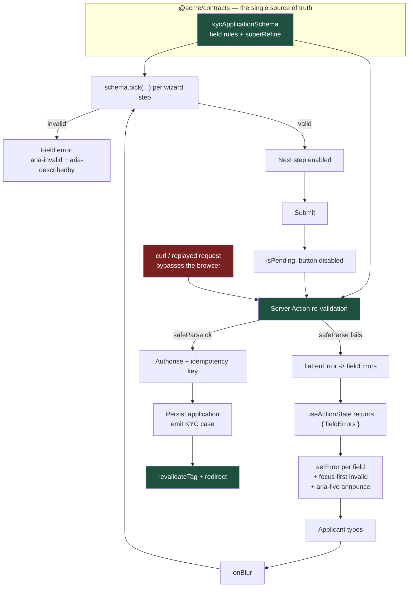

# One Schema, Both Sides: React Hook Form and Zod for Forms That Cannot Be Wrong

A validation rule written twice is a validation rule that will disagree with itself. The only defensible architecture for a high-stakes enterprise form is one schema, authored once, executed on the client for feedback and on the server for truth.

## The Real-World Problem

A commercial bank launched digital **KYC onboarding for business customers** — a nine-step application covering the legal entity, registered and trading addresses, beneficial owners above 25%, directors, expected turnover, source of funds, sanctions declarations, and document upload. Regulatory rework: the form is the control that keeps unverifiable applications out of the onboarding queue.

Validation was written twice. The React front end had hand-rolled rules in `onChange` handlers. The Java service had Bean Validation annotations. Both were written from the same requirements document, three months apart, by different teams.

They drifted, in three specific ways.

The **company registration number** was `^[A-Z0-9]{8}$` on the client and `^[A-Z]{2}[0-9]{6}$|^[0-9]{8}$` on the server. Applicants with a Scottish `SC`-prefixed number passed the client, filled all nine steps, uploaded four documents, and were rejected on submit with `500 — validation failed`. Support could not tell them which field was wrong, because the server returned no field mapping.

The **beneficial-owner ownership percentages** were validated per-field on the client (each between 0 and 100) but summed on the server (total must not exceed 100). An applicant entering three owners at 50% each got through eight steps before a terminal error.

The **incident that closed the argument**: the server accepted a trading address with no postcode, because the annotation was on the registered-address class only. Eleven business accounts were opened with unverifiable addresses. They were caught in a quarterly file review and had to be remediated one by one, with an internal finding recorded against the onboarding control.

The measured cost was an **application abandonment rate of 34% at the review step**, and a support queue where the most common ticket was "the form says my registration number is fine but submitting fails." The rebuild deleted both rule sets and replaced them with one Zod schema in a shared package, imported by the form and by the server action.

## The Concept

### The founding principle: one schema, two executions

| | Client execution | Server execution |
|---|---|---|
| **Purpose** | Immediate, per-field feedback | The decision. The only one that counts |
| **Trust** | None. It runs in a browser the user controls | Total |
| **Can be skipped?** | Yes — curl, devtools, a replayed request | Never |
| **Source** | `@acme/contracts` | `@acme/contracts` — the same file |

The client validation is a **user-experience feature**. The server validation is the **control**. Sharing the schema is what makes those two things agree, and it is why the schema lives in a package that both import rather than being copied into each.

The corollary that teams resist: **server-side re-validation is not optional even when the client already validated.** A request that arrives at your server action did not necessarily come from your form.

### React Hook Form's model, and why it fits enterprise forms

RHF keeps input state in refs and subscribes narrowly, so typing in field 40 of a 60-field application does not re-render fields 1–39. On a nine-step KYC form with field arrays that is the difference between responsive and sluggish. The pieces you actually use:

| API | Role |
|---|---|
| `useForm({ resolver: zodResolver(schema), defaultValues })` | Typed form instance; `defaultValues` is where the TypeScript inference starts |
| `register` / `Controller` | Native inputs vs. controlled third-party components |
| `useFieldArray` | Repeating sections: beneficial owners, directors, funding sources |
| `formState` | `errors`, `isSubmitting`, `isDirty`, `isValid` |
| `setError` | The channel for mapping server errors back onto fields |
| `mode: 'onBlur'` | The right default: validate when the user leaves the field, not on every keystroke |

Choose `mode: 'onBlur'` with `reValidateMode: 'onChange'`. Validating on every keystroke tells someone their email is invalid while they are still typing it, which is hostile; validating only on submit hides nine steps of problems until the end, which is the abandonment rate above.

### `superRefine` for cross-field rules

Per-field validation cannot express "the sum of these must be ≤ 100" or "this date must precede that one." Those are object-level rules and belong in `superRefine`, where you can attach the error to a specific `path` so it renders next to the field the user must fix — not in a generic banner at the top.

### Multi-step wizards: slice the schema, do not fork it

The temptation is a separate schema per step. Then the composite schema drifts from the slices, and you are back to two sources of truth. Instead: **one full schema, and `schema.pick({ ... })` per step.** The step validates a subset of the same rules. Cross-field rules that span steps are validated at the step where both fields are known, and again in full on the server.

### Accessible errors are a requirement, not a nicety

A form error that is only visible is invisible to a screen-reader user. Three mechanics, all cheap:

- `aria-invalid="true"` on the failing control.
- `aria-describedby` pointing at the message element's `id` (append, do not replace, any hint id).
- A **live region** that announces the summary on submit failure, plus programmatic focus to the first invalid field.

WCAG 2.2 puts three success criteria directly on this: **3.3.1 Error Identification**, **3.3.3 Error Suggestion** ("registration number must be 8 characters, or 2 letters followed by 6 digits" — not "invalid"), and **4.1.3 Status Messages**. In a regulated onboarding journey these are audited.

### Pending state, and the double-submit problem

Disable submit while `isSubmitting` or the action is pending, and rely on `useActionState`'s `isPending` for the server round trip. Then make the server operation **idempotent** anyway — a disabled button is a UX control, not a concurrency control, and a double-submitted KYC application creates two onboarding cases.

## How It Works



The two arrows into `SRV` are the whole argument: the browser path and the hostile path reach the identical rules, because there is only one set.

## Practical Example

**Wrong — the drift, in the two files that disagreed:**

```tsx
// apps/web/features/kyc/company-step.tsx  — DO NOT DO THIS
const validate = (v: string) =>
  /^[A-Z0-9]{8}$/.test(v) ? null : 'Invalid registration number'
```

```java
// services/onboarding/CompanyDetails.java  — a different rule, same field
@Pattern(regexp = "^[A-Z]{2}[0-9]{6}$|^[0-9]{8}$")
private String registrationNumber;
```

**Right — the shared schema:**

```ts
// packages/contracts/src/kyc.ts
import { z } from 'zod'

/** UK company numbers: 8 digits, or a 2-letter prefix (SC, NI, OC…) + 6 digits. */
const REGISTRATION_NUMBER = /^(?:\d{8}|[A-Z]{2}\d{6})$/
const UK_POSTCODE = /^[A-Z]{1,2}\d[A-Z\d]?\s?\d[A-Z]{2}$/i

export const addressSchema = z.object({
  line1: z.string().trim().min(1, 'Enter the first line of the address').max(120),
  line2: z.string().trim().max(120).optional().or(z.literal('')),
  city: z.string().trim().min(1, 'Enter a town or city').max(80),
  // the rule that was missing on the trading address: now structurally impossible to miss
  postcode: z.string().trim().regex(UK_POSTCODE, 'Enter a valid UK postcode'),
  country: z.string().length(2, 'Select a country'),
})

export const beneficialOwnerSchema = z.object({
  fullName: z.string().trim().min(2, 'Enter the owner’s full legal name').max(140),
  dateOfBirth: z.coerce.date().refine((d) => {
    const age = (Date.now() - d.getTime()) / (365.25 * 24 * 3600 * 1000)
    return age >= 18 && age <= 120
  }, 'Beneficial owners must be at least 18'),
  ownershipPercent: z.coerce
    .number({ message: 'Enter a percentage' })
    .min(25.01, 'Only owners above 25% must be declared')
    .max(100, 'Ownership cannot exceed 100%'),
  isPep: z.boolean(),
})

export const kycApplicationSchema = z
  .object({
    legalName: z.string().trim().min(2, 'Enter the registered legal name').max(200),
    registrationNumber: z
      .string()
      .trim()
      .toUpperCase()
      .regex(
        REGISTRATION_NUMBER,
        'Enter 8 digits, or 2 letters followed by 6 digits (for example SC123456)',
      ),
    incorporatedOn: z.coerce.date().max(new Date(), 'Incorporation date cannot be in the future'),
    registeredAddress: addressSchema,
    tradingAddress: addressSchema,          // same rules. No second class, no second annotation
    expectedAnnualTurnover: z.coerce
      .number({ message: 'Enter expected annual turnover' })
      .int('Enter a whole number of pounds')
      .min(0)
      .max(1_000_000_000),
    sourceOfFunds: z.enum(['trading_income', 'investment', 'loan', 'grant', 'other']),
    sourceOfFundsDetail: z.string().trim().max(500).optional().or(z.literal('')),
    beneficialOwners: z
      .array(beneficialOwnerSchema)
      .min(1, 'Declare at least one beneficial owner above 25%')
      .max(10),
    sanctionsDeclarationAccepted: z.literal(true, {
      message: 'You must confirm the sanctions declaration',
    }),
  })
  .superRefine((data, ctx) => {
    // Cross-field rule 1: the sum. Per-field validation cannot see this.
    const total = data.beneficialOwners.reduce((s, o) => s + o.ownershipPercent, 0)
    if (total > 100) {
      ctx.addIssue({
        code: 'custom',
        path: ['beneficialOwners'],      // renders against the section, not a banner
        message: `Declared ownership totals ${total.toFixed(2)}%. It cannot exceed 100%.`,
      })
    }

    // Cross-field rule 2: 'other' requires an explanation.
    if (data.sourceOfFunds === 'other' && !data.sourceOfFundsDetail?.trim()) {
      ctx.addIssue({
        code: 'custom',
        path: ['sourceOfFundsDetail'],
        message: 'Describe the source of funds',
      })
    }

    // Cross-field rule 3: an owner cannot predate the company by policy check.
    for (const [i, owner] of data.beneficialOwners.entries()) {
      if (owner.isPep && !data.sourceOfFundsDetail?.trim()) {
        ctx.addIssue({
          code: 'custom',
          path: ['beneficialOwners', i, 'isPep'],
          message: 'Declaring a politically exposed person requires source-of-funds detail',
        })
      }
    }
  })

export type KycApplication = z.infer<typeof kycApplicationSchema>

/** Wizard steps are slices of the SAME schema — never separate schemas. */
export const kycStepSchemas = {
  company: kycApplicationSchema.pick({
    legalName: true,
    registrationNumber: true,
    incorporatedOn: true,
  }),
  addresses: kycApplicationSchema.pick({ registeredAddress: true, tradingAddress: true }),
  financials: kycApplicationSchema.pick({
    expectedAnnualTurnover: true,
    sourceOfFunds: true,
    sourceOfFundsDetail: true,
  }),
  owners: kycApplicationSchema.pick({ beneficialOwners: true }),
  declaration: kycApplicationSchema.pick({ sanctionsDeclarationAccepted: true }),
} as const
```

Note `.pick()` on a schema carrying `.superRefine` returns the object shape without the object-level checks — so cross-field rules are re-run in full on the server, which is the only place they are load-bearing.

**The Server Action — re-validating and mapping errors back to fields:**

```ts
// app/(onboarding)/kyc/actions.ts
'use server'

import { z } from 'zod'
import { revalidateTag } from 'next/cache'
import { kycApplicationSchema, type KycApplication } from '@acme/contracts/kyc'
import { requireOnboardingUser } from '@/server/auth'
import { onboarding } from '@/server/onboarding'

export type KycFormState = {
  status: 'idle' | 'success' | 'error'
  message?: string
  /** Dotted paths so the client can map straight onto RHF field names. */
  fieldErrors?: Record<string, string[]>
  caseRef?: string
}

export async function submitKycApplication(
  _prev: KycFormState,
  payload: unknown,
): Promise<KycFormState> {
  const user = await requireOnboardingUser()

  // The same schema. This runs whether the request came from our form or from curl.
  const parsed = kycApplicationSchema.safeParse(payload)
  if (!parsed.success) {
    const fieldErrors: Record<string, string[]> = {}
    for (const issue of parsed.error.issues) {
      const path = issue.path.join('.')          // 'beneficialOwners.1.ownershipPercent'
      ;(fieldErrors[path] ??= []).push(issue.message)
    }
    return {
      status: 'error',
      message: 'Some details need correcting before we can continue.',
      fieldErrors,
    }
  }

  const application: KycApplication = parsed.data

  try {
    // Idempotent by construction: a double submit returns the same case.
    const result = await onboarding.submitApplication({
      application,
      submittedBy: user.id,
      idempotencyKey: `kyc:${user.id}:${application.registrationNumber}`,
    })
    revalidateTag(`onboarding:${user.id}`)
    return { status: 'success', caseRef: result.caseRef }
  } catch (error) {
    // Business-rule rejections from downstream also map onto fields where possible.
    if (error instanceof onboarding.RegistrationConflict) {
      return {
        status: 'error',
        fieldErrors: { registrationNumber: ['An application already exists for this company'] },
      }
    }
    return { status: 'error', message: 'We could not submit your application. Please try again.' }
  }
}
```

**The form — typed defaults, field array, server errors mapped back:**

```tsx
// app/(onboarding)/kyc/kyc-form.tsx
'use client'

import { useActionState, useEffect, useRef, startTransition } from 'react'
import { useForm, useFieldArray, type SubmitHandler } from 'react-hook-form'
import { zodResolver } from '@hookform/resolvers/zod'
import { kycApplicationSchema, type KycApplication } from '@acme/contracts/kyc'
import { submitKycApplication, type KycFormState } from './actions'
import { Field } from '@/components/form/field'

const emptyAddress = { line1: '', line2: '', city: '', postcode: '', country: 'GB' }

export function KycForm() {
  const [state, formAction, isPending] = useActionState<KycFormState, unknown>(
    submitKycApplication,
    { status: 'idle' },
  )

  const form = useForm<KycApplication>({
    resolver: zodResolver(kycApplicationSchema),
    mode: 'onBlur',
    reValidateMode: 'onChange',
    defaultValues: {
      legalName: '',
      registrationNumber: '',
      registeredAddress: emptyAddress,
      tradingAddress: emptyAddress,
      sourceOfFunds: 'trading_income',
      sourceOfFundsDetail: '',
      beneficialOwners: [{ fullName: '', ownershipPercent: 25.01, isPep: false }],
      sanctionsDeclarationAccepted: false,
    } as unknown as KycApplication,
  })

  const owners = useFieldArray({ control: form.control, name: 'beneficialOwners' })
  const summaryRef = useRef<HTMLDivElement>(null)

  /** Map server-side errors onto the exact fields that produced them. */
  useEffect(() => {
    if (state.status !== 'error' || !state.fieldErrors) return
    for (const [path, messages] of Object.entries(state.fieldErrors)) {
      form.setError(path as never, { type: 'server', message: messages[0] })
    }
    const first = Object.keys(state.fieldErrors)[0]
    form.setFocus(first as never)      // focus the first problem, don't make them hunt
    summaryRef.current?.focus()
  }, [state, form])

  const onSubmit: SubmitHandler<KycApplication> = (data) => {
    // Client validation passed; hand the parsed object to the action for the real check.
    startTransition(() => formAction(data))
  }

  const errors = form.formState.errors

  return (
    <form onSubmit={form.handleSubmit(onSubmit)} noValidate className="space-y-8">
      {/* Live region: announces submit failures to screen readers */}
      <div
        ref={summaryRef}
        tabIndex={-1}
        role="alert"
        aria-live="assertive"
        className="text-sm text-breach"
      >
        {state.status === 'error' ? state.message : null}
      </div>

      <fieldset className="space-y-4" disabled={isPending}>
        <legend className="font-medium">Company details</legend>

        <Field label="Registered legal name" error={errors.legalName?.message}>
          {(ids) => <input {...form.register('legalName')} {...ids} autoComplete="organization" />}
        </Field>

        <Field
          label="Company registration number"
          hint="8 digits, or 2 letters followed by 6 digits — for example SC123456"
          error={errors.registrationNumber?.message}
        >
          {(ids) => (
            <input {...form.register('registrationNumber')} {...ids} inputMode="text" />
          )}
        </Field>
      </fieldset>

      <fieldset className="space-y-4" disabled={isPending}>
        <legend className="font-medium">Beneficial owners above 25%</legend>

        {owners.fields.map((field, i) => (
          <div key={field.id} className="grid grid-cols-3 gap-3 rounded border border-border p-3">
            <Field
              label="Full legal name"
              error={errors.beneficialOwners?.[i]?.fullName?.message}
            >
              {(ids) => <input {...form.register(`beneficialOwners.${i}.fullName`)} {...ids} />}
            </Field>
            <Field
              label="Ownership %"
              error={errors.beneficialOwners?.[i]?.ownershipPercent?.message}
            >
              {(ids) => (
                <input
                  type="number"
                  step="0.01"
                  {...form.register(`beneficialOwners.${i}.ownershipPercent`)}
                  {...ids}
                />
              )}
            </Field>
            <button
              type="button"
              onClick={() => owners.remove(i)}
              disabled={owners.fields.length === 1}
              className="self-end text-xs underline"
            >
              Remove owner
            </button>
          </div>
        ))}

        {/* The superRefine sum error lands here, against the section */}
        {errors.beneficialOwners?.root?.message ?? errors.beneficialOwners?.message ? (
          <p role="alert" className="text-sm text-breach">
            {errors.beneficialOwners.root?.message ?? errors.beneficialOwners.message}
          </p>
        ) : null}

        <button
          type="button"
          onClick={() =>
            owners.append({ fullName: '', ownershipPercent: 25.01, isPep: false } as never)
          }
          className="text-sm underline"
        >
          Add another owner
        </button>
      </fieldset>

      <button
        type="submit"
        disabled={isPending}
        aria-busy={isPending}
        className="rounded bg-brand px-4 py-2 text-on-brand disabled:opacity-50"
      >
        {isPending ? 'Submitting application…' : 'Submit application'}
      </button>
    </form>
  )
}
```

**The accessible field primitive — written once so no call site can forget it:**

```tsx
// components/form/field.tsx
'use client'

import { useId, type ReactNode } from 'react'

type Ids = { id: string; 'aria-invalid'?: true; 'aria-describedby'?: string }

export function Field({
  label,
  hint,
  error,
  children,
}: {
  label: string
  hint?: string
  error?: string
  children: (ids: Ids) => ReactNode
}) {
  const id = useId()
  const hintId = `${id}-hint`
  const errorId = `${id}-error`
  // describedby carries BOTH hint and error — replacing the hint loses the guidance
  const describedBy = [hint ? hintId : null, error ? errorId : null].filter(Boolean).join(' ')

  return (
    <div className="flex flex-col gap-1">
      <label htmlFor={id} className="text-sm font-medium">{label}</label>
      {hint ? <p id={hintId} className="text-xs text-text-muted">{hint}</p> : null}
      {children({
        id,
        ...(error ? { 'aria-invalid': true as const } : {}),
        ...(describedBy ? { 'aria-describedby': describedBy } : {}),
      })}
      {error ? (
        <p id={errorId} className="text-xs text-breach">{error}</p>
      ) : null}
    </div>
  )
}
```

**Tests: the drift cases that caused the incident, pinned in one place:**

```ts
// packages/contracts/src/kyc.test.ts
import { kycApplicationSchema, addressSchema } from './kyc'

const valid = {
  legalName: 'Northbridge Logistics Ltd',
  registrationNumber: 'SC123456',
  incorporatedOn: '2019-04-02',
  registeredAddress: { line1: '1 Dock St', city: 'Glasgow', postcode: 'G1 4AB', country: 'GB' },
  tradingAddress: { line1: '9 Quay Rd', city: 'Leith', postcode: 'EH6 6QA', country: 'GB' },
  expectedAnnualTurnover: 4_200_000,
  sourceOfFunds: 'trading_income' as const,
  beneficialOwners: [
    { fullName: 'Ada Fraser', dateOfBirth: '1981-03-09', ownershipPercent: 60, isPep: false },
  ],
  sanctionsDeclarationAccepted: true as const,
}

it('accepts a Scottish SC-prefixed registration number', () => {
  expect(kycApplicationSchema.safeParse(valid).success).toBe(true)
})

it('rejects a trading address with no postcode — the field-review finding', () => {
  const result = kycApplicationSchema.safeParse({
    ...valid,
    tradingAddress: { ...valid.tradingAddress, postcode: '' },
  })
  expect(result.success).toBe(false)
  expect(result.error!.issues.map((i) => i.path.join('.'))).toContain('tradingAddress.postcode')
})

it('rejects declared ownership totalling more than 100%', () => {
  const result = kycApplicationSchema.safeParse({
    ...valid,
    beneficialOwners: [
      { ...valid.beneficialOwners[0], ownershipPercent: 50 },
      { fullName: 'Ben Ross', dateOfBirth: '1977-01-01', ownershipPercent: 50, isPep: false },
      { fullName: 'Cara Lyle', dateOfBirth: '1990-06-15', ownershipPercent: 50, isPep: false },
    ],
  })
  expect(result.success).toBe(false)
  expect(result.error!.issues[0].message).toMatch(/cannot exceed 100%/)
})

it('applies identical address rules to registered and trading addresses', () => {
  // the structural guarantee: one schema, used twice
  expect(kycApplicationSchema.shape.registeredAddress).toBe(addressSchema)
  expect(kycApplicationSchema.shape.tradingAddress).toBe(addressSchema)
})
```

## Enterprise Trade-offs

| Approach | Pros | Cons | When to use (Banking / Insurance / Enterprise) |
|---|---|---|---|
| **One Zod schema in a shared package, RHF on the client, re-parsed in the Server Action** | Impossible to drift; error paths map straight to fields; types derived from the rules | The contracts package needs versioning and an owner; TS-only consumers | Default for every high-stakes form: KYC, claims intake, credit applications, payment setup |
| **`schema.pick()` per wizard step** | Steps validate real rules; no parallel schema to drift | Object-level `superRefine` does not run on a slice — must be re-run whole on submit | Any multi-step journey longer than three steps |
| **`superRefine` for cross-field rules with explicit `path`** | Sum and date-ordering rules render next to the offending field | Slightly harder to read than field rules; test coverage matters | Ownership totals, incident-date-before-report-date, effective-date windows |
| **Server error mapping via `useActionState` + `setError`** | Downstream business rejections land on the field, not in a toast | Requires the server to return dotted paths; a contract of its own | Whenever a downstream system can reject what the schema accepts |
| **Client-only validation** | Fastest to build | Bypassable with one curl; the 11 unverifiable accounts | Never for anything with a regulatory or financial consequence |
| **Server-only validation** | Sound; nothing bypasses it | Full round trip per mistake; 34% abandonment at review | Acceptable only for a two-field internal tool |
| **Schema generated from the OpenAPI spec** | The backend contract *is* the schema; zero hand-authoring | Generated rules are structural; business rules still need a hand-written layer | Pair it with a `superRefine` layer — see the Orval article |

→ Next: [../08-testing-strategies/03-end-to-end-testing-playwright-and-cypress.md](../08-testing-strategies/03-end-to-end-testing-playwright-and-cypress.md) · Related: [../10-example-code/nextjs/form-with-react-hook-form-zod-example.md](../10-example-code/nextjs/form-with-react-hook-form-zod-example.md) · [../09-ux-ui-guidelines/04-loading-error-empty-states.md](../09-ux-ui-guidelines/04-loading-error-empty-states.md)
