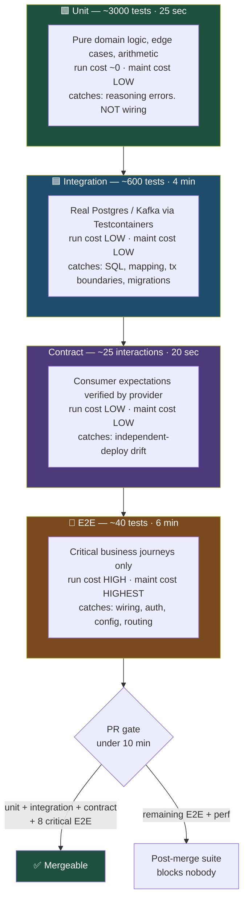

# The Pyramid Was Never About Ratios: Re-Shaping the Test Suite for 2026

The testing pyramid was drawn in an era when spinning up a real database for a test took a DBA and a ticket. Containers destroyed that constraint, and the shape of a good test suite changed with it — more integration, far less end-to-end, and a new layer the original drawing never had.

## The Real-World Problem

A corporate lending platform at a European bank has 912 Selenium-derived E2E tests, accumulated over six years by a QA team that was measured on test count.

The suite takes 71 minutes and fails somewhere between 8% and 30% of the time for reasons that have nothing to do with the change under test: a shared staging database left dirty by a previous run, an animation that had not finished, a session that expired mid-suite. The team's response evolved into a ritual — open the report, scan the failure names, decide from experience which ones are "the usual", re-run, merge.

Then a genuine regression ships. A change to the covenant-check service caused facility approvals above £5m to skip a second-approver step. Three E2E tests failed on that exact behaviour. All three had failed intermittently for months, so nobody looked. The defect reached production and took eleven days and a regulatory notification to unwind.

The suite had 912 tests and roughly zero decision-making authority. Nobody had ever asked what each test was *for* — only how many there were.

## The Concept

### What each layer is actually for

Layers are not defined by how many things they touch. They are defined by **the question they answer** and **who they protect you from**.

| Layer | The question it answers | Protects you from | Typical runtime |
|---|---|---|---|
| **Unit** | Is this logic correct, including the awkward edges? | Your own reasoning errors in branching, arithmetic, date handling, rounding | microseconds–ms |
| **Integration** | Does my code work against the real database, real HTTP layer, real serialiser? | Wrong SQL, bad transaction boundaries, mapping errors, migration drift | 100ms–seconds |
| **Contract** | Does my API still match what the consumer relies on? | Another team's independent deploy breaking you (or you breaking them) | ms per interaction |
| **End-to-end** | Can a real user complete a business-critical journey through the real stack? | Wiring, config, auth, routing — the seams nothing else covers | seconds–minutes |

A test that exercises a service class against a real Postgres via Testcontainers is an integration test with unit-like precision. That combination barely existed when the pyramid was drawn; today it is the highest-value test you can write, and it is why the middle of the shape should be the widest part.

### The cost model — the thing that should actually drive the ratios

| Layer | Write cost | Run cost | Maintenance cost | Defect-detection value |
|---|---|---|---|---|
| Unit | Low | Negligible | Low — unless heavily mocked, then high | High for logic, **zero** for wiring |
| Integration (Testcontainers) | Medium | Low (seconds) | Low — asserts behaviour, not structure | Very high: catches SQL, mapping, transactions, migrations |
| Contract | Medium once, then cheap | Negligible | Low | High and *unique* — nothing else catches cross-team drift |
| E2E | High | High | **Highest** — every UI change can break it | High per test, but decays fast as the suite grows |

The critical asymmetry: **E2E maintenance cost scales superlinearly with suite size, while its marginal detection value falls.** Test 900 covers a journey that tests 1 through 40 already touch, and it adds another 4 seconds and another chance to flake. This is why 40 well-chosen E2E tests are strictly more useful than 912 — not just cheaper, *more useful*, because a suite that is trusted gets acted on.

### The coverage-percentage trap

Line coverage measures which lines executed, not whether anything was verified. A test that calls a method and asserts nothing produces identical coverage to one that asserts everything.

The rules that survive contact with reality:

- Use coverage as a **discovery tool**, never a target. Read the uncovered-lines report to find untested branches you care about; do not chase the number.
- Ratchet, never mandate: the gate is "coverage on changed lines must not fall", not "the project must hit 80%".
- Where you want real rigour on a genuinely critical calculation — interest accrual, premium rating, sanctions matching — use **mutation testing** (Pitest on the JVM, Stryker for TS). It answers "would my tests notice if the logic were wrong?", which is the actual question.

### Contract testing as its own layer

Once frontend and backend deploy independently — which by 2026 is the default — integration tests lie to you. Both sides test against their own assumptions and both pass. Contract testing is the only layer that catches the disagreement, and it belongs in the diagram as a distinct band, not folded into "integration".

### The trophy argument, honestly

Kent C. Dodds' "testing trophy" argues the widest band should be integration, on the grounds that integration tests most closely resemble how the software is used while staying fast. For a React frontend that argument is straightforwardly correct: a Testing Library test rendering a real component tree with a stubbed network boundary catches more real defects than a hundred tests on individual hooks.

For a backend service with dense domain logic — premium rating, amortisation schedules, eligibility rules — the pyramid still holds at the bottom, because those branches are combinatorial and only cheap unit tests can cover them exhaustively. The honest synthesis: **trophy-shaped at the edges, pyramid-shaped in the domain core.** Argue about the shape of your own suite, not about whose drawing is right.

## How It Works



The shape that matters is not the triangle — it is the runtime column. Unit plus integration plus contract cover the overwhelming majority of defects in under five minutes; E2E buys the last mile at ten times the cost per test.

## Practical Example

The same behaviour — *facilities above £5m require a second approver* — tested at each layer. Note what each test knows and what it deliberately does not.

**Unit: the rule itself, exhaustively.** No Spring context, no database, no mocks.

```java
import org.junit.jupiter.api.DisplayName;
import org.junit.jupiter.params.ParameterizedTest;
import org.junit.jupiter.params.provider.CsvSource;
import java.math.BigDecimal;
import static org.assertj.core.api.Assertions.assertThat;

class ApprovalPolicyTest {

    private final ApprovalPolicy policy = new ApprovalPolicy(new BigDecimal("5000000"));

    @ParameterizedTest(name = "£{0} → second approver required: {1}")
    @CsvSource({
        "4999999.99, false",
        "5000000.00, false",   // threshold is exclusive — the boundary auditors ask about
        "5000000.01, true",
        "12000000.00, true"
    })
    @DisplayName("second approver is required strictly above the threshold")
    void secondApproverRequirement(BigDecimal amount, boolean expected) {
        assertThat(policy.requiresSecondApprover(Facility.of(amount))).isEqualTo(expected);
    }
}
```

Four boundary cases in under a millisecond. No E2E budget on earth buys that granularity.

**Integration: does the persisted approval state actually enforce it?** Real Postgres, real transaction, real SQL.

```java
import org.junit.jupiter.api.Test;
import org.springframework.beans.factory.annotation.Autowired;
import org.springframework.boot.test.context.SpringBootTest;
import org.testcontainers.containers.PostgreSQLContainer;
import org.testcontainers.junit.jupiter.Container;
import org.testcontainers.junit.jupiter.Testcontainers;
import org.springframework.test.context.DynamicPropertyRegistry;
import org.springframework.test.context.DynamicPropertySource;
import static org.assertj.core.api.Assertions.assertThat;
import static org.assertj.core.api.Assertions.assertThatThrownBy;

@SpringBootTest
@Testcontainers
class FacilityApprovalIntegrationTest {

    @Container
    static PostgreSQLContainer<?> postgres = new PostgreSQLContainer<>("postgres:16-alpine");

    @DynamicPropertySource
    static void datasource(DynamicPropertyRegistry registry) {
        registry.add("spring.datasource.url", postgres::getJdbcUrl);
        registry.add("spring.datasource.username", postgres::getUsername);
        registry.add("spring.datasource.password", postgres::getPassword);
    }

    @Autowired FacilityApprovalService approvals;
    @Autowired FacilityRepository facilities;

    @Test
    void largeFacilityCannotBeDisbursedWithASingleApproval() {
        var facility = facilities.save(Facility.draft(new BigDecimal("7500000"), "GBP"));
        approvals.approve(facility.id(), Approver.of("analyst-1"));

        assertThatThrownBy(() -> approvals.disburse(facility.id()))
            .isInstanceOf(SecondApprovalRequiredException.class);

        assertThat(facilities.findById(facility.id()).orElseThrow().status())
            .isEqualTo(FacilityStatus.AWAITING_SECOND_APPROVAL);
    }
}
```

This is the layer that catches the real bug from the scenario: the rule was correct in the domain object but the persisted state machine let `disburse` through. A unit test on `ApprovalPolicy` alone would have stayed green.

**E2E: one test, because one is enough here.**

```ts
// e2e/lending/second-approver.spec.ts
import { test, expect } from '@playwright/test'
import { seedDraftFacility } from './fixtures/lending'

test('facility over £5m blocks disbursement until a second approver signs', async ({ page }) => {
  const facility = await seedDraftFacility({ amount: 7_500_000, currency: 'GBP' })

  await page.goto(`/facilities/${facility.id}`)
  await page.getByRole('button', { name: 'Approve' }).click()

  await expect(page.getByRole('status')).toHaveText(/awaiting second approval/i)
  await expect(page.getByRole('button', { name: 'Disburse' })).toBeDisabled()
})
```

One journey, asserted on user-visible outcomes. The 40 permutations live at the unit layer where they cost nothing.

**Enforce the shape in CI rather than in a wiki page** — a coverage ratchet on changed lines, not a project-wide percentage:

```yaml
# .github/workflows/ci.yml (excerpt)
      - name: Coverage on changed lines must not regress
        uses: madrapps/jacoco-report@v1.7.1
        with:
          paths: build/reports/jacoco/test/jacocoTestReport.xml
          token: ${{ secrets.GITHUB_TOKEN }}
          min-coverage-changed-files: 80    # the diff, not the codebase
          min-coverage-overall: 0           # deliberately not a gate
```

## Enterprise Trade-offs

| Approach | Pros | Cons | When to use (Banking / Insurance / Enterprise) |
|---|---|---|---|
| **Classic pyramid (many unit, few integration, minimal E2E)** | Fast; cheap to maintain | Misses SQL, mapping and transaction defects that unit tests structurally cannot see | Legacy codebases where standing up real infrastructure in CI is genuinely blocked |
| **Wide-middle shape: unit + heavy Testcontainers integration + contract + ~40 E2E** | Highest defect detection per minute; tests survive refactoring | Requires container-capable CI runners and disciplined E2E selection | **Default for 2026.** Banking core services, insurance policy administration, enterprise platforms |
| **Testing trophy (integration-dominant)** | Mirrors real usage; excellent for UI and thin services | Under-covers combinatorial domain rules — rating engines, accrual, eligibility | Frontends and CRUD-shaped services; pair with a unit-dense domain core |
| **E2E-heavy ("test like a user")** | Reads well to non-engineers; needs little code knowledge | Slow, flaky, high maintenance; trust collapses past ~100 tests — the scenario above | Never as a primary strategy. Acceptable only as a thin critical-path layer |
| **Coverage percentage as a hard gate** | Trivial to measure; satisfies naive audit asks | Rewards assertion-free tests; teams game it within one sprint | Only as a per-diff ratchet. Never as an absolute project target |
| **Mutation testing on the critical module** | Proves tests actually detect wrong behaviour | Slow; needs a tightly scoped module list | Interest calculation, premium rating, fee schedules, sanctions matching |

## Why This Still Matters Through 2030

The pyramid's specific ratios were always a consequence of cost, and cost keeps moving. Containers made real-dependency testing cheap, which pushed the widest band up from unit to integration; independent team deploys made contract testing a necessary layer; and AI-assisted code generation is now pushing volume in a new direction — generating tests is nearly free, which makes *curating* them the scarce skill. A suite that grows without a stated purpose per test converges on the 912-test state: expensive, distrusted, and ignored. What endures is the underlying discipline, which is economic rather than architectural: for each test, know what defect it catches, what it costs to run, what it costs to maintain, and whether another layer already covers it more cheaply. Teams that can answer those four questions will keep reshaping their suite correctly as the costs shift again; teams that only count tests will keep rebuilding the same distrusted pile.

→ Next: [02-unit-and-integration-testing.md](02-unit-and-integration-testing.md) · Related: [../00-project-setup-roadmap/05-ci-pipeline.md](../00-project-setup-roadmap/05-ci-pipeline.md) · [../00-project-setup-roadmap/10-definition-of-done.md](../00-project-setup-roadmap/10-definition-of-done.md)
