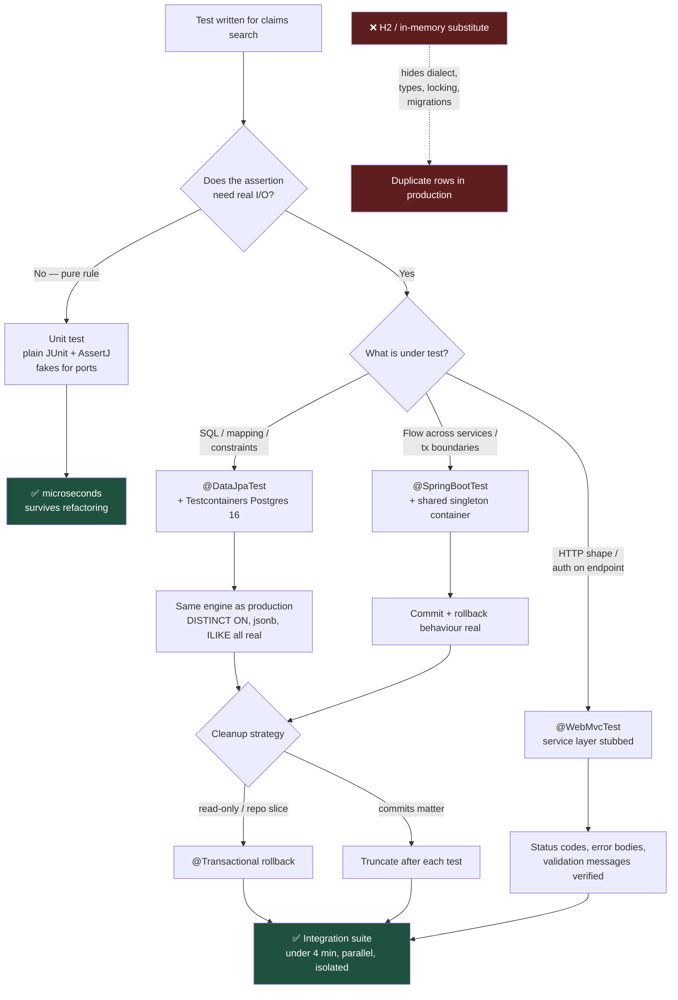

# Test Against the Real Database: Where Unit Ends and Integration Begins

The two most expensive testing mistakes in enterprise Java are mocking so heavily that tests assert your own implementation back at you, and swapping the real database for H2 so the suite runs fast and lies. Both are avoidable in an afternoon.

## The Real-World Problem

A motor insurer's claims platform runs 4,100 tests in 90 seconds against H2 in PostgreSQL compatibility mode. The team is proud of the number and the speed. Production runs PostgreSQL 16.

A release adds a claims-search screen with a filter on reserve amount and a sort by incident date. The repository method uses a native query with `DISTINCT ON (claim_id)` to collapse duplicate rows from a join against claim events. H2 does not support `DISTINCT ON`, so the developer had already discovered this and guarded the query behind a profile check — the test path used a different, simpler query. Green build.

In production the screen returns duplicate claims. Adjusters see the same claim three times, each with a different reserve figure, and begin adjusting the wrong rows. Two claims are settled twice, £46,000 leaves the business, and the incident takes a week to reconcile because the audit trail also records the duplicate updates as legitimate.

The postmortem line the CTO remembers: *the test suite had never once executed the SQL that runs in production.*

## The Concept

### The boundary: what makes a test a unit test

The useful definition is not "tests one class". It is **"has no I/O and no framework container"**.

| Belongs in a unit test | Belongs in an integration test |
|---|---|
| Domain rules, calculations, state machines | Anything with a SQL query in it |
| Validation logic, mappers, value objects | Repository methods, including derived queries |
| Date/time and money arithmetic | HTTP serialisation, status codes, error bodies |
| Branch-heavy eligibility and rating rules | Transaction boundaries and rollback behaviour |
| Pure functions over collections | Liquibase/Flyway migrations applying cleanly |
| — | Security rules: who can read what |

The rule of thumb that resolves most arguments: **if the assertion would still be meaningful with the framework deleted, it is a unit test.** If the thing you actually want to verify is how a framework or an engine behaves, mocking that framework destroys the test's entire purpose.

### Fakes, stubs, mocks — and why heavy mocking rots

The words get used interchangeably. They are not the same, and the difference determines how your tests age.

| Double | What it does | Test couples to | Ages |
|---|---|---|---|
| **Stub** | Returns canned values | Inputs and outputs | Well |
| **Fake** | Working in-memory implementation of the port | The interface contract only | Very well |
| **Mock** | Records calls; assertions verify *how* collaborators were called | Implementation structure | **Badly** |
| **Spy** | Real object with selected calls observed | Partial structure | Poorly |

`verify(repository).save(any())` asserts that your code calls `save`. That is not behaviour — that is a restatement of the code. Refactor the method to use `saveAll`, change nothing observable, and the test fails. Do that a thousand times and you have built a suite that punishes refactoring, which is exactly backwards.

Use mocks for **outbound side effects you must prove happened and cannot observe otherwise**: an audit event published, an email dispatched, a fraud-scoring vendor called. Use fakes and real infrastructure for everything else. A hand-written `InMemoryClaimRepository` implementing your port is roughly forty lines, runs instantly, and never breaks when you rename a private method.

### Testcontainers against the real engine, never H2

In-memory substitutes hide a specific and dangerous class of bug: everything where your database is not generic.

- Dialect-specific SQL — `DISTINCT ON`, window functions, `ON CONFLICT`, `ILIKE`, lateral joins.
- Types with no faithful equivalent — `jsonb`, arrays, `tstzrange`, enums, `citext`, `numeric` precision behaviour.
- Constraint and locking semantics — deferrable constraints, `SELECT ... FOR UPDATE SKIP LOCKED`, actual deadlock behaviour.
- Collation and case-sensitivity, which silently changes sort order in name searches.
- Migrations. H2 accepting your Liquibase changelog tells you nothing about whether PostgreSQL will.
- Isolation levels. H2's MVCC is not PostgreSQL's; a test for a lost-update race is meaningless there.

Testcontainers removes the trade-off. One container, reused across the whole suite, adds a few seconds of startup, not minutes — and every SQL statement your tests exercise is the SQL production will run.

Two settings make this fast enough that nobody complains:

1. **A singleton container** shared by all integration tests, not `@Container` per class.
2. **Reusable containers** locally (`testcontainers.reuse.enable=true` in `~/.testcontainers.properties`) so the container survives between runs on a developer machine. Never enable reuse in CI, where each job must start clean.

### Spring test slices: use the smallest context that answers the question

| Annotation | Loads | Use it for | Typical cost |
|---|---|---|---|
| plain JUnit, no annotation | Nothing | Domain logic, mappers, policies | < 1 ms |
| `@WebMvcTest` | Controllers, JSON, validation, security filters | Request/response shape, status codes, error bodies, authorisation on endpoints | ~1 s context, ms per test |
| `@DataJpaTest` | JPA, repositories, `DataSource` | Repository queries, entity mapping, constraints — **point it at Testcontainers, not the auto-configured embedded DB** | ~2 s context |
| `@SpringBootTest` | The whole application | Cross-cutting flows, transaction boundaries spanning services, config wiring | ~5–15 s context |

The failure mode is putting `@SpringBootTest` on everything. Spring caches contexts by configuration, so a suite with eleven slightly different `@SpringBootTest` variations builds eleven contexts and takes four minutes to do nothing. **Keep the number of distinct context configurations small and deliberate** — one shared base class per slice type, and resist per-test `@MockBean`, which forks a new context every time.

### Test data builders beat fixture files

Shared SQL fixture files become a tragedy of the commons: every test depends on row 47, nobody dares change it, and eventually the file encodes contradictory assumptions. Builders scale because each test states only what it cares about.

```java
Claim.aClaim().withReserve("15000.00").withStatus(OPEN).build();
```

The reader sees exactly the two facts that matter to this test. Everything else is a sensible default defined in one place.

### Rollback vs. truncation

| Strategy | How | Pros | Cons |
|---|---|---|---|
| **Transactional rollback** | `@Transactional` on the test; Spring rolls back after | Fastest; zero cleanup code | Hides flush timing bugs; useless when the code under test manages its own transactions, uses `REQUIRES_NEW`, or runs async |
| **Truncate between tests** | Delete/truncate all tables after each test | Real commits, real constraint firing, real triggers | Slower; needs correct FK ordering |
| **Fresh schema per class** | Migrations re-run per test class | Total isolation; validates migrations | Slowest — reserve for migration tests |

Use rollback for repository slices, truncation for anything where commit behaviour is part of what you are testing. Never rely on test ordering to leave data behind for the next test.

### Parallel execution and isolation

Parallelism is where hidden coupling surfaces. Enable it deliberately:

- JUnit 5 `@Execution(CONCURRENT)` with parallel test discovery — but keep tests that share the same container **schema-isolated** or serialised via `@ResourceLock`.
- Never share mutable static state. No `static Clock`, no static counters, no singleton caches carried between tests.
- Randomise fixture keys (policy numbers, claim references) so two concurrent tests cannot collide on a unique constraint.
- Inject a fixed `Clock` rather than calling `Instant.now()` in production code — otherwise a test that passes at 14:00 fails at midnight, and parallel runs make it worse.

## How It Works



Every branch that reaches production-grade confidence runs the production database engine. The dotted path is the insurer's outage.

## Practical Example

**The singleton container and shared base class** — one context, one container, every integration test.

```java
package com.insurer.claims.support;

import org.springframework.boot.test.context.SpringBootTest;
import org.springframework.test.context.DynamicPropertyRegistry;
import org.springframework.test.context.DynamicPropertySource;
import org.testcontainers.containers.PostgreSQLContainer;

@SpringBootTest(webEnvironment = SpringBootTest.WebEnvironment.RANDOM_PORT)
public abstract class IntegrationTestBase {

    // Static, started once, shared by every subclass. Not @Container per class.
    static final PostgreSQLContainer<?> POSTGRES =
        new PostgreSQLContainer<>("postgres:16-alpine")
            .withReuse(true);           // honoured locally only; CI ignores it

    static { POSTGRES.start(); }

    @DynamicPropertySource
    static void datasource(DynamicPropertyRegistry registry) {
        registry.add("spring.datasource.url", POSTGRES::getJdbcUrl);
        registry.add("spring.datasource.username", POSTGRES::getUsername);
        registry.add("spring.datasource.password", POSTGRES::getPassword);
        registry.add("spring.liquibase.enabled", () -> true);   // real migrations, every run
    }
}
```

**The test that would have caught the £46,000 bug.** It runs the real native query against real PostgreSQL.

```java
package com.insurer.claims.search;

import com.insurer.claims.support.IntegrationTestBase;
import org.junit.jupiter.api.Test;
import org.springframework.beans.factory.annotation.Autowired;
import org.springframework.transaction.annotation.Transactional;

import java.math.BigDecimal;
import java.time.LocalDate;
import java.util.List;

import static com.insurer.claims.testdata.ClaimBuilder.aClaim;
import static org.assertj.core.api.Assertions.assertThat;

@Transactional   // rolled back; this test only reads after seeding
class ClaimSearchRepositoryIT extends IntegrationTestBase {

    @Autowired ClaimSearchRepository repository;
    @Autowired ClaimFixtures fixtures;

    @Test
    void searchCollapsesClaimsWithMultipleEventsToASingleRow() {
        var claim = fixtures.persist(
            aClaim().withReference("CLM-2026-0041")
                    .withReserve(new BigDecimal("15000.00"))
                    .withIncidentDate(LocalDate.of(2026, 3, 11))
                    .withEvents(3)                 // three joined event rows
                    .build());
        fixtures.persist(aClaim().withReference("CLM-2026-0042")
                    .withReserve(new BigDecimal("900.00")).withEvents(1).build());

        List<ClaimSearchRow> rows = repository.search(
            new ClaimSearchCriteria(new BigDecimal("1000.00"), null), Sort.byIncidentDateDesc());

        // The DISTINCT ON must actually collapse. On H2 this query never even ran.
        assertThat(rows)
            .extracting(ClaimSearchRow::reference)
            .containsExactly("CLM-2026-0041");
        assertThat(rows).singleElement()
            .extracting(ClaimSearchRow::reserve)
            .isEqualTo(new BigDecimal("15000.00"));
    }

    @Test
    void searchIsCaseInsensitiveOnPolicyholderSurname() {
        fixtures.persist(aClaim().withPolicyholderSurname("Ó Súilleabháin").build());

        // ILIKE + collation behaviour: engine-specific, untestable on an in-memory stand-in
        assertThat(repository.searchByName("ó súilleabháin"))
            .hasSize(1);
    }
}
```

**A test data builder** — sensible defaults, only the relevant facts stated per test.

```java
package com.insurer.claims.testdata;

import com.insurer.claims.domain.*;
import java.math.BigDecimal;
import java.time.LocalDate;
import java.util.concurrent.atomic.AtomicLong;

public final class ClaimBuilder {

    private static final AtomicLong SEQ = new AtomicLong();   // unique per test, parallel-safe

    private String reference   = "CLM-TEST-" + SEQ.incrementAndGet();
    private String surname     = "Nowak";
    private BigDecimal reserve = new BigDecimal("2500.00");
    private LocalDate incident = LocalDate.of(2026, 1, 15);
    private ClaimStatus status = ClaimStatus.OPEN;
    private int events         = 1;

    public static ClaimBuilder aClaim() { return new ClaimBuilder(); }

    public ClaimBuilder withReference(String v)        { this.reference = v; return this; }
    public ClaimBuilder withPolicyholderSurname(String v) { this.surname = v; return this; }
    public ClaimBuilder withReserve(BigDecimal v)      { this.reserve = v; return this; }
    public ClaimBuilder withIncidentDate(LocalDate v)  { this.incident = v; return this; }
    public ClaimBuilder withStatus(ClaimStatus v)      { this.status = v; return this; }
    public ClaimBuilder withEvents(int n)              { this.events = n; return this; }

    public Claim build() {
        var claim = Claim.reopenedFrom(reference, surname, reserve, incident, status);
        for (int i = 0; i < events; i++) {
            claim.record(new ClaimEvent(EventType.RESERVE_REVIEWED, incident.plusDays(i)));
        }
        return claim;
    }
}
```

**A fake instead of a mock** — the unit test asserts outcomes, not call structure.

```java
class ReserveAdjustmentServiceTest {

    private final InMemoryClaimRepository claims = new InMemoryClaimRepository();
    private final RecordingAuditPublisher audit = new RecordingAuditPublisher();
    private final ReserveAdjustmentService service =
        new ReserveAdjustmentService(claims, audit, Clock.fixed(
            Instant.parse("2026-04-02T09:00:00Z"), ZoneOffset.UTC));   // deterministic time

    @Test
    void increasingReserveBeyondAuthorityRequiresReferral() {
        var claim = claims.save(aClaim().withReserve(new BigDecimal("2500.00")).build());

        service.adjust(claim.id(), new BigDecimal("80000.00"), Adjuster.of("adj-7", Authority.TIER_1));

        // Behaviour, not interactions:
        assertThat(claims.require(claim.id()).status()).isEqualTo(ClaimStatus.REFERRED);
        assertThat(claims.require(claim.id()).reserve()).isEqualByComparingTo("2500.00");
        // The audit event IS the observable side effect, so asserting it is legitimate:
        assertThat(audit.events()).singleElement()
            .extracting(AuditEvent::type).isEqualTo("RESERVE_REFERRAL_RAISED");
    }
}
```

**Parallel execution, enabled deliberately:**

```properties
# src/test/resources/junit-platform.properties
junit.jupiter.execution.parallel.enabled = true
junit.jupiter.execution.parallel.mode.default = concurrent
junit.jupiter.execution.parallel.mode.classes.default = concurrent
junit.jupiter.execution.parallel.config.strategy = dynamic
junit.jupiter.execution.parallel.config.dynamic.factor = 0.75
```

**The TypeScript side — Vitest, with the network boundary stubbed rather than the module mocked:**

```ts
// src/features/claims/claim-search.test.ts
import { describe, it, expect, beforeAll, afterAll, afterEach } from 'vitest'
import { render, screen } from '@testing-library/react'
import userEvent from '@testing-library/user-event'
import { http, HttpResponse } from 'msw'
import { setupServer } from 'msw/node'
import { QueryClient, QueryClientProvider } from '@tanstack/react-query'
import { ClaimSearchPage } from './ClaimSearchPage'

const server = setupServer(
  http.get('/api/v1/claims', ({ request }) => {
    const min = new URL(request.url).searchParams.get('minReserve')
    return HttpResponse.json({
      items: min === '1000'
        ? [{ reference: 'CLM-2026-0041', reserve: '15000.00', status: 'OPEN' }]
        : [],
      total: min === '1000' ? 1 : 0,
    })
  }),
)

beforeAll(() => server.listen({ onUnhandledRequest: 'error' }))  // an unstubbed call fails loudly
afterEach(() => server.resetHandlers())
afterAll(() => server.close())

function renderWithQuery(ui: React.ReactElement) {
  const client = new QueryClient({ defaultOptions: { queries: { retry: false } } })
  return render(<QueryClientProvider client={client}>{ui}</QueryClientProvider>)
}

describe('ClaimSearchPage', () => {
  it('shows each matching claim exactly once', async () => {
    renderWithQuery(<ClaimSearchPage />)

    await userEvent.type(screen.getByLabelText(/minimum reserve/i), '1000')
    await userEvent.click(screen.getByRole('button', { name: /search/i }))

    const rows = await screen.findAllByRole('row', { name: /CLM-2026-0041/ })
    expect(rows).toHaveLength(1)
  })
})
```

Stubbing at the HTTP boundary with MSW keeps the component, its hooks, and its query client all real. Mocking the `useClaimSearch` hook instead would leave nothing under test but JSX.

## Enterprise Trade-offs

| Approach | Pros | Cons | When to use (Banking / Insurance / Enterprise) |
|---|---|---|---|
| **Testcontainers against the production engine** | Real SQL, types, constraints, migrations; no dialect surprises | Needs Docker on CI runners; a few seconds of startup | **Default.** Any service with non-trivial SQL — claims, policy admin, ledgers |
| **H2 / in-memory substitute** | Instant startup; zero infrastructure | Hides dialect, type, locking and migration defects — the insurer's outage | Only for throwaway prototypes with no production database |
| **Shared CI database** | Cheap; already exists | Cross-run interference; the leading cause of flake; cannot run in parallel | Never. This is the anti-pattern the CI pipeline article rules out explicitly |
| **Fakes for outbound ports** | Fast; tests survive refactoring; readable | You must maintain the fake and keep it honest against the real adapter | Domain-heavy services with clean ports — pairs naturally with hexagonal architecture |
| **Mockito-heavy interaction tests** | No infrastructure; forces a seam | Couples tests to implementation; blocks refactoring; passes while production breaks | Only for unobservable outbound effects: audit publishing, notifications, vendor calls |
| **`@SpringBootTest` everywhere** | One annotation to remember | Context explosion; four-minute suites; slow feedback | Reserve for genuine cross-cutting flows; use slices for everything else |

→ Next: [03-end-to-end-testing-playwright-and-cypress.md](03-end-to-end-testing-playwright-and-cypress.md) · Related: [../03-architecture/02-hexagonal-architecture.md](../03-architecture/02-hexagonal-architecture.md) · [../10-example-code/spring-boot/testing-example.md](../10-example-code/spring-boot/testing-example.md)
