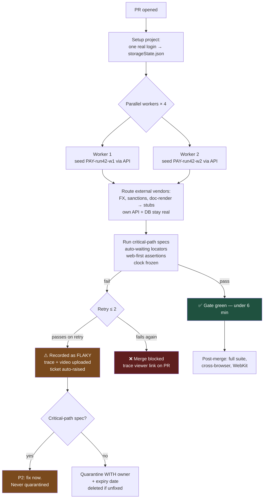

# Forty Tests You Trust: Killing Flake in End-to-End Suites

A flaky E2E suite is worse than no E2E suite, because it trains an entire team to ignore red. Flake is not bad luck — it has about six specific causes, and every one of them is fixable.

## The Real-World Problem

An enterprise treasury-management platform — used by corporate clients to authorise bulk payment files — has a 340-test Cypress suite that runs against a shared QA environment.

The suite is red more often than green. The team maintains a Slack channel where someone posts "known flakes today" each morning. The recurring causes are catalogued but never fixed: `cy.wait(3000)` calls that are sometimes not long enough on a loaded runner; tests that log in through the UI 340 times and periodically trip the identity provider's rate limit; a shared "test corporate" client account whose payment limits get mutated by whichever test ran first; and a payments dashboard that sorts by "most recent" so the row a test wants moves whenever another test creates data.

The consequence arrives during a release. A change to the file-parser rejects payment files with Windows line endings — which is how every one of their clients' ERP systems exports them. The E2E test covering bulk-file upload had been quarantined three months earlier as "flaky, revisit later". The release goes out on a Thursday. By Friday morning six corporate clients cannot submit payroll files, and the platform's support team is manually re-keying £11m of payments.

The suite's honest coverage was not 340 tests. It was however many tests the team still believed, which by then was close to zero.

## The Concept

### The six causes of flake, and the fix for each

| Cause | What it looks like | Fix |
|---|---|---|
| **Fixed sleeps** | `cy.wait(3000)`, `page.waitForTimeout(2000)` | Auto-waiting locators + web-first assertions. Ban the sleep in lint |
| **Shared mutable state** | Two tests fight over one account, one policy, one shopping basket | Fresh data per test, seeded via API, keyed by a unique run ID |
| **Ordering dependence** | Test B needs the record Test C created | Every test creates what it needs and asserts only on that |
| **Real third parties** | Rate limits, sandbox downtime, non-deterministic responses | Stub at the network boundary; keep one real-integration test outside the gate |
| **Non-deterministic UI** | "Most recent first" lists, animations, relative timestamps | Assert by unique text/role, not position; freeze time; disable animations |
| **Login through the UI, every test** | 340 logins, session races, IdP throttling | One authenticated `storageState`, reused |

### Auto-waiting and web-first assertions

The single largest source of flake is asserting on a moment rather than a condition. `waitForTimeout` encodes a guess about machine speed; on a busy CI runner the guess is wrong.

Playwright's locators are lazy and its assertions retry until a timeout. That means this:

```ts
await expect(page.getByRole('status')).toHaveText('Payment file accepted')
```

polls until the text appears or the timeout expires. Compare the non-retrying form, which reads the DOM exactly once and fails if the response has not landed yet:

```ts
expect(await page.getByRole('status').textContent()).toBe('Payment file accepted')  // ❌ races
```

The discipline is mechanical: **always `expect(locator).toX()`, never `expect(await locator.something())`.** And prefer role/label/text locators over CSS — they survive restyling and they double as a rough accessibility check.

### Deterministic test data

E2E data must be created by the test, unique to the test, and irrelevant to every other test.

- Seed via a **test-only API endpoint or a direct SQL seeder**, not by driving the UI. Creating a payment file through eleven screens to test the twelfth is how a 4-second test becomes 40.
- Namespace everything with a run-scoped identifier: `PAY-${runId}-${workerIndex}`. Two parallel workers must never be able to select each other's rows.
- Freeze time where the UI shows dates. `page.clock.install({ time: ... })` makes "expires in 3 days" a stable string instead of a moving target.
- Never assert on `nth(0)` of a list you did not fully control.

### Network stubbing at the boundary

Stub the calls you do not own; keep the ones you do. A bulk-payment E2E test should hit the real treasury API and the real database — that is the point — but the FX rate provider, the sanctions-screening vendor, and the document-rendering service should be routed to deterministic responses.

```ts
await page.route('**/marketdata.example/v1/rate/**', (route) =>
  route.fulfill({ json: { pair: 'GBPEUR', rate: 1.1742 } }))
```

This also lets you test the paths a sandbox will never produce on demand: the vendor returning 503, the screening service flagging a match, the timeout.

### One authenticated storage state, reused

Log in once in a setup project, save cookies and local storage, and load that state into every test. This removes hundreds of redundant logins, eliminates IdP rate limiting, and cuts minutes from the suite. Keep exactly one test that performs a real interactive login — that path deserves coverage, once.

### What to actually cover E2E

The selection rule: **a journey earns an E2E test if its failure would stop the business, and no cheaper layer can prove the whole path works.** Everything else belongs in integration or contract tests.

For a bank or an insurer, that is roughly these eight:

1. **Authenticate** — real login through the IdP, including MFA challenge, and session expiry behaviour.
2. **Onboard/KYC submission** — the multi-step identity form reaching a persisted, reviewable state.
3. **Money movement or claim submission** — the core value transaction, end to end, including the confirmation the customer relies on.
4. **Second-approver / maker-checker flow** — a payment or claim requiring two distinct users. This one *needs* E2E because it spans two sessions.
5. **Bulk file upload** — the CSV/ISO 20022/ERP export path, including a malformed file being rejected cleanly. (The test in the scenario above.)
6. **Statement, policy document, or schedule generation** — the artefact the customer downloads, verified as actually downloadable and non-empty.
7. **Payee/beneficiary or policy amendment** — the highest-frequency change operation, with its validation errors.
8. **Authorisation boundary** — a user of one tenant or role provably cannot reach another's data through the UI.

Eight to fifteen specs, forty or so tests once variants are counted. That fits in six minutes and every failure is worth reading.

### Playwright vs. Cypress, honestly

| Dimension | Playwright | Cypress |
|---|---|---|
| Architecture | Out-of-process driver via CDP/WebDriver BiDi | Runs inside the browser event loop |
| Parallelism | Built in, free, worker-based | Free runner is serial; parallelisation via paid Cloud or third-party orchestration |
| Browsers | Chromium, Firefox, WebKit — real WebKit | Chromium family + Firefox; no WebKit |
| Multi-tab / multi-origin | Native, first-class | Historically restricted; improved but still awkward |
| **Multiple browser contexts (two users at once)** | Native — essential for maker-checker | Requires workarounds |
| Debugging | Trace viewer: DOM snapshots, network, console per step | Excellent interactive time-travel runner |
| API testing in-suite | `request` fixture built in | `cy.request`, less ergonomic for seeding |
| Language support | TS/JS, Python, .NET, Java | JS/TS only |
| Async model | `async/await` — plain JS | Custom chained command queue; a distinct mental model |

**Recommendation: Playwright for new enterprise work.** The deciding factors are not marginal — free parallelism (which is what makes a six-minute gate possible), native multi-context support (which is what makes maker-checker testable at all), and the trace viewer (which is what makes CI-only failures diagnosable). Cypress remains a good tool and an existing healthy Cypress suite is not worth rewriting for its own sake; but if the suite is being rebuilt anyway — which, if you are reading this because your suite is distrusted, it is — rebuild it in Playwright.

### Page Object Model vs. fixtures

POM survives because it centralises selectors, but classic POM accumulates a `PaymentsPage` god-object with sixty methods, half of which wrap a single click.

The 2026 shape: **Playwright fixtures for setup and state, thin page objects only where selector logic is genuinely non-trivial.** A fixture gives each test a pre-authenticated page and pre-seeded data by declaring it in the signature. Reserve page objects for complex compound widgets — a data grid with virtualised rows, a multi-step wizard — not for `getByRole('button', { name: 'Submit' })`.

### Retry policy and quarantine that actually ends

Retries are a shock absorber, not a cure. Configure them narrowly and make flake visible:

- `retries: 2` in CI, `retries: 0` locally. A test that passes on retry is **still a bug**, and Playwright's report marks it "flaky" — track that count as a metric.
- Quarantine with an expiry. A quarantined test gets a ticket, an owner, and a date. If it is not fixed by then, it is deleted — a permanently quarantined test is a lie about your coverage, and it is precisely what let the bulk-upload defect ship.
- Zero tolerance on the critical-path set. The eight journeys above are never quarantined; if one is unstable, that is a P2 until it is stable.

### Artifacts for debugging CI failures

Configure trace, video and screenshot on first retry, then upload them. A trace file makes a CI-only failure reproducible on a laptop, which is the difference between fixing flake and shrugging at it.

## How It Works



Two properties matter: the login happens once for the whole run, and a retry-pass is never silent — it produces an artifact and a ticket.

## Practical Example

**Configuration — retries, artifacts, storage state, parallelism:**

```ts
// playwright.config.ts
import { defineConfig, devices } from '@playwright/test'

export default defineConfig({
  testDir: './e2e',
  fullyParallel: true,
  forbidOnly: !!process.env.CI,
  retries: process.env.CI ? 2 : 0,
  workers: process.env.CI ? 4 : undefined,
  timeout: 30_000,
  expect: { timeout: 10_000 },           // web-first assertions poll up to 10s
  reporter: [
    ['list'],
    ['html', { outputFolder: 'playwright-report', open: 'never' }],
    ['junit', { outputFile: 'reports/e2e-junit.xml' }],   // feeds PR annotations + audit evidence
  ],
  use: {
    baseURL: process.env.BASE_URL ?? 'http://localhost:3000',
    trace: 'on-first-retry',
    video: 'retain-on-failure',
    screenshot: 'only-on-failure',
    actionTimeout: 10_000,
  },
  projects: [
    { name: 'setup', testMatch: /global\.setup\.ts/ },
    {
      name: 'chromium',
      dependencies: ['setup'],
      use: { ...devices['Desktop Chrome'], storageState: '.auth/corporate-user.json' },
    },
    // WebKit runs post-merge only — cross-browser is not worth 3x the gate time
    {
      name: 'webkit',
      dependencies: ['setup'],
      use: { ...devices['Desktop Safari'], storageState: '.auth/corporate-user.json' },
      grep: /@post-merge|@critical/,
    },
  ],
})
```

**The one real login, saved as storage state:**

```ts
// e2e/global.setup.ts
import { test as setup, expect } from '@playwright/test'

const AUTH_FILE = '.auth/corporate-user.json'

setup('authenticate once for the whole run', async ({ page }) => {
  await page.goto('/login')
  await page.getByLabel('Corporate ID').fill(process.env.E2E_CORP_ID!)
  await page.getByLabel('Password').fill(process.env.E2E_PASSWORD!)
  await page.getByRole('button', { name: 'Sign in' }).click()

  // Web-first assertion: waits for the real post-login state, no sleep
  await expect(page.getByRole('heading', { name: 'Accounts overview' })).toBeVisible()

  await page.context().storageState({ path: AUTH_FILE })
})
```

**Fixtures that give each test isolated, deterministic data:**

```ts
// e2e/fixtures/treasury.ts
import { test as base, type APIRequestContext } from '@playwright/test'

type PaymentFile = { id: string; reference: string }

type TreasuryFixtures = {
  runScope: string
  seed: {
    paymentFile(opts?: { lineEndings?: 'lf' | 'crlf'; rows?: number }): Promise<PaymentFile>
  }
}

export const test = base.extend<TreasuryFixtures>({
  // Unique per test AND per worker — two parallel tests can never collide
  runScope: async ({}, use, testInfo) => {
    await use(`${process.env.GITHUB_RUN_ID ?? 'local'}-w${testInfo.workerIndex}-${testInfo.testId.slice(0, 6)}`)
  },

  seed: async ({ request, runScope }, use) => {
    const created: string[] = []
    await use({
      async paymentFile({ lineEndings = 'lf', rows = 3 } = {}) {
        const res = await request.post('/test-support/payment-files', {
          data: { reference: `PAY-${runScope}`, lineEndings, rows },
        })
        if (!res.ok()) throw new Error(`seed failed: ${res.status()} ${await res.text()}`)
        const file = (await res.json()) as PaymentFile
        created.push(file.id)
        return file
      },
    })
    // Teardown: leave the environment exactly as found
    for (const id of created) await request.delete(`/test-support/payment-files/${id}`)
  },
})

export { expect } from '@playwright/test'
```

**A critical-path test — the one that would have caught the CRLF defect:**

```ts
// e2e/payments/bulk-file-upload.spec.ts
import { test, expect } from '../fixtures/treasury'

test.describe('bulk payment file upload @critical', () => {

  test('accepts a CRLF-delimited file exported from an ERP', async ({ page, seed }) => {
    const file = await seed.paymentFile({ lineEndings: 'crlf', rows: 3 })

    await page.goto('/payments/bulk')
    await page.getByLabel('Payment file').setInputFiles({
      name: `${file.reference}.csv`,
      mimeType: 'text/csv',
      // Windows line endings — how every client's ERP actually exports
      buffer: Buffer.from(
        'sortcode,account,amount,reference\r\n' +
        '203253,44556677,1500.00,PAYROLL-01\r\n' +
        '203253,44556678,2250.50,PAYROLL-02\r\n',
      ),
    })
    await page.getByRole('button', { name: 'Validate file' }).click()

    // Assert on the locator, not on a snapshot of it
    await expect(page.getByRole('status')).toHaveText(/3 payments ready to authorise/i)
    await expect(page.getByRole('row', { name: /PAYROLL-01/ })).toBeVisible()
    await expect(page.getByRole('button', { name: 'Authorise' })).toBeEnabled()
  })

  test('rejects a malformed file with a usable error, not a 500', async ({ page, seed }) => {
    await seed.paymentFile({ rows: 0 })

    await page.goto('/payments/bulk')
    await page.getByLabel('Payment file').setInputFiles({
      name: 'broken.csv',
      mimeType: 'text/csv',
      buffer: Buffer.from('sortcode,account\r\n203253\r\n'),
    })
    await page.getByRole('button', { name: 'Validate file' }).click()

    await expect(page.getByRole('alert'))
      .toContainText('Row 2: missing amount and reference')
    await expect(page.getByRole('button', { name: 'Authorise' })).toBeDisabled()
  })
})
```

**Maker-checker across two real sessions — the case that justifies Playwright specifically:**

```ts
// e2e/payments/second-authoriser.spec.ts
import { test, expect } from '../fixtures/treasury'

test('a payment run requires a second, different authoriser @critical', async ({ browser, seed }) => {
  const file = await seed.paymentFile({ rows: 2 })

  const maker = await browser.newContext({ storageState: '.auth/maker.json' })
  const checker = await browser.newContext({ storageState: '.auth/checker.json' })

  const makerPage = await maker.newPage()
  await makerPage.goto(`/payments/bulk/${file.id}`)
  await makerPage.getByRole('button', { name: 'Submit for authorisation' }).click()
  await expect(makerPage.getByRole('status')).toHaveText(/awaiting authorisation/i)
  // The maker must not be able to authorise their own submission
  await expect(makerPage.getByRole('button', { name: 'Authorise' })).toBeDisabled()

  const checkerPage = await checker.newPage()
  await checkerPage.goto('/payments/authorisations')
  await checkerPage.getByRole('row', { name: file.reference })
    .getByRole('button', { name: 'Authorise' }).click()
  await expect(checkerPage.getByRole('status')).toHaveText(/2 payments authorised/i)

  await makerPage.reload()
  await expect(makerPage.getByText(/authorised by/i)).toBeVisible()

  await maker.close()
  await checker.close()
})
```

**Stubbing an external vendor, plus freezing the clock:**

```ts
test('flags a beneficiary matched by sanctions screening', async ({ page }) => {
  await page.clock.install({ time: new Date('2026-08-09T10:00:00Z') })  // stable relative dates

  await page.route('**/screening.vendor.example/v2/check', (route) =>
    route.fulfill({ json: { decision: 'POTENTIAL_MATCH', listId: 'OFSI-1188', score: 0.94 } }))

  await page.goto('/payees/new')
  await page.getByLabel('Beneficiary name').fill('Acme Trading LLC')
  await page.getByLabel('IBAN').fill('GB29NWBK60161331926819')
  await page.getByRole('button', { name: 'Add payee' }).click()

  await expect(page.getByRole('alert'))
    .toContainText('Referred for compliance review')
  await expect(page.getByText('Reviewed by 12 Aug 2026')).toBeVisible()
})
```

**Ban sleeps in lint, so the fix does not regress:**

```js
// eslint.config.js (excerpt)
export default [{
  files: ['e2e/**/*.ts'],
  rules: {
    'no-restricted-syntax': ['error',
      { selector: "CallExpression[callee.property.name='waitForTimeout']",
        message: 'No fixed sleeps. Use a web-first assertion or expect(locator).toBeVisible().' },
      { selector: "MemberExpression[property.name='nth']",
        message: 'Positional selectors are order-dependent. Select by role/text/label.' },
    ],
  },
}]
```

**The gate, consistent with the CI pipeline: critical paths only, artifacts always uploaded:**

```yaml
  e2e-critical:
    name: E2E critical paths
    runs-on: ubuntu-latest
    needs: [build]
    timeout-minutes: 10
    steps:
      - uses: actions/checkout@v4
      - uses: actions/setup-node@v4
        with: { node-version: '22', cache: 'npm' }
      - run: npm ci --prefer-offline
      - run: npx playwright install --with-deps chromium
      - run: npx playwright test --project=chromium --grep @critical
      - uses: actions/upload-artifact@v4
        if: always()                       # traces are worthless if only uploaded on success
        with:
          name: playwright-report
          path: playwright-report/
          retention-days: 30
```

## Enterprise Trade-offs

| Approach | Pros | Cons | When to use (Banking / Insurance / Enterprise) |
|---|---|---|---|
| **~8 critical journeys in the PR gate, full suite post-merge** | Under 6 min; every failure is credible; suite stays trusted | A non-critical regression can reach `main` briefly | **Default.** Matches the ten-minute pipeline; staging-only deploys cover the gap |
| **Playwright with fixtures + shared storageState** | Free parallelism; multi-context for maker-checker; traces make CI failures debuggable | Team learns a new mental model if coming from Cypress | New enterprise suites; any rebuild of a distrusted suite |
| **Cypress, kept and hardened** | Best-in-class interactive debugging; team already fluent | Serial without paid Cloud; no WebKit; multi-origin friction | An existing healthy suite — harden it rather than rewrite it |
| **Full-regression E2E on every PR** | Nothing merges unverified | 40–70 min; flake compounds; re-run culture; the treasury scenario | Never. Move breadth post-merge or nightly |
| **Login through the UI in every test** | Simple; exercises the real path each time | Minutes of waste; IdP rate limits; session races | One test only. Everything else loads storage state |
| **Stub all external vendors** | Deterministic; failure paths become testable | Vendor contract drift goes unnoticed | Default in the gate. Pair with a nightly real-sandbox smoke test |
| **Quarantine with owner + expiry** | Keeps the gate green without hiding debt | Needs enforcement, or it becomes a graveyard | Any suite with existing flake. Never applies to the critical-path set |

## Why This Still Matters Through 2030

E2E testing is the only layer that answers a question nothing else can: does a real user, in a real browser, against the real system, actually get their work done? That question does not go away, and neither does the fundamental economics — E2E tests will always be the most expensive tests to run and by far the most expensive to maintain, so selection will always matter more than volume. The tooling is converging rather than diverging: WebDriver BiDi is standardising the control layer, which reduces vendor lock-in and makes the choice between frameworks less consequential over time. The change worth preparing for is generation: AI tooling can now produce E2E specs from a user story or a recorded session in seconds, which makes it trivially easy to rebuild the 340-test distrusted suite faster than before. The defence is a written selection rule, a hard budget on gate runtime, and a quarantine process with an expiry date — governance, not tooling. Teams that hold a small suite they believe will keep shipping confidently; teams that let generation inflate the count will rediscover, on a Friday, exactly what the treasury team learned.

→ Next: [04-contract-testing-for-apis.md](04-contract-testing-for-apis.md) · Related: [../00-project-setup-roadmap/05-ci-pipeline.md](../00-project-setup-roadmap/05-ci-pipeline.md) · [../07-frontend-best-practices/08-forms-with-react-hook-form-and-zod.md](../07-frontend-best-practices/08-forms-with-react-hook-form-and-zod.md)
