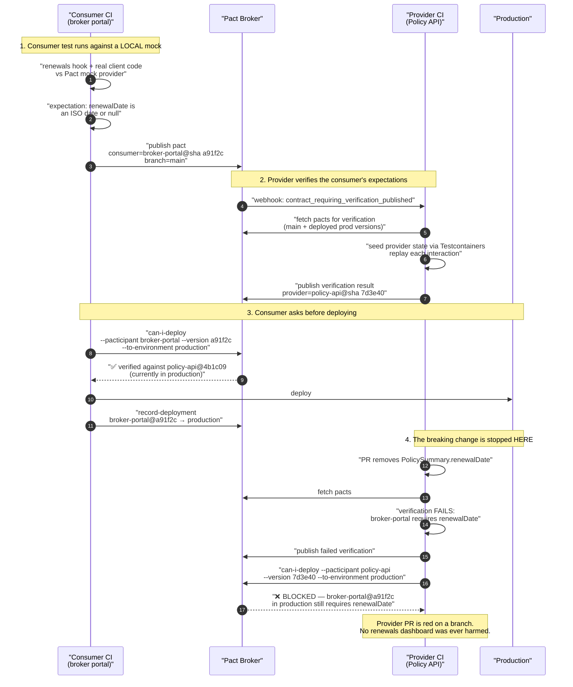

# Am I Safe to Deploy? Contract Testing When Two Teams Ship Independently

Two teams, two pipelines, two green builds, one broken integration. Contract testing exists because "all our tests pass" stops meaning anything the moment the other side of the API can deploy without asking you.

## The Real-World Problem

An insurance group runs a broker portal — a Next.js App Router application used by 1,900 independent brokers — against a **Policy API** owned by a different team in a different building, on a different release train. The portal deploys on demand, several times a week. The Policy API deploys fortnightly.

The portal's test suite is genuinely good: 2,800 unit tests, 400 integration tests, MSW handlers stubbing every endpoint, and 30 Playwright tests against a shared staging environment.

Then the Policy API team ships a tidy-up. `PolicySummary.renewalDate` — nullable, because policies that have lapsed have no renewal date — is split into `renewal: { date, premium }`, and the old field is removed. It was documented in their release notes. Their own tests all pass, because they updated them.

The portal breaks in three places at once.

- The renewals dashboard renders `Invalid Date` on every row, because it reads `policy.renewalDate` and gets `undefined`.
- The "policies due in 30 days" filter returns nothing, so 4,100 renewals silently drop out of every broker's work queue.
- Commission projections compute against `NaN` and display `—`.

Every one of the portal's 3,230 tests still passes. The MSW handlers still return `renewalDate`, because the handlers are the portal team's *belief* about the API, written eight months earlier. Staging had the new API for three days and nobody looked at the renewals dashboard there, because renewals were not what that release changed.

Discovery came from a broker's phone call on renewal day. Nine days of missed renewal outreach, an estimated €280,000 of lapsed premium, and a joint post-incident review whose conclusion was: *there was no test anywhere in the organisation that would have failed.*

## The Concept

### What contract testing catches that nothing else can

| Test layer | Verifies | Blind to |
|---|---|---|
| **Unit** | Your logic in isolation | Anything about the other side of the wire |
| **Integration** | Your code against *your* database and *your* stubs | Whether the stubs match reality — the stub is your assumption, restated |
| **E2E on staging** | The whole stack at one moment in time | Whether the *next* provider deploy breaks you; only covers paths the test walks; requires both versions co-deployed |
| **Contract** | That the provider's actual behaviour satisfies each consumer's actual expectations, **before either deploys** | Semantics, performance, business correctness |

The precise gap is this: **integration tests verify your code against your assumptions; contract tests verify your assumptions against the provider.** The portal's MSW handlers were an assumption that nothing ever checked. A contract test turns that same handler into an executable expectation that the Policy API's pipeline must satisfy — so the *provider's* build goes red when it removes `renewalDate`, on their branch, naming the consumer that needs it.

E2E on staging looks like it should cover this, and it does not, for three reasons. It only exercises the paths a test happens to walk. It requires both new versions to be deployed together, which is exactly what independent release trains prevent. And it tells you after the fact, not before the merge.

### What contract testing does **not** catch

Be honest about this or the technique gets oversold and then distrusted.

- **Semantics.** `premium` changing from minor units (cents) to a decimal string keeps the same type and passes every contract check. Only a test asserting a *value* catches that.
- **Business correctness.** That a renewal quote is arithmetically right is a unit test's job.
- **Performance and load.** A contract test proves shape, not that the endpoint answers in 200 ms.
- **Untested paths.** A consumer-driven contract covers exactly what the consumer wrote an expectation for. A field nobody wrote an interaction for is unprotected.
- **Deployment and config.** Wrong base URL, missing scope, TLS misconfiguration — that is a smoke test's job.
- **Provider bugs on data the consumer did not describe.** The contract says "given a policy exists, return a body shaped like this". It does not say the policy data is correct.

Contract testing replaces the *integration-shape* portion of an E2E suite. It does not replace E2E, unit tests, or a staging smoke test.

### Consumer-driven contracts (Pact-style), precisely

The flow has four moving parts and the ordering matters.

1. **The consumer writes an expectation** in its own test suite: given some provider state, when I send this request, I expect this response. Pact spins up a local mock provider, the consumer's *real* client code calls it, and the test asserts on the result. If the consumer's own code does not use the response correctly, the test fails — so the contract is a by-product of a test that already had value.
2. **A pact file is generated** — a JSON document of interactions — and **published to a broker** tagged with the consumer's version and branch.
3. **The provider verifies the pact** in its own pipeline: it replays each interaction against a real running provider, setting up the required state first, and asserts the response satisfies the consumer's matchers. Verification results are published back to the broker.
4. **`can-i-deploy` gates the deployment.** Before either side deploys to an environment, it asks the broker: *for the version I am about to deploy, is there a successful verification against every version of my counterpart that is currently in that environment?* No → the deploy is blocked.

Step 4 is the part teams skip, and it is the part that makes the technique work. Publishing pacts without gating deployments is documentation with extra steps.

### Matchers: describe the shape, not the fixture

The single most common way a Pact suite becomes unbearable is asserting exact values. `"policyNumber": "POL-2026-0041"` forces the provider to have that exact policy. Use type and regex matchers instead:

| Instead of | Use | Because |
|---|---|---|
| `"premium": "412.50"` | `like('412.50')` / decimal regex | The provider's fixture data will differ |
| `"policies": [ {...}, {...} ]` | `eachLike({...})` with `min: 1` | Cardinality is not the contract; element shape is |
| `"renewalDate": "2026-09-01"` | `term({ generate, matcher: ISO_DATE })` | Format is the contract, the date is not |
| Asserting a field the consumer ignores | **omit it entirely** | Every field in a pact is a constraint the provider can never remove |

That last rule is the discipline that matters most: **a pact should describe the minimum the consumer actually reads.** Over-specified pacts make the provider unable to evolve and the team will delete the suite within a year.

### Provider states are the provider's problem

`given('a policy exists with a renewal date within 30 days')` is a string the consumer chooses and the provider implements — usually by seeding a database via Testcontainers before replaying the interaction. Keep the vocabulary small and stable; a proliferation of near-identical states is a smell that consumers are over-specifying.

### Provider-driven and schema-based alternatives

Consumer-driven contracts require the provider to run the consumer's expectations. Sometimes you cannot get that — a partner consumer you do not control, a provider team that will not adopt it, or dozens of unknown consumers.

| Technique | How it works | Catches | Use when |
|---|---|---|---|
| **OpenAPI diff in CI** | Compare the PR's spec against the published one; fail on incompatible change | Removed/renamed fields, tightened validation, new required fields | Public and partner APIs with unknown consumers. **Pair with spec-from-code so the spec cannot lie** |
| **Response validation against the spec** | Assert every integration-test response validates against the OpenAPI schema | Implementation drifting from its own published document | Always — it is nearly free and it makes the spec trustworthy |
| **Spring Cloud Contract** | Provider writes contract DSL/YAML; generates provider tests *and* consumer stub JARs published to a Maven repo | Same class of defect, provider-first; excellent when the provider is the centre of gravity | JVM-heavy estates, provider-led governance, consumers who want a versioned stub artefact |
| **`buf breaking` on protobuf** | Wire-compatibility check against `main` | Renumbering, type changes, removed fields | Every gRPC boundary |
| **Bi-directional contract testing** | Broker cross-compares a provider's OpenAPI spec with consumer-recorded expectations, no live verification run | Most shape drift, without the provider running consumer tests | Provider teams unwilling to run consumer suites; partner-facing APIs |

The pragmatic enterprise position: **consumer-driven Pact where both sides are internal and both pipelines are yours; OpenAPI diff plus spec validation at the partner edge**, where consumers are unknown or unwilling. See [choosing REST vs GraphQL vs gRPC](../05-apis-and-integration/05-choosing-rest-vs-graphql-vs-grpc.md) for how the boundaries map.

### Versioning and "am I safe to deploy?"

The broker only answers correctly if you tell it the truth about versions and environments.

- **Application version = the git SHA.** Not a semver, not a build number that resets. The SHA is what actually deployed.
- **Tag the branch** on publish (`--branch main`), so the broker knows which line of development an expectation came from.
- **Record deployments, don't just tag environments.** `pact-broker record-deployment --environment production` tells the broker exactly what is running where, which is what makes `can-i-deploy` a real answer rather than a guess.
- **`can-i-deploy` runs twice**: in CI before the deploy step, and it is the deploy step's gate. `--retry-while-unknown` gives the provider's verification a window to finish rather than failing on a race.
- **Pending pacts** (`--enable-pending`) stop a brand-new consumer expectation from immediately breaking the provider's build: the interaction is verified and reported but does not fail the provider until it has passed once. This is what makes adoption politically possible.
- **WIP pacts** do the same for expectations on feature branches.
- **Removing a field** becomes a sequenced negotiation the broker enforces: consumer stops reading it → consumer deploys → provider's verification no longer requires it → provider removes it. That is expand/contract applied to an API contract.

## How It Works



The failure lands in step 4, in the provider's pipeline, before a merge — naming the consumer, the interaction, and the field. That is the entire value: the €280,000 incident becomes a red check.

## Practical Example

### Consumer side — Pact JS in the portal's Vitest suite

The test drives the **real** data-fetching code, not a hand-written HTTP call.

```ts
// src/features/renewals/api/renewals.pact.test.ts
import { describe, it, expect, beforeAll, afterAll } from 'vitest'
import { PactV4, MatchersV3, SpecificationVersion } from '@pact-foundation/pact'
import path from 'node:path'
import { fetchRenewalsDue } from './renewals.client'   // the production client

const { like, eachLike, integer, regex, nullValue } = MatchersV3
const ISO_DATE = '\\d{4}-\\d{2}-\\d{2}'
const DECIMAL = '^-?\\d{1,12}(\\.\\d{1,2})?$'

const provider = new PactV4({
  consumer: 'broker-portal',
  provider: 'policy-api',
  dir: path.resolve(process.cwd(), 'pacts'),
  spec: SpecificationVersion.SPECIFICATION_VERSION_V4,
  logLevel: 'warn',
})

describe('policy-api renewals contract', () => {
  it('returns policies due for renewal with a renewal date the dashboard can render', async () => {
    await provider
      .addInteraction()
      // Provider state: a string the PROVIDER implements by seeding its database.
      .given('a broker has 2 policies with renewal dates within 30 days')
      .uponReceiving('a request for renewals due in the next 30 days')
      .withRequest('GET', '/v1/policies', (builder) => {
        builder.query({ renewalWithinDays: '30', limit: '50' })
        builder.headers({ Accept: 'application/json' })
      })
      .willRespondWith(200, (builder) => {
        builder.headers({ 'Content-Type': 'application/json' })
        builder.jsonBody({
          // eachLike with min:1 — cardinality is not the contract, element shape is.
          items: eachLike(
            {
              policyId: like('pol_01JQ5R8KX2'),
              policyNumber: regex('^POL-\\d{4}-\\d{4,}$', 'POL-2026-0041'),
              // THE field from the incident. Nullable, so the matcher must allow null.
              renewalDate: regex(ISO_DATE, '2026-09-01'),
              annualPremium: regex(DECIMAL, '412.50'),
              currency: regex('^[A-Z]{3}$', 'EUR'),
            },
            { min: 1 },
          ),
          nextCursor: nullValue(),
          // Deliberately NOT specified: `product`, `underwriter`, `createdAt`.
          // The dashboard does not read them, so they must not become constraints.
        })
      })
      .executeTest(async (mockServer) => {
        // The real client runs against the mock. If OUR code mishandles the
        // shape, this test fails — the contract is a by-product of a real test.
        const renewals = await fetchRenewalsDue({
          baseUrl: mockServer.url,
          withinDays: 30,
          limit: 50,
        })

        expect(renewals).toHaveLength(1)
        expect(renewals[0].renewalDate).toBeInstanceOf(Date)
        expect(Number.isNaN(renewals[0].renewalDate!.getTime())).toBe(false)
        expect(renewals[0].annualPremium.toFixed(2)).toBe('412.50')
      })
  })

  it('handles a lapsed policy with no renewal date without rendering Invalid Date', async () => {
    await provider
      .addInteraction()
      .given('a broker has 1 lapsed policy with no renewal date')
      .uponReceiving('a request for renewals including a lapsed policy')
      .withRequest('GET', '/v1/policies', (b) => {
        b.query({ renewalWithinDays: '30', limit: '50' })
      })
      .willRespondWith(200, (b) => {
        b.jsonBody({
          items: [
            {
              policyId: like('pol_01JQ5R8KX3'),
              policyNumber: regex('^POL-\\d{4}-\\d{4,}$', 'POL-2026-0042'),
              renewalDate: nullValue(),          // null is part of the contract
              annualPremium: regex(DECIMAL, '0.00'),
              currency: regex('^[A-Z]{3}$', 'EUR'),
            },
          ],
          nextCursor: nullValue(),
        })
      })
      .executeTest(async (mockServer) => {
        const [policy] = await fetchRenewalsDue({ baseUrl: mockServer.url, withinDays: 30, limit: 50 })
        expect(policy.renewalDate).toBeNull()
        expect(policy.renewalLabel).toBe('Lapsed')   // not 'Invalid Date'
      })
  })
})
```

Publishing, in the consumer's pipeline:

```bash
# Version IS the git SHA. Branch tells the broker which line of development.
npx pact-broker publish ./pacts \
  --consumer-app-version "$GIT_COMMIT" \
  --branch "$GIT_BRANCH" \
  --broker-base-url "$PACT_BROKER_BASE_URL" \
  --broker-token "$PACT_BROKER_TOKEN"
```

### Provider side — Pact JVM verifying against a real Spring Boot app

```java
package com.insurer.policy.contract;

import au.com.dius.pact.provider.junit5.HttpTestTarget;
import au.com.dius.pact.provider.junit5.PactVerificationContext;
import au.com.dius.pact.provider.junit5.PactVerificationInvocationContextProvider;
import au.com.dius.pact.provider.junitsupport.Provider;
import au.com.dius.pact.provider.junitsupport.State;
import au.com.dius.pact.provider.junitsupport.loader.PactBroker;
import au.com.dius.pact.provider.junitsupport.loader.PactBrokerConsumerVersionSelectors;
import au.com.dius.pact.provider.junitsupport.loader.SelectorBuilder;
import org.junit.jupiter.api.BeforeEach;
import org.junit.jupiter.api.TestTemplate;
import org.junit.jupiter.api.extension.ExtendWith;
import org.springframework.beans.factory.annotation.Autowired;
import org.springframework.boot.test.context.SpringBootTest;
import org.springframework.boot.test.web.server.LocalServerPort;
import org.testcontainers.containers.PostgreSQLContainer;
import org.springframework.test.context.DynamicPropertyRegistry;
import org.springframework.test.context.DynamicPropertySource;

import java.math.BigDecimal;
import java.time.LocalDate;

@Provider("policy-api")
@PactBroker(
    url = "${PACT_BROKER_BASE_URL}",
    authentication = @au.com.dius.pact.provider.junitsupport.loader.PactBrokerAuth(
        token = "${PACT_BROKER_TOKEN}"),
    // Report new consumer expectations without failing the build until they pass once.
    enablePendingPacts = "true",
    providerBranch = "${GIT_BRANCH}")
@SpringBootTest(webEnvironment = SpringBootTest.WebEnvironment.RANDOM_PORT)
class PolicyApiPactVerificationTest {

    static final PostgreSQLContainer<?> POSTGRES =
        new PostgreSQLContainer<>("postgres:16-alpine");
    static { POSTGRES.start(); }

    @DynamicPropertySource
    static void datasource(DynamicPropertyRegistry registry) {
        registry.add("spring.datasource.url", POSTGRES::getJdbcUrl);
        registry.add("spring.datasource.username", POSTGRES::getUsername);
        registry.add("spring.datasource.password", POSTGRES::getPassword);
    }

    @LocalServerPort int port;
    @Autowired PolicyTestFixtures fixtures;

    /**
     * Verify against: the consumer's main branch, AND every consumer version
     * currently deployed to production. The second selector is what makes the
     * provider unable to break what is live.
     */
    @PactBrokerConsumerVersionSelectors
    static SelectorBuilder consumerVersionSelectors() {
        return new SelectorBuilder()
            .branch("main")
            .deployedTo("production");
    }

    @BeforeEach
    void setTarget(PactVerificationContext context) {
        context.setTarget(new HttpTestTarget("localhost", port, "/"));
        fixtures.truncateAll();
    }

    @TestTemplate
    @ExtendWith(PactVerificationInvocationContextProvider.class)
    void verifyConsumerExpectations(PactVerificationContext context) {
        context.verifyInteraction();
    }

    // --- Provider states: seed real rows in real Postgres -------------------

    @State("a broker has 2 policies with renewal dates within 30 days")
    void twoRenewalsDueSoon() {
        fixtures.persistBroker("BRK-0007");
        fixtures.persistPolicy("POL-2026-0041", "BRK-0007",
            LocalDate.now().plusDays(12), new BigDecimal("412.50"), "EUR");
        fixtures.persistPolicy("POL-2026-0044", "BRK-0007",
            LocalDate.now().plusDays(27), new BigDecimal("980.00"), "EUR");
    }

    @State("a broker has 1 lapsed policy with no renewal date")
    void oneLapsedPolicy() {
        fixtures.persistBroker("BRK-0007");
        fixtures.persistLapsedPolicy("POL-2026-0042", "BRK-0007", new BigDecimal("0.00"));
    }
}
```

The provider publishes its results and asks the same question before deploying:

```bash
# Verification, with results published back to the broker.
./gradlew test --tests '*PactVerificationTest' \
  -Dpact.verifier.publishResults=true \
  -Dpact.provider.version="$GIT_COMMIT" \
  -Dpact.provider.branch="$GIT_BRANCH"

# The gate. This is the step that turns pacts from documentation into a control.
pact-broker can-i-deploy \
  --pacticipant policy-api --version "$GIT_COMMIT" \
  --to-environment production \
  --retry-while-unknown 12 --retry-interval 10

# Only reached if the above exits 0.
./deploy.sh production
pact-broker record-deployment \
  --pacticipant policy-api --version "$GIT_COMMIT" --environment production
```

### The consumer's pipeline, end to end

```yaml
# .github/workflows/deploy.yml (broker portal)
name: Deploy broker portal
on:
  push: { branches: [main] }

env:
  PACT_BROKER_BASE_URL: ${{ vars.PACT_BROKER_BASE_URL }}
  PACT_BROKER_TOKEN: ${{ secrets.PACT_BROKER_TOKEN }}

jobs:
  contract:
    runs-on: ubuntu-latest
    steps:
      - uses: actions/checkout@v4
      - uses: actions/setup-node@v4
        with: { node-version: 22, cache: npm }
      - run: npm ci
      - run: npx vitest run --dir src --testNamePattern '' src/**/*.pact.test.ts
      - name: Publish pacts
        run: |
          npx pact-broker publish ./pacts \
            --consumer-app-version "$GITHUB_SHA" \
            --branch "${GITHUB_REF_NAME}"

  deploy:
    needs: contract
    runs-on: ubuntu-latest
    steps:
      - uses: actions/checkout@v4
      # Blocks if policy-api's version in production has not verified our pact.
      - name: Am I safe to deploy?
        run: |
          npx pact-broker can-i-deploy \
            --pacticipant broker-portal --version "$GITHUB_SHA" \
            --to-environment production \
            --retry-while-unknown 12 --retry-interval 10
      - run: ./deploy.sh production
      - name: Record deployment
        run: |
          npx pact-broker record-deployment \
            --pacticipant broker-portal --version "$GITHUB_SHA" --environment production
```

### The provider-driven alternative, when you cannot get consumer tests

At the partner edge the consumers are outside your organisation. Gate on the spec instead, and validate that the implementation matches its own spec:

```java
@Test
void everyResponseValidatesAgainstThePublishedOpenApiDocument() {
    var validator = OpenApiInteractionValidator
        .createForSpecificationUrl("classpath:openapi/policy-partner-v1.yaml")
        .withLevelResolver(LevelResolver.create()
            .withLevel("validation.response.body.schema.additionalProperties", ERROR)
            .build())
        .build();

    var response = restTemplate.getForEntity("/v1/policies?renewalWithinDays=30", String.class);

    // Fails if the implementation has drifted from the document partners generate from.
    assertThat(validator.validateResponse("/v1/policies", Request.Method.GET,
            SimpleResponse.Builder.ok().withBody(response.getBody()).build()))
        .satisfies(report -> assertThat(report.hasErrors())
            .withFailMessage(report::getMessage).isFalse());
}
```

```yaml
      # And the CI gate on the document itself.
      - name: Fail on a breaking partner contract change
        run: |
          npx openapi-diff published/policy-partner-v1.yaml \
                              openapi/policy-partner-v1.yaml --fail-on-incompatible
```

## Enterprise Trade-offs

| Approach | Pros | Cons | When to use (Banking / Insurance / Enterprise) |
|---|---|---|---|
| **Consumer-driven Pact + broker + `can-i-deploy`** | Catches cross-team drift before merge; consumers document exactly what they read; deployment gate is mechanical; enables independent release trains | Broker to run and secure; provider must run consumer expectations; over-specified pacts freeze the provider | **Default when both sides are internal** — broker portal ↔ policy API, frontend ↔ BFF, service ↔ service over REST |
| **Pact without `can-i-deploy`** | Cheap to adopt; still surfaces drift in the provider build | Nothing prevents the deploy; teams learn to ignore a red verification | Only as a two-sprint stepping stone to the gate |
| **OpenAPI diff + response validation in CI** | No provider/consumer coordination; works with unknown consumers; nearly free | Only shape, never usage — cannot tell you which field a consumer actually reads | Partner and public APIs; the required baseline everywhere |
| **Spring Cloud Contract** | Provider-first; generates provider tests and publishes consumer stub JARs as versioned artefacts | JVM-centric; provider defines what consumers "should" need, which can miss real usage | JVM estates with provider-led governance; consumers wanting a Maven stub artefact |
| **Bi-directional contract testing** | Provider only publishes its spec; broker cross-compares with consumer expectations | Weaker than live verification — no provider state, no real responses | When a provider team will not run consumer suites |
| **Shared staging E2E as the integration check** | Feels realistic; needs no new tooling | Only covers walked paths; requires co-deployed versions; feedback after merge; the €280,000 incident | As a thin post-deploy smoke layer, never as the drift control |
| **`buf breaking` on protobuf boundaries** | Mechanical wire-compatibility enforcement; zero consumer coordination | Shape only, and gRPC only | Every internal gRPC contract |

→ Next: [05-testing-in-regulated-enterprise-systems.md](05-testing-in-regulated-enterprise-systems.md) · Related: [01-the-testing-pyramid-revisited.md](01-the-testing-pyramid-revisited.md) · [../05-apis-and-integration/01-rest-api-design-principles.md](../05-apis-and-integration/01-rest-api-design-principles.md) · [../00-project-setup-roadmap/06-cd-and-deployment.md](../00-project-setup-roadmap/06-cd-and-deployment.md) · [../00-project-setup-roadmap/10-definition-of-done.md](../00-project-setup-roadmap/10-definition-of-done.md)
