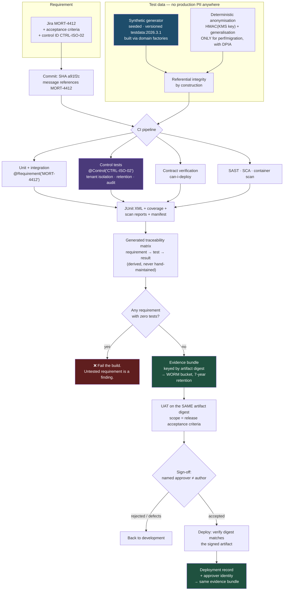

# Tests as Evidence: Traceability, Synthetic Data, and Proving the Controls Work

In a regulated system a test has two jobs: tell the engineer whether the code works, and tell an auditor two years later that it worked, on that release, and who accepted it. Most suites do the first job well and the second not at all — and the gap is usually discovered during an examination, at the worst possible time.

## The Real-World Problem

A retail bank's mortgage-origination platform goes through a combined internal-audit and regulatory examination six weeks before a major release. The engineering team is confident: 6,400 automated tests, a green pipeline, 74% coverage, contract tests against four downstream services.

They fail on three findings, none of which is about code quality.

**Finding 1 — no evidence.** The examiner asks for the test results that supported the affordability-calculation change released in March. GitHub Actions retains logs for 90 days by default; the March run is gone. The team can prove the commit was merged and that a check passed at the time, but cannot produce what was executed, what passed, or what the assertion was. The control — "changes are tested before release" — is documented in the SDLC policy and unevidenced in practice.

**Finding 2 — real customer data in UAT.** UAT runs against a nightly copy of production with names replaced by `Customer_00041`, but account numbers, addresses, dates of birth, income figures, and full transaction histories intact. The bank's position is that the data is "anonymised". The DPO's assessment is blunter: names were removed, but the records remain singularly identifiable from postcode plus date of birth plus salary, so it is **pseudonymised personal data, still fully in scope for GDPR** — with a lawful basis nobody documented, a retention period nobody set, and access by 40 UAT users and 3 outsourced test contractors nobody assessed. Then a customer files an erasure request. The bank deletes from production and discovers it cannot enumerate, let alone delete, the 90 days of nightly UAT copies, four developer laptop dumps, and the two years of database snapshots in cold storage.

**Finding 3 — the controls were never tested.** The platform is multi-tenant across three broker networks. Cross-tenant isolation is enforced by a `WHERE tenant_id = ?` predicate applied in a repository base class. There is no test that a broker from network A is *denied* access to network B's applications. The 7-year retention job that must purge declined applications has a unit test asserting it builds the right SQL, and no test asserting anything is actually deleted. Both controls are asserted in the control matrix. Neither has ever been verified.

Remediation: release slipped one quarter, a data-protection breach notification, and an external assurance engagement. The code was fine. The *evidence about the code* did not exist.

## The Concept

### Evidence is an artifact with a retention period, not a log line

A pipeline log is not evidence. Evidence has four properties an auditor will check:

| Property | What it means concretely |
|---|---|
| **Immutable** | Written once to storage the pipeline identity cannot overwrite or delete (object lock / WORM bucket) |
| **Attributable** | Names the commit SHA, the built artifact digest, the pipeline run, and the environment |
| **Complete** | The machine-readable result of every test, not a summary — JUnit XML, coverage XML, contract verification results, scan reports |
| **Retained** | For the regulatory period, which is years, not the CI platform's 90-day default |

The practical implementation is unglamorous and takes an afternoon: on every pipeline run for a release branch, collect the JUnit XML, coverage report, dependency and container scan output, contract-verification results, and a manifest, then upload to an evidence bucket keyed by artifact digest. Keep the CI platform's own retention as convenience only. See [CI pipeline](../00-project-setup-roadmap/05-ci-pipeline.md) and [CD and deployment](../00-project-setup-roadmap/06-cd-and-deployment.md).

### Traceability must be generated, never maintained

The classic requirement-to-test traceability matrix is a spreadsheet, maintained by hand, wrong within a sprint, and useless to everybody. The fix is to make the linkage a property of the code and derive the matrix from test execution.

**The mechanism: put the ticket ID in the test itself.**

- JVM: a custom `@Requirement("MORT-4412")` annotation, or JUnit 5 `@Tag("req:MORT-4412")`.
- TypeScript: the ID in the test title, or Playwright's `annotations`.
- Then parse the test-report XML/JSON and emit `requirement → test → result → run → artifact digest`.

This gives you three things the spreadsheet never did: it is **always current**, it exposes **requirements with no test** (the interesting direction), and each row is backed by an actual execution record with a timestamp.

The chain an auditor wants to walk, end to end:

**Requirement (Jira MORT-4412 with acceptance criteria) → design/ADR → commit → test annotated with MORT-4412 → test result in the retained evidence bundle → artifact digest → deployment record → approver identity.**

Every arrow should be machine-derivable. Where one is not, that is your finding.

### Test data: the rule that surprises people

**Masked production data is still personal data.** Removing names is not anonymisation. Under GDPR, data is anonymous only when re-identification is not reasonably possible by anyone, using any means, including combination with other datasets. A record with postcode, date of birth, salary band, and a 24-month transaction history is trivially re-identifiable — and courts and regulators have consistently treated that as pseudonymisation, which keeps every obligation intact: lawful basis, purpose limitation, retention limits, access control, breach notification, and data-subject rights.

The consequences engineers actually need to internalise:

| Belief | Reality |
|---|---|
| "It's masked, so it's not personal data" | Pseudonymised. Fully in scope |
| "Non-prod is out of scope" | **Non-prod environments are in scope for data-subject rights.** An erasure request covers UAT, snapshots, and laptop dumps |
| "We'll delete it if asked" | You must be able to *enumerate* every copy first. Uncontrolled copies are the actual finding |
| "Test data has no retention period" | It needs one, enforced by a job, and the job needs a test |
| "Contractors can use it, they signed an NDA" | Processor assessment, transfer mechanism, and access logging still required |

### The hierarchy of test data strategies

| Strategy | Re-identification risk | Realism | Referential integrity | Verdict |
|---|---|---|---|---|
| **Raw production copy** | Certain | Perfect | Perfect | Never. Not in UAT, not in dev, not on a laptop |
| **Masked production copy** | High — still personal data | High | Preserved | Only with a documented lawful basis, retention, and full access control. Treat as production |
| **Deterministic anonymisation of production** | Moderate; depends on generalisation, not just substitution | Good | Preserved if keyed consistently | Acceptable for performance and migration testing with a DPIA |
| **Synthetic generation from the schema + domain rules** | **None** | Good enough for functional testing; poor for realistic distributions | Must be engineered deliberately | **Default for functional, integration, contract, and E2E** |
| **Synthetic + statistically fitted distributions** | None | High | Engineered | Performance testing, rating-engine validation, ML feature work |

### Deterministic anonymisation, done properly

When you must derive from production — migration rehearsals, performance testing at real volume — determinism is what preserves referential integrity: the same input must always produce the same output, across every table and every run, or joins break and the dataset is useless.

Use a **keyed HMAC**, not a plain hash. A plain `SHA-256(nationalInsuranceNumber)` is reversible by brute force for any low-entropy input, which includes every identifier a bank holds. The key lives in a KMS, is never present in a non-production environment, and rotating it is a deliberate act that invalidates old datasets by design.

And substitution is not enough on its own. Generalise the quasi-identifiers that make a record unique: date of birth → year of birth or a five-year band, postcode → outward code only, salary → band. Substitution defeats the lookup; generalisation defeats the jigsaw.

### Referential integrity across synthetic datasets

This is where synthetic-data efforts fail. A generator producing plausible rows table-by-table produces a database that violates every foreign key and every domain invariant, so the suite spends its life debugging fixtures.

Generate **through the domain model or through the API**, not into tables:

- Build **aggregates**, not rows: a `Customer` with `Applications`, each with `Applicants`, `Properties`, `Affordability` records — created via the same factories production code uses.
- **Seed the generator** so a run is reproducible. `Faker` with a fixed seed and derived per-entity seeds gives you a byte-identical dataset from a dataset version number.
- **Version the dataset** (`testdata:2026.3.1`) and record which version each pipeline run used. That is evidence.
- Keep **domain invariants** in the generator: an approved application has a decision date after its submission date; a joint application has exactly two applicants; a declined application has a reason code.
- Generate **the awkward cases on purpose**: a customer with 400 transactions in one day, a name with a diacritic and an apostrophe, a policy that lapsed on 29 February, an applicant aged exactly 18.

### UAT and formal sign-off next to automated testing

Automated tests answer "does it do what we built it to do". UAT answers "is this what the business needs, and will a named person accept the risk of releasing it". Both are required; neither substitutes for the other.

Make the gate real without making it a bottleneck:

- UAT scope is **the acceptance criteria for the tickets in the release**, not a re-run of the regression suite. Regression is the machine's job.
- The sign-off record captures **who, what version, when, and what was accepted with known defects** — and it is stored with the evidence bundle, keyed by the same artifact digest.
- Approval is on the **artifact**, not on the branch. The thing signed off must be bit-identical to the thing deployed; verify the digest at deploy time.
- **Segregation of duties**: the person who approves the release is not the person who wrote the change. Enforce it in the tool, not in a policy document — a required review from a different identity, checked by the pipeline.
- Emergency changes get a **documented break-glass path** with retrospective approval inside a fixed window. Undocumented break-glass is how a control becomes fiction.

### Test the controls, not just the features

This is the highest-value idea in this article and the one most often missing. A control asserted in a matrix and never executed is an assumption. Write a test per control, tag it with the control ID, and make its result part of the evidence bundle.

| Control | The test that proves it |
|---|---|
| Tenant isolation | Broker A's token requesting Broker B's application gets 404/403, and the row is not returned by the repository either |
| Retention / erasure | Seed data past its retention date, run the job, assert **rows are gone** — including from audit-adjacent and child tables |
| Field-level authorisation | A user without `income:read` gets the field absent or redacted, not merely hidden in the UI |
| Audit completeness | Reading a sensitive field writes exactly one immutable access record with actor, resource, field, and timestamp |
| Encryption at rest | The column's raw bytes on disk do not contain the plaintext |
| Segregation of duties | A single approver cannot release a payment above the dual-authorisation threshold |
| Immutability | An `UPDATE` or `DELETE` on the audit table fails |
| Data minimisation | An error response body contains no account number, no PAN, no name |

These tests are cheap, they never flake, and they are the ones an examiner will actually ask to see executed.

## How It Works



Two properties make this auditable: every arrow is machine-derived, and the artifact digest is the join key from requirement all the way to the approver's name.

## Practical Example

### 1. Traceability that generates itself

```java
package com.bank.mortgages.testsupport;

import org.junit.jupiter.api.Tag;
import java.lang.annotation.*;

/** Ticket ID on the test. The traceability matrix is derived from this. */
@Target({ElementType.METHOD, ElementType.TYPE})
@Retention(RetentionPolicy.RUNTIME)
@Tag("traced")
public @interface Requirement {
    String[] value();               // e.g. "MORT-4412"
}

/** Control ID for tests that prove a control works, not that a feature works. */
@Target({ElementType.METHOD, ElementType.TYPE})
@Retention(RetentionPolicy.RUNTIME)
@Tag("control")
public @interface Control {
    String[] value();               // e.g. "CTRL-ISO-02"
    String description();
}
```

A JUnit 5 extension writes one line of machine-readable evidence per executed test:

```java
package com.bank.mortgages.testsupport;

import org.junit.jupiter.api.extension.*;
import com.fasterxml.jackson.databind.ObjectMapper;
import java.nio.file.*;
import java.time.Instant;
import java.util.*;

/** Registered via META-INF/services so it applies to every test, automatically. */
public class TraceabilityExtension implements TestWatcher, BeforeAllCallback {

    private static final Path OUT = Path.of("build/evidence/traceability.ndjson");
    private static final ObjectMapper JSON = new ObjectMapper();

    @Override public void beforeAll(ExtensionContext ctx) throws Exception {
        Files.createDirectories(OUT.getParent());
    }

    @Override public void testSuccessful(ExtensionContext ctx) { write(ctx, "PASSED", null); }
    @Override public void testFailed(ExtensionContext ctx, Throwable cause) {
        write(ctx, "FAILED", cause.getMessage());
    }
    @Override public void testDisabled(ExtensionContext ctx, Optional<String> reason) {
        write(ctx, "SKIPPED", reason.orElse(null));
    }

    private void write(ExtensionContext ctx, String outcome, String detail) {
        var method = ctx.getRequiredTestMethod();
        var row = new LinkedHashMap<String, Object>();
        row.put("test", ctx.getRequiredTestClass().getName() + "#" + method.getName());
        row.put("displayName", ctx.getDisplayName());
        row.put("requirements", ids(method.getAnnotation(Requirement.class)));
        row.put("controls", controlIds(method.getAnnotation(Control.class)));
        row.put("outcome", outcome);
        row.put("detail", detail);
        row.put("executedAt", Instant.now().toString());
        row.put("commit", System.getenv().getOrDefault("GIT_COMMIT", "local"));
        row.put("pipelineRun", System.getenv().getOrDefault("CI_RUN_ID", "local"));
        row.put("testDataVersion", System.getProperty("testdata.version", "unknown"));
        try {
            Files.writeString(OUT, JSON.writeValueAsString(row) + "\n",
                StandardOpenOption.CREATE, StandardOpenOption.APPEND);
        } catch (Exception e) {
            throw new IllegalStateException("evidence write failed — do not swallow this", e);
        }
    }

    private static List<String> ids(Requirement r) {
        return r == null ? List.of() : List.of(r.value());
    }
    private static List<String> controlIds(Control c) {
        return c == null ? List.of() : List.of(c.value());
    }
}
```

Then fail the build on requirements with no test — the direction that finds real gaps:

```bash
# scripts/traceability-gate.sh
set -euo pipefail

# Requirements in this release, from the changelog / Jira release query.
jq -r '.[].key' release-scope.json | sort -u > /tmp/required.txt

# Requirements actually exercised by a PASSING test.
jq -r 'select(.outcome=="PASSED") | .requirements[]' \
   build/evidence/traceability.ndjson | sort -u > /tmp/covered.txt

if ! comm -23 /tmp/required.txt /tmp/covered.txt | tee /tmp/gaps.txt | grep -q .; then
  echo "All in-scope requirements have at least one passing test."
else
  echo "::error::Requirements in this release with no passing test:"
  cat /tmp/gaps.txt
  exit 1
fi
```

### 2. Synthetic data with referential integrity, built through the domain

```java
package com.bank.mortgages.testdata;

import net.datafaker.Faker;
import java.math.BigDecimal;
import java.time.LocalDate;
import java.util.*;

/**
 * Generates a complete, internally consistent dataset. Zero production data.
 * Seeded, so `testdata:2026.3.1` is byte-identical on every machine and in CI —
 * which is what makes the dataset version usable as evidence.
 */
public final class MortgageDatasetGenerator {

    public static final String VERSION = "2026.3.1";
    private static final long SEED = 20260301L;

    private final Faker faker = new Faker(new Locale("en", "GB"), new Random(SEED));
    private final Random rng = new Random(SEED);

    public Dataset generate(int customers) {
        var dataset = new Dataset(VERSION);

        for (int i = 0; i < customers; i++) {
            // Built as an AGGREGATE via the same factories production uses, so
            // every FK and every domain invariant holds by construction.
            var customer = Customer.register(
                CustomerReference.of("CUST-SYN-%06d".formatted(i)),
                faker.name().firstName(),
                faker.name().lastName(),
                LocalDate.now().minusYears(21 + rng.nextInt(45)),
                syntheticPostcode(i));

            int applications = 1 + rng.nextInt(3);
            for (int a = 0; a < applications; a++) {
                var submitted = LocalDate.now().minusDays(10 + rng.nextInt(700));
                var application = customer.startApplication(
                    Money.of(new BigDecimal(120_000 + rng.nextInt(600_000)), "GBP"),
                    Property.of(syntheticPostcode(i * 7 + a), PropertyType.values()[rng.nextInt(3)]),
                    submitted);

                // Joint applications have EXACTLY two applicants — an invariant, enforced here.
                if (rng.nextBoolean()) application.addJointApplicant(syntheticApplicant());

                // Decision dates are always after submission. Declines always carry a reason.
                switch (rng.nextInt(4)) {
                    case 0 -> application.approve(submitted.plusDays(3 + rng.nextInt(20)));
                    case 1 -> application.decline(submitted.plusDays(2 + rng.nextInt(14)),
                                                  DeclineReason.AFFORDABILITY);
                    case 2 -> application.withdraw(submitted.plusDays(1 + rng.nextInt(30)));
                    default -> { /* still in progress */ }
                }
                dataset.add(application);
            }
            dataset.add(customer);
        }

        dataset.addAll(awkwardCases());     // the rows that break production
        return dataset;
    }

    /** Deliberately generated edge cases. These are where defects live. */
    private List<Object> awkwardCases() {
        return List.of(
            Customer.register(CustomerReference.of("CUST-SYN-EDGE01"),
                "Siobhán", "O'Súilleabháin",            // diacritic + apostrophe + collation
                LocalDate.now().minusYears(18),          // exactly 18 — boundary
                "SW1A 1AA"),
            Customer.register(CustomerReference.of("CUST-SYN-EDGE02"),
                "李", "伟",                               // non-Latin script
                LocalDate.of(2004, 2, 29),               // leap day
                "EH1 1YZ"));
    }

    /** Never a real postcode: reserved test outward codes only. */
    private String syntheticPostcode(int i) {
        return "ZZ%02d %dZZ".formatted(i % 100, i % 10);
    }

    private Applicant syntheticApplicant() {
        return Applicant.of(faker.name().firstName(), faker.name().lastName(),
            LocalDate.now().minusYears(25 + rng.nextInt(30)),
            Money.of(new BigDecimal(22_000 + rng.nextInt(90_000)), "GBP"));
    }
}
```

### 3. Deterministic anonymisation, for the cases where synthetic is not enough

```java
package com.bank.mortgages.testdata;

import javax.crypto.Mac;
import javax.crypto.spec.SecretKeySpec;
import java.nio.charset.StandardCharsets;
import java.time.LocalDate;
import java.util.HexFormat;

/**
 * For migration rehearsals and performance runs at production volume ONLY,
 * under a documented DPIA. Output is pseudonymised, NOT anonymous — it remains
 * personal data and inherits production-grade access control and retention.
 */
public final class DeterministicPseudonymiser {

    private final Mac mac;

    /** Key lives in KMS and is NEVER present in a non-production environment. */
    public DeterministicPseudonymiser(byte[] kmsKey) throws Exception {
        this.mac = Mac.getInstance("HmacSHA256");
        this.mac.init(new SecretKeySpec(kmsKey, "HmacSHA256"));
    }

    /**
     * Keyed HMAC, not a plain hash: SHA-256 of a low-entropy identifier such as
     * a national insurance number is brute-forceable in seconds. Determinism is
     * what preserves joins across every table in the dataset.
     */
    public synchronized String pseudonym(String prefix, String value) {
        var digest = mac.doFinal(value.trim().toUpperCase().getBytes(StandardCharsets.UTF_8));
        return prefix + "-" + HexFormat.of().formatHex(digest).substring(0, 16);
    }

    // --- Generalisation: substitution alone does not defeat the jigsaw attack ---

    /** Date of birth → 1 January of a five-year band. */
    public LocalDate generaliseDob(LocalDate dob) {
        return LocalDate.of(dob.getYear() - (dob.getYear() % 5), 1, 1);
    }

    /** Full postcode → outward code only ("EH1 2NG" → "EH1"). */
    public String generalisePostcode(String postcode) {
        return postcode.trim().split("\\s+")[0];
    }

    /** Salary → £10k band midpoint. */
    public long generaliseIncome(long annualIncome) {
        return (annualIncome / 10_000) * 10_000 + 5_000;
    }
}
```

### 4. Testing the controls themselves

**Tenant isolation** — the test that was missing from the scenario:

```java
package com.bank.mortgages.security;

import com.bank.mortgages.testsupport.*;
import org.junit.jupiter.api.Test;
import org.springframework.beans.factory.annotation.Autowired;
import static org.assertj.core.api.Assertions.*;
import static org.springframework.test.web.servlet.request.MockMvcRequestBuilders.get;
import static org.springframework.test.web.servlet.result.MockMvcResultMatchers.status;

@Control(value = "CTRL-ISO-02", description = "Broker networks cannot access each other's applications")
@Requirement("MORT-4412")
class TenantIsolationControlTest extends IntegrationTestBase {

    @Autowired MockMvc mvc;
    @Autowired ApplicationRepository repository;
    @Autowired MortgageFixtures fixtures;

    @Test
    void brokerFromNetworkACannotReadNetworkBsApplication() throws Exception {
        var networkB = fixtures.persistApplication("NET-B", "APP-B-0001");

        // Asserted at the HTTP boundary...
        mvc.perform(get("/v1/applications/{id}", networkB.id())
                .with(brokerToken("broker-7", "NET-A")))
           .andExpect(status().isNotFound());     // 404, not 403: existence is itself information

        // ...AND below it, because a future endpoint must not be able to bypass it.
        TenantContext.set("NET-A");
        assertThat(repository.findById(networkB.id())).isEmpty();

        // ...AND on the list path, which is the one that leaks in bulk.
        TenantContext.set("NET-A");
        assertThat(repository.findAll())
            .allSatisfy(app -> assertThat(app.tenantId()).isEqualTo("NET-A"));
    }

    @Test
    void aMissingTenantContextFailsClosed() {
        TenantContext.clear();
        // The dangerous default is "return everything". Prove it is not the default.
        assertThatThrownBy(repository::findAll)
            .isInstanceOf(TenantContextMissingException.class);
    }
}
```

**Retention** — assert deletion actually happens, in real Postgres, across child tables:

```java
@Control(value = "CTRL-RET-05",
         description = "Declined applications and their child records are purged after 7 years")
@Requirement("MORT-3980")
class RetentionJobControlTest extends IntegrationTestBase {

    @Autowired RetentionJob job;
    @Autowired JdbcClient jdbc;
    @Autowired MortgageFixtures fixtures;

    @Test
    void purgesDeclinedApplicationsPastRetentionIncludingChildRows() {
        var expired = fixtures.persistDeclinedApplication(
            LocalDate.now().minusYears(7).minusDays(1), 3 /* applicants + docs + affordability */);
        var withinRetention = fixtures.persistDeclinedApplication(
            LocalDate.now().minusYears(6), 2);

        job.purgeExpired(Clock.systemUTC());

        // Rows are GONE — not flagged, not soft-deleted.
        assertThat(rowsFor("mortgage_application", expired.id())).isZero();
        assertThat(rowsFor("applicant", expired.id())).isZero();
        assertThat(rowsFor("affordability_assessment", expired.id())).isZero();
        assertThat(rowsFor("uploaded_document", expired.id())).isZero();

        // And nothing else was taken with it.
        assertThat(rowsFor("mortgage_application", withinRetention.id())).isOne();

        // The purge itself is auditable, and the audit record survives the purge.
        assertThat(jdbc.sql("SELECT count(*) FROM retention_audit WHERE subject_id = ?")
                       .param(expired.id().toString()).query(Integer.class).single()).isOne();
    }

    private int rowsFor(String table, Object applicationId) {
        var column = table.equals("mortgage_application") ? "id" : "application_id";
        return jdbc.sql("SELECT count(*) FROM %s WHERE %s = ?".formatted(table, column))
                   .param(applicationId.toString()).query(Integer.class).single();
    }
}
```

**Data minimisation in error bodies** — the leak nobody notices until a log review:

```java
@Control(value = "CTRL-MIN-01", description = "Error responses contain no personal data")
@Test
void problemDetailsNeverEchoPersonalData() throws Exception {
    var body = mvc.perform(post("/v1/applications")
            .contentType(APPLICATION_JSON)
            .content("""
                {"applicantSurname":"O'Súilleabháin","nationalInsuranceNumber":"QQ123456C",
                 "requestedAmount":{"amount":"not-a-number","currency":"GBP"}}"""))
        .andExpect(status().isBadRequest())
        .andReturn().getResponse().getContentAsString();

    assertThat(body).doesNotContain("QQ123456C", "O'Súilleabháin");
    assertThat(body).contains("https://api.bank.com/problems/validation-failed");
}
```

### 5. The evidence bundle, retained beyond the CI platform's default

```yaml
# .github/workflows/release.yml (excerpt)
      - name: Run tests with the versioned synthetic dataset
        run: ./gradlew test integrationTest -Dtestdata.version=2026.3.1
        env:
          GIT_COMMIT: ${{ github.sha }}
          CI_RUN_ID: ${{ github.run_id }}

      - name: Fail on requirements with no passing test
        run: ./scripts/traceability-gate.sh

      - name: Assemble evidence bundle
        run: |
          DIGEST=$(crane digest "$IMAGE")
          mkdir -p evidence
          cp -r build/test-results build/reports/jacoco build/evidence evidence/
          cp sbom.spdx.json trivy-report.json pact-verification-results.json evidence/
          cat > evidence/manifest.json <<JSON
          {
            "artifactDigest": "$DIGEST",
            "commit": "${{ github.sha }}",
            "pipelineRun": "${{ github.run_id }}",
            "testDataVersion": "2026.3.1",
            "builtAt": "$(date -Is)",
            "retainUntil": "$(date -Is -d '+7 years')"
          }
          JSON
          tar czf "evidence-$DIGEST.tar.gz" evidence/

      # Object Lock in COMPLIANCE mode: not even the pipeline identity can delete it.
      - name: Upload to WORM evidence store
        run: |
          aws s3 cp "evidence-$DIGEST.tar.gz" \
            "s3://bank-sdlc-evidence/mortgages/$DIGEST/" \
            --object-lock-mode COMPLIANCE \
            --object-lock-retain-until-date "$(date -Is -d '+7 years')"
```

## Enterprise Trade-offs

| Approach | Pros | Cons | When to use (Banking / Insurance / Enterprise) |
|---|---|---|---|
| **Synthetic data generated through domain factories, seeded and versioned** | No personal data anywhere; reproducible; edge cases generated on purpose; no DSAR exposure in non-prod | Real effort to build; distributions less realistic than production | **Default** for functional, integration, contract and E2E testing across every regulated environment |
| **Deterministic anonymisation (HMAC + generalisation) of production** | Production-scale volume and realistic distributions; joins preserved | Still personal data — needs DPIA, lawful basis, retention, access control; re-identification risk is never zero | Migration rehearsals and performance runs only, in a locked-down environment with an expiry date |
| **Masked production copy in UAT** | Zero build effort; perfectly realistic | Pseudonymised personal data in a weakly controlled environment; uncontrolled copies; the DSAR problem — finding 2 above | Only with a documented lawful basis and production-equivalent controls. Usually not worth it |
| **Generated traceability from test annotations** | Always current; exposes untested requirements; each row backed by an execution record | Requires discipline to annotate; needs a tagging convention teams agree on | Any system under SOX, PCI-DSS, Solvency II, DORA or SOC 2 |
| **Hand-maintained traceability spreadsheet** | Familiar to auditors; no tooling | Stale within a sprint; nobody trusts it; consumes analyst time permanently | Never. Generate it |
| **Evidence in a WORM store keyed by artifact digest** | Survives CI retention; immutable; joins requirement → test → artifact → approver | Storage cost; needs a lifecycle policy and a restore procedure that has been rehearsed | Every regulated release. This is the cheapest audit finding you will ever close |
| **Automated control tests (isolation, retention, audit, minimisation)** | Turns an asserted control into a verified one; never flaky; exactly what examiners ask for | Someone must own the mapping from control matrix to test IDs | Mandatory for multi-tenant, retention-bound, or field-audited systems |
| **Manual UAT sign-off as the only gate** | Business ownership is explicit | Slow; cannot cover regression; sign-off on a branch rather than an artifact is unverifiable | Keep UAT for acceptance of new scope; never let it substitute for automated regression |

→ Next: [../09-ux-ui-guidelines/01-ui-consistency-and-design-tokens.md](../09-ux-ui-guidelines/01-ui-consistency-and-design-tokens.md) · Related: [04-contract-testing-for-apis.md](04-contract-testing-for-apis.md) · [../04-security-and-authentication/06-compliance-standards-pci-dss-gdpr-soc2.md](../04-security-and-authentication/06-compliance-standards-pci-dss-gdpr-soc2.md) · [../06-database-strategies/06-schema-migrations-in-a-regulated-environment.md](../06-database-strategies/06-schema-migrations-in-a-regulated-environment.md) · [../01-core-concepts/04-data-integrity-and-migrations.md](../01-core-concepts/04-data-integrity-and-migrations.md) · [../10-example-code/spring-boot/testing-example.md](../10-example-code/spring-boot/testing-example.md)
