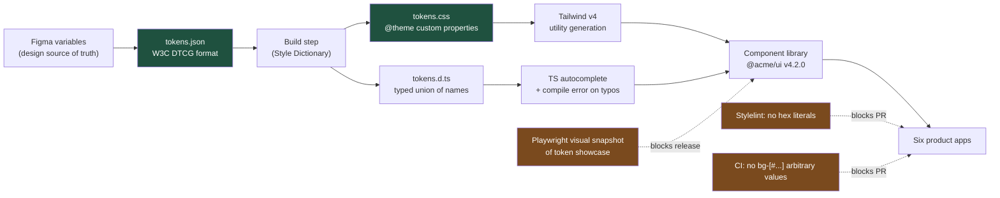

# Five Shades of Delete: Design Tokens as the Contract You Can Lint

A design system is not a Figma library. It is a set of named values that your compiler can see, your linter can enforce, and your reviewer can reject a PR over. Everything else is a suggestion.

## The Real-World Problem

A logistics software vendor ships a suite of six web applications — Fleet, Dispatch, Billing, Warehouse, Partner Portal, and Admin — built by four teams over seven years. Every one of them has a destructive-action button.

An accessibility audit ahead of a large tender inventoried them. The "delete" red appeared as `#DC2626` in Fleet, `#E53935` in Dispatch (a Material Design leftover), `#D32F2F` in Billing, `bg-red-600` in Warehouse, and `#FF0000` in the Admin app, hardcoded by a contractor in 2021. Three of the five failed 4.5:1 contrast against their own hover state. Two used the same red for destructive actions *and* for validation errors, so a form with a delete button showed two different meanings in the same hue.

The rebrand made it concrete. Marketing changed the brand red. The design team estimated "a token change, one afternoon." Engineering found 1,847 hardcoded colour literals across 31 packages. The rebrand took eleven weeks, shipped in four uncoordinated releases, and the Admin app was still wrong six months later because nobody could grep for `#FF0000` with confidence — it also appeared in an SVG icon, a chart series, and an email template.

The cost was not the eleven weeks. It was that for seven years, no engineer could answer "what colour should this button be?" without asking a designer, and every answer was relitigated per PR.

## The Concept

### Tokens are the interface between design and code

Design owns the *values*. Engineering owns the *consumption*. The token name is the contract, and like any interface, its stability matters more than its implementation. `--color-surface-danger` can change from crimson to vermilion without a single component edit. `#DC2626` cannot change at all without a migration.

**Always** name tokens by role, never by appearance. **Never** ship a token called `--color-red-button` or `--spacing-8px` — the first breaks when the button turns orange, the second breaks when 8px becomes 10px at high density.

### Three tiers, and only three

| Tier | Example | Who owns it | Who may reference it |
|---|---|---|---|
| **Primitive** | `--red-600: oklch(0.58 0.21 25)` | Design (brand) | Semantic tier only |
| **Semantic** | `--color-surface-danger: var(--red-600)` | Design + engineering jointly | Components, features, app code |
| **Component** | `--button-danger-bg: var(--color-surface-danger)` | Component library owner | That component only |

The rules that make this work:

- **Never** reference a primitive token from application or feature code. `bg-[var(--red-600)]` is the same bug as `bg-[#DC2626]` with extra steps — it hardcodes an appearance decision at the call site.
- **Always** add a semantic token when you need a new meaning, not a new colour. If you cannot name the meaning, you do not yet have a design decision; you have a preference.
- **Skip the component tier** unless the component genuinely needs to vary independently. Three tiers are the maximum; four is a taxonomy project.

### Theming and density are the same mechanism

Enterprise UI has two axes designers routinely forget to specify: theme (light/dark/high-contrast) and density (comfortable/compact). A claims adjudication grid at comfortable density shows 12 rows; at compact it shows 28, and adjusters will demand compact within a week of go-live.

Both are token overrides on a scope, not component variants. **Always** implement density as a spacing/type-scale override, never as conditional `className` logic — the moment density becomes an `if`, every component must be individually taught about it.

### Enforcement is the whole point

An unenforced token system decays at roughly the rate of team turnover. Enforcement has three layers:

| Layer | Catches | Cost |
|---|---|---|
| **Stylelint / ESLint rule** | Hex, rgb, hsl literals in `.css` and `.tsx` | One afternoon of setup |
| **CI check on arbitrary Tailwind values** | `bg-[#fff]`, `text-[13px]` | A grep in the pipeline |
| **Visual regression on the token showcase** | Semantic token drift and accidental rebrands | A Playwright snapshot suite |

**Always** fail the build, not the review. A lint rule that emits a warning is a lint rule that has been ignored 400 times.

### Component library governance

The library is a published, versioned package — not a shared folder. Concretely: semver where a token *rename* is a major, a token *value change* is a minor with a changelog entry, and a new token is a patch. Ship a codemod with every breaking rename; a rename without a codemod is a task you have assigned to twelve other teams.

## How It Works



The load-bearing part is not the pipeline — it is the three dotted lines. Without automated rejection, the pipeline produces tokens that nobody is obliged to use.

## Practical Example

**The token definition** — Tailwind v4 needs no JS config; `@theme` publishes CSS custom properties *and* generates utilities from them.

```css
/* packages/ui/src/tokens.css */
@import "tailwindcss";

@theme {
  /* ---- Tier 1: primitives. Never referenced outside this file. ---- */
  --color-red-600: oklch(0.577 0.245 27.3);
  --color-red-700: oklch(0.505 0.213 27.5);
  --color-slate-50: oklch(0.984 0.003 247.9);
  --color-slate-900: oklch(0.208 0.042 265.8);

  /* ---- Tier 2: semantic. This is the public contract. ---- */
  --color-surface-page: var(--color-slate-50);
  --color-surface-danger: var(--color-red-600);
  --color-surface-danger-hover: var(--color-red-700);
  --color-text-on-danger: oklch(1 0 0);
  --color-border-focus: oklch(0.62 0.19 259.8);

  /* ---- Density: one scale, overridden per scope. ---- */
  --spacing-row-y: 0.75rem;
  --text-body: 0.875rem;
}

/* Dark theme overrides SEMANTIC tokens only — primitives are untouched. */
[data-theme="dark"] {
  --color-surface-page: var(--color-slate-900);
  --color-surface-danger: var(--color-red-700);
}

/* Density is a scope, not a component prop cascade. */
[data-density="compact"] {
  --spacing-row-y: 0.25rem;
  --text-body: 0.8125rem;
}
```

**Bad — the button that caused the eleven-week rebrand:**

```tsx
// features/fleet/components/delete-vehicle-button.tsx  ❌
export function DeleteVehicleButton({ onDelete }: { onDelete: () => void }) {
  return (
    <button
      onClick={onDelete}
      className="rounded px-4 py-2 text-[13px] font-medium text-white"
      style={{ backgroundColor: '#DC2626' }}   // invisible to every lint rule
      onMouseEnter={(e) => (e.currentTarget.style.backgroundColor = '#B91C1C')}
    >
      Delete vehicle
    </button>
  )
}
```

Three separate failures: the colour is a literal, the hover is a second literal set imperatively, and `text-[13px]` opts out of the density scale so this button never gets smaller in compact mode.

**Good — the semantic component, consumed by all six apps:**

```tsx
// packages/ui/src/button.tsx
import { cva, type VariantProps } from 'class-variance-authority'
import { cn } from './cn'

const button = cva(
  [
    'inline-flex items-center justify-center rounded-md font-medium',
    'text-body transition-colors',
    'focus-visible:outline-2 focus-visible:outline-offset-2',
    'focus-visible:outline-(--color-border-focus)',
    'disabled:pointer-events-none disabled:opacity-50',
  ],
  {
    variants: {
      intent: {
        primary: 'bg-surface-accent text-on-accent hover:bg-surface-accent-hover',
        // Every value below resolves through the semantic tier.
        danger: 'bg-surface-danger text-on-danger hover:bg-surface-danger-hover',
        ghost: 'bg-transparent text-body-default hover:bg-surface-subtle',
      },
      size: { sm: 'h-8 px-3', md: 'h-10 px-4', lg: 'h-12 px-6' },
    },
    defaultVariants: { intent: 'primary', size: 'md' },
  },
)

export type ButtonProps = React.ComponentPropsWithoutRef<'button'> &
  VariantProps<typeof button>

export function Button({ intent, size, className, ...props }: ButtonProps) {
  return <button className={cn(button({ intent, size }), className)} {...props} />
}
```

```tsx
// features/fleet/components/delete-vehicle-button.tsx  ✅
import { Button } from '@acme/ui'

export function DeleteVehicleButton({ onDelete }: { onDelete: () => void }) {
  return (
    <Button intent="danger" onClick={onDelete}>
      Delete vehicle
    </Button>
  )
}
```

**The enforcement that keeps it true:**

```js
// stylelint.config.mjs
export default {
  rules: {
    'color-no-hex': [true, { message: 'Use a semantic token: var(--color-*).' }],
    'declaration-property-value-disallowed-list': {
      '/color$/': ['/^rgb/', '/^hsl/', '/^oklch/'],
    },
  },
  overrides: [
    // Primitives are the one place raw colour values are legal.
    { files: ['packages/ui/src/tokens.css'], rules: { 'color-no-hex': null,
      'declaration-property-value-disallowed-list': null } },
  ],
}
```

```json
// .eslintrc — blocks Tailwind arbitrary values in app code
{
  "rules": {
    "no-restricted-syntax": [
      "error",
      {
        "selector": "JSXAttribute[name.name='className'] Literal[value=/\\[#[0-9a-fA-F]{3,8}\\]|\\[\\d+px\\]/]",
        "message": "Arbitrary colour/size value. Add a semantic token in @acme/ui instead."
      },
      {
        "selector": "JSXAttribute[name.name='style']",
        "message": "Inline style bypasses the token system. Use a variant or a token-backed utility."
      }
    ]
  }
}
```

**Which back-and-forth this prevents:** the recurring PR-review argument "is this the right red?", and the design-QA ticket cycle where a designer screenshots two buttons side by side and files a bug. With semantic tokens plus a failing lint rule, there is exactly one red for destructive surfaces, the answer is discoverable in autocomplete, and a wrong one cannot merge. It also kills the rebrand negotiation entirely: "change the brand colour" becomes a one-line diff in `tokens.css` and a minor version bump, not a cross-team programme.

## Enterprise Trade-offs

| Approach | Pros | Cons | When to use (Banking / Insurance / Enterprise) |
|---|---|---|---|
| **Three-tier tokens + published component library + CI enforcement** | Rebrand and theming become config; one answer per decision; audit-friendly | Upfront build, needs an owning team, versioning discipline | Default for any multi-app suite or a product with a 5+ year life — core banking consoles, policy admin suites |
| **Semantic tokens only (no component tier)** | 80% of the value, far less machinery | Component-specific overrides leak into feature code | Single-product teams under ~15 engineers; the pragmatic starting point |
| **Tailwind default palette, no custom tokens** | Zero setup; consistent by accident | `red-600` is an appearance, not a meaning; no theming, no density, no rebrand path | Internal tools with no brand requirement and a known short life — never for customer-facing financial UI |
| **Third-party design system (MUI, Fluent, Carbon)** | Accessible defaults, documented, staffed by someone else | Brand ceiling; heavy override cost; you inherit their upgrade cadence | Insurance back-office and admin tooling where speed beats differentiation and the vendor is stable |
| **Figma variables synced automatically to `tokens.json`** | Design changes land as PRs; no transcription errors | Fragile tooling; designers can break the build; needs review gating on the sync PR | Mature design orgs with 2+ full-time designers; otherwise a hand-maintained `tokens.css` is more reliable |
| **Hardcoded values, "we'll clean it up later"** | — | Every colour becomes a negotiation; rebrand cost scales with codebase size | Never. This is the scenario above |

→ Next: [02-accessibility-basics-wcag.md](02-accessibility-basics-wcag.md) · Related: [../07-frontend-best-practices/04-styling-with-tailwind-css.md](../07-frontend-best-practices/04-styling-with-tailwind-css.md) · [../07-frontend-best-practices/01-react-component-architecture.md](../07-frontend-best-practices/01-react-component-architecture.md) · [../00-project-setup-roadmap/09-code-review-process.md](../00-project-setup-roadmap/09-code-review-process.md)
