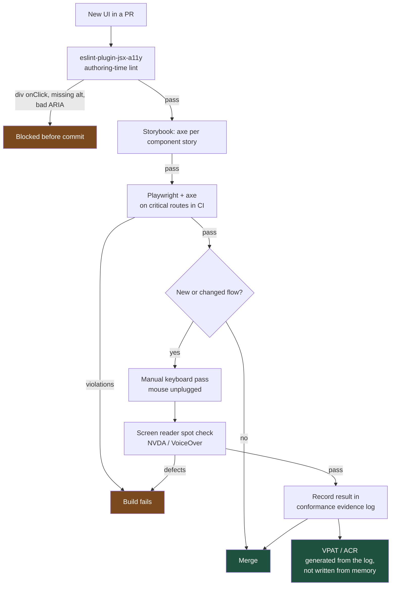

# The VPAT Question: Accessibility as a Procurement Gate, Not a Nice-to-Have

Accessibility stops being a backlog item the moment a €40M tender asks for your VPAT. WCAG 2.2 AA is not a quality aspiration in enterprise software — it is a contractual precondition, and roughly eight rules produce most of the compliance.

## The Real-World Problem

A mid-size insurer bid for the group health scheme of a national civil-service pension body: 220,000 members, five-year term, the largest deal in the company's pipeline. Their member self-service portal — claims submission, policy documents, beneficiary management — was the centrepiece of the bid.

Section 3.4 of the RFP asked for a completed VPAT 2.5 (Rev INT) documenting conformance with WCAG 2.1 AA and EN 301 549. The insurer had never produced one. Sales committed to delivering it in three weeks.

The audit found 47 issues. Eleven were blocking:

- The claims wizard's "Next" button was a `<div onClick>` — unreachable by keyboard, so the entire claims flow was keyboard-inoperable end to end.
- Focus outlines had been removed globally by `*:focus { outline: none }` added in 2019 "because it looked bad on the buttons".
- The document-upload modal trapped focus *outside* itself: Tab moved into the page behind it, and Escape did nothing.
- Field-level validation errors were rendered visually in red with no programmatic association, so a screen reader announced "edit, blank" on a field the sighted user saw marked "Required — enter your policy number".
- The beneficiary percentage table used colour alone to flag rows summing to more than 100%.

Remediation was quoted at fourteen weeks. The tender closed in five. The insurer submitted the VPAT with eleven "Does Not Support" and nine "Partially Supports" entries. They were shortlisted, then eliminated at technical evaluation — the scoring matrix weighted accessibility conformance at 15%, and a "Does Not Support" on keyboard operability was a hard disqualifier under the body's own procurement policy.

The portal had run for six years. Every one of the eleven blockers was a decision an engineer made in under a minute, without knowing it was a decision.

## The Concept

### Why this is a legal and commercial constraint

Treat these as requirements documents, not advocacy:

| Instrument | Applies to | Practical effect on you |
|---|---|---|
| **EAA (EU 2019/882)** | Consumer-facing banking, insurance, e-commerce, e-books, transport in the EU | Enforceable since June 2025. Non-conformance is a market-access and penalty issue, not a bug |
| **EN 301 549** | EU public-sector procurement | Referenced directly in tender text; incorporates WCAG 2.1 AA (2.2 in newer revisions) |
| **Section 508 / ADA (US)** | Federal procurement; ADA Title III litigation for private sector | VPAT requested at RFP stage; thousands of ADA web suits filed annually |
| **VPAT / ACR** | Any large buyer, public or private | A per-criterion self-declaration you sign. Overstating it is a misrepresentation in a contract |
| **WCAG 2.2 AA** | The technical baseline all of the above point at | The actual checklist your code must satisfy |

**Always** ask whether the product is in scope for public-sector or EU consumer sales *before* the first sprint. If it is, WCAG 2.2 AA belongs in the Definition of Done, because retrofitting costs 10–30× what building it in costs.

### The eight rules that produce most of the conformance

**1. Semantic HTML first.** `<button>`, `<a href>`, `<nav>`, `<table>`, `<label>`, `<fieldset>`. **Never** build an interactive control from `<div>` or `<span>`. The native element gives you keyboard operability, focus, role, state, and platform behaviour for free; a `div` requires you to reimplement all of it correctly and you will not.

**2. Everything operable by keyboard.** Tab reaches it, Enter/Space activates it, Arrow keys move within composite widgets, Escape dismisses. **Never** ship an interaction that requires hover or drag with no keyboard equivalent (WCAG 2.1.1).

**3. Visible focus, always.** **Never** write `outline: none` without an equivalent replacement. Use `:focus-visible` so pointer users do not see rings but keyboard users always do. 2.4.11 Focus Not Obscured (new in 2.2) additionally requires the focused element not be hidden behind sticky headers.

**4. Accessible names on everything.** Every input has a programmatically associated `<label>`. Every icon-only button has `aria-label`. Every image has `alt` (empty `alt=""` if decorative — never omit the attribute).

**5. Contrast.** 4.5:1 for body text, 3:1 for large text (≥24px, or ≥19px bold) and for UI component boundaries and states (1.4.11). This is a token-level property — fix it once in the palette, not per component.

**6. Errors identified, described, and announced.** `aria-invalid`, `aria-describedby` pointing at the message, and a live region so the error is announced rather than only rendered. Text must say what is wrong and how to fix it (3.3.1, 3.3.3).

**7. Target size.** 2.5.8 requires 24×24 CSS px minimum for pointer targets (with spacing exceptions). 44×44 is the practical target for anything used on a touch device.

**8. No keyboard traps in modals.** Focus moves into the dialog, cycles within it, Escape closes it, and focus returns to the trigger. Use `<dialog>` or a maintained primitive — **never** hand-roll this.

### What automation catches, and what it never will

| Check | Tool | Coverage |
|---|---|---|
| Static JSX patterns (missing alt, `onClick` on div, invalid ARIA) | `eslint-plugin-jsx-a11y` | Catches at authoring time; cheapest possible feedback |
| Rendered DOM violations (contrast, names, roles, landmarks) | `axe-core` via `@axe-core/playwright`, Storybook a11y addon | ~30–40% of WCAG failures |
| Full-page audit per PR on critical routes | Playwright + axe in CI | Prevents regression; gate the build |
| **Logical focus order** | — | Manual keyboard pass only |
| **Whether the announced text makes sense** | — | Manual screen reader only (NVDA + Firefox, VoiceOver + Safari) |
| **Whether the flow is completable without a mouse** | — | Manual: unplug the mouse and file the claim |

**Always** run axe in CI *and* require a manual keyboard pass on any new flow. Automated tools find roughly a third of real failures; every blocker in the scenario above except contrast required a human pressing Tab.

## How It Works



The path that matters is the right-hand branch: automation gates regressions, humans certify new flows, and the VPAT is assembled from accumulated evidence rather than authored under tender pressure.

## Practical Example

**Bad — the claims wizard step that failed the audit:**

```tsx
// features/claims/components/wizard-nav.tsx  ❌
export function WizardNav({ onNext, errors }: { onNext: () => void; errors: string[] }) {
  return (
    <div>
      {errors.length > 0 && (
        <div className="text-red-500">{errors.join(', ')}</div>  // never announced
      )}
      <div className="cursor-pointer rounded bg-blue-600 p-2 text-white" onClick={onNext}>
        Next
      </div>
                                      {/* no alt */}
      <span onClick={() => window.history.back()}>Back</span>
    </div>
  )
}
```

Not reachable by Tab, not activatable by Enter, no role, no accessible name on the icon, and errors that exist only visually. `eslint-plugin-jsx-a11y` flags four of these five before the commit lands.

**Good — the same step, conformant:**

```tsx
// features/claims/components/wizard-nav.tsx  ✅
'use client'

import { Button } from '@acme/ui'
import { HelpCircle } from 'lucide-react'

type Props = {
  onNext: () => void
  onBack: () => void
  errors: string[]
  isSubmitting: boolean
}

export function WizardNav({ onNext, onBack, errors, isSubmitting }: Props) {
  return (
    <div className="flex flex-col gap-4">
      {/* role="alert" => announced on appearance without moving focus (3.3.1). */}
      {errors.length > 0 && (
        <div
          role="alert"
          className="rounded-md border border-danger bg-surface-danger-subtle p-3 text-body"
        >
          <p className="font-medium">We could not continue. Fix the following:</p>
          <ul className="mt-1 list-disc pl-5">
            {errors.map((e) => (
              <li key={e}>{e}</li>
            ))}
          </ul>
        </div>
      )}

      <div className="flex items-center gap-2">
        <Button intent="ghost" onClick={onBack}>
          Back
        </Button>

        <Button onClick={onNext} disabled={isSubmitting}>
          {isSubmitting ? 'Checking…' : 'Next'}
        </Button>

        {/* Icon-only control: accessible name + 44px hit area (2.5.8). */}
        <button
          type="button"
          aria-label="What documents do I need for this step?"
          className="grid size-11 place-items-center rounded-md
                     focus-visible:outline-2 focus-visible:outline-offset-2
                     focus-visible:outline-(--color-border-focus)"
        >
          <HelpCircle aria-hidden="true" className="size-5" />
        </button>
      </div>
    </div>
  )
}
```

**Good — a field whose error is programmatically associated** (React Hook Form + Zod):

```tsx
// features/claims/components/policy-number-field.tsx
'use client'

import { useFormContext } from 'react-hook-form'
import { useId } from 'react'

export function PolicyNumberField() {
  const { register, formState } = useFormContext<{ policyNumber: string }>()
  const id = useId()
  const errorId = `${id}-error`
  const hintId = `${id}-hint`
  const error = formState.errors.policyNumber

  return (
    <div className="flex flex-col gap-1">
      {/* Real <label htmlFor>. Not a styled div, not a placeholder. */}
      <label htmlFor={id} className="text-body font-medium">
        Policy number <span aria-hidden="true">*</span>
        <span className="sr-only">(required)</span>
      </label>

      <p id={hintId} className="text-sm text-muted">
        10 characters, printed top-right of your policy schedule. Example: HL0042871X
      </p>

      <input
        id={id}
        {...register('policyNumber')}
        aria-describedby={error ? `${hintId} ${errorId}` : hintId}
        aria-invalid={error ? true : undefined}
        autoComplete="off"
        className="h-11 rounded-md border px-3
                   aria-invalid:border-danger
                   focus-visible:outline-2 focus-visible:outline-offset-2
                   focus-visible:outline-(--color-border-focus)"
      />

      {error && (
        <p id={errorId} className="text-sm text-danger">
          {error.message}
        </p>
      )}
    </div>
  )
}
```

Note the Zod message does the work of criterion 3.3.3 — it must state the remedy:

```ts
// features/claims/schema.ts
import { z } from 'zod'

export const claimIntakeSchema = z.object({
  policyNumber: z
    .string()
    .trim()
    // ✅ Says what is wrong AND what to do. ❌ would be "Invalid input".
    .regex(/^HL\d{7}[A-Z]$/, 'Enter your policy number as HL followed by 7 digits and a letter, e.g. HL0042871X'),
})
```

**The CI gate:**

```ts
// e2e/a11y.spec.ts
import { test, expect } from '@playwright/test'
import AxeBuilder from '@axe-core/playwright'

const CRITICAL_ROUTES = ['/claims/new', '/claims/new/documents', '/policies', '/beneficiaries']

for (const route of CRITICAL_ROUTES) {
  test(`${route} has no WCAG 2.2 AA violations`, async ({ page }) => {
    await page.goto(route)
    const results = await new AxeBuilder({ page })
      .withTags(['wcag2a', 'wcag2aa', 'wcag21a', 'wcag21aa', 'wcag22aa'])
      .analyze()
    expect(results.violations).toEqual([])
  })
}

test('claims wizard is completable with the keyboard alone', async ({ page }) => {
  await page.goto('/claims/new')
  await page.keyboard.press('Tab')
  await page.keyboard.type('HL0042871X')
  await page.keyboard.press('Tab')
  await page.keyboard.press('Enter')
  await expect(page.getByRole('heading', { name: 'Upload documents' })).toBeVisible()
  // Focus must land inside the new step, not reset to <body>.
  await expect(page.locator(':focus')).toBeVisible()
})

test('upload modal traps focus and returns it on Escape', async ({ page }) => {
  await page.goto('/claims/new/documents')
  const trigger = page.getByRole('button', { name: 'Add document' })
  await trigger.click()
  const dialog = page.getByRole('dialog')
  await expect(dialog).toBeVisible()
  await page.keyboard.press('Escape')
  await expect(dialog).toBeHidden()
  await expect(trigger).toBeFocused()   // the check the insurer's portal failed
})
```

**Which back-and-forth this prevents:** the audit-driven remediation sprint, where a third party files 47 tickets against six years of UI and design must re-specify focus states, error copy, and contrast for components that already shipped. It also removes the recurring "can we hide the focus ring, it looks bad" request — `:focus-visible` gives design the clean pointer appearance and gives procurement the conformance, so the conversation happens once instead of per component.

## Enterprise Trade-offs

| Approach | Pros | Cons | When to use (Banking / Insurance / Enterprise) |
|---|---|---|---|
| **Accessible-by-default component library (Radix / React Aria + tokens)** | Focus management, ARIA, and keyboard behaviour solved once by specialists | Styling effort; another dependency to upgrade | Default for anything in EAA or public-procurement scope — member portals, retail banking, self-service claims |
| **Lint + axe in CI, no manual testing** | Cheap, prevents regression, no headcount | Misses focus order, announcement quality, mouse-free completability — the blockers above | Acceptable minimum for internal admin tools; insufficient for a signed VPAT |
| **Full manual audit each release (internal or third-party)** | Finds what automation cannot; produces defensible evidence | €10–40k and 2–4 weeks per audit cycle | Before a public-sector bid, and annually thereafter for in-scope consumer products |
| **Accessibility in Definition of Done from sprint one** | Cheapest possible path; no remediation programme | Slows early delivery ~5–10%; requires real training | Any product with a 3+ year life or known public-sector pipeline |
| **Overlay widget ("accessibility plugin")** | Fast to install; vendor promises compliance | Does not fix the DOM; widely rejected by auditors and named in litigation | Never. It will not satisfy EN 301 549 evaluation |
| **Remediate only after a tender asks** | Zero cost until it isn't | 10–30× rebuild cost, under deadline, with a lost deal as the trigger | The scenario above |

→ Next: [03-responsive-and-mobile-first.md](03-responsive-and-mobile-first.md) · Related: [../08-testing-strategies/03-end-to-end-testing-playwright-and-cypress.md](../08-testing-strategies/03-end-to-end-testing-playwright-and-cypress.md) · [../07-frontend-best-practices/08-forms-with-react-hook-form-and-zod.md](../07-frontend-best-practices/08-forms-with-react-hook-form-and-zod.md) · [../00-project-setup-roadmap/10-definition-of-done.md](../00-project-setup-roadmap/10-definition-of-done.md)
