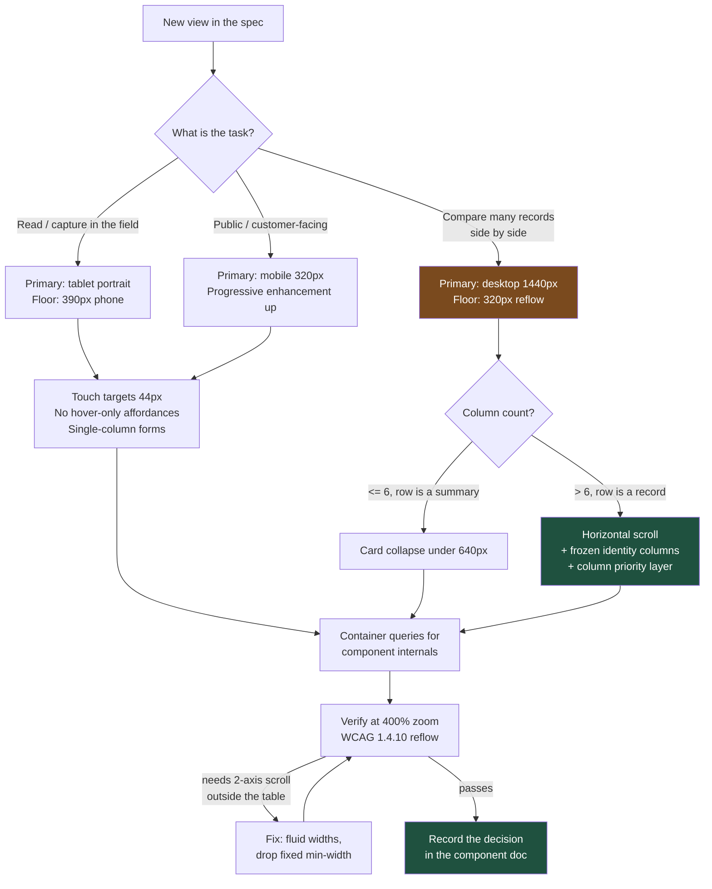

# A Claims Grid Is Not a Phone Experience: Responsive Design With an Actual Opinion

Mobile-first is a default, not a law. In enterprise software the honest answer is often "this view is desktop-first, that view is mobile-first, and here is the breakpoint where we stop pretending" — and saying it out loud in the spec saves months.

## The Real-World Problem

A property and casualty insurer rolled out a new field inspection app for its 340 loss adjusters. Adjusters work from vehicles: they photograph damage, record measurements, capture the policyholder's statement, and submit an estimate, mostly on 10-inch tablets in portrait, occasionally on a phone in the rain.

The same platform team also owned the back-office adjudication console, where 45 desk adjusters review submitted claims in a 34-column grid — claim reference, policy, peril, reserve, paid-to-date, reinsurance flag, SLA clock, and so on — sorted, filtered, and bulk-actioned all day on 27-inch monitors.

Design produced one responsive system for both, mobile-first, per the company's stated policy.

Two things broke. The field app was built desktop-down: the photo capture screen assumed hover for its delete affordance, its tap targets were 28px, and at 768px the estimate form's two-column layout compressed currency inputs to 90px, so adjusters routinely typed into the wrong field. Field submissions with data-entry errors ran at 19%.

The console broke in the other direction. To satisfy "must work on mobile", the 34-column grid collapsed into stacked cards below 1024px. Nobody used it on a phone — but the collapse logic meant the grid component could never assume horizontal space, so the desktop version lost frozen columns, lost the compact row height desk adjusters had asked for, and lost bulk selection. A 34-column card stack is 34 stacked rows per claim; on a 27-inch monitor it showed two claims per screen instead of twenty-eight.

Six months of rework. The fix was not technical. It was writing down, per view, which form factor was primary and which was explicitly out of scope.

## The Concept

### Decide the primary form factor per view, and record it

**Always** state the primary form factor in the ticket, and the minimum supported width. **Never** accept "responsive" as a requirement — it describes an implementation, not a decision.

| View type | Primary | Realistic minimum | Rationale |
|---|---|---|---|
| Customer-facing portal, marketing, onboarding | Mobile | 320px | Traffic is majority mobile; no negotiation |
| Field / inspection / point-of-sale tools | Tablet-first (768–1024) | 390px | Real device is a tablet; phone is a degraded fallback that must still work |
| Data-dense operational grid (adjudication, treasury, reconciliation) | Desktop | 1024px, with reflow to 320px for WCAG 1.4.10 | The task needs simultaneous columns. A phone layout is a different product |
| Dashboards / approvals / notifications | Dual: mobile read, desktop act | 320px | Managers approve from phones and analyse from desks |

Desktop-first is a legitimate engineering decision for a data-dense operational view. Saying so is not laziness — it is refusing to spend six months building an interface nobody will open. But note the third row: "desktop-first" never means "breaks below 1024px". WCAG 1.4.10 Reflow still applies, which is a hard floor discussed below.

### Container queries over viewport media queries

A component does not know the viewport, and should not care. It knows how much space *it* was given. A filter panel rendered in a 320px sidebar on a 2560px monitor should lay out as narrow — a viewport media query gets this exactly wrong.

**Always** use `@container` for component-internal layout. **Reserve** viewport media queries for page-level shell decisions: does the app have a sidebar or a bottom bar, one column or three. This is the single highest-leverage change available in 2026 CSS, and it is universally supported.

### Responsive data tables: the real enterprise problem

Four options. Only one is generally correct.

| Strategy | Behaviour | Verdict |
|---|---|---|
| **Horizontal scroll** | Full table in an `overflow-x` container, header row and 1–2 identity columns frozen | **Recommended default.** Preserves the mental model, no data hidden, trivially accessible, works at any width |
| **Column priority** | Each column carries a priority; low-priority columns drop as space shrinks, with an expandable row detail | Good second layer *on top of* scroll for genuinely tablet-primary tables. Needs a per-column priority decision from product |
| **Card collapse** | Below a breakpoint, each row becomes a stacked card | Only for tables with ≤6 columns where the row is a summary, not a record. Never for 34 columns |
| **Separate mobile view** | A distinct route/component optimised for the phone task | Correct when the mobile task genuinely differs — e.g. desktop reviews claims, mobile only approves flagged ones |

**Never** hide table data with `display: none` and no way to reveal it. That is not responsive design; that is data loss the user cannot detect.

### Touch targets and fluid scales

Minimum 24×24 CSS px to satisfy WCAG 2.5.8; 44×44 for anything primarily touched. **Always** size the hit area, not the icon — an 18px icon in a 44px button is correct, an 18px button is not.

For type and spacing, use `clamp()` with a viewport term so the scale is continuous instead of jumping at breakpoints, and **always** cap it — unbounded `vw` units break zoom.

### Reflow at 400% zoom is an obligation

WCAG 1.4.10 requires content to be usable at 400% zoom without two-dimensional scrolling — which on a 1280px viewport means everything must reflow into a 320px-equivalent column. Vertical scrolling is fine. Requiring both axes is a failure.

Two consequences engineers get wrong: `user-scalable=no` in the viewport meta tag is a direct 1.4.4 failure and must never ship; and a horizontally scrolling data table is an explicit *exception* to 1.4.10 (tables are two-dimensional data), but the page chrome around it is not. **Always** test at 400% before calling a layout done — it is one keystroke and it catches fixed pixel widths, `min-width` on containers, and sticky headers that eat the whole viewport.

## How It Works



The branch that saves the project is the second one: column count and whether a row is a summary or a record determine the table strategy, and that question is answerable before any code is written.

## Practical Example

**Bad — the console grid forced to collapse into cards:**

```tsx
// features/adjudication/components/claims-grid.tsx  ❌
'use client'
import { useEffect, useState } from 'react'

export function ClaimsGrid({ claims }: { claims: Claim[] }) {
  // Viewport listener in JS: re-renders on resize, wrong under SSR,
  // and the component still cannot know its own available width.
  const [isNarrow, setIsNarrow] = useState(false)
  useEffect(() => {
    const on = () => setIsNarrow(window.innerWidth < 1024)
    on()
    window.addEventListener('resize', on)
    return () => window.removeEventListener('resize', on)
  }, [])

  if (isNarrow) {
    // 34 fields stacked per claim. Two claims visible per screen.
    return claims.map((c) => <ClaimCard key={c.id} claim={c} />)
  }
  // Because the card branch exists, this branch can never assume
  // horizontal space — so it lost frozen columns and bulk select.
  return <table className="w-full">{/* ... */}</table>
}
```

**Good — desktop-primary grid, horizontal scroll, frozen identity columns, priority-driven column hiding via container queries:**

```tsx
// features/adjudication/components/claims-grid.tsx  ✅
'use client'

import { flexRender, getCoreRowModel, useReactTable, type ColumnDef } from '@tanstack/react-table'

/** Column priority: 1 = always visible, 3 = first to hide. Product decides these. */
type Priority = 1 | 2 | 3
const PRIORITY_CLASS: Record<Priority, string> = {
  1: '',
  2: 'hidden @3xl:table-cell',   // container query, not viewport
  3: 'hidden @6xl:table-cell',
}

export const columns: Array<ColumnDef<Claim> & { priority: Priority }> = [
  { id: 'ref', header: 'Claim', accessorKey: 'reference', priority: 1 },
  { id: 'insured', header: 'Insured', accessorKey: 'insuredName', priority: 1 },
  { id: 'peril', header: 'Peril', accessorKey: 'peril', priority: 2 },
  { id: 'reserve', header: 'Reserve', accessorKey: 'reserveAmount', priority: 2 },
  { id: 'reinsurance', header: 'Reins.', accessorKey: 'reinsuranceFlag', priority: 3 },
  { id: 'slaClock', header: 'SLA', accessorKey: 'slaHoursRemaining', priority: 3 },
]

export function ClaimsGrid({ claims }: { claims: Claim[] }) {
  const table = useReactTable({ data: claims, columns, getCoreRowModel: getCoreRowModel() })

  return (
    // @container: children respond to THIS box, not the window.
    <div className="@container w-full">
      {/* The table itself is the documented 1.4.10 exception: 2-axis
          scroll is permitted for tabular data, but it is scoped here
          and never applied to the page shell. */}
      <div className="overflow-x-auto overscroll-x-contain" tabIndex={0} role="region"
           aria-label="Claims, scrollable horizontally">
        <table className="w-full min-w-[64rem] border-collapse text-body">
          <thead className="sticky top-0 z-10 bg-surface-page">
            {table.getHeaderGroups().map((group) => (
              <tr key={group.id}>
                {group.headers.map((header, i) => (
                  <th
                    key={header.id}
                    scope="col"
                    className={[
                      'whitespace-nowrap px-3 py-(--spacing-row-y) text-left font-medium',
                      // First two columns stay pinned while the rest scrolls.
                      i < 2 ? 'sticky left-0 z-20 bg-surface-page' : '',
                      PRIORITY_CLASS[(header.column.columnDef as { priority: Priority }).priority],
                    ].join(' ')}
                  >
                    {flexRender(header.column.columnDef.header, header.getContext())}
                  </th>
                ))}
              </tr>
            ))}
          </thead>
          <tbody>
            {table.getRowModel().rows.map((row) => (
              <tr key={row.id} className="border-t hover:bg-surface-subtle">
                {row.getVisibleCells().map((cell, i) => (
                  <td
                    key={cell.id}
                    className={[
                      'px-3 py-(--spacing-row-y)',
                      i < 2 ? 'sticky left-0 bg-surface-page' : '',
                      PRIORITY_CLASS[(cell.column.columnDef as { priority: Priority }).priority],
                    ].join(' ')}
                  >
                    {flexRender(cell.column.columnDef.cell, cell.getContext())}
                  </td>
                ))}
              </tr>
            ))}
          </tbody>
        </table>
      </div>
    </div>
  )
}
```

**Good — the field app's capture card, tablet-primary, no hover-only affordance:**

```tsx
// features/inspection/components/photo-tile.tsx  ✅
'use client'

import Image from 'next/image'
import { Trash2 } from 'lucide-react'

export function PhotoTile({ photo, onRemove }: { photo: Photo; onRemove: () => void }) {
  return (
    <figure className="@container relative rounded-lg border">
      <Image
        src={photo.thumbUrl}
        alt={photo.caption ?? 'Damage photograph awaiting caption'}
        width={480}
        height={360}
        className="aspect-4/3 w-full rounded-t-lg object-cover"
      />

      {/* ❌ was: opacity-0 group-hover:opacity-100 — unreachable on touch.
          ✅ always visible, 44px target, real <button>. */}
      <button
        type="button"
        onClick={onRemove}
        aria-label={`Remove photo: ${photo.caption ?? 'untitled'}`}
        className="absolute right-2 top-2 grid size-11 place-items-center rounded-full
                   bg-surface-overlay text-on-overlay
                   focus-visible:outline-2 focus-visible:outline-offset-2
                   focus-visible:outline-(--color-border-focus)"
      >
        <Trash2 aria-hidden="true" className="size-5" />
      </button>

      {/* Caption goes side-by-side only when the TILE is wide, regardless of screen. */}
      <figcaption className="flex flex-col gap-1 p-3 @sm:flex-row @sm:items-baseline @sm:justify-between">
        <span className="font-medium">{photo.caption ?? 'Untitled'}</span>
        <time dateTime={photo.takenAt} className="text-sm text-muted">
          {new Intl.DateTimeFormat('en-GB', { timeStyle: 'short' }).format(new Date(photo.takenAt))}
        </time>
      </figcaption>
    </figure>
  )
}
```

**Fluid scales, capped so zoom still works:**

```css
/* packages/ui/src/tokens.css */
@theme {
  /* Continuous scale between 360px and 1440px; both ends clamped.
     Never a bare vw unit — it breaks at 400% zoom. */
  --text-body: clamp(0.875rem, 0.82rem + 0.25vw, 1rem);
  --text-heading-lg: clamp(1.5rem, 1.2rem + 1.5vw, 2.25rem);
  --spacing-section: clamp(1.5rem, 1rem + 2vw, 4rem);
}
```

```tsx
// app/layout.tsx — the viewport config. `maximumScale` is never set.
import type { Viewport } from 'next'

export const viewport: Viewport = {
  width: 'device-width',
  initialScale: 1,
  // ❌ maximumScale: 1 / userScalable: false → direct WCAG 1.4.4 failure.
}
```

**Which back-and-forth this prevents:** the recurring "why doesn't this work on my phone?" review comment on a view that was never intended for phones, and its mirror image — the sprint spent building a mobile layout for an internal grid that has never once been opened on a phone, discoverable from analytics in ten minutes. Recording the primary form factor and minimum width per view turns both into a one-line answer in the ticket. It also pre-empts the late-stage accessibility surprise, because the 400% reflow check happens while the layout is still cheap to change.

## Enterprise Trade-offs

| Approach | Pros | Cons | When to use (Banking / Insurance / Enterprise) |
|---|---|---|---|
| **Mobile-first, single responsive codebase** | One codebase; forces content prioritisation; best for public traffic | Data-dense views get compromised; desktop affordances arrive late | Retail banking apps, insurance quote funnels, customer portals |
| **Desktop-first with declared reflow floor** | Dense views stay dense; frozen columns and compact rows survive | Needs explicit 1.4.10 verification; mobile is genuinely secondary | Adjudication consoles, treasury dashboards, reconciliation and back-office grids |
| **Container queries for all component layout** | Components are context-independent and truly reusable across shells | Team must unlearn viewport thinking; slightly harder to reason about at first | Default in 2026 for any shared component library |
| **Horizontal scroll + frozen columns for tables** | No data hidden; preserves the mental model; accessible with a labelled scroll region | Discoverability of off-screen columns; needs a visible scroll affordance | Any table over ~8 columns in any of the three sectors |
| **Separate mobile route for a distinct task** | Each interface fits its actual job; no compromise in either | Two codepaths, two test suites, divergence risk | When the mobile task is genuinely different — approve-only vs. full review |
| **`user-scalable=no` to "keep the layout tidy"** | — | Direct WCAG 1.4.4 failure; blocks low-vision users entirely | Never |

→ Next: [04-loading-error-empty-states.md](04-loading-error-empty-states.md) · Related: [02-accessibility-basics-wcag.md](02-accessibility-basics-wcag.md) · [../07-frontend-best-practices/04-styling-with-tailwind-css.md](../07-frontend-best-practices/04-styling-with-tailwind-css.md) · [../01-core-concepts/06-performance-budget.md](../01-core-concepts/06-performance-budget.md)
