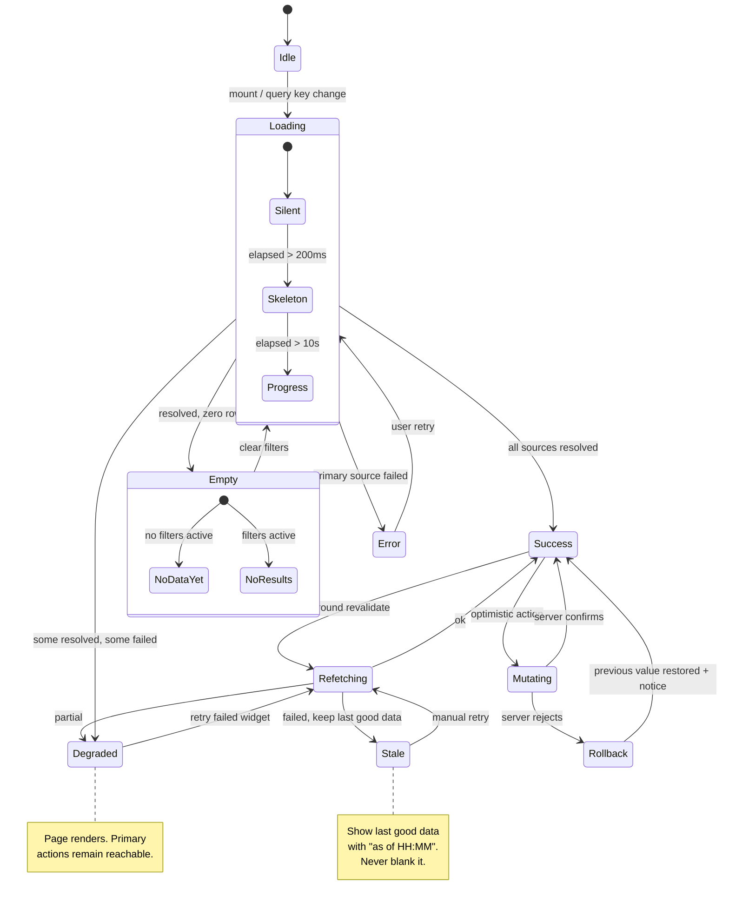

# The Five States: Why One Failing Widget Should Never Blank a Page

Every async view has five states, and you will ship all five whether or not you designed them. The four you skipped will be designed by accident — by a thrown exception, an unstyled spinner, and a blank rectangle where a chart used to be.

## The Real-World Problem

A retail bank's post-login dashboard aggregated six independent sources: account balances (core banking), recent transactions (a read replica), pending card authorisations (the card scheme), the credit-score widget (a third-party bureau), spending insights (an internal analytics service), and a marketing offers tile (the CRM).

The credit-score bureau had a routine maintenance window on a Sunday night that ran long. Their API returned `502` for 40 minutes.

The dashboard was a single server component that awaited all six calls, mapped the results into one view model, and rendered. One rejected promise propagated to the route, the Next.js error boundary at the segment level caught it, and every authenticated customer landing on the dashboard saw a centred grey panel reading **"Something went wrong. Please try again later."**

Nothing was actually wrong with the customer's money. Balances were available. Transactions were available. Transfers worked — customers just could not reach the transfer button, because it was on the dashboard.

The measurable damage: 11,400 calls to the contact centre in 40 minutes, the top three reported symptoms being "my account has disappeared", "I've been locked out", and "has the bank been hacked?". Support had no script, because the failing dependency was a decorative credit-score tile that no runbook mentioned. Two customers filed complaints with the ombudsman about suspected account closure. The incident was logged as Severity 1 on customer impact, against a third-party dependency the bank did not consider critical.

The bureau outage lasted 40 minutes. The trust damage lasted a quarter. And the fix was ten lines: render the five widgets that worked, and put "Credit score temporarily unavailable" in the sixth.

## The Concept

### The five states, and the rule for each

**Always** define all five before writing the component. Not after design review — before.

| State | Trigger | What the user must see | Rule |
|---|---|---|---|
| **Loading** | Request in flight | Layout-preserving placeholder | **Never** show nothing for >200ms; **never** shift layout when data arrives |
| **Empty** | Success, zero rows | Why it is empty + the next action | **Always** distinguish "no data yet" from "no results for this filter" |
| **Error** | Request failed | What happened, what to do, a retry | **Never** a raw stack trace; **never** a bare "Something went wrong" |
| **Partial / degraded** | Some sources failed | Everything that worked, plus a scoped notice | **Never** let one failed source suppress a successful one |
| **Success** | Data present | The data | **Always** the only state with no explanatory copy |

### Skeleton, spinner, or nothing

The choice is not aesthetic. It is determined by what you know.

| Situation | Use | Why |
|---|---|---|
| You know the shape of the result (table, card grid, form) | **Skeleton** | Reserves final layout; zero shift on arrival; perceived faster |
| You do not know the shape (search across types, variable-length report) | **Spinner** with a label | A skeleton that lies about the shape causes a visible jolt |
| Expected under ~200ms (cached query, optimistic mutation) | **Nothing** | A flashed spinner reads as a glitch, not as speed |
| Longer than ~10s (report generation, batch validation) | **Progress + cancel** | An indeterminate spinner past 10s is indistinguishable from a hang |
| Refetch of data already on screen | **Subtle inline indicator** | **Never** replace visible data with a skeleton — that is a regression, not a load |

**Always** set a minimum display duration (~300ms) on any skeleton you do show, or a fast response produces a flicker.

### Optimistic UI and the rollback you owe

Optimistic updates are correct for actions that almost always succeed, are cheap to reverse, and are locally verifiable — renaming a payee, toggling a notification preference, dismissing an alert.

They are wrong for anything where the user would act on a false confirmation. **Never** optimistically confirm a payment, a claim submission, a credit decision, or a limit change. In a banking UI, "money moved" that later un-moves is worse than a two-second wait.

Where you do use them, the rollback is part of the feature: restore the previous value, tell the user it did not stick, and keep their input recoverable. A silent revert is a data-loss bug wearing a UI costume.

### Error copy: three sentences, in this order

1. **What happened**, in the user's terms — not the system's.
2. **What it means for them** — is their data safe, did the action apply?
3. **What to do next** — retry, wait, use an alternative, or contact support with a reference.

| Bad | Good |
|---|---|
| "Something went wrong." | "We couldn't load your credit score. Everything else on this page is up to date. Try again in a few minutes." |
| `TypeError: Cannot read properties of undefined (reading 'balance')` | "We couldn't reach your account details. Your balance and payments are unaffected. Refresh to try again — reference `DSH-4471`." |
| "Error 500" | "Your transfer wasn't submitted, so no money has moved. Check the details and try again." |

**Always** include a correlation ID in a support-facing error and log it with the same value. **Never** put an exception message, a URL, or a stack frame in front of a customer — it is a support burden and an information-disclosure finding in the same string.

### Empty states are two different states

| Variant | Copy | Action |
|---|---|---|
| **No data yet** (new account, first login) | "No transactions yet. They'll appear here within a day of your first payment." | Onboarding action — "Make a transfer" |
| **No results for this filter** | "No transactions between 1–14 March over €500." | "Clear filters" — and echo the active filters back |
| **No permission** | "You don't have access to spending insights. Ask an administrator to grant the Insights role." | Who to ask, not a dead end |

Collapsing these into one "No data found" is the most common empty-state bug in enterprise UI. The user who filtered themselves into nothing thinks the system is broken; the new user thinks the feature is broken.

### Partial/degraded: where resilience becomes visible

A backend that degrades gracefully and a frontend that renders all-or-nothing produce an outage anyway. The contract must be explicit:

- **Always** fetch independent sources independently. One `await Promise.all` over six calls is an availability decision, and it multiplies six failure probabilities into one.
- **Always** scope the failure to the smallest widget that owns it.
- **Always** state what is *unaffected* — "your balance is up to date" is the sentence that prevents the contact-centre call.
- **Always** label stale data with its timestamp rather than hiding it.
- **Never** let a non-critical widget sit above the primary action in the DOM or the error boundary tree.

## How It Works



Two transitions carry the whole design: `Loading --> Degraded` (a failed source is not a failed page) and `Refetching --> Stale` (a failed refresh never destroys data already on screen).

## Practical Example

**Bad — the dashboard that blanked:**

```tsx
// app/(dashboard)/page.tsx  ❌
export default async function DashboardPage() {
  // One rejection here fails the whole route. Six sources, one fate.
  const [balances, transactions, pending, creditScore, insights, offers] =
    await Promise.all([
      getBalances(), getTransactions(), getPendingAuths(),
      getCreditScore(), getInsights(), getOffers(),
    ])

  return (
    <div className="grid gap-4 lg:grid-cols-3">
      <CreditScoreTile score={creditScore.value} />   {/* decorative, first in tree */}
      <BalanceTile accounts={balances} />
      <TransactionList items={transactions} />
      {/* ... */}
    </div>
  )
}
```

```tsx
// app/(dashboard)/error.tsx  ❌ — the grey panel 11,400 people called about
'use client'
export default function Error() {
  return <div className="p-12 text-center text-muted">Something went wrong. Please try again later.</div>
}
```

**Good — independent boundaries, so failure is scoped to the tile that owns it:**

```tsx
// app/(dashboard)/page.tsx  ✅
import { Suspense } from 'react'
import { WidgetBoundary } from '@/components/widget-boundary'
import { BalanceTile } from '@/features/accounts/balance-tile'
import { TransactionList } from '@/features/transactions/transaction-list'
import { CreditScoreTile } from '@/features/credit/credit-score-tile'
import { BalanceSkeleton, ListSkeleton, TileSkeleton } from '@/components/skeletons'

export default function DashboardPage() {
  return (
    <div className="grid gap-4 lg:grid-cols-3">
      {/* Primary path first in the DOM and in the boundary tree. */}
      <WidgetBoundary title="Accounts" critical>
        <Suspense fallback={<BalanceSkeleton rows={3} />}>
          <BalanceTile />
        </Suspense>
      </WidgetBoundary>

      <WidgetBoundary title="Recent transactions">
        <Suspense fallback={<ListSkeleton rows={8} />}>
          <TransactionList />
        </Suspense>
      </WidgetBoundary>

      {/* Third-party bureau. Its outage may cost exactly this rectangle. */}
      <WidgetBoundary title="Credit score" unaffectedNote="Your balances and payments are up to date.">
        <Suspense fallback={<TileSkeleton />}>
          <CreditScoreTile />
        </Suspense>
      </WidgetBoundary>
    </div>
  )
}
```

```tsx
// components/widget-boundary.tsx  ✅
'use client'

import { Component, type ReactNode } from 'react'
import { Button } from '@acme/ui'

type Props = {
  title: string
  children: ReactNode
  /** Critical widgets escalate; decorative ones degrade in place. */
  critical?: boolean
  unaffectedNote?: string
}

type State = { error: Error | null; correlationId: string | null }

export class WidgetBoundary extends Component<Props, State> {
  state: State = { error: null, correlationId: null }

  static getDerivedStateFromError(error: Error): Partial<State> {
    return { error, correlationId: crypto.randomUUID().slice(0, 8).toUpperCase() }
  }

  componentDidCatch(error: Error) {
    // The UI degrades; observability does not.
    void fetch('/api/client-errors', {
      method: 'POST',
      body: JSON.stringify({
        widget: this.props.title,
        correlationId: this.state.correlationId,
        message: error.message,
      }),
    })
  }

  render() {
    const { error, correlationId } = this.state
    if (!error) return this.props.children

    if (this.props.critical) throw error // only a critical widget may fail the page

    return (
      <section
        aria-label={this.props.title}
        className="rounded-lg border border-subtle bg-surface-subtle p-4"
      >
        <h3 className="text-body font-medium">{this.props.title}</h3>
        <p className="mt-1 text-sm text-muted">
          We couldn&apos;t load this right now.{' '}
          {this.props.unaffectedNote ?? 'The rest of this page is unaffected.'}
        </p>
        <div className="mt-3 flex items-center gap-3">
          <Button intent="ghost" size="sm" onClick={() => this.setState({ error: null })}>
            Try again
          </Button>
          <span className="text-xs text-muted">Reference {correlationId}</span>
        </div>
      </section>
    )
  }
}
```

**Good — the two empty states, kept distinct** (TanStack Query + URL-driven filters):

```tsx
// features/transactions/transaction-list.tsx  ✅
'use client'

import { useQuery } from '@tanstack/react-query'
import { useQueryStates, parseAsIsoDate, parseAsFloat } from 'nuqs'
import { ListSkeleton } from '@/components/skeletons'
import { EmptyState } from '@/components/empty-state'

export function TransactionList() {
  const [filters, setFilters] = useQueryStates({
    from: parseAsIsoDate,
    to: parseAsIsoDate,
    minAmount: parseAsFloat,
  })
  const hasFilters = Object.values(filters).some((v) => v != null)

  const { data, isPending, isError, isFetching, error, refetch, dataUpdatedAt } = useQuery({
    queryKey: ['transactions', filters],
    queryFn: ({ signal }) => fetchTransactions(filters, signal),
    staleTime: 30_000,
    placeholderData: (previous) => previous, // ✅ never blank on refetch
  })

  if (isPending) return <ListSkeleton rows={8} />

  if (isError && !data) {
    return (
      <EmptyState
        tone="error"
        title="We couldn't load your transactions"
        body="Your balance is unaffected and no payments have changed."
        action={{ label: 'Try again', onClick: () => void refetch() }}
        reference={correlationIdOf(error)}
      />
    )
  }

  if (data.length === 0) {
    return hasFilters ? (
      <EmptyState
        title="No transactions match these filters"
        body={describeFilters(filters)}
        action={{ label: 'Clear filters', onClick: () => void setFilters(null) }}
      />
    ) : (
      <EmptyState
        title="No transactions yet"
        body="Payments appear here within a day of leaving your account."
        action={{ label: 'Make a transfer', href: '/transfer' }}
      />
    )
  }

  return (
    <div aria-busy={isFetching}>
      {/* Failed refresh: keep the data, label its age. Never blank it. */}
      {isError && (
        <p role="status" className="mb-2 text-xs text-muted">
          Couldn&apos;t refresh — showing data as of{' '}
          {new Date(dataUpdatedAt).toLocaleTimeString()}.
        </p>
      )}
      <ul className="divide-y divide-subtle">
        {data.map((t) => (
          <TransactionRow key={t.id} transaction={t} />
        ))}
      </ul>
    </div>
  )
}
```

**Good — the skeleton that reserves the real layout, and the anti-flicker rule:**

```css
/* components/skeletons.css — token-driven, respects reduced motion */
.skeleton {
  background: linear-gradient(
    90deg,
    var(--color-surface-subtle) 25%,
    var(--color-surface-muted) 50%,
    var(--color-surface-subtle) 75%
  );
  background-size: 200% 100%;
  animation: skeleton-sweep 1.4s ease-in-out infinite;
  border-radius: var(--radius-sm);
}
@keyframes skeleton-sweep {
  to { background-position: -200% 0; }
}
@media (prefers-reduced-motion: reduce) {
  .skeleton { animation: none; background: var(--color-surface-subtle); }
}
```

```tsx
// hooks/use-delayed-flag.ts — nothing under 200ms, no sub-300ms flash
export function useDelayedFlag(active: boolean, delay = 200, minVisible = 300) {
  const [shown, setShown] = useState(false)
  useEffect(() => {
    if (active) {
      const t = setTimeout(() => setShown(true), delay)
      return () => clearTimeout(t)
    }
    if (!shown) return
    const t = setTimeout(() => setShown(false), minVisible)
    return () => clearTimeout(t)
  }, [active, delay, minVisible, shown])
  return shown
}
```

**Optimistic update with a real rollback:**

```tsx
// features/payees/use-rename-payee.ts  ✅ safe to be optimistic: cheap, reversible, local
export function useRenamePayee() {
  const qc = useQueryClient()
  return useMutation({
    mutationFn: renamePayee,
    onMutate: async ({ id, name }) => {
      await qc.cancelQueries({ queryKey: ['payees'] })
      const previous = qc.getQueryData<Payee[]>(['payees'])
      qc.setQueryData<Payee[]>(['payees'], (old) =>
        old?.map((p) => (p.id === id ? { ...p, name } : p)),
      )
      return { previous, name }
    },
    onError: (_err, _vars, ctx) => {
      qc.setQueryData(['payees'], ctx?.previous)            // restore
      toast.error(`Couldn't rename to "${ctx?.name}" — the old name is still saved.`)
    },                                                      // never a silent revert
    onSettled: () => void qc.invalidateQueries({ queryKey: ['payees'] }),
  })
}
```

**Which back-and-forth this prevents:** the design-QA loop where a designer files "the loading spinner jumps", "this error message is scary", and "why does an empty table say the same thing as a broken one" as three separate bugs, weeks after the happy path shipped. Specifying five states per view up front turns those into one 15-minute conversation at spec time. It also ends the recurring PM question during an incident — "does the customer see anything?" — because the answer is written into the component and provable in a test.

## Enterprise Trade-offs

| Approach | Pros | Cons | When to use (Banking / Insurance / Enterprise) |
|---|---|---|---|
| **Per-widget Suspense + error boundary, independent fetches** | One failed source costs one rectangle; primary actions stay reachable | More boundaries, more states to test, more request fan-out | Default for any aggregating dashboard — retail banking home, policy summary, claims cockpit |
| **Single page-level fetch and one error boundary** | Simplest code; one loading state | Availability multiplies; a decorative dependency can blank the page | Only where every source is genuinely required to render anything meaningful |
| **Skeletons matching final layout** | No layout shift; better perceived performance and CLS | Must be maintained alongside the component or it lies | Known-shape views: tables, card grids, forms, detail panes |
| **Spinner with a label** | Trivial; honest when shape is unknown | No layout reservation; reads as slower | Search across mixed result types, variable-length reports |
| **Stale-while-error (keep last good data, label its age)** | Users keep working through a backend blip | Stale data must be safe to act on and clearly timestamped | Reference data, rates, dashboards. **Never** for balances used to authorise a payment, limits, or sanctions results |
| **Optimistic UI** | Feels instant; fewer perceived waits | Requires a real rollback path and honest failure copy | Preferences, renames, dismissals. **Never** for payments, claim submissions, or credit decisions |

→ Next: [05-engineer-designer-handoff.md](05-engineer-designer-handoff.md) · Related: [../01-core-concepts/03-failure-modes-and-resilience.md](../01-core-concepts/03-failure-modes-and-resilience.md) · [../07-frontend-best-practices/06-data-fetching-and-caching-with-tanstack-query.md](../07-frontend-best-practices/06-data-fetching-and-caching-with-tanstack-query.md) · [../10-example-code/react/tanstack-query-example.md](../10-example-code/react/tanstack-query-example.md)
