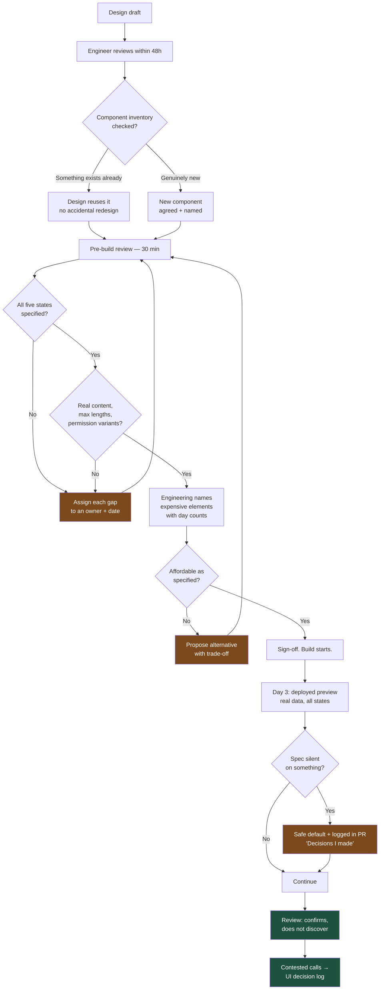

# Handoff Is a Contract: What to Demand, What You Owe, and Who Decides

A handoff is not a link to a Figma file. It is an agreement about what has been decided, what has not, and who resolves the difference. Get that wrong and you will build the same screen three times, each version approved by someone different.

## The Real-World Problem

An enterprise software vendor was rebuilding the approvals module of its procurement suite — a purchase-requisition queue used by roughly 4,000 approvers across 60 corporate customers.

Design delivered a single Figma frame: a beautiful table of eleven requisitions with realistic-looking supplier names, a status pill per row, and a bulk-approve bar. Sign-off came from the product lead in a 20-minute review. Two engineers began building.

Then it unravelled, one review at a time:

- **Sprint 1 review.** The supplier names in the mock were 12–18 characters. Real data included `Nordwestdeutsche Baustoffhandelsgesellschaft GmbH & Co. KG` at 56. The design had no truncation rule, no tooltip, and no max-width. Design decided mid-review: two-line wrap. That changed row height, which changed how many rows fit, which changed the pagination the engineers had already built.
- **Sprint 2 review.** Nobody had specified what an approver with view-only rights sees. Design produced a second frame with the bulk bar hidden. The engineers had built the bar into the table header component; extracting it took three days.
- **Sprint 3 review.** A customer demo hit an empty queue — an approver with nothing to approve, which is the normal state most mornings. The screen showed an empty table with visible column headers and nothing else. Design called it "broken." It was exactly what the spec contained.
- **Sprint 4 review.** The approve action could fail: the requisition might have been withdrawn by the requester seconds earlier. There was no error state, no copy, and no decision about whether a partially-successful bulk approve reported per-row or as a whole. Engineering had guessed. Product disagreed with the guess in front of a customer.

Final accounting: eleven days of rework across four sprints, on a two-sprint build. But the durable damage was cultural. Engineers began treating designs as first drafts and stopped raising issues early — since everything would change at review anyway. Designers began treating engineering estimates as padded. The next two modules shipped later, with more rework, and neither side could point at a single bad decision. There wasn't one. There was an absent contract.

## The Concept

### What you demand: the handoff checklist

**Never** start a build from a single happy-path frame. **Always** require these before the story is sizeable. If something is genuinely undecided, that is fine — it must be written down as undecided, with an owner.

| Demand | Why | What "missing" costs |
|---|---|---|
| **All five states** — loading, empty, error, partial/degraded, success | The four non-happy states are ~40% of the code | Sprint-3 and sprint-4 rework in the scenario above |
| **Two empty variants** — "no data yet" vs. "no results for this filter" | Different copy, different action | A user who over-filtered concludes the system is broken |
| **Tokens, not hex codes** | A hex in a spec is a decision that cannot be rebranded or themed | Colour literals in code; the audit trail of the previous article |
| **Real content with max lengths** | Design mocks are the best-case string | Truncation invented at review, cascading into row height and pagination |
| **Error copy, written by whoever owns tone** | Engineers write the worst copy in the building | "Something went wrong" in a customer-facing product |
| **Permission variants** | Enterprise UI has 3–8 roles per screen | A view-only user seeing a bulk-approve bar they cannot use |
| **Interaction and focus behaviour** | Keyboard order, focus after submit, Escape behaviour, modal return focus | An accessibility finding, not a polish item |
| **Responsive behaviour at named breakpoints** | "Make it responsive" is not a specification | Three different reflow guesses in three components |
| **Density variant** (comfortable/compact) | Data-dense enterprise users demand compact within a week of go-live | A retrofit through every component |
| **Motion intent and duration** | What animates, what never does | Animated table rows that make a 500-row grid feel broken |

Ask for these once, as a template, and the request stops feeling like an objection. **Always** put the checklist in the Definition of Ready rather than in a per-story argument.

### What you owe: engineering's side of the contract

The checklist above is worthless if it only points one way. Designers are usually blamed for handoff failures that engineers caused by staying silent.

| You owe | Concretely | When |
|---|---|---|
| **A component inventory** | A live Storybook of what exists, with names designers can reference | Maintained continuously, not assembled on request |
| **Constraints raised early** | "That grid can't virtualise with variable row heights — here are two options" | Within 48 hours of seeing the design, **not at review** |
| **Honest effort signals** | "The table is 2 days; the bulk-approve state machine is 5" — per element, not per screen | During the design review, before sign-off |
| **A build preview, mid-sprint** | A deployed branch on day 3, not a demo on day 10 | Halfway, while changing things is still cheap |
| **Data reality** | Real string lengths, real row counts, real latency, real failure rates | Before design finalises layout |
| **No silent substitutions** | If you cannot build the specified thing, say so — never quietly ship something adjacent | Immediately |

The component inventory is the highest-leverage item on this list. Most accidental redesign is not designers ignoring the system; it is designers not knowing a component exists because the only record of it is the codebase.

### Design review before build, not after

**Always** hold a 30-minute review with design, engineering, and product *before* the build starts, with a fixed agenda:

1. Walk all five states. Anything absent is named and assigned.
2. Engineering names the expensive elements, with day counts.
3. Engineering names which existing components will be reused and which are new.
4. Real content is pasted in — longest supplier name, longest customer name, zero rows, 5,000 rows.
5. Permission variants are enumerated by role.
6. Open questions are recorded with an owner and a date.

This meeting costs half an hour and removed all eleven days of rework in the scenario above. It works because it moves discovery from the review — where changes are public and expensive — to the spec, where they are private and cheap.

### Who decides when the spec is silent

This is the question that actually causes the damage, and it must be answered *before* the first sprint, not during it.

| Gap type | Default decider | Engineer's obligation |
|---|---|---|
| Visual (spacing, colour, weight) | Design system defaults | Use the nearest token; **never** invent a value |
| Copy (labels, errors, empty states) | Content/design owner | Ship a clearly-marked placeholder and raise it same day |
| Behavioural (what happens on partial failure) | Product | **Never** guess silently — pick the safe option and flag it in the PR |
| Technical feasibility | Engineering | Propose the alternative with its trade-off, not a flat "can't" |
| Accessibility | Engineering, non-negotiable | Conformance is not a design preference; override the spec if needed |

The rule that makes this work: **a gap filled by an engineer is legitimate if and only if it is visible.** Write it in the PR description under "Decisions I made because the spec was silent." Reviewers can then accept or correct it in one pass, and it never surfaces as a surprise at demo.

### Figma-to-code: what it actually gives you

Design tooling now emits code, and the emitted code is genuinely useful for measurement — spacing, type scale, token names, layout intent. It is not useful as production output.

| Figma/plugin output gives you | It cannot give you |
|---|---|
| Exact spacing, sizes, token references | Component reuse — it regenerates rather than reusing yours |
| A close visual approximation | State logic, focus management, ARIA relationships |
| Auto-layout intent that maps to flex/grid | Responsive intent beyond the frames drawn |
| Asset export | Anything about loading, error, empty, or permissions |

**Always** treat generated code as a measurement, not a component. **Never** merge it. Selectively translating a Figma frame into your existing primitives takes about as long and produces something maintainable.

### Recording decisions so they are not relitigated

Enterprise UI decisions get re-argued every time the team changes, roughly every nine months. Keep a lightweight UI decision log — one short entry per contested decision, in the repo next to the component:

```md
### UID-014 — Long supplier names truncate to one line with a tooltip
Date: 2026-03-11 · Decided by: design + eng · Supersedes: two-line wrap (sprint 1)
Why: Two-line wrap makes row height variable, which blocks virtualisation
     on the 5,000-row queue and breaks fixed pagination.
Trade-off: Full name requires hover or focus. Accepted; the name is also
     shown in full on the requisition detail page.
Revisit if: We move to a virtualiser supporting dynamic row heights.
```

Six entries prevent most repeat arguments. **Always** link the entry from the component's doc comment so the next engineer finds it before proposing the change again.

## How It Works



The load-bearing arrows are the loops back into the pre-build review and the day-3 preview. Both exist to make discovery happen before sign-off rather than at the demo.

## Practical Example

**Bad — the component the vendor built from the single approved frame:**

```tsx
// features/approvals/requisition-table.tsx  ❌
export function RequisitionTable({ rows }: { rows: Requisition[] }) {
  return (
    <table className="w-full">
      <thead>
        <tr className="border-b" style={{ height: 44 }}>
          <th className="text-left text-[13px] font-semibold" style={{ color: '#475569' }}>
            Supplier
          </th>
          <th>Amount</th>
          <th>Status</th>
        </tr>
      </thead>
      <tbody>
        {rows.map((r) => (
          <tr key={r.id} style={{ height: 52 }}>
            {/* No max-width, no truncation, no title. 56 chars destroys the layout. */}
            <td>{r.supplierName}</td>
            <td>{r.amount}</td>
            <td><StatusPill status={r.status} /></td>
          </tr>
        ))}
      </tbody>
      {/* Bulk bar hardcoded inside the table. No permission variant exists. */}
      <BulkApproveBar ids={rows.map((r) => r.id)} />
    </table>
  )
}
```

Five failures, all traceable to the spec: hex literals and a `13px` opt-out of the density scale, fixed pixel row heights, no truncation rule, the bulk bar structurally welded in so a view-only variant requires surgery, and no empty or error path at all.

**Good — built from a complete handoff, with the silent gaps made visible:**

```tsx
// features/approvals/requisition-table.tsx  ✅
'use client'

import { DataTable, Button, Tooltip } from '@acme/ui'
import { EmptyState } from '@/components/empty-state'
import { ListSkeleton } from '@/components/skeletons'
import { useRequisitions } from './use-requisitions'
import { useApproverPermissions } from '@/features/auth/use-approver-permissions'

/**
 * Handoff: figma.com/file/…/Approvals?node-id=214-88 (all five states, v4)
 * UI decisions: UID-014 (name truncation), UID-017 (bulk partial-failure reporting)
 */
export function RequisitionTable({ filters }: { filters: RequisitionFilters }) {
  const { can } = useApproverPermissions()
  const { data, isPending, isError, refetch } = useRequisitions(filters)

  if (isPending) return <ListSkeleton rows={11} />

  if (isError) {
    return (
      <EmptyState
        tone="error"
        title="We couldn't load the approval queue"
        body="Nothing has been approved or rejected. Your queue is unchanged."
        action={{ label: 'Try again', onClick: () => void refetch() }}
      />
    )
  }

  if (data.length === 0) {
    return filters.isActive ? (
      <EmptyState
        title="No requisitions match these filters"
        body={describeFilters(filters)}
        action={{ label: 'Clear filters', onClick: filters.clear }}
      />
    ) : (
      <EmptyState
        title="Nothing waiting for you"
        body="Requisitions appear here as soon as a requester submits them."
      />
    )
  }

  return (
    <>
      {/* Permission variant is a prop of the page, not a fork of the table. */}
      {can('approve.bulk') && <BulkApproveBar rows={data} />}

      <DataTable rows={data} rowHeight="density" ariaLabel="Requisitions awaiting approval">
        <DataTable.Column
          header="Supplier"
          // UID-014: truncate to one line + tooltip; keeps row height fixed
          // so the 5,000-row queue can virtualise.
          cell={(r) => (
            <Tooltip content={r.supplierName}>
              <span className="block max-w-[28ch] truncate">{r.supplierName}</span>
            </Tooltip>
          )}
        />
        <DataTable.Column header="Amount" align="end" cell={(r) => formatMoney(r.amount)} />
        <DataTable.Column header="Status" cell={(r) => <StatusPill status={r.status} />} />
      </DataTable>
    </>
  )
}
```

**The `max-w-[28ch]` value is exactly the kind of gap the log exists for.** It is a decision, not a measurement — so it goes in the PR:

```md
## Decisions I made because the spec was silent

1. **Supplier name truncation width: 28ch.** Spec said "truncate with tooltip"
   but gave no width. 28ch fits 94% of live supplier names without truncating
   (queried production; p94 = 27 chars). Happy to change — it's one token.
2. **Bulk approve with 2 of 9 failures** reports per-row, banner summarising
   "7 approved, 2 could not be approved". Spec covered all-success and
   all-failure only. Chose per-row because a requester withdrawal is the
   common cause and the approver needs to know which one. See UID-017.
3. **Focus after bulk approve** returns to the table header, not `<body>`.
   Not specified; required for keyboard operability.
```

**The inventory that stops accidental redesign** — publish it, do not describe it:

```ts
// packages/ui/src/index.ts — every export is documented in Storybook with all five states
export { Button } from './button'
export { DataTable } from './data-table'        // sortable, virtualised, density-aware
export { EmptyState } from './empty-state'      // tone: 'info' | 'error'; two empty variants
export { StatusPill } from './status-pill'      // 6 statuses; do not add a 7th without design
export { Tooltip } from './tooltip'             // focus-visible + hover; never hover-only
export { Skeleton, ListSkeleton, TileSkeleton } from './skeletons'
```

```bash
# CI publishes the inventory on every merge to main. Designers link to it in Figma.
pnpm --filter @acme/ui build-storybook && pnpm dlx chromatic --exit-zero-on-changes
```

**Which back-and-forth this prevents:** the entire sprint-1-through-4 sequence above. Truncation, permission variants, empty states, and partial-failure reporting all move from "discovered at review, in front of a customer" to "assigned at spec time, with an owner." It also prevents the quieter loop — the designer who redesigns a status pill because they had no way to know one existed, and the engineer who silently ships something adjacent to the spec and gets blamed for it two sprints later.

## Enterprise Trade-offs

| Approach | Pros | Cons | When to use (Banking / Insurance / Enterprise) |
|---|---|---|---|
| **Full five-state spec + pre-build review + published inventory** | Rework collapses; decisions traceable; accessibility caught before code | ~1 extra day per feature upfront; needs designer capacity | Default for any product with a 3+ year life or multiple customer tenants — procurement suites, policy admin, banking consoles |
| **Happy-path frame + engineer fills the gaps, logged in the PR** | Fast; keeps designers on the next feature | Consistency depends on individual engineers; copy quality suffers | Internal admin tools, low-traffic back office, spike work |
| **Design system covers states generically; specs are layout only** | Very fast per feature; states are consistent by construction | Requires a genuinely mature library and disciplined governance | Mature platform teams shipping many similar screens — the strongest end-state |
| **Designer embedded in the sprint team** | Gaps closed in hours; no handoff document needed | Expensive; does not scale past a few teams; decisions go unrecorded | Flagship customer-facing flows: onboarding, KYC, claims intake |
| **Figma-to-code generation as the build path** | Pixel-accurate first pass | Bypasses your components, produces no state logic or a11y, unmaintainable | Never as output. Useful as a measurement source |
| **Design review only after build ("we'll iterate")** | No upfront cost | Discovery happens in public; rework is guaranteed | The scenario above |

## Why This Still Matters Through 2030

The handoff is becoming more important precisely because the mechanical part of it is disappearing. Generated code, token pipelines, and design tooling that reads your component library are steadily eliminating transcription work — and transcription was never where handoffs failed. They failed on absent decisions: nobody said what a 56-character supplier name does, what a view-only approver sees, or how a partially-successful bulk action reports. Generative tooling makes this worse before it makes it better, because a model asked to build the approvals table will confidently produce all five states with plausible copy, and plausible-but-unowned copy is harder to catch than missing copy. Meanwhile enterprise UI keeps accumulating the things that multiply the state space — more roles, more tenants with different configurations, more third-party sources that can be individually unavailable, more accessibility and consumer-duty obligations where the wording of an error is a compliance artefact rather than a preference. The durable skill is not translating a design into code; it is knowing which questions a design has not answered, asking them before sign-off, and writing down who decided what. That work has no automation path, because it is not production — it is agreement.

→ Next: [../10-example-code/react/component-structure-example.md](../10-example-code/react/component-structure-example.md) · Related: [04-loading-error-empty-states.md](04-loading-error-empty-states.md) · [01-ui-consistency-and-design-tokens.md](01-ui-consistency-and-design-tokens.md) · [../00-project-setup-roadmap/10-definition-of-done.md](../00-project-setup-roadmap/10-definition-of-done.md) · [../11-stakeholder-communication/01-talking-to-pm.md](../11-stakeholder-communication/01-talking-to-pm.md)
