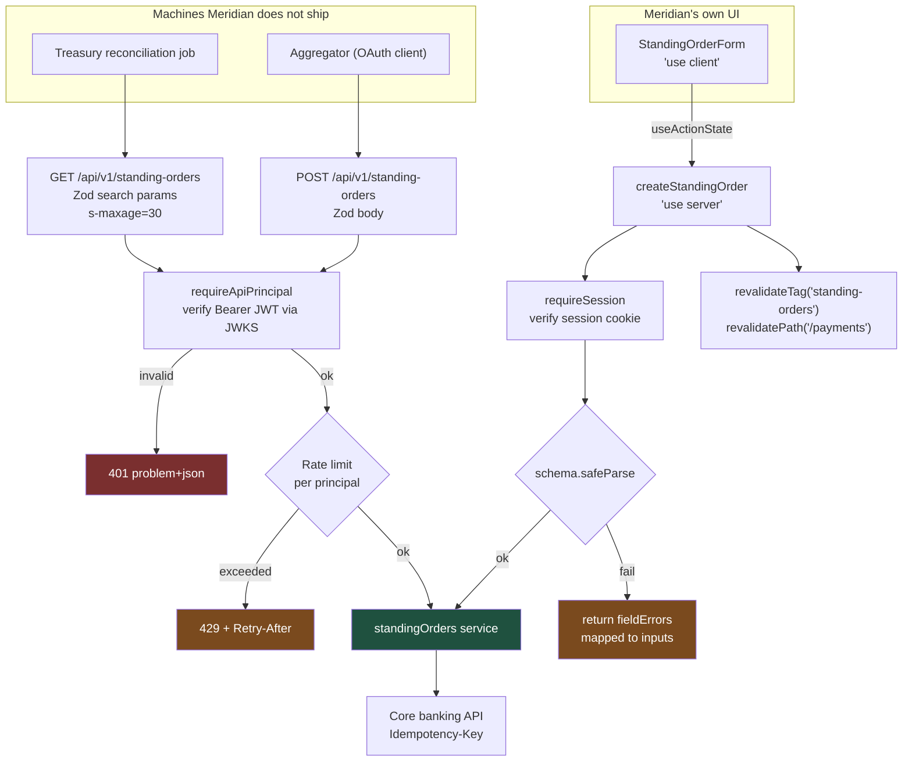

# Route Handlers or Server Actions? Build Both, Then Choose Correctly

Next.js gives you two ways to run server code from the App Router, and teams pick by habit rather than by consumer. The rule is one sentence: **a Server Action for your own form, a Route Handler for anything you don't control.** Here is both, fully written.

## The Real-World Problem

Meridian Trust's retail banking app has a "standing orders" screen. Customers create, amend, and cancel recurring payments there. The same standing-order data is also consumed by two things Meridian does not control: the treasury team's Python reconciliation job, and a partner personal-finance aggregator with an OAuth client credential.

The first version exposed everything as `/api/standing-orders` and had the React form `fetch()` it. Three problems showed up in the first quarter.

The handler trusted an `X-Customer-Id` header the frontend set — so anyone with curl could read another customer's payments. Validation lived in the React component, so the treasury job could POST a negative amount and it went through. And errors came back as `{ "error": "bad request" }`, which meant the aggregator's integration team could never tell a validation failure from a duplicate submission, and opened a support ticket for every one.

The rebuild below splits by consumer, validates once with Zod on the server, authenticates from a verified session or bearer token, and returns RFC 9457 problem details so a machine caller can act on the failure.

## The Concept

**Route Handlers** (`app/api/**/route.ts`) are HTTP endpoints. They have a URL, a method, headers, and a status code. Use them when the caller is a machine you do not ship: another service, a scheduled job, a partner, a webhook sender, a mobile client on a different release cadence.

**Server Actions** (`'use server'`) are RPC from your own components. There is no stable URL contract, the request body is a framework-internal encoding, and the return value is typed end to end. Use them for form mutations in your own UI — you get progressive enhancement, `useActionState`, and `revalidateTag` in the same function.

The decision:

| Consumer | Use |
|---|---|
| Your own `<form>` in this app | Server Action |
| A partner, a cron job, a webhook, another service | Route Handler |
| Both need the same mutation | Route Handler for the contract, Server Action that calls the same domain service — **not** the Action calling the Route Handler |

Three rules apply to both. Identity comes from a cryptographically verified session or token, never a header the client can write. Every input is parsed with Zod at the boundary, because a Server Action is a public endpoint whether you documented it or not. And caching is stated explicitly — `GET` handlers are uncached by default in Next.js 15, so if you want caching you opt in, and you say for how long.

## How It Works



## Practical Example

### Folder layout

```
src/
├── app/
│   ├── api/
│   │   ├── healthz/route.ts
│   │   └── v1/standing-orders/
│   │       ├── route.ts                   # GET (list) + POST (create)
│   │       └── route.test.ts
│   └── (dashboard)/payments/page.tsx
├── features/standing-orders/
│   ├── index.ts
│   ├── model/standing-order.schema.ts     # ONE schema, both consumers
│   ├── api/standing-orders.service.ts     # the only place that talks upstream
│   └── actions/create-standing-order.ts   # 'use server'
└── shared/
    ├── http/problem.ts                    # RFC 9457
    ├── http/rate-limit.ts
    └── auth/principal.ts                  # verified identity
```

### `src/features/standing-orders/model/standing-order.schema.ts`

```ts
import { z } from 'zod'

export const frequencySchema = z.enum(['WEEKLY', 'MONTHLY', 'QUARTERLY'])

/** IBAN shape check only — the core banking API does the mod-97 checksum. */
const ibanSchema = z
  .string()
  .trim()
  .toUpperCase()
  .regex(/^[A-Z]{2}\d{2}[A-Z0-9]{10,30}$/, 'Enter a valid IBAN')

export const createStandingOrderSchema = z.object({
  reference: z.string().trim().min(1, 'Reference is required').max(35),
  creditorName: z.string().trim().min(2, 'Payee name is required').max(70),
  creditorIban: ibanSchema,
  amountMinor: z.coerce
    .number()
    .int('Amount must be a whole number of cents')
    .positive('Amount must be greater than zero')
    .max(50_000_00, 'Amounts above 50,000.00 need branch approval'),
  currency: z.literal('EUR'),
  frequency: frequencySchema,
  firstPaymentOn: z.coerce.date().refine((d) => d.getTime() > Date.now(), {
    message: 'First payment must be in the future',
  }),
})

export const listStandingOrdersQuerySchema = z.object({
  status: z.enum(['ACTIVE', 'CANCELLED', 'ALL']).default('ACTIVE'),
  page: z.coerce.number().int().min(1).default(1),
  pageSize: z.coerce.number().int().min(1).max(100).default(25),
})

export const standingOrderSchema = createStandingOrderSchema
  .omit({ firstPaymentOn: true })
  .extend({
    id: z.string().uuid(),
    status: z.enum(['ACTIVE', 'CANCELLED']),
    firstPaymentOn: z.string().date(),
    createdAt: z.string().datetime(),
  })

export type CreateStandingOrderInput = z.infer<typeof createStandingOrderSchema>
export type ListStandingOrdersQuery = z.infer<typeof listStandingOrdersQuerySchema>
export type StandingOrder = z.infer<typeof standingOrderSchema>
```

### `src/shared/http/problem.ts` — RFC 9457

```ts
import { NextResponse } from 'next/server'
import type { ZodError } from 'zod'

export interface ProblemDetail {
  type: string
  title: string
  status: number
  detail?: string
  instance?: string
  errors?: Array<{ field: string; message: string }>
}

const CONTENT_TYPE = { 'content-type': 'application/problem+json; charset=utf-8' }

export function problem(
  body: ProblemDetail,
  headers: Record<string, string> = {},
): NextResponse<ProblemDetail> {
  return NextResponse.json(body, { status: body.status, headers: { ...CONTENT_TYPE, ...headers } })
}

export function validationProblem(error: ZodError, instance: string): NextResponse<ProblemDetail> {
  return problem({
    type: 'https://api.meridian.example/problems/validation-error',
    title: 'Request validation failed',
    status: 422,
    detail: 'One or more fields were rejected. See errors for details.',
    instance,
    errors: error.issues.map((i) => ({ field: i.path.join('.'), message: i.message })),
  })
}

export function unauthorizedProblem(instance: string): NextResponse<ProblemDetail> {
  return problem(
    {
      type: 'https://api.meridian.example/problems/unauthorized',
      title: 'Authentication required',
      status: 401,
      instance,
    },
    { 'www-authenticate': 'Bearer realm="meridian-api"' },
  )
}
```

### `src/shared/auth/principal.ts` — identity from a verified token only

```ts
import { createRemoteJWKSet, jwtVerify } from 'jose'
import { cookies } from 'next/headers'
import { env } from '@/env'

export interface Principal {
  readonly subject: string
  readonly customerId: string
  readonly scopes: readonly string[]
}

const jwks = createRemoteJWKSet(
  new URL(`${env.KEYCLOAK_ISSUER}/protocol/openid-connect/certs`),
)

async function verify(token: string): Promise<Principal | null> {
  try {
    const { payload } = await jwtVerify(token, jwks, {
      issuer: env.KEYCLOAK_ISSUER,
      audience: 'meridian-banking-api',
    })
    if (typeof payload.customer_id !== 'string') return null
    return {
      subject: String(payload.sub),
      customerId: payload.customer_id,
      scopes: String(payload.scope ?? '').split(' ').filter(Boolean),
    }
  } catch {
    return null
  }
}

/** Route Handlers: machine callers send a Bearer token. Never trust a custom header. */
export async function principalFromRequest(request: Request): Promise<Principal | null> {
  const header = request.headers.get('authorization')
  if (!header?.toLowerCase().startsWith('bearer ')) return null
  return verify(header.slice(7).trim())
}

/** Server Actions: identity comes from the httpOnly session cookie. */
export async function requireSession(): Promise<Principal> {
  const token = (await cookies()).get('session')?.value
  const principal = token ? await verify(token) : null
  if (!principal) throw new Error('unauthenticated')
  return principal
}

export function hasScope(principal: Principal, scope: string): boolean {
  return principal.scopes.includes(scope)
}
```

### `src/shared/http/rate-limit.ts`

```ts
import { Ratelimit } from '@upstash/ratelimit'
import { Redis } from '@upstash/redis'

const limiter = new Ratelimit({
  redis: Redis.fromEnv(),
  limiter: Ratelimit.slidingWindow(60, '1 m'),
  prefix: 'rl:standing-orders',
  analytics: true,
})

export interface RateLimitResult {
  readonly ok: boolean
  readonly retryAfterSeconds: number
  readonly remaining: number
}

/** Key on the verified principal, not the IP — a partner behind one NAT is one tenant. */
export async function checkRateLimit(key: string): Promise<RateLimitResult> {
  const { success, reset, remaining } = await limiter.limit(key)
  return {
    ok: success,
    remaining,
    retryAfterSeconds: Math.max(1, Math.ceil((reset - Date.now()) / 1000)),
  }
}
```

### `src/features/standing-orders/api/standing-orders.service.ts`

```ts
import { randomUUID } from 'node:crypto'
import { env } from '@/env'
import {
  standingOrderSchema,
  type CreateStandingOrderInput,
  type ListStandingOrdersQuery,
  type StandingOrder,
} from '../model/standing-order.schema'
import { z } from 'zod'

export class CoreBankingError extends Error {
  constructor(readonly status: number, readonly upstreamCode?: string) {
    super(`core_banking_${status}`)
  }
}

const pageSchema = z.object({
  items: z.array(standingOrderSchema),
  total: z.number().int().nonnegative(),
})

export type StandingOrderPage = z.infer<typeof pageSchema>

export async function listStandingOrders(
  customerId: string,
  query: ListStandingOrdersQuery,
): Promise<StandingOrderPage> {
  const params = new URLSearchParams({
    status: query.status,
    page: String(query.page),
    pageSize: String(query.pageSize),
  })
  const res = await fetch(
    `${env.CORE_BANKING_URL}/customers/${customerId}/standing-orders?${params}`,
    {
      headers: { accept: 'application/json', 'x-api-key': env.CORE_BANKING_KEY },
      signal: AbortSignal.timeout(3_000),
      cache: 'no-store', // customer money data: never cached server-side
    },
  )
  if (!res.ok) throw new CoreBankingError(res.status)
  return pageSchema.parse(await res.json())
}

export async function createStandingOrder(
  customerId: string,
  input: CreateStandingOrderInput,
  idempotencyKey: string = randomUUID(),
): Promise<StandingOrder> {
  const res = await fetch(`${env.CORE_BANKING_URL}/customers/${customerId}/standing-orders`, {
    method: 'POST',
    headers: {
      'content-type': 'application/json',
      accept: 'application/json',
      'x-api-key': env.CORE_BANKING_KEY,
      'idempotency-key': idempotencyKey,
    },
    body: JSON.stringify({ ...input, firstPaymentOn: input.firstPaymentOn.toISOString() }),
    signal: AbortSignal.timeout(5_000),
    cache: 'no-store',
  })
  if (!res.ok) {
    const body = (await res.json().catch(() => null)) as { code?: string } | null
    throw new CoreBankingError(res.status, body?.code)
  }
  return standingOrderSchema.parse(await res.json())
}
```

### `src/app/api/v1/standing-orders/route.ts` — the machine-facing contract

```ts
import { NextResponse } from 'next/server'
import { principalFromRequest, hasScope } from '@/shared/auth/principal'
import { problem, unauthorizedProblem, validationProblem } from '@/shared/http/problem'
import { checkRateLimit } from '@/shared/http/rate-limit'
import {
  createStandingOrderSchema,
  listStandingOrdersQuerySchema,
} from '@/features/standing-orders/model/standing-order.schema'
import {
  createStandingOrder,
  listStandingOrders,
  CoreBankingError,
} from '@/features/standing-orders/api/standing-orders.service'

const INSTANCE = '/api/v1/standing-orders'

export const dynamic = 'force-dynamic' // per-principal data; never statically rendered
export const runtime = 'nodejs'

export async function GET(request: Request): Promise<NextResponse> {
  const principal = await principalFromRequest(request)
  if (!principal) return unauthorizedProblem(INSTANCE)
  if (!hasScope(principal, 'standing-orders:read')) {
    return problem({
      type: 'https://api.meridian.example/problems/forbidden',
      title: 'Insufficient scope',
      status: 403,
      detail: 'This token is missing the standing-orders:read scope.',
      instance: INSTANCE,
    })
  }

  const rate = await checkRateLimit(`get:${principal.subject}`)
  if (!rate.ok) {
    return problem(
      {
        type: 'https://api.meridian.example/problems/rate-limited',
        title: 'Too many requests',
        status: 429,
        instance: INSTANCE,
      },
      { 'retry-after': String(rate.retryAfterSeconds) },
    )
  }

  const parsed = listStandingOrdersQuerySchema.safeParse(
    Object.fromEntries(new URL(request.url).searchParams),
  )
  if (!parsed.success) return validationProblem(parsed.error, INSTANCE)

  try {
    const page = await listStandingOrders(principal.customerId, parsed.data)
    return NextResponse.json(page, {
      headers: {
        // Explicit and short. Shared caches may hold the list for 30s; browsers may not.
        'cache-control': 'private, no-cache, max-age=0, must-revalidate',
        'x-ratelimit-remaining': String(rate.remaining),
      },
    })
  } catch (error) {
    return upstreamProblem(error)
  }
}

export async function POST(request: Request): Promise<NextResponse> {
  const principal = await principalFromRequest(request)
  if (!principal) return unauthorizedProblem(INSTANCE)
  if (!hasScope(principal, 'standing-orders:write')) {
    return problem({
      type: 'https://api.meridian.example/problems/forbidden',
      title: 'Insufficient scope',
      status: 403,
      instance: INSTANCE,
    })
  }

  const rate = await checkRateLimit(`post:${principal.subject}`)
  if (!rate.ok) {
    return problem(
      {
        type: 'https://api.meridian.example/problems/rate-limited',
        title: 'Too many requests',
        status: 429,
        instance: INSTANCE,
      },
      { 'retry-after': String(rate.retryAfterSeconds) },
    )
  }

  if (!request.headers.get('content-type')?.includes('application/json')) {
    return problem({
      type: 'https://api.meridian.example/problems/unsupported-media-type',
      title: 'Expected application/json',
      status: 415,
      instance: INSTANCE,
    })
  }

  const raw = await request.json().catch(() => null)
  const parsed = createStandingOrderSchema.safeParse(raw)
  if (!parsed.success) return validationProblem(parsed.error, INSTANCE)

  // A machine caller supplies its own key so a network retry cannot double-create.
  const idempotencyKey = request.headers.get('idempotency-key') ?? undefined

  try {
    const created = await createStandingOrder(principal.customerId, parsed.data, idempotencyKey)
    return NextResponse.json(created, {
      status: 201,
      headers: { location: `${INSTANCE}/${created.id}` },
    })
  } catch (error) {
    return upstreamProblem(error)
  }
}

function upstreamProblem(error: unknown): NextResponse {
  if (error instanceof CoreBankingError && error.status === 409) {
    return problem({
      type: 'https://api.meridian.example/problems/duplicate-reference',
      title: 'A standing order with this reference already exists',
      status: 409,
      instance: INSTANCE,
    })
  }
  console.error(JSON.stringify({ event: 'standing_orders_upstream_error', error: String(error) }))
  return problem({
    type: 'https://api.meridian.example/problems/upstream-unavailable',
    title: 'Core banking is temporarily unavailable',
    status: 503,
    detail: 'Retry with the same Idempotency-Key. No order was created.',
    instance: INSTANCE,
  })
}
```

### `src/features/standing-orders/actions/create-standing-order.ts` — the Server Action

```ts
'use server'

import { revalidatePath, revalidateTag } from 'next/cache'
import { requireSession } from '@/shared/auth/principal'
import { createStandingOrderSchema } from '../model/standing-order.schema'
import { createStandingOrder, CoreBankingError } from '../api/standing-orders.service'

export interface FormState {
  status: 'idle' | 'success' | 'error'
  message?: string
  /** Keyed by field name so the form can render each message beside its input. */
  fieldErrors?: Partial<Record<keyof typeof shape, string[]>>
  createdId?: string
}

const shape = createStandingOrderSchema.shape

export async function createStandingOrderAction(
  _previous: FormState,
  formData: FormData,
): Promise<FormState> {
  const principal = await requireSession()

  const parsed = createStandingOrderSchema.safeParse({
    reference: formData.get('reference'),
    creditorName: formData.get('creditorName'),
    creditorIban: formData.get('creditorIban'),
    amountMinor: formData.get('amountMinor'),
    currency: formData.get('currency'),
    frequency: formData.get('frequency'),
    firstPaymentOn: formData.get('firstPaymentOn'),
  })

  if (!parsed.success) {
    return {
      status: 'error',
      message: 'Please correct the highlighted fields.',
      fieldErrors: parsed.error.flatten().fieldErrors as FormState['fieldErrors'],
    }
  }

  try {
    const created = await createStandingOrder(principal.customerId, parsed.data)

    // Invalidate precisely: the tag drops the cached list, the path refreshes the screen.
    revalidateTag('standing-orders')
    revalidatePath('/payments')

    return { status: 'success', message: `Standing order ${created.reference} created.`, createdId: created.id }
  } catch (error) {
    if (error instanceof CoreBankingError && error.status === 409) {
      return {
        status: 'error',
        message: 'You already have a standing order with this reference.',
        fieldErrors: { reference: ['This reference is already in use'] },
      }
    }
    return {
      status: 'error',
      message: 'Core banking did not respond. Nothing was created — please try again.',
    }
  }
}
```

### Consuming the action from the client leaf

```tsx
'use client'

import { useActionState } from 'react'
import { createStandingOrderAction, type FormState } from '@/features/standing-orders'

const INITIAL: FormState = { status: 'idle' }

export function StandingOrderForm() {
  const [state, formAction, isPending] = useActionState(createStandingOrderAction, INITIAL)

  return (
    <form action={formAction} className="space-y-4" noValidate>
      <div aria-live="polite" className="min-h-6 text-sm">
        {state.message}
      </div>

      <label className="block">
        <span className="text-sm font-medium">Reference</span>
        <input
          name="reference"
          required
          aria-invalid={Boolean(state.fieldErrors?.reference)}
          aria-describedby={state.fieldErrors?.reference ? 'reference-error' : undefined}
          className="mt-1 w-full rounded border px-3 py-2"
        />
        {state.fieldErrors?.reference && (
          <p id="reference-error" className="mt-1 text-sm text-red-700">
            {state.fieldErrors.reference[0]}
          </p>
        )}
      </label>

      <input type="hidden" name="currency" value="EUR" />

      <button
        type="submit"
        disabled={isPending}
        className="rounded bg-slate-900 px-4 py-2 text-white disabled:opacity-50"
      >
        {isPending ? 'Creating…' : 'Create standing order'}
      </button>
    </form>
  )
}
```

### `src/app/api/v1/standing-orders/route.test.ts`

```ts
import { describe, expect, it, vi, beforeEach } from 'vitest'
import { GET, POST } from './route'

const principal = {
  subject: 'user-77',
  customerId: 'cust-1001',
  scopes: ['standing-orders:read', 'standing-orders:write'],
}

vi.mock('@/shared/auth/principal', () => ({
  principalFromRequest: vi.fn(),
  hasScope: (p: typeof principal, s: string) => p.scopes.includes(s),
}))
vi.mock('@/shared/http/rate-limit', () => ({ checkRateLimit: vi.fn() }))
vi.mock('@/features/standing-orders/api/standing-orders.service', async () => {
  const actual = await vi.importActual<
    typeof import('@/features/standing-orders/api/standing-orders.service')
  >('@/features/standing-orders/api/standing-orders.service')
  return { ...actual, listStandingOrders: vi.fn(), createStandingOrder: vi.fn() }
})

const { principalFromRequest } = await import('@/shared/auth/principal')
const { checkRateLimit } = await import('@/shared/http/rate-limit')
const service = await import('@/features/standing-orders/api/standing-orders.service')

const url = 'https://app.meridian.example/api/v1/standing-orders'

const validBody = {
  reference: 'RENT-2026',
  creditorName: 'Hausverwaltung Nord',
  creditorIban: 'DE44500105175407324931',
  amountMinor: 120_000,
  currency: 'EUR',
  frequency: 'MONTHLY',
  firstPaymentOn: '2027-01-01T00:00:00.000Z',
}

function post(body: unknown, headers: Record<string, string> = {}) {
  return new Request(url, {
    method: 'POST',
    headers: { 'content-type': 'application/json', ...headers },
    body: JSON.stringify(body),
  })
}

beforeEach(() => {
  vi.mocked(principalFromRequest).mockResolvedValue(principal)
  vi.mocked(checkRateLimit).mockResolvedValue({ ok: true, remaining: 59, retryAfterSeconds: 1 })
})

describe('GET /api/v1/standing-orders', () => {
  it('returns 401 problem+json without a Bearer token', async () => {
    vi.mocked(principalFromRequest).mockResolvedValue(null)

    const res = await GET(new Request(url))

    expect(res.status).toBe(401)
    expect(res.headers.get('content-type')).toContain('application/problem+json')
    expect(res.headers.get('www-authenticate')).toContain('Bearer')
  })

  it('rejects an out-of-range pageSize with 422 and a field path', async () => {
    const res = await GET(new Request(`${url}?pageSize=500`))
    const body = await res.json()

    expect(res.status).toBe(422)
    expect(body.errors).toEqual([{ field: 'pageSize', message: expect.any(String) }])
    expect(service.listStandingOrders).not.toHaveBeenCalled()
  })

  it('scopes the query to the token customer, not a client header', async () => {
    vi.mocked(service.listStandingOrders).mockResolvedValue({ items: [], total: 0 })

    await GET(new Request(url, { headers: { 'x-customer-id': 'cust-9999' } }))

    expect(service.listStandingOrders).toHaveBeenCalledWith('cust-1001', {
      status: 'ACTIVE',
      page: 1,
      pageSize: 25,
    })
  })

  it('returns 429 with Retry-After when the principal is over budget', async () => {
    vi.mocked(checkRateLimit).mockResolvedValue({ ok: false, remaining: 0, retryAfterSeconds: 42 })

    const res = await GET(new Request(url))

    expect(res.status).toBe(429)
    expect(res.headers.get('retry-after')).toBe('42')
  })
})

describe('POST /api/v1/standing-orders', () => {
  it('creates the order and returns 201 with a Location header', async () => {
    vi.mocked(service.createStandingOrder).mockResolvedValue({
      ...validBody,
      id: '6f1c1a8e-0f38-4a6b-9f0e-1c2d3e4f5a6b',
      status: 'ACTIVE',
      firstPaymentOn: '2027-01-01',
      createdAt: '2026-08-09T10:00:00.000Z',
    } as never)

    const res = await POST(post(validBody, { 'idempotency-key': 'key-1' }))

    expect(res.status).toBe(201)
    expect(res.headers.get('location')).toMatch(/\/api\/v1\/standing-orders\//)
    expect(service.createStandingOrder).toHaveBeenCalledWith(
      'cust-1001',
      expect.objectContaining({ reference: 'RENT-2026' }),
      'key-1',
    )
  })

  it('rejects a negative amount before it reaches core banking', async () => {
    const res = await POST(post({ ...validBody, amountMinor: -500 }))
    const body = await res.json()

    expect(res.status).toBe(422)
    expect(body.errors.map((e: { field: string }) => e.field)).toContain('amountMinor')
    expect(service.createStandingOrder).not.toHaveBeenCalled()
  })

  it('maps an upstream conflict to a 409 problem type the partner can branch on', async () => {
    vi.mocked(service.createStandingOrder).mockRejectedValue(
      new service.CoreBankingError(409, 'DUPLICATE_REFERENCE'),
    )

    const res = await POST(post(validBody))
    const body = await res.json()

    expect(res.status).toBe(409)
    expect(body.type).toContain('duplicate-reference')
  })
})
```

## Enterprise Trade-offs

| Approach | Pros | Cons | When to use (Banking / Insurance / Enterprise) |
|---|---|---|---|
| **Server Action for own-UI mutations** | Typed end to end; works without JS; `useActionState` field errors; `revalidateTag` in the same function | No stable URL, so nothing external can call it; harder to load-test with standard HTTP tools | Every form in your own app: standing orders, claims intake, KYC steps |
| **Route Handler for machine consumers** | Versioned URL, status codes, problem details, `Idempotency-Key`; OpenAPI-documentable | You hand-write validation, auth, and rate limiting; more surface to secure | Partner APIs, treasury jobs, webhooks, mobile clients on their own release train |
| **Route Handler called by your own React form** | One code path for both consumers | Loses progressive enhancement and typed returns; you re-implement `useActionState` by hand | Only when the same mutation must be identical for UI and partners *and* the team won't maintain two entry points |
| **Server Action that `fetch`es your own Route Handler** | Looks like reuse | Extra network hop, doubled auth, lost stack traces | Never — have both call the same service function |
| **`export const revalidate = 60` on a `GET` handler** | Cheap CDN offload for shared reference data | Wrong answer for per-customer data; a cached balance is an incident | Product catalogues, branch lists, FX reference rates — never account or claim data |
| **Trusting `X-Customer-Id` from the client** | — | Direct IDOR; every caller can read every customer | Never. Identity is derived from a verified token, full stop |

→ Next: [orval-generated-client-example.md](orval-generated-client-example.md) · Related: [../../05-apis-and-integration/01-rest-api-design-principles.md](../../05-apis-and-integration/01-rest-api-design-principles.md) · [../../01-core-concepts/05-security-by-default.md](../../01-core-concepts/05-security-by-default.md) · [../../01-core-concepts/03-failure-modes-and-resilience.md](../../01-core-concepts/03-failure-modes-and-resilience.md)
