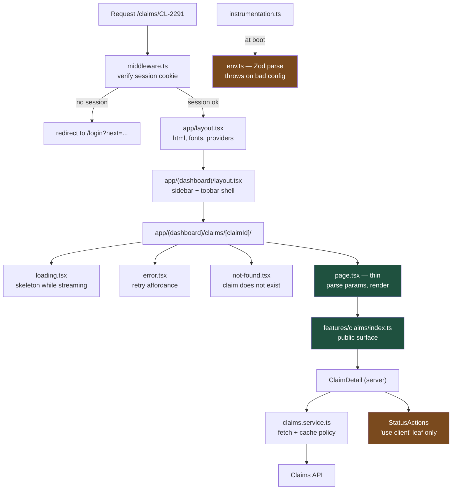

# The App Router Layout That Survives Its Third Team

The App Router gives you filesystem routing and almost no opinion about where your business logic lives. Two years in, that absence of opinion is why `app/` contains a 900-line page component. This is the layout that prevents it.

## The Real-World Problem

Nordheim Versicherung's claims back-office is a Next.js dashboard used by about 400 internal adjusters. It started as one squad and three routes. It is now three squads — Claims, Payments, Policy — sharing one repository.

The symptoms are familiar. `app/claims/[id]/page.tsx` is 640 lines because it holds the data fetch, the currency formatting, the status state machine, and the JSX. Two squads have written their own `formatMoney`. Nobody can tell from a diff whether a change touches claims or payments, so every PR needs three reviewers. A missing `error.tsx` means an adjuster who hits a timed-out policy lookup gets the raw Next.js error overlay in production, on a screen that shows a customer's medical claim.

The fix is not a rewrite. It is a rule: **route files are thin adapters. All logic lives in a feature module with an explicit public surface.** Everything below enforces that rule mechanically.

## The Concept

Four decisions are embedded in the tree below, and each one is load-bearing:

1. **Route groups carve out layout scopes, not URLs.** `(auth)` and `(dashboard)` do not appear in the path. They exist so the sign-in page gets a bare centred layout and the dashboard gets the sidebar shell — without one layout branching on `pathname`.
2. **Every async segment owns its three boundaries.** `loading.tsx`, `error.tsx`, `not-found.tsx` sit next to the `page.tsx` that can suspend or throw. A boundary at the root only catches what nothing closer catches, which means the entire shell unmounts.
3. **`features/` is the real application.** Each feature is a folder with `api/`, `components/`, `model/`, and a single `index.ts` barrel. Nothing outside a feature may deep-import into it; cross-feature reuse goes through `shared/`.
4. **Configuration fails at boot, not at request time.** `env.ts` parses `process.env` with Zod at module load. A missing `KEYCLOAK_ISSUER` breaks the build, not a 3 a.m. login.

## How It Works



## Practical Example

### The tree

```
claims-backoffice/
├── instrumentation.ts                  # boot hook: validate env, start tracing
├── middleware.ts                       # auth redirect at the edge
├── next.config.mjs
├── tsconfig.json
├── vitest.config.ts
└── src/
    ├── env.ts                          # typed, Zod-validated config
    ├── app/
    │   ├── layout.tsx                  # <html>, fonts, global providers
    │   ├── globals.css
    │   ├── not-found.tsx               # global 404
    │   ├── (auth)/
    │   │   ├── layout.tsx              # centred card, no sidebar
    │   │   └── login/
    │   │       └── page.tsx
    │   └── (dashboard)/
    │       ├── layout.tsx              # sidebar + topbar shell
    │       ├── error.tsx               # catches anything a segment misses
    │       ├── page.tsx                # /  → overview
    │       └── claims/
    │           ├── loading.tsx
    │           ├── error.tsx
    │           ├── page.tsx            # /claims  → queue
    │           └── [claimId]/
    │               ├── loading.tsx
    │               ├── error.tsx
    │               ├── not-found.tsx
    │               └── page.tsx        # /claims/CL-2291
    ├── features/
    │   ├── claims/
    │   │   ├── index.ts                # THE public surface
    │   │   ├── api/claims.service.ts
    │   │   ├── model/claim.schema.ts
    │   │   └── components/
    │   │       ├── claim-detail.tsx    # server component
    │   │       ├── claims-queue.tsx    # server component
    │   │       └── status-actions.tsx  # 'use client' leaf
    │   └── auth/
    │       ├── index.ts
    │       └── session.ts
    └── shared/
        ├── ui/skeleton.tsx
        ├── ui/error-panel.tsx
        └── lib/format.ts               # ONE formatMoney, for everyone
```

### `src/env.ts` — configuration that fails loudly

```ts
import { z } from 'zod'

const serverSchema = z.object({
  NODE_ENV: z.enum(['development', 'test', 'production']).default('development'),
  CLAIMS_API_URL: z.string().url(),
  CLAIMS_API_TIMEOUT_MS: z.coerce.number().int().positive().max(10_000).default(3_000),
  KEYCLOAK_ISSUER: z.string().url(),
  SESSION_SECRET: z.string().min(32, 'SESSION_SECRET must be at least 32 chars'),
  OTEL_EXPORTER_OTLP_ENDPOINT: z.string().url().optional(),
})

export type ServerEnv = z.infer<typeof serverSchema>

function load(): ServerEnv {
  const parsed = serverSchema.safeParse(process.env)
  if (!parsed.success) {
    const issues = parsed.error.issues
      .map((i) => `  - ${i.path.join('.')}: ${i.message}`)
      .join('\n')
    throw new Error(`Invalid server environment:\n${issues}`)
  }
  return parsed.data
}

export const env: ServerEnv = load()
```

### `instrumentation.ts` — the boot hook

```ts
export async function register(): Promise<void> {
  const { env } = await import('./src/env')

  if (env.OTEL_EXPORTER_OTLP_ENDPOINT) {
    const { registerOTel } = await import('@vercel/otel')
    registerOTel({ serviceName: 'claims-backoffice' })
  }

  console.info(
    JSON.stringify({ event: 'boot_ok', env: env.NODE_ENV, api: env.CLAIMS_API_URL }),
  )
}

export function onRequestError(
  error: unknown,
  request: { path: string; method: string },
): void {
  console.error(
    JSON.stringify({
      event: 'request_error',
      path: request.path,
      method: request.method,
      message: error instanceof Error ? error.message : String(error),
    }),
  )
}
```

### `middleware.ts` — auth redirect, no business logic

```ts
import { NextResponse, type NextRequest } from 'next/server'
import { verifySessionCookie } from '@/features/auth'

const PUBLIC_PATHS = ['/login', '/healthz']

export async function middleware(request: NextRequest): Promise<NextResponse> {
  const { pathname, search } = request.nextUrl

  if (PUBLIC_PATHS.some((p) => pathname.startsWith(p))) {
    return NextResponse.next()
  }

  const session = await verifySessionCookie(request.cookies.get('session')?.value)
  if (session) {
    return NextResponse.next()
  }

  const loginUrl = new URL('/login', request.url)
  loginUrl.searchParams.set('next', `${pathname}${search}`)
  return NextResponse.redirect(loginUrl)
}

export const config = {
  matcher: ['/((?!_next/static|_next/image|favicon.ico).*)'],
}
```

### `src/features/auth/session.ts`

```ts
import { jwtVerify, createRemoteJWKSet } from 'jose'
import { env } from '@/env'

export interface Session {
  readonly userId: string
  readonly email: string
  readonly roles: readonly string[]
}

const jwks = createRemoteJWKSet(
  new URL(`${env.KEYCLOAK_ISSUER}/protocol/openid-connect/certs`),
)

export async function verifySessionCookie(token: string | undefined): Promise<Session | null> {
  if (!token) return null
  try {
    const { payload } = await jwtVerify(token, jwks, { issuer: env.KEYCLOAK_ISSUER })
    return {
      userId: String(payload.sub),
      email: String(payload.email ?? ''),
      roles: Array.isArray(payload.realm_access_roles)
        ? (payload.realm_access_roles as string[])
        : [],
    }
  } catch {
    return null
  }
}
```

```ts
// src/features/auth/index.ts
export { verifySessionCookie, type Session } from './session'
```

### `src/features/claims/model/claim.schema.ts`

```ts
import { z } from 'zod'

export const claimStatusSchema = z.enum([
  'RECEIVED',
  'ASSESSING',
  'AWAITING_DOCS',
  'APPROVED',
  'DECLINED',
])

export const claimSchema = z.object({
  claimId: z.string().regex(/^CL-\d{4,8}$/),
  policyNumber: z.string().min(1),
  claimantName: z.string().min(1),
  status: claimStatusSchema,
  reserveAmountMinor: z.number().int().nonnegative(),
  currency: z.string().length(3),
  reportedAt: z.string().datetime(),
})

export const claimListSchema = z.object({
  items: z.array(claimSchema),
  total: z.number().int().nonnegative(),
})

export type Claim = z.infer<typeof claimSchema>
export type ClaimStatus = z.infer<typeof claimStatusSchema>
export type ClaimList = z.infer<typeof claimListSchema>
```

### `src/features/claims/api/claims.service.ts` — explicit caching, always

```ts
import { notFound } from 'next/navigation'
import { env } from '@/env'
import { claimListSchema, claimSchema, type Claim, type ClaimList } from '../model/claim.schema'

export class UpstreamError extends Error {
  constructor(readonly status: number) {
    super(`claims_api_status_${status}`)
  }
}

async function request(path: string, init: RequestInit & { next?: NextFetchRequestConfig }) {
  return fetch(`${env.CLAIMS_API_URL}${path}`, {
    ...init,
    signal: AbortSignal.timeout(env.CLAIMS_API_TIMEOUT_MS),
    headers: { accept: 'application/json', ...init.headers },
  })
}

/** Queue view: revalidate on a tag so a mutation can invalidate it precisely. */
export async function listClaims(status?: string): Promise<ClaimList> {
  const query = status ? `?status=${encodeURIComponent(status)}` : ''
  const res = await request(`/v1/claims${query}`, {
    cache: 'force-cache',
    next: { revalidate: 30, tags: ['claims'] },
  })
  if (!res.ok) throw new UpstreamError(res.status)
  return claimListSchema.parse(await res.json())
}

/** Detail view: never cached — an adjuster must see the live reserve. */
export async function getClaim(claimId: string): Promise<Claim> {
  const res = await request(`/v1/claims/${encodeURIComponent(claimId)}`, {
    cache: 'no-store',
  })
  if (res.status === 404) notFound()
  if (!res.ok) throw new UpstreamError(res.status)
  return claimSchema.parse(await res.json())
}
```

### `src/features/claims/components/claim-detail.tsx` — server component

```tsx
import { getClaim } from '../api/claims.service'
import { formatMoney, formatDate } from '@/shared/lib/format'
import { StatusActions } from './status-actions'

export async function ClaimDetail({ claimId }: { claimId: string }) {
  const claim = await getClaim(claimId)

  return (
    <article className="space-y-6">
      <header>
        <h1 className="text-2xl font-semibold">{claim.claimId}</h1>
        <p className="text-sm text-slate-500">
          Policy {claim.policyNumber} · reported {formatDate(claim.reportedAt)}
        </p>
      </header>

      <dl className="grid grid-cols-2 gap-4">
        <div>
          <dt className="text-sm text-slate-500">Claimant</dt>
          <dd className="font-medium">{claim.claimantName}</dd>
        </div>
        <div>
          <dt className="text-sm text-slate-500">Reserve</dt>
          <dd className="font-medium tabular-nums">
            {formatMoney(claim.reserveAmountMinor, claim.currency)}
          </dd>
        </div>
      </dl>

      {/* The only interactive island on this page. */}
      <StatusActions claimId={claim.claimId} current={claim.status} />
    </article>
  )
}
```

### `src/features/claims/components/status-actions.tsx` — the client leaf

```tsx
'use client'

import { useTransition } from 'react'
import type { ClaimStatus } from '../model/claim.schema'

const NEXT_STATES: Record<ClaimStatus, readonly ClaimStatus[]> = {
  RECEIVED: ['ASSESSING'],
  ASSESSING: ['AWAITING_DOCS', 'APPROVED', 'DECLINED'],
  AWAITING_DOCS: ['ASSESSING'],
  APPROVED: [],
  DECLINED: [],
}

export function StatusActions({
  claimId,
  current,
}: {
  claimId: string
  current: ClaimStatus
}) {
  const [isPending, startTransition] = useTransition()
  const options = NEXT_STATES[current]

  if (options.length === 0) {
    return <p className="text-sm text-slate-500">Claim is closed. No further transitions.</p>
  }

  return (
    <div className="flex gap-2" aria-busy={isPending}>
      {options.map((next) => (
        <button
          key={next}
          type="button"
          disabled={isPending}
          className="rounded bg-slate-900 px-3 py-2 text-sm text-white disabled:opacity-50"
          onClick={() =>
            startTransition(async () => {
              const { transitionClaim } = await import('../api/claims.actions')
              await transitionClaim(claimId, next)
            })
          }
        >
          {isPending ? 'Saving…' : `Move to ${next.replace('_', ' ').toLowerCase()}`}
        </button>
      ))}
    </div>
  )
}
```

### `src/features/claims/index.ts` — the public surface

```ts
// Anything not exported here is private to the feature.
// ESLint forbids `@/features/claims/*` imports from outside this folder.
export { ClaimDetail } from './components/claim-detail'
export { ClaimsQueue } from './components/claims-queue'
export { claimSchema, claimStatusSchema, type Claim, type ClaimStatus } from './model/claim.schema'
```

### `src/shared/lib/format.ts` — one implementation

```ts
export function formatMoney(amountMinor: number, currency: string, locale = 'de-DE'): string {
  return new Intl.NumberFormat(locale, { style: 'currency', currency }).format(amountMinor / 100)
}

export function formatDate(iso: string, locale = 'de-DE'): string {
  return new Intl.DateTimeFormat(locale, { dateStyle: 'medium' }).format(new Date(iso))
}
```

### The route files — thin on purpose

```tsx
// src/app/(dashboard)/claims/[claimId]/page.tsx
import type { Metadata } from 'next'
import { ClaimDetail } from '@/features/claims'

interface PageProps {
  params: Promise<{ claimId: string }>
}

export async function generateMetadata({ params }: PageProps): Promise<Metadata> {
  const { claimId } = await params
  return { title: `Claim ${claimId} · Back office` }
}

export default async function ClaimDetailPage({ params }: PageProps) {
  const { claimId } = await params
  return <ClaimDetail claimId={claimId} />
}
```

Nine lines of logic. If a reviewer sees a `fetch`, a date format, or a conditional in a `page.tsx`, that is the smell.

```tsx
// src/app/(dashboard)/claims/[claimId]/loading.tsx
import { Skeleton } from '@/shared/ui/skeleton'

export default function Loading() {
  return (
    <div className="space-y-6" aria-busy="true" aria-live="polite">
      <Skeleton className="h-8 w-48" />
      <Skeleton className="h-4 w-72" />
      <div className="grid grid-cols-2 gap-4">
        <Skeleton className="h-16" />
        <Skeleton className="h-16" />
      </div>
    </div>
  )
}
```

```tsx
// src/app/(dashboard)/claims/[claimId]/error.tsx
'use client'

import { useEffect } from 'react'
import { ErrorPanel } from '@/shared/ui/error-panel'

export default function ClaimError({
  error,
  reset,
}: {
  error: Error & { digest?: string }
  reset: () => void
}) {
  useEffect(() => {
    console.error(JSON.stringify({ event: 'claim_detail_error', digest: error.digest }))
  }, [error])

  return (
    <ErrorPanel
      title="We couldn't load this claim"
      detail="The claims service did not respond in time. Your work has not been lost."
      reference={error.digest}
      onRetry={reset}
    />
  )
}
```

```tsx
// src/app/(dashboard)/claims/[claimId]/not-found.tsx
import Link from 'next/link'

export default function ClaimNotFound() {
  return (
    <div className="space-y-3">
      <h1 className="text-xl font-semibold">Claim not found</h1>
      <p className="text-slate-600">
        This claim reference does not exist, or it belongs to a portfolio you cannot access.
      </p>
      <Link href="/claims" className="text-blue-700 underline">
        Back to the claims queue
      </Link>
    </div>
  )
}
```

```tsx
// src/app/(dashboard)/layout.tsx — the shell, rendered once
import Link from 'next/link'
import type { ReactNode } from 'react'

export default function DashboardLayout({ children }: { children: ReactNode }) {
  return (
    <div className="flex min-h-screen">
      <nav aria-label="Main" className="w-56 shrink-0 border-r bg-slate-50 p-4">
        <ul className="space-y-1 text-sm">
          <li><Link href="/">Overview</Link></li>
          <li><Link href="/claims">Claims queue</Link></li>
        </ul>
      </nav>
      <main className="flex-1 p-8">{children}</main>
    </div>
  )
}
```

```tsx
// src/app/(auth)/layout.tsx — a different shell, same URL space
import type { ReactNode } from 'react'

export default function AuthLayout({ children }: { children: ReactNode }) {
  return (
    <div className="flex min-h-screen items-center justify-center bg-slate-100">
      <div className="w-full max-w-sm rounded-lg bg-white p-8 shadow">{children}</div>
    </div>
  )
}
```

### `next.config.mjs`

```js
/** @type {import('next').NextConfig} */
const nextConfig = {
  reactStrictMode: true,
  poweredByHeader: false,
  typedRoutes: true,
  experimental: {
    typedEnv: true,
  },
  // Fail the build on a type or lint error. A regulated back office does not ship red.
  typescript: { ignoreBuildErrors: false },
  eslint: { ignoreDuringBuilds: false },
  async headers() {
    return [
      {
        source: '/:path*',
        headers: [
          { key: 'X-Content-Type-Options', value: 'nosniff' },
          { key: 'Referrer-Policy', value: 'strict-origin-when-cross-origin' },
          { key: 'Strict-Transport-Security', value: 'max-age=63072000; includeSubDomains' },
        ],
      },
    ]
  },
}

export default nextConfig
```

### The boundary is enforced, not requested

```json
// .eslintrc.json (excerpt) — deep imports across features fail CI
{
  "rules": {
    "no-restricted-imports": [
      "error",
      {
        "patterns": [
          {
            "group": ["@/features/*/*"],
            "message": "Import from the feature's index.ts, not its internals."
          }
        ]
      }
    ]
  }
}
```

### A test for the boundary that actually breaks in production

```ts
// src/features/claims/api/claims.service.test.ts
import { describe, expect, it, vi, afterEach } from 'vitest'
import { listClaims, getClaim, UpstreamError } from './claims.service'

const notFoundSignal = new Error('NEXT_NOT_FOUND')
vi.mock('next/navigation', () => ({
  notFound: () => {
    throw notFoundSignal
  },
}))

vi.mock('@/env', () => ({
  env: { CLAIMS_API_URL: 'https://claims.test', CLAIMS_API_TIMEOUT_MS: 3000 },
}))

afterEach(() => vi.unstubAllGlobals())

describe('claims.service', () => {
  it('requests the queue with an explicit revalidate tag', async () => {
    const fetchMock = vi.fn().mockResolvedValue(
      new Response(JSON.stringify({ items: [], total: 0 }), { status: 200 }),
    )
    vi.stubGlobal('fetch', fetchMock)

    await listClaims('ASSESSING')

    const [url, init] = fetchMock.mock.calls[0]
    expect(url).toBe('https://claims.test/v1/claims?status=ASSESSING')
    expect(init).toMatchObject({ cache: 'force-cache', next: { revalidate: 30, tags: ['claims'] } })
  })

  it('never caches claim detail', async () => {
    const claim = {
      claimId: 'CL-2291',
      policyNumber: 'POL-88123',
      claimantName: 'A. Keller',
      status: 'ASSESSING',
      reserveAmountMinor: 450_000,
      currency: 'EUR',
      reportedAt: '2026-07-14T09:12:00.000Z',
    }
    vi.stubGlobal('fetch', vi.fn().mockResolvedValue(new Response(JSON.stringify(claim))))

    await expect(getClaim('CL-2291')).resolves.toMatchObject({ claimId: 'CL-2291' })
  })

  it('renders the not-found boundary for an unknown claim', async () => {
    vi.stubGlobal('fetch', vi.fn().mockResolvedValue(new Response(null, { status: 404 })))
    await expect(getClaim('CL-0000')).rejects.toBe(notFoundSignal)
  })

  it('surfaces upstream failures so error.tsx can catch them', async () => {
    vi.stubGlobal('fetch', vi.fn().mockResolvedValue(new Response(null, { status: 503 })))
    await expect(getClaim('CL-2291')).rejects.toBeInstanceOf(UpstreamError)
  })
})
```

## Enterprise Trade-offs

| Approach | Pros | Cons | When to use (Banking / Insurance / Enterprise) |
|---|---|---|---|
| **Route groups + colocated `features/` with `index.ts`** | Ownership maps to folders; CODEOWNERS works; deep-import lint keeps boundaries honest | Two places to look for a screen (route + feature); needs the lint rule to hold | Default for any multi-squad enterprise dashboard — this is the layout above |
| **Logic directly in `page.tsx`** | Fastest for a prototype; nothing to navigate | Untestable without rendering a route; 600-line files; merge conflicts on every change | Spikes and internal tools with one owner and a known end-of-life |
| **Flat `components/` + `lib/` + `hooks/` by technical type** | Familiar from CRA-era codebases | A feature's code is scattered across four folders; deleting a feature is archaeology | Small apps under ~15 routes; migrate before the second squad joins |
| **One boundary set at the root only** | Minimal files | One slow policy lookup unmounts the whole shell; the adjuster loses their place | Never in a back office. Acceptable on a marketing site |
| **Separate app per domain (Claims, Payments) + module federation** | Hard isolation; independent deploys | Duplicated design system, auth, and build infra; cross-app navigation is a full reload | Only when squads have genuinely divergent release cadences or regulatory scopes |
| **Zod-validated `env.ts` at boot** | Misconfiguration fails the build, not a customer session | Slightly more ceremony per new variable | Always — a regulated system must not start with a half-configured identity provider |

→ Next: [api-route-example.md](api-route-example.md) · Related: [../../07-frontend-best-practices/02-nextjs-app-router-and-rendering-strategies.md](../../07-frontend-best-practices/02-nextjs-app-router-and-rendering-strategies.md) · [../../00-project-setup-roadmap/03-project-structure.md](../../00-project-setup-roadmap/03-project-structure.md) · [../../09-ux-ui-guidelines/04-loading-error-empty-states.md](../../09-ux-ui-guidelines/04-loading-error-empty-states.md)
