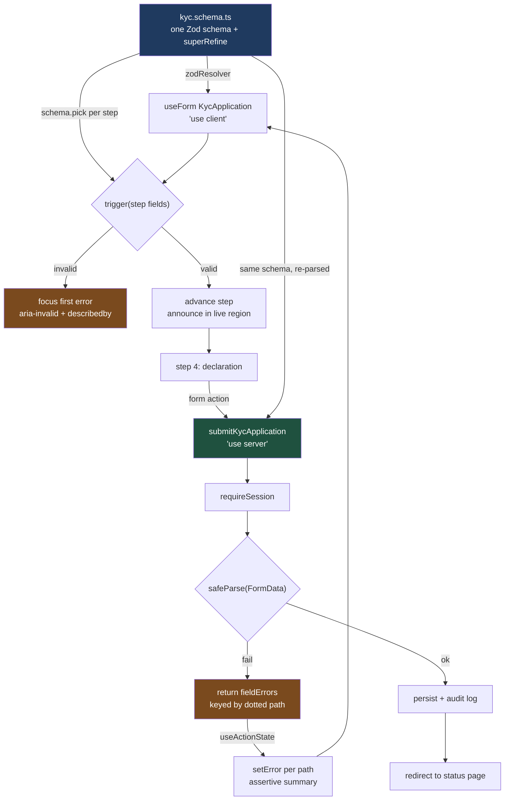

# One Schema, Four Steps, Zero Trust: A KYC Onboarding Form That Validates the Same Way Twice

A form that validates in the browser and a server that validates differently is two products with one name. This is a four-step KYC wizard where one Zod schema drives the client resolver, each step's slice, and the Server Action — and the server never trusts a byte of it.

## The Real-World Problem

**Kestrel Bank** onboards small-business customers through a self-service KYC wizard: applicant identity, business details, beneficial owners, and a declaration. Regulation requires that every beneficial owner holding 25% or more is captured, that ownership never sums above 100%, and that the submitted record can be reproduced from an audit log.

The first implementation validated in the components. Each step had its own `useState`, its own `if (!value) setError(...)`, and the Server Action did `await db.insert(formData)`.

The failures were the predictable ones. A compliance analyst found applications in the queue where the beneficial owners summed to 140% — the browser check existed, but a submission replayed from the network tab skipped it entirely. Applicants on step 3 lost everything when they refreshed, because step state lived in component state. The date-of-birth field accepted `1823`, so the under-18 rule silently passed for a typo. And a screen-reader user could not complete the form at all: errors were rendered as red text with no programmatic association, so the field just refused to advance with no announcement of why.

The rebuild below is one schema in one file, imported by the client and by the Server Action. The client version exists for speed of feedback. The server version is the one that decides.

## The Concept

Six decisions carry this example:

1. **One schema module, no `'use client'` and no `'use server'`.** It is plain TypeScript that both runtimes import. `z.infer` gives the form type, so `useForm<KycApplication>` and the action's parsed output are the same type by construction.
2. **Step slices via `schema.pick()`.** The wizard validates the current step only, using a derived schema. There is no second copy of the rules — a step slice is a projection of the whole.
3. **`superRefine` for cross-field rules.** Ownership summing to ≤ 100% and "at least one owner ≥ 25%" cannot live on a single field. They attach to the array path, so React Hook Form can render them.
4. **`useFieldArray` for beneficial owners.** Add, remove, and per-index errors, with stable `field.id` keys — never the array index.
5. **The Server Action re-parses and maps errors back to fields.** `useActionState` receives a `fieldErrors` record keyed by dotted path (`beneficialOwners.1.percentage`), and `setError` pushes them into the same UI the client validator uses.
6. **Accessibility is wired, not sprinkled.** `aria-invalid`, `aria-describedby` pointing at the message node, a polite live region for step transitions, an assertive summary on submit failure, and focus moved to the first invalid field.

## How It Works



## Practical Example

### Folder layout

```
src/features/kyc-onboarding/
├── model/
│   ├── kyc.schema.ts               # ONE schema — client and server both import this
│   └── steps.ts                    # step definitions derived from the schema
├── actions/
│   └── submit-kyc-application.ts   # 'use server' — re-validates, maps errors to fields
├── components/
│   ├── KycWizard.tsx               # 'use client' — the only interactive boundary
│   ├── BeneficialOwnersStep.tsx    # useFieldArray
│   ├── Field.tsx                   # accessible input wrapper
│   └── SubmitButton.tsx            # useFormStatus
├── __tests__/
│   └── KycWizard.test.tsx
└── index.ts
```

### `model/kyc.schema.ts`

```ts
import { z } from 'zod'

const EIGHTEEN_YEARS_MS = 18 * 365.25 * 24 * 60 * 60 * 1000

export const countrySchema = z.enum(['IE', 'DE', 'FR', 'NL', 'LU'])
export const entityTypeSchema = z.enum(['SOLE_TRADER', 'PARTNERSHIP', 'PRIVATE_LIMITED'])

export const beneficialOwnerSchema = z.object({
  fullName: z.string().trim().min(2, 'Full name is required').max(120),
  dateOfBirth: z
    .string()
    .regex(/^\d{4}-\d{2}-\d{2}$/, 'Use the date picker (YYYY-MM-DD)')
    .refine((value) => {
      const time = Date.parse(value)
      return Number.isFinite(time) && time < Date.now() - EIGHTEEN_YEARS_MS
    }, 'A beneficial owner must be at least 18 years old'),
  percentage: z.coerce
    .number()
    .min(0.01, 'Enter a holding above 0%')
    .max(100, 'A holding cannot exceed 100%'),
  isPoliticallyExposed: z.coerce.boolean(),
})

export const kycApplicationSchema = z
  .object({
    // Step 1 — applicant
    applicantFirstName: z.string().trim().min(1, 'First name is required').max(70),
    applicantLastName: z.string().trim().min(1, 'Last name is required').max(70),
    applicantEmail: z.string().trim().toLowerCase().email('Enter a valid email address'),
    applicantPhone: z
      .string()
      .trim()
      .regex(/^\+[1-9]\d{7,14}$/, 'Use international format, e.g. +35315551234'),

    // Step 2 — business
    legalName: z.string().trim().min(2, 'Registered legal name is required').max(160),
    entityType: entityTypeSchema,
    registrationNumber: z
      .string()
      .trim()
      .toUpperCase()
      .regex(/^[A-Z0-9-]{5,20}$/, 'Enter the company registration number'),
    registeredCountry: countrySchema,
    expectedMonthlyTurnoverMinor: z.coerce
      .number()
      .int('Enter a whole amount')
      .nonnegative('Turnover cannot be negative')
      .max(500_000_00, 'Above 500,000.00 requires relationship-managed onboarding'),

    // Step 3 — beneficial owners
    beneficialOwners: z
      .array(beneficialOwnerSchema)
      .min(1, 'Add at least one beneficial owner')
      .max(10, 'Contact us if there are more than ten owners'),

    // Step 4 — declaration
    sourceOfFunds: z
      .string()
      .trim()
      .min(30, 'Describe the source of funds in at least 30 characters')
      .max(1000),
    declarationAccepted: z.literal(true, {
      errorMap: () => ({ message: 'You must confirm the declaration to submit' }),
    }),
  })
  .superRefine((application, ctx) => {
    const total = application.beneficialOwners.reduce((sum, owner) => sum + owner.percentage, 0)

    if (total > 100.0001) {
      ctx.addIssue({
        code: z.ZodIssueCode.custom,
        path: ['beneficialOwners'],
        message: `Holdings total ${total.toFixed(2)}%. They cannot exceed 100%.`,
      })
    }

    // Regulatory rule: a 25%+ owner must be disclosed, or the entity needs manual review.
    if (!application.beneficialOwners.some((owner) => owner.percentage >= 25)) {
      ctx.addIssue({
        code: z.ZodIssueCode.custom,
        path: ['beneficialOwners'],
        message: 'Disclose at least one owner holding 25% or more.',
      })
    }

    // A sole trader has exactly one owner, by definition.
    if (application.entityType === 'SOLE_TRADER' && application.beneficialOwners.length !== 1) {
      ctx.addIssue({
        code: z.ZodIssueCode.custom,
        path: ['beneficialOwners'],
        message: 'A sole trader has exactly one beneficial owner.',
      })
    }
  })

export type KycApplication = z.input<typeof kycApplicationSchema>
export type KycApplicationParsed = z.output<typeof kycApplicationSchema>
export type BeneficialOwner = z.input<typeof beneficialOwnerSchema>
```

### `model/steps.ts` — step slices are projections, not copies

```ts
import { kycApplicationSchema } from './kyc.schema'
import type { KycApplication } from './kyc.schema'

/** `superRefine` wraps the object, so pick from the inner shape. */
const base = kycApplicationSchema._def.schema

export const STEPS = [
  {
    id: 'applicant',
    title: 'About you',
    fields: ['applicantFirstName', 'applicantLastName', 'applicantEmail', 'applicantPhone'],
    schema: base.pick({
      applicantFirstName: true,
      applicantLastName: true,
      applicantEmail: true,
      applicantPhone: true,
    }),
  },
  {
    id: 'business',
    title: 'Your business',
    fields: [
      'legalName',
      'entityType',
      'registrationNumber',
      'registeredCountry',
      'expectedMonthlyTurnoverMinor',
    ],
    schema: base.pick({
      legalName: true,
      entityType: true,
      registrationNumber: true,
      registeredCountry: true,
      expectedMonthlyTurnoverMinor: true,
    }),
  },
  {
    id: 'owners',
    title: 'Beneficial owners',
    fields: ['beneficialOwners'],
    // Cross-field rules live on the full schema, so the owners step revalidates the whole thing
    // and reads issues at the `beneficialOwners` path.
    schema: kycApplicationSchema,
  },
  {
    id: 'declaration',
    title: 'Declaration',
    fields: ['sourceOfFunds', 'declarationAccepted'],
    schema: base.pick({ sourceOfFunds: true, declarationAccepted: true }),
  },
] as const satisfies ReadonlyArray<{
  id: string
  title: string
  fields: ReadonlyArray<keyof KycApplication>
  schema: unknown
}>

export type StepIndex = 0 | 1 | 2 | 3

export const EMPTY_APPLICATION: KycApplication = {
  applicantFirstName: '',
  applicantLastName: '',
  applicantEmail: '',
  applicantPhone: '',
  legalName: '',
  entityType: 'PRIVATE_LIMITED',
  registrationNumber: '',
  registeredCountry: 'IE',
  expectedMonthlyTurnoverMinor: 0,
  beneficialOwners: [
    { fullName: '', dateOfBirth: '', percentage: 100, isPoliticallyExposed: false },
  ],
  sourceOfFunds: '',
  declarationAccepted: true,
}
```

### `actions/submit-kyc-application.ts` — the decision point

```ts
'use server'

import { randomUUID } from 'node:crypto'
import { redirect } from 'next/navigation'
import { revalidateTag } from 'next/cache'
import { requireSession } from '@/shared/auth/principal'
import { kycApplicationSchema, type KycApplication } from '../model/kyc.schema'
import { persistApplication, writeAuditRecord } from '@/shared/kyc/repository'

export interface KycFormState {
  status: 'idle' | 'error' | 'success'
  message?: string
  /** Dotted RHF paths: "applicantEmail", "beneficialOwners.1.percentage", "beneficialOwners". */
  fieldErrors?: Record<string, string>
  submissionId?: string
}

export const INITIAL_KYC_STATE: KycFormState = { status: 'idle' }

/**
 * The client sends the whole application as one JSON field. The wizard's step
 * validation is a UX affordance; this function is the control.
 */
export async function submitKycApplication(
  _previous: KycFormState,
  formData: FormData,
): Promise<KycFormState> {
  const principal = await requireSession()

  const raw = formData.get('application')
  if (typeof raw !== 'string') {
    return { status: 'error', message: 'The application payload was missing.' }
  }

  let candidate: unknown
  try {
    candidate = JSON.parse(raw) as KycApplication
  } catch {
    return { status: 'error', message: 'The application payload could not be read.' }
  }

  const parsed = kycApplicationSchema.safeParse(candidate)

  if (!parsed.success) {
    // Flatten to dotted paths so setError can target the exact input, including array indices.
    const fieldErrors: Record<string, string> = {}
    for (const issue of parsed.error.issues) {
      const path = issue.path.join('.')
      if (!fieldErrors[path]) fieldErrors[path] = issue.message
    }
    return {
      status: 'error',
      message: `${Object.keys(fieldErrors).length} field(s) need attention before we can submit.`,
      fieldErrors,
    }
  }

  const submissionId = randomUUID()

  // Audit first: what the customer submitted, hashed and timestamped, before any mutation.
  await writeAuditRecord({
    submissionId,
    actorSubject: principal.subject,
    submittedAt: new Date().toISOString(),
    payload: parsed.data,
  })

  await persistApplication({ submissionId, customerId: principal.customerId, ...parsed.data })

  revalidateTag('kyc-applications')
  redirect(`/onboarding/status/${submissionId}`)
}
```

### `components/Field.tsx` — the accessibility contract in one place

```tsx
'use client'

import type { InputHTMLAttributes, ReactNode } from 'react'

interface FieldProps extends InputHTMLAttributes<HTMLInputElement> {
  id: string
  label: string
  error?: string
  hint?: string
  children?: ReactNode
}

export function Field({ id, label, error, hint, children, ...inputProps }: FieldProps) {
  const errorId = `${id}-error`
  const hintId = `${id}-hint`
  const describedBy = [hint ? hintId : null, error ? errorId : null].filter(Boolean).join(' ')

  return (
    <div className="flex flex-col gap-1">
      <label htmlFor={id} className="text-sm font-medium text-slate-800">
        {label}
      </label>
      {hint && (
        <p id={hintId} className="text-xs text-slate-500">
          {hint}
        </p>
      )}
      {children ?? (
        <input
          id={id}
          aria-invalid={error ? true : undefined}
          aria-describedby={describedBy || undefined}
          className="rounded border border-slate-300 px-3 py-2 aria-[invalid]:border-red-600"
          {...inputProps}
        />
      )}
      {/* Rendered only when present, and referenced by the input — not just red text nearby. */}
      {error && (
        <p id={errorId} className="text-sm text-red-700">
          {error}
        </p>
      )}
    </div>
  )
}
```

### `components/SubmitButton.tsx` — `useFormStatus`

```tsx
'use client'

import { useFormStatus } from 'react-dom'

export function SubmitButton() {
  // Reads the pending state of the enclosing <form>. No prop threading, no local isSubmitting.
  const { pending } = useFormStatus()

  return (
    <button
      type="submit"
      disabled={pending}
      aria-disabled={pending}
      className="rounded bg-slate-900 px-4 py-2 text-white disabled:opacity-50"
    >
      {pending ? 'Submitting application…' : 'Submit application'}
    </button>
  )
}
```

### `components/BeneficialOwnersStep.tsx` — the field array

```tsx
'use client'

import { useFieldArray, useFormContext } from 'react-hook-form'
import type { KycApplication } from '../model/kyc.schema'
import { Field } from './Field'

export function BeneficialOwnersStep() {
  const {
    control,
    register,
    formState: { errors },
    watch,
  } = useFormContext<KycApplication>()

  const { fields, append, remove } = useFieldArray({ control, name: 'beneficialOwners' })

  const owners = watch('beneficialOwners')
  const total = owners.reduce((sum, owner) => sum + Number(owner.percentage || 0), 0)
  const arrayError = errors.beneficialOwners?.root?.message ?? errors.beneficialOwners?.message

  return (
    <fieldset className="flex flex-col gap-4">
      <legend className="text-base font-semibold">Beneficial owners</legend>

      {fields.map((field, index) => (
        // field.id is RHF's stable identity. Using `index` would rebind inputs on remove.
        <div key={field.id} className="rounded border border-slate-200 p-4">
          <div className="mb-2 flex items-center justify-between">
            <h3 className="text-sm font-medium">Owner {index + 1}</h3>
            {fields.length > 1 && (
              <button
                type="button"
                onClick={() => remove(index)}
                className="text-sm text-red-700 underline"
              >
                Remove owner {index + 1}
              </button>
            )}
          </div>

          <div className="grid gap-3 sm:grid-cols-3">
            <Field
              id={`owner-${index}-name`}
              label="Full name"
              error={errors.beneficialOwners?.[index]?.fullName?.message}
              {...register(`beneficialOwners.${index}.fullName`)}
            />
            <Field
              id={`owner-${index}-dob`}
              label="Date of birth"
              type="date"
              error={errors.beneficialOwners?.[index]?.dateOfBirth?.message}
              {...register(`beneficialOwners.${index}.dateOfBirth`)}
            />
            <Field
              id={`owner-${index}-pct`}
              label="Holding (%)"
              type="number"
              step="0.01"
              min="0"
              max="100"
              error={errors.beneficialOwners?.[index]?.percentage?.message}
              {...register(`beneficialOwners.${index}.percentage`)}
            />
          </div>

          <label className="mt-3 flex items-center gap-2 text-sm">
            <input type="checkbox" {...register(`beneficialOwners.${index}.isPoliticallyExposed`)} />
            This person is a politically exposed person (PEP)
          </label>
        </div>
      ))}

      <div className="flex items-center justify-between">
        <button
          type="button"
          onClick={() =>
            append({ fullName: '', dateOfBirth: '', percentage: 0, isPoliticallyExposed: false })
          }
          disabled={fields.length >= 10}
          className="rounded border px-3 py-1 text-sm disabled:opacity-40"
        >
          Add another owner
        </button>
        <p className="text-sm tabular-nums text-slate-600" aria-live="polite">
          Total disclosed: {total.toFixed(2)}%
        </p>
      </div>

      {arrayError && (
        <p role="alert" className="text-sm text-red-700">
          {arrayError}
        </p>
      )}
    </fieldset>
  )
}
```

### `components/KycWizard.tsx` — the wizard

```tsx
'use client'

import { useActionState, useEffect, useRef, useState } from 'react'
import { FormProvider, useForm, type FieldPath } from 'react-hook-form'
import { zodResolver } from '@hookform/resolvers/zod'
import { INITIAL_KYC_STATE, submitKycApplication } from '../actions/submit-kyc-application'
import { kycApplicationSchema, type KycApplication } from '../model/kyc.schema'
import { EMPTY_APPLICATION, STEPS, type StepIndex } from '../model/steps'
import { BeneficialOwnersStep } from './BeneficialOwnersStep'
import { Field } from './Field'
import { SubmitButton } from './SubmitButton'

export function KycWizard() {
  const [step, setStep] = useState<StepIndex>(0)
  const [state, formAction] = useActionState(submitKycApplication, INITIAL_KYC_STATE)
  const summaryRef = useRef<HTMLDivElement>(null)

  const methods = useForm<KycApplication>({
    resolver: zodResolver(kycApplicationSchema),
    defaultValues: EMPTY_APPLICATION,
    mode: 'onBlur',
    shouldFocusError: true,
  })
  const {
    register,
    trigger,
    getValues,
    setError,
    formState: { errors },
  } = methods

  // Server rejections land on the same fields the client resolver uses.
  useEffect(() => {
    if (state.status !== 'error' || !state.fieldErrors) return

    for (const [path, message] of Object.entries(state.fieldErrors)) {
      setError(path as FieldPath<KycApplication>, { type: 'server', message })
    }

    // Send the user back to the earliest step that now has an error.
    const firstBadStep = STEPS.findIndex((s) =>
      s.fields.some((field) => Object.keys(state.fieldErrors ?? {}).some((p) => p.startsWith(field))),
    )
    if (firstBadStep >= 0) setStep(firstBadStep as StepIndex)

    summaryRef.current?.focus()
  }, [state, setError])

  const current = STEPS[step]
  const isLast = step === STEPS.length - 1

  async function goNext() {
    // Validate this step only. `trigger` runs the resolver and reports on the named fields.
    const ok = await trigger(current.fields as FieldPath<KycApplication>[], { shouldFocus: true })
    if (ok && !isLast) setStep((s) => (s + 1) as StepIndex)
  }

  return (
    <FormProvider {...methods}>
      {/* No onSubmit: the Server Action owns submission, so this works without JS too. */}
      <form action={formAction} noValidate className="mx-auto flex max-w-2xl flex-col gap-6 p-6">
        <ol className="flex gap-2 text-sm" aria-label="Onboarding progress">
          {STEPS.map((s, index) => (
            <li
              key={s.id}
              aria-current={index === step ? 'step' : undefined}
              className={index === step ? 'font-semibold text-slate-900' : 'text-slate-500'}
            >
              {index + 1}. {s.title}
            </li>
          ))}
        </ol>

        {/* Polite: step changes are informational. */}
        <p aria-live="polite" className="sr-only">
          Step {step + 1} of {STEPS.length}: {current.title}
        </p>

        {/* Assertive + focusable: a rejected submission must interrupt. */}
        <div
          ref={summaryRef}
          tabIndex={-1}
          role="alert"
          aria-live="assertive"
          className="min-h-6 text-sm text-red-700"
        >
          {state.status === 'error' ? state.message : null}
        </div>

        {step === 0 && (
          <div className="grid gap-4 sm:grid-cols-2">
            <Field
              id="applicantFirstName"
              label="First name"
              error={errors.applicantFirstName?.message}
              {...register('applicantFirstName')}
            />
            <Field
              id="applicantLastName"
              label="Last name"
              error={errors.applicantLastName?.message}
              {...register('applicantLastName')}
            />
            <Field
              id="applicantEmail"
              label="Email"
              type="email"
              autoComplete="email"
              error={errors.applicantEmail?.message}
              {...register('applicantEmail')}
            />
            <Field
              id="applicantPhone"
              label="Mobile number"
              hint="International format, e.g. +35315551234"
              error={errors.applicantPhone?.message}
              {...register('applicantPhone')}
            />
          </div>
        )}

        {step === 1 && (
          <div className="grid gap-4 sm:grid-cols-2">
            <Field
              id="legalName"
              label="Registered legal name"
              error={errors.legalName?.message}
              {...register('legalName')}
            />
            <Field id="entityType" label="Entity type" error={errors.entityType?.message}>
              <select
                id="entityType"
                aria-invalid={errors.entityType ? true : undefined}
                className="rounded border border-slate-300 px-3 py-2"
                {...register('entityType')}
              >
                <option value="PRIVATE_LIMITED">Private limited company</option>
                <option value="PARTNERSHIP">Partnership</option>
                <option value="SOLE_TRADER">Sole trader</option>
              </select>
            </Field>
            <Field
              id="registrationNumber"
              label="Company registration number"
              error={errors.registrationNumber?.message}
              {...register('registrationNumber')}
            />
            <Field
              id="expectedMonthlyTurnoverMinor"
              label="Expected monthly turnover (cents)"
              type="number"
              error={errors.expectedMonthlyTurnoverMinor?.message}
              {...register('expectedMonthlyTurnoverMinor')}
            />
          </div>
        )}

        {step === 2 && <BeneficialOwnersStep />}

        {step === 3 && (
          <div className="flex flex-col gap-4">
            <Field id="sourceOfFunds" label="Source of funds" error={errors.sourceOfFunds?.message}>
              <textarea
                id="sourceOfFunds"
                rows={5}
                aria-invalid={errors.sourceOfFunds ? true : undefined}
                aria-describedby={errors.sourceOfFunds ? 'sourceOfFunds-error' : undefined}
                className="rounded border border-slate-300 px-3 py-2"
                {...register('sourceOfFunds')}
              />
            </Field>
            {errors.sourceOfFunds && (
              <p id="sourceOfFunds-error" className="text-sm text-red-700">
                {errors.sourceOfFunds.message}
              </p>
            )}

            <label className="flex items-start gap-2 text-sm">
              <input
                type="checkbox"
                aria-invalid={errors.declarationAccepted ? true : undefined}
                {...register('declarationAccepted')}
              />
              I confirm the information is accurate and complete.
            </label>
            {errors.declarationAccepted && (
              <p className="text-sm text-red-700">{errors.declarationAccepted.message}</p>
            )}

            {/* The whole application travels as one JSON field the action re-parses. */}
            <input type="hidden" name="application" value={JSON.stringify(getValues())} />
          </div>
        )}

        <div className="flex items-center justify-between border-t pt-4">
          <button
            type="button"
            onClick={() => setStep((s) => Math.max(0, s - 1) as StepIndex)}
            disabled={step === 0}
            className="rounded border px-4 py-2 disabled:opacity-40"
          >
            Back
          </button>
          {isLast ? (
            <SubmitButton />
          ) : (
            <button
              type="button"
              onClick={goNext}
              className="rounded bg-slate-900 px-4 py-2 text-white"
            >
              Continue
            </button>
          )}
        </div>
      </form>
    </FormProvider>
  )
}
```

### The server component that renders it

```tsx
// app/(onboarding)/onboarding/kyc/page.tsx — server component, no 'use client'
import { KycWizard } from '@/features/kyc-onboarding'

export const metadata = { title: 'Business onboarding — Kestrel Bank' }

export default function KycPage() {
  return (
    <main>
      <h1 className="mx-auto max-w-2xl px-6 pt-6 text-xl font-semibold">Business onboarding</h1>
      <KycWizard />
    </main>
  )
}
```

### `__tests__/KycWizard.test.tsx` — the validation-failure paths

```tsx
import { describe, expect, it, vi, beforeEach } from 'vitest'
import { render, screen } from '@testing-library/react'
import userEvent from '@testing-library/user-event'
import { KycWizard } from '../components/KycWizard'
import { kycApplicationSchema } from '../model/kyc.schema'
import { EMPTY_APPLICATION } from '../model/steps'

// The action runs on the server; assert the wizard's contract with it, not the network.
const submitSpy = vi.fn()
vi.mock('../actions/submit-kyc-application', () => ({
  INITIAL_KYC_STATE: { status: 'idle' },
  submitKycApplication: (previous: unknown, formData: FormData) => {
    submitSpy(formData.get('application'))
    return Promise.resolve({ status: 'success' })
  },
}))

beforeEach(() => submitSpy.mockClear())

async function fillApplicantStep(user: ReturnType<typeof userEvent.setup>) {
  await user.type(screen.getByLabelText('First name'), 'Nuala')
  await user.type(screen.getByLabelText('Last name'), 'Ó Ceallaigh')
  await user.type(screen.getByLabelText('Email'), 'nuala@stonebridge.example')
  await user.type(screen.getByLabelText('Mobile number'), '+35315551234')
}

describe('KycWizard step validation', () => {
  it('blocks step 1 and associates the error with the invalid input', async () => {
    const user = userEvent.setup()
    render(<KycWizard />)

    await user.type(screen.getByLabelText('Email'), 'not-an-email')
    await user.click(screen.getByRole('button', { name: 'Continue' }))

    const email = screen.getByLabelText('Email')
    expect(email).toHaveAttribute('aria-invalid', 'true')

    const errorId = email.getAttribute('aria-describedby')
    expect(errorId).toBeTruthy()
    expect(document.getElementById(errorId as string)).toHaveTextContent(
      'Enter a valid email address',
    )

    // Still on step 1.
    expect(screen.getByLabelText('First name')).toBeInTheDocument()
  })

  it('rejects beneficial owners that sum above 100% with a cross-field message', async () => {
    const user = userEvent.setup()
    render(<KycWizard />)

    await fillApplicantStep(user)
    await user.click(screen.getByRole('button', { name: 'Continue' }))

    await user.type(screen.getByLabelText('Registered legal name'), 'Stonebridge Joinery Ltd')
    await user.type(screen.getByLabelText('Company registration number'), 'IE-664201')
    await user.click(screen.getByRole('button', { name: 'Continue' }))

    await user.type(screen.getByLabelText('Full name'), 'Nuala Ó Ceallaigh')
    await user.type(screen.getByLabelText('Date of birth'), '1984-03-11')

    await user.click(screen.getByRole('button', { name: 'Add another owner' }))
    await user.type(screen.getByLabelText('Full name', { selector: '#owner-1-name' }), 'Cian Byrne')
    await user.type(screen.getByLabelText('Date of birth', { selector: '#owner-1-dob' }), '1979-09-02')
    const secondPct = screen.getByLabelText('Holding (%)', { selector: '#owner-1-pct' })
    await user.clear(secondPct)
    await user.type(secondPct, '60')

    await user.click(screen.getByRole('button', { name: 'Continue' }))

    expect(await screen.findByRole('alert')).toHaveTextContent(/cannot exceed 100%/)
    expect(screen.getByText('Total disclosed: 160.00%')).toBeInTheDocument()
  })
})

describe('the shared schema on the server side', () => {
  it('rejects the same payload the client rejected — the browser is not the control', () => {
    const replayed = {
      ...EMPTY_APPLICATION,
      applicantFirstName: 'Nuala',
      applicantLastName: 'Ó Ceallaigh',
      applicantEmail: 'nuala@stonebridge.example',
      applicantPhone: '+35315551234',
      legalName: 'Stonebridge Joinery Ltd',
      registrationNumber: 'IE-664201',
      sourceOfFunds: 'Retained profits from twelve years of contract joinery work.',
      beneficialOwners: [
        { fullName: 'Nuala Ó Ceallaigh', dateOfBirth: '1984-03-11', percentage: 100, isPoliticallyExposed: false },
        { fullName: 'Cian Byrne', dateOfBirth: '1979-09-02', percentage: 60, isPoliticallyExposed: false },
      ],
    }

    const result = kycApplicationSchema.safeParse(replayed)

    expect(result.success).toBe(false)
    if (result.success) return
    expect(result.error.issues.map((i) => i.path.join('.'))).toContain('beneficialOwners')
    expect(result.error.issues[0].message).toMatch(/cannot exceed 100%/)
  })

  it('rejects an under-age beneficial owner', () => {
    const result = kycApplicationSchema.safeParse({
      ...EMPTY_APPLICATION,
      applicantFirstName: 'Nuala',
      applicantLastName: 'Ó Ceallaigh',
      applicantEmail: 'nuala@stonebridge.example',
      applicantPhone: '+35315551234',
      legalName: 'Stonebridge Joinery Ltd',
      registrationNumber: 'IE-664201',
      sourceOfFunds: 'Retained profits from twelve years of contract joinery work.',
      beneficialOwners: [
        { fullName: 'Teen Owner', dateOfBirth: '2015-01-01', percentage: 100, isPoliticallyExposed: false },
      ],
    })

    expect(result.success).toBe(false)
    if (result.success) return
    expect(result.error.issues.some((i) => i.message.includes('at least 18 years old'))).toBe(true)
  })
})
```

## Enterprise Trade-offs

| Approach | Pros | Cons | When to use (Banking / Insurance / Enterprise) |
|---|---|---|---|
| **One Zod schema, RHF client + Server Action server** | Rules cannot diverge; `z.infer` keeps types honest; replayed requests are rejected | Schema module must stay runtime-neutral (no Node or DOM imports); large schemas need splitting | Default for any regulated form: KYC, claims intake, credit applications |
| **`schema.pick()` step slices** | No duplicated rules; adding a field to a step is one line | `superRefine` wraps the object, so cross-field rules need the full schema per step | Any wizard longer than two steps |
| **`superRefine` for cross-field rules** | Expresses real regulation (ownership totals, PEP thresholds) where it belongs | Issues attach to a path you must remember to render; harder to unit-test in isolation | Whenever a rule spans two or more fields — which in compliance is most of them |
| **Client-only validation** | Fastest to build; instant feedback | Bypassed by curl, a replayed request, or a disabled-JS submit; unenforceable as a control | Never as the only layer. Fine as the first layer |
| **`useActionState` field mapping** | Server rejections land on the exact input, including array indices; works without JS | Requires a dotted-path convention both sides honour | Any Server Action form where the server can reject for reasons the client cannot know (duplicate registration number, sanctions hit) |
| **Persisting wizard state to the server per step** | Survives refresh, device switch, and session expiry; partial applications are recoverable | More endpoints, partial records to reconcile, and PII stored before consent is complete | Long applications (10+ minutes) where drop-off costs real revenue — add it once the single-submit version works |

## Why This Still Matters Through 2030

The schema-as-contract pattern outlives its libraries because the constraint is regulatory, not technical: a control that only runs in the browser is not a control, and any auditor will say so. React's direction reinforces the split shown here — Server Actions and `useActionState` make the server the natural owner of submission while `useFormStatus` removes the last reason to hand-roll pending state, so the client's job narrows to fast feedback and accessible error presentation. Zod's standard-schema alignment means the same object can now feed a form resolver, an API boundary, and an OpenAPI document, which pushes even harder toward a single definition per domain concept. Accessibility is the part that ages best and is skipped most: `aria-invalid` plus `aria-describedby` plus a live region has been the correct answer for over a decade and remains the difference between a form that passes an EN 301 549 audit and one that gets remediated under deadline. And as generated code becomes the norm, the schema is the artefact worth reviewing carefully — get it right once and both the UI and the server inherit it; get it wrong and the mistake is now enforced consistently in two places.

→ Next: [../react/tanstack-query-example.md](../react/tanstack-query-example.md) · Related: [../../07-frontend-best-practices/08-forms-with-react-hook-form-and-zod.md](../../07-frontend-best-practices/08-forms-with-react-hook-form-and-zod.md) · [../../09-ux-ui-guidelines/02-accessibility-basics-wcag.md](../../09-ux-ui-guidelines/02-accessibility-basics-wcag.md) · [../../01-core-concepts/05-security-by-default.md](../../01-core-concepts/05-security-by-default.md) · [api-route-example.md](api-route-example.md)
