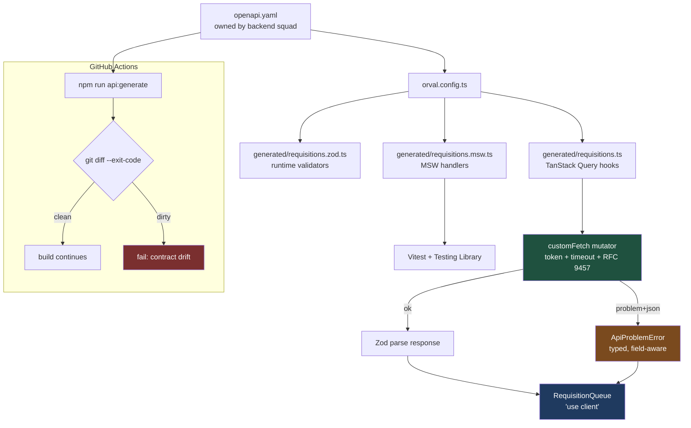

# Stop Hand-Writing the Client: Orval, Zod, MSW and a CI Job That Breaks on Contract Drift

The frontend types are a copy of the backend contract, and copies rot. Orval turns the OpenAPI document into the query hooks, the runtime validators, and the mocks — and one CI job makes a backend rename fail the build instead of the browser.

## The Real-World Problem

**Halvard Systems** builds the internal procurement platform for a 40,000-seat manufacturing group. The purchase-requisition service is owned by a backend squad in a different timezone that ships twice a week. The frontend squad owns the approval console.

For two years the console had a hand-written `src/lib/api/requisitions.ts`: an axios instance, twelve functions, and a `types.ts` that somebody transcribed from the Swagger page. It drifted continuously and silently.

Three incidents, all the same shape. The backend renamed `approver_id` to `approverId` in a minor release; the console kept compiling, because the hand-written interface still said `approver_id`, and the approvals table rendered an empty column for eleven days before a plant manager called. The pagination envelope changed from `{ items, total }` to `{ data, meta: { total } }`; the console's `total` became `undefined`, so the pager showed page 1 of 0. And a new `422` problem-detail body was introduced for budget-ceiling violations, which the console rendered as `[object Object]` inside a red box.

Every one of these was a *type* problem that TypeScript could not see, because the types were a hand-maintained fiction. What follows replaces the fiction with generation, and puts a gate in CI so drift is a red pipeline, not a red screen.

## The Concept

Orval reads an OpenAPI 3.x document and writes TypeScript. In this setup it writes four things from one source:

1. **Typed TanStack Query hooks** — `useListRequisitions`, `useApproveRequisition` — with query keys, params, and response types derived from the spec.
2. **Zod schemas** for the same models, so the response is *validated at runtime*, not just typed at compile time. Types catch the rename; Zod catches the shape the server actually sent in production.
3. **MSW handlers** seeded from the spec's schemas, so component tests run against mocks that cannot drift from the contract either.
4. **A single custom mutator** — the only place in the app that knows about auth headers, timeouts, and error normalisation.

Two decisions matter more than the config. First, generated code is **committed**, not gitignored: reviewers see the contract change in the diff, and the CI drift check needs a baseline to compare against. Second, generated code is **never imported directly by components**. It lands in `src/features/<feature>/api/generated/` and the feature's `index.ts` re-exports a small hand-written surface on top. That gives you a place to stand when a generated name changes.

## How It Works



## Practical Example

### Folder layout

```
├── openapi/
│   └── procurement.yaml                       # vendored from the backend squad's release
├── orval.config.ts
├── src/
│   ├── features/requisitions/
│   │   ├── api/
│   │   │   ├── generated/                     # committed, never hand-edited
│   │   │   │   ├── requisitions.ts            # TanStack Query hooks
│   │   │   │   ├── requisitions.zod.ts        # Zod schemas
│   │   │   │   ├── requisitions.msw.ts        # MSW handlers
│   │   │   │   └── model/                     # interfaces per schema
│   │   │   └── index.ts                       # the curated re-export surface
│   │   ├── components/RequisitionQueue.tsx    # 'use client'
│   │   └── __tests__/RequisitionQueue.test.tsx
│   └── shared/api/
│       ├── custom-fetch.ts                    # the mutator
│       └── problem.ts                         # ApiProblemError
└── .github/workflows/api-contract.yml
```

### `openapi/procurement.yaml` — the source slice

```yaml
openapi: 3.1.0
info:
  title: Halvard Procurement API
  version: 4.3.0
servers:
  - url: https://procurement.halvard.internal/api/v4
security:
  - bearerAuth: []
paths:
  /requisitions:
    get:
      operationId: listRequisitions
      summary: List purchase requisitions visible to the caller
      tags: [requisitions]
      parameters:
        - name: status
          in: query
          schema:
            type: string
            enum: [DRAFT, PENDING_APPROVAL, APPROVED, REJECTED]
        - name: costCentre
          in: query
          schema: { type: string, pattern: '^CC-\d{5}$' }
        - name: page
          in: query
          schema: { type: integer, minimum: 1, default: 1 }
        - name: pageSize
          in: query
          schema: { type: integer, minimum: 1, maximum: 100, default: 25 }
      responses:
        '200':
          description: A page of requisitions
          content:
            application/json:
              schema: { $ref: '#/components/schemas/RequisitionPage' }
        '401':
          $ref: '#/components/responses/Problem'
        '429':
          $ref: '#/components/responses/Problem'
  /requisitions/{requisitionId}/approval:
    post:
      operationId: approveRequisition
      summary: Approve or reject a requisition
      tags: [requisitions]
      parameters:
        - name: requisitionId
          in: path
          required: true
          schema: { type: string, format: uuid }
      requestBody:
        required: true
        content:
          application/json:
            schema: { $ref: '#/components/schemas/ApprovalDecision' }
      responses:
        '200':
          description: Updated requisition
          content:
            application/json:
              schema: { $ref: '#/components/schemas/Requisition' }
        '409':
          $ref: '#/components/responses/Problem'
        '422':
          $ref: '#/components/responses/Problem'
components:
  securitySchemes:
    bearerAuth:
      type: http
      scheme: bearer
      bearerFormat: JWT
  responses:
    Problem:
      description: RFC 9457 problem detail
      content:
        application/problem+json:
          schema: { $ref: '#/components/schemas/Problem' }
  schemas:
    Problem:
      type: object
      required: [type, title, status]
      properties:
        type: { type: string, format: uri }
        title: { type: string }
        status: { type: integer }
        detail: { type: string }
        instance: { type: string }
        errors:
          type: array
          items:
            type: object
            required: [field, message]
            properties:
              field: { type: string }
              message: { type: string }
    PageMeta:
      type: object
      required: [page, pageSize, totalItems, totalPages]
      properties:
        page: { type: integer }
        pageSize: { type: integer }
        totalItems: { type: integer }
        totalPages: { type: integer }
    Requisition:
      type: object
      required:
        [id, reference, status, costCentre, requesterName, netAmountMinor, currency, submittedAt]
      properties:
        id: { type: string, format: uuid }
        reference: { type: string, pattern: '^REQ-\d{4}-\d{6}$' }
        status:
          type: string
          enum: [DRAFT, PENDING_APPROVAL, APPROVED, REJECTED]
        costCentre: { type: string }
        requesterName: { type: string }
        netAmountMinor: { type: integer, minimum: 0 }
        currency: { type: string, enum: [EUR, SEK] }
        submittedAt: { type: string, format: date-time }
        approverId: { type: string, nullable: true }
    RequisitionPage:
      type: object
      required: [data, meta]
      properties:
        data:
          type: array
          items: { $ref: '#/components/schemas/Requisition' }
        meta: { $ref: '#/components/schemas/PageMeta' }
    ApprovalDecision:
      type: object
      required: [decision]
      properties:
        decision: { type: string, enum: [APPROVE, REJECT] }
        comment: { type: string, maxLength: 500 }
```

### `orval.config.ts`

```ts
import { defineConfig } from 'orval'

const INPUT = './openapi/procurement.yaml'
const FEATURE = './src/features/requisitions/api/generated'

export default defineConfig({
  // 1. TanStack Query hooks + MSW mocks, split one file per tag.
  requisitionsClient: {
    input: { target: INPUT },
    output: {
      target: `${FEATURE}/requisitions.ts`,
      schemas: `${FEATURE}/model`,
      mode: 'tags-split',
      client: 'react-query',
      httpClient: 'fetch',
      clean: true, // removes stale files when an operation disappears from the spec
      prettier: true,
      mock: {
        type: 'msw',
        useExamples: false,
        delay: false, // deterministic tests; no artificial latency
      },
      override: {
        // Every operation routes through one mutator. Nothing else touches fetch.
        mutator: {
          path: './src/shared/api/custom-fetch.ts',
          name: 'customFetch',
        },
        query: {
          useQuery: true,
          useMutation: true,
          signal: true, // wires AbortSignal from TanStack Query into fetch
          options: {
            // Deliberate per-domain defaults; individual hooks can override.
            staleTime: 30_000,
            gcTime: 5 * 60_000,
          },
        },
        // Generated hook names read like domain verbs, not HTTP.
        operationName: ({ operationId }) => operationId,
      },
    },
  },

  // 2. Zod schemas for the same spec — runtime validation of responses.
  requisitionsZod: {
    input: { target: INPUT },
    output: {
      target: `${FEATURE}/requisitions.zod.ts`,
      client: 'zod',
      fileExtension: '.zod.ts',
      prettier: true,
      override: {
        zod: {
          generate: { param: true, query: true, body: true, response: true },
          coerce: { query: true },
        },
      },
    },
  },
})
```

### `src/shared/api/problem.ts` — the typed error

```ts
export interface ProblemFieldError {
  readonly field: string
  readonly message: string
}

export interface ProblemDetail {
  readonly type: string
  readonly title: string
  readonly status: number
  readonly detail?: string
  readonly instance?: string
  readonly errors?: readonly ProblemFieldError[]
}

/** One error class the whole app can branch on — no `catch (e: any)` anywhere. */
export class ApiProblemError extends Error {
  readonly status: number
  readonly type: string
  readonly detail?: string
  readonly fieldErrors: Readonly<Record<string, string>>

  constructor(problem: ProblemDetail) {
    super(problem.title)
    this.name = 'ApiProblemError'
    this.status = problem.status
    this.type = problem.type
    this.detail = problem.detail
    this.fieldErrors = Object.fromEntries(
      (problem.errors ?? []).map((e) => [e.field, e.message]),
    )
  }

  /** True for anything the caller can fix by changing the request. Never retried. */
  get isClientFault(): boolean {
    return this.status >= 400 && this.status < 500
  }

  static isBudgetCeiling(error: unknown): error is ApiProblemError {
    return error instanceof ApiProblemError && error.type.endsWith('/budget-ceiling-exceeded')
  }
}

export class ApiTimeoutError extends Error {
  constructor(readonly url: string) {
    super(`Request timed out: ${url}`)
    this.name = 'ApiTimeoutError'
  }
}

function isProblemDetail(value: unknown): value is ProblemDetail {
  return (
    typeof value === 'object' &&
    value !== null &&
    typeof (value as ProblemDetail).title === 'string' &&
    typeof (value as ProblemDetail).status === 'number'
  )
}

export function toApiProblem(status: number, body: unknown, url: string): ApiProblemError {
  if (isProblemDetail(body)) return new ApiProblemError(body)
  // A gateway 502 with an HTML body still becomes the same typed error.
  return new ApiProblemError({
    type: 'about:blank',
    title: status >= 500 ? 'The procurement service is unavailable' : 'Request rejected',
    status,
    instance: url,
  })
}
```

### `src/shared/api/custom-fetch.ts` — the mutator

```ts
import { ApiTimeoutError, toApiProblem } from './problem'
import { getAccessToken } from '@/shared/auth/token'

const BASE_URL = process.env.NEXT_PUBLIC_PROCUREMENT_URL ?? ''
const DEFAULT_TIMEOUT_MS = 8_000

export interface CustomFetchOptions extends RequestInit {
  /** Orval passes the AbortSignal from TanStack Query here. */
  signal?: AbortSignal
}

/**
 * The single network seam for every generated operation.
 * Injects auth, bounds the request, and normalises errors into ApiProblemError.
 */
export const customFetch = async <T>(
  url: string,
  options: CustomFetchOptions = {},
): Promise<T> => {
  const token = await getAccessToken()
  const timeout = AbortSignal.timeout(DEFAULT_TIMEOUT_MS)
  const signal = options.signal ? AbortSignal.any([options.signal, timeout]) : timeout

  const absolute = url.startsWith('http') ? url : `${BASE_URL}${url}`

  let response: Response
  try {
    response = await fetch(absolute, {
      ...options,
      signal,
      // Never rely on implicit caching. Requisition state is per-approver and live.
      cache: 'no-store',
      headers: {
        accept: 'application/json, application/problem+json',
        ...(options.body ? { 'content-type': 'application/json' } : {}),
        ...(token ? { authorization: `Bearer ${token}` } : {}),
        ...options.headers,
      },
    })
  } catch (error) {
    if (timeout.aborted) throw new ApiTimeoutError(absolute)
    throw error // a caller-initiated abort must stay an abort
  }

  if (response.status === 204) return undefined as T

  const payload: unknown = await response.json().catch(() => null)

  if (!response.ok) throw toApiProblem(response.status, payload, absolute)

  return payload as T
}
```

### `src/features/requisitions/api/index.ts` — the curated surface

Generated names are an implementation detail. This file is what components import, and it is where response validation happens.

```ts
import { listRequisitionsResponse } from './generated/requisitions.zod'
import {
  useListRequisitions as useGeneratedListRequisitions,
  useApproveRequisition as useGeneratedApproveRequisition,
  getListRequisitionsQueryKey,
} from './generated/requisitions'
import type { ListRequisitionsParams, RequisitionPage } from './generated/model'

export type { Requisition, RequisitionPage, ApprovalDecision } from './generated/model'
export { getListRequisitionsQueryKey }

/**
 * Wraps the generated hook with runtime validation.
 * The generated types describe the contract; Zod checks the payload actually matches it.
 */
export function useRequisitionQueue(params: ListRequisitionsParams) {
  return useGeneratedListRequisitions(params, {
    query: {
      staleTime: 30_000,
      placeholderData: (previous: RequisitionPage | undefined) => previous,
      retry: (attempt: number, error: unknown) =>
        attempt < 2 && !(error instanceof Error && error.name === 'ApiProblemError'),
      select: (page: RequisitionPage) => listRequisitionsResponse.parse(page),
    },
  })
}

export function useApproveRequisition() {
  return useGeneratedApproveRequisition({ mutation: { retry: false } })
}
```

### `src/features/requisitions/components/RequisitionQueue.tsx`

```tsx
'use client'

import { useState } from 'react'
import { useQueryClient } from '@tanstack/react-query'
import { ApiProblemError } from '@/shared/api/problem'
import {
  getListRequisitionsQueryKey,
  useApproveRequisition,
  useRequisitionQueue,
  type Requisition,
} from '../api'

const money = (minor: number, currency: string) =>
  new Intl.NumberFormat('sv-SE', { style: 'currency', currency }).format(minor / 100)

export function RequisitionQueue({ costCentre }: { costCentre: string }) {
  const [page, setPage] = useState(1)
  const params = { status: 'PENDING_APPROVAL' as const, costCentre, page, pageSize: 25 }
  const { data, isPending, isFetching, error } = useRequisitionQueue(params)
  const queryClient = useQueryClient()
  const approve = useApproveRequisition()
  const [rowError, setRowError] = useState<string | null>(null)

  function decide(requisition: Requisition, decision: 'APPROVE' | 'REJECT') {
    setRowError(null)
    approve.mutate(
      { requisitionId: requisition.id, data: { decision } },
      {
        onSuccess: () => {
          // Targeted: only the page currently on screen.
          void queryClient.invalidateQueries({ queryKey: getListRequisitionsQueryKey(params) })
        },
        onError: (mutationError: unknown) => {
          if (ApiProblemError.isBudgetCeiling(mutationError)) {
            setRowError(`${requisition.reference}: ${mutationError.detail ?? mutationError.message}`)
            return
          }
          if (mutationError instanceof ApiProblemError && mutationError.status === 409) {
            setRowError(`${requisition.reference} was already decided by another approver.`)
            return
          }
          setRowError('Could not record the decision. Nothing was changed.')
        },
      },
    )
  }

  if (isPending) return <p className="p-6 text-slate-600">Loading requisitions…</p>

  if (error instanceof ApiProblemError) {
    return (
      <div role="alert" className="rounded border border-red-300 bg-red-50 p-4">
        <h2 className="font-medium text-red-900">{error.message}</h2>
        {error.detail && <p className="mt-1 text-sm text-red-800">{error.detail}</p>}
      </div>
    )
  }

  return (
    <section aria-busy={isFetching} className="flex flex-col gap-3">
      <div aria-live="polite" className="min-h-6 text-sm text-red-700">
        {rowError}
      </div>

      <table className="w-full border-collapse text-sm">
        <caption className="sr-only">Requisitions pending approval for {costCentre}</caption>
        <thead>
          <tr>
            {['Reference', 'Requester', 'Net amount', 'Decision'].map((h) => (
              <th key={h} scope="col" className="px-3 py-2 text-left font-medium">
                {h}
              </th>
            ))}
          </tr>
        </thead>
        <tbody>
          {data?.data.map((requisition) => (
            <tr key={requisition.id}>
              <td className="px-3 py-2 font-mono">{requisition.reference}</td>
              <td className="px-3 py-2">{requisition.requesterName}</td>
              <td className="px-3 py-2 text-right tabular-nums">
                {money(requisition.netAmountMinor, requisition.currency)}
              </td>
              <td className="px-3 py-2">
                <button
                  type="button"
                  disabled={approve.isPending}
                  onClick={() => decide(requisition, 'APPROVE')}
                  className="rounded bg-emerald-700 px-3 py-1 text-white disabled:opacity-50"
                >
                  Approve
                </button>
              </td>
            </tr>
          ))}
        </tbody>
      </table>

      <nav aria-label="Pagination" className="flex items-center justify-end gap-2">
        <button
          type="button"
          disabled={page <= 1 || isFetching}
          onClick={() => setPage((p) => p - 1)}
          className="rounded border px-3 py-1 disabled:opacity-40"
        >
          Previous
        </button>
        <span className="text-sm" aria-live="polite">
          Page {data?.meta.page} of {data?.meta.totalPages}
        </span>
        <button
          type="button"
          disabled={(data?.meta.totalPages ?? 1) <= page || isFetching}
          onClick={() => setPage((p) => p + 1)}
          className="rounded border px-3 py-1 disabled:opacity-40"
        >
          Next
        </button>
      </nav>
    </section>
  )
}
```

### npm scripts

```json
{
  "scripts": {
    "api:pull": "curl -fsSL \"$PROCUREMENT_SPEC_URL\" -o openapi/procurement.yaml",
    "api:generate": "orval --config ./orval.config.ts",
    "api:check": "npm run api:generate && git diff --exit-code -- src/features/*/api/generated openapi",
    "typecheck": "tsc --noEmit",
    "test": "vitest run"
  }
}
```

### `.github/workflows/api-contract.yml` — drift fails CI, not production

```yaml
name: API contract
on:
  pull_request:
  schedule:
    - cron: '0 6 * * 1-5' # catches a backend release that landed without a frontend PR

jobs:
  contract-drift:
    runs-on: ubuntu-latest
    env:
      PROCUREMENT_SPEC_URL: ${{ vars.PROCUREMENT_SPEC_URL }}
    steps:
      - uses: actions/checkout@v4
      - uses: actions/setup-node@v4
        with:
          node-version: 22
          cache: npm
      - run: npm ci

      # Pull the spec the backend squad publishes for the current release.
      - name: Fetch published OpenAPI document
        run: npm run api:pull

      - name: Regenerate client and fail on drift
        run: npm run api:generate

      - name: Assert generated client matches the committed one
        run: git diff --exit-code -- src/features/*/api/generated openapi
        # Non-empty diff => the contract moved. Fix: commit the regenerated client
        # and the code changes it forces. A renamed field is now a red pipeline.

      - name: Typecheck against the regenerated client
        run: npm run typecheck

      - name: Test against generated MSW handlers
        run: npm run test
```

The `typecheck` step is the one that turns `approver_id` → `approverId` into a compile error at the call site. The `git diff` step is what stops somebody quietly editing generated files by hand.

### `src/features/requisitions/__tests__/RequisitionQueue.test.tsx`

```tsx
import { describe, expect, it, beforeAll, afterEach, afterAll } from 'vitest'
import { render, screen } from '@testing-library/react'
import userEvent from '@testing-library/user-event'
import { QueryClient, QueryClientProvider } from '@tanstack/react-query'
import { http, HttpResponse } from 'msw'
import { setupServer } from 'msw/node'
import type { ReactElement } from 'react'
import { getListRequisitionsMock } from '../api/generated/requisitions.msw'
import { RequisitionQueue } from '../components/RequisitionQueue'
import type { Requisition } from '../api'

const BASE = 'https://procurement.halvard.internal/api/v4'

function requisition(overrides: Partial<Requisition> = {}): Requisition {
  return {
    id: 'a1c0f6de-0000-4000-8000-000000000001',
    reference: 'REQ-2026-004417',
    status: 'PENDING_APPROVAL',
    costCentre: 'CC-40218',
    requesterName: 'Ingrid Sjöberg',
    netAmountMinor: 4_250_00,
    currency: 'SEK',
    submittedAt: '2026-08-03T07:41:00Z',
    approverId: null,
    ...overrides,
  }
}

const page = {
  data: [requisition()],
  meta: { page: 1, pageSize: 25, totalItems: 1, totalPages: 1 },
}

const server = setupServer(
  // Generated handlers give a spec-shaped baseline for every operation…
  ...getListRequisitionsMock(),
  // …and this override pins the exact rows this test asserts on.
  http.get(`${BASE}/requisitions`, () => HttpResponse.json(page)),
)

beforeAll(() => server.listen({ onUnhandledRequest: 'error' }))
afterEach(() => server.resetHandlers())
afterAll(() => server.close())

function renderWithClient(ui: ReactElement) {
  const client = new QueryClient({
    defaultOptions: { queries: { retry: false }, mutations: { retry: false } },
  })
  return render(<QueryClientProvider client={client}>{ui}</QueryClientProvider>)
}

describe('RequisitionQueue', () => {
  it('renders rows from the generated client with formatted amounts', async () => {
    renderWithClient(<RequisitionQueue costCentre="CC-40218" />)

    expect(await screen.findByText('REQ-2026-004417')).toBeInTheDocument()
    expect(screen.getByText('Ingrid Sjöberg')).toBeInTheDocument()
    expect(screen.getByText(/4\s?250,00/)).toBeInTheDocument()
  })

  it('surfaces an RFC 9457 budget-ceiling problem as a field-level message', async () => {
    server.use(
      http.post(`${BASE}/requisitions/:id/approval`, () =>
        HttpResponse.json(
          {
            type: 'https://procurement.halvard.internal/problems/budget-ceiling-exceeded',
            title: 'Approval rejected',
            status: 422,
            detail: 'CC-40218 has 1 200,00 SEK remaining this quarter.',
            errors: [{ field: 'decision', message: 'Exceeds remaining budget' }],
          },
          { status: 422, headers: { 'content-type': 'application/problem+json' } },
        ),
      ),
    )

    const user = userEvent.setup()
    renderWithClient(<RequisitionQueue costCentre="CC-40218" />)

    await user.click(await screen.findByRole('button', { name: 'Approve' }))

    expect(
      await screen.findByText(/REQ-2026-004417: CC-40218 has 1 200,00 SEK remaining/),
    ).toBeInTheDocument()
  })

  it('reports a concurrent decision (409) without claiming the change succeeded', async () => {
    server.use(
      http.post(`${BASE}/requisitions/:id/approval`, () =>
        HttpResponse.json(
          {
            type: 'https://procurement.halvard.internal/problems/already-decided',
            title: 'Conflict',
            status: 409,
          },
          { status: 409, headers: { 'content-type': 'application/problem+json' } },
        ),
      ),
    )

    const user = userEvent.setup()
    renderWithClient(<RequisitionQueue costCentre="CC-40218" />)

    await user.click(await screen.findByRole('button', { name: 'Approve' }))

    expect(await screen.findByText(/already decided by another approver/)).toBeInTheDocument()
  })
})
```

## Enterprise Trade-offs

| Approach | Pros | Cons | When to use (Banking / Insurance / Enterprise) |
|---|---|---|---|
| **Orval → TanStack Query + Zod + MSW, generated committed** | One source of truth; drift is a CI failure; mocks match the contract; runtime validation catches production-only shapes | Generation step to maintain; large diffs on spec changes; regenerated names churn if the spec is unstable | Default whenever a team that isn't yours owns the API and publishes OpenAPI |
| **Hand-written fetch client + hand-written types** | No tooling, no build step, total control over naming | Silent drift; types are a fiction reviewers cannot verify; every endpoint re-implements auth and errors | Two or three endpoints on an API you also own, and never more |
| **Types only (`openapi-typescript`), hooks by hand** | Small output, no opinion on data layer; compile-time safety | You still hand-write the calls, keys, and mocks; no runtime validation | A codebase already committed to its own data layer that only wants the types |
| **Generated code gitignored, built in CI** | Clean diffs; nothing stale in the repo | No drift signal in review; local dev needs codegen before typecheck; you cannot diff what changed | Only with a very stable spec and strong CI discipline — you lose the best part of the setup |
| **Custom mutator for auth/timeout/errors** | One seam for tokens, `AbortSignal`, and RFC 9457 normalisation; testable in isolation | An extra indirection generated code depends on; a mutator bug affects every call | Always. This is the piece that makes generated code safe to consume |
| **Blanket `orval --watch` in dev against a live spec URL** | Instant feedback while a contract is being co-designed | Non-reproducible builds; a backend deploy silently rewrites your source tree | Short-lived integration spikes only. CI must always regenerate from a vendored file |

## Why This Still Matters Through 2030

OpenAPI is the contract format enterprise API governance already runs on — gateways, developer portals, and API catalogues all consume it, so in a large organisation the document exists whether or not the frontend uses it. That makes generation the cheap path, and hand-transcription the expensive one that merely hides its cost until an incident. The specific generator will change; the shape of the setup will not, because the durable ideas are separable: a machine-readable contract, code generated from it rather than copied, runtime validation at the boundary because compile-time types are erased before the response arrives, and a CI gate that turns an upstream change into somebody's build failure rather than a user's blank column. As more code is written by assistants, that gate matters more, not less — a model will happily produce a plausible interface that matches nothing, and `git diff --exit-code` against a regenerated client is one of the few checks that catches a confident wrong answer. Contract testing sits directly on top of this: once the spec is the artefact both sides build from, verifying provider conformance is an extension of the same pipeline rather than a new project.

→ Next: [form-with-react-hook-form-zod-example.md](form-with-react-hook-form-zod-example.md) · Related: [../../05-apis-and-integration/04-orval-generating-typed-clients-from-openapi.md](../../05-apis-and-integration/04-orval-generating-typed-clients-from-openapi.md) · [../../05-apis-and-integration/01-rest-api-design-principles.md](../../05-apis-and-integration/01-rest-api-design-principles.md) · [../react/tanstack-query-example.md](../react/tanstack-query-example.md) · [../../08-testing-strategies/02-unit-and-integration-testing.md](../../08-testing-strategies/02-unit-and-integration-testing.md)
