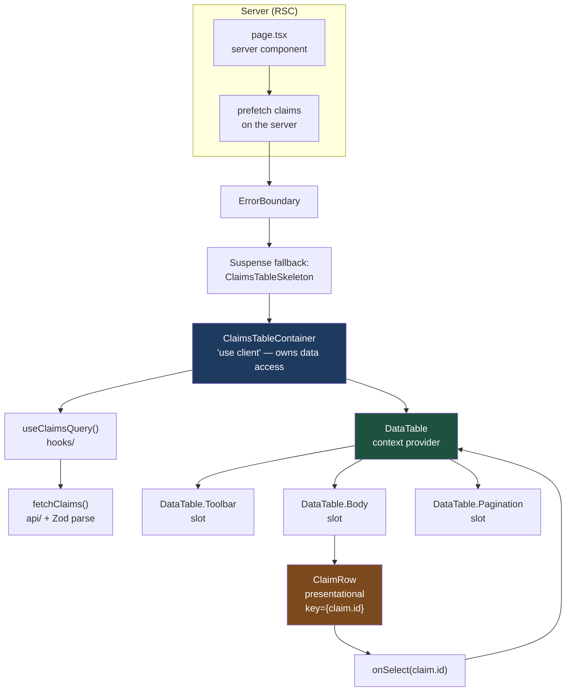

# One Table, Twenty-Three Props: Building a Claims Grid That Survives Its Third Stakeholder

Every enterprise table starts as `<ClaimsTable claims={claims} />` and ends as a component with twenty-three props, six of them booleans that must never be `true` at the same time. This article shows the folder, the boundaries, and the composition that stops that happening.

## The Real-World Problem

**Northbridge Mutual**, a mid-size property insurer, runs a claims triage screen used by roughly 200 adjusters. It shows open claims: reference, policy number, claimant, peril, reserve amount, days open, assigned adjuster, SLA status.

The screen shipped in one quarter as a single `ClaimsTable` component. Then the requests arrived. Legal wanted a read-only variant with the reserve column masked. The subrogation team wanted row selection and a bulk-assign action. The fraud unit wanted an extra "risk score" column and no pagination, because they export everything. Each request was implemented as another prop: `readOnly`, `hideReserve`, `selectable`, `onBulkAssign`, `extraColumns`, `disablePagination`.

Eighteen months in, `ClaimsTable.tsx` was 900 lines, the prop interface had four mutually exclusive combinations that rendered nothing at all, and a change for the fraud unit broke reserve masking for legal — caught in UAT by an auditor, not by a test. Nobody would touch the file without a full regression pass.

The component was not too big. It was **too configured**. Every new requirement widened one interface instead of adding one composition.

## The Concept

This example demonstrates five decisions, all of them structural:

1. **A feature folder with exactly one public surface.** `index.ts` re-exports what the rest of the app may import. Everything else — components, hooks, api, schema — is private by convention and enforced by lint.
2. **Compound components over prop explosion.** `DataTable` owns state via context; `DataTable.Toolbar`, `.Body`, `.Pagination` are slots the *caller* arranges. A variant that needs no pagination simply doesn't render `.Pagination`. No `disablePagination` prop ever exists.
3. **Presentational components take data and callbacks only.** `ClaimRow` receives a `Claim` and an `onSelect`. It does not know that claims come from HTTP, and it can be rendered in a test with a literal object.
4. **The container owns data access.** One component per screen talks to the query layer. Below it, everything is pure.
5. **Boundaries are explicit.** The server component fetches and streams; `'use client'` sits at the leaf that actually needs interactivity, not at the top of the tree. An `ErrorBoundary` and a `Suspense` boundary wrap the data region so a claims-service outage degrades one panel rather than blanking the page.

And one detail that is not stylistic: **`key` must be a stable domain ID.** Using the array index means that when a filter reorders rows, React reuses the wrong DOM node — a checked "escalate" checkbox stays visually checked against a different claim. In an insurance workflow that is a data-integrity bug wearing a rendering costume.

## How It Works



The caller composes the slots. The container is the only place that knows about the network. The leaf is the only place with `'use client'`.

## Practical Example

### Folder layout

```
src/features/claims-triage/
├── api/
│   └── claims.api.ts              # transport only — fetch + Zod parse
├── schema/
│   └── claim.schema.ts            # Zod schemas + inferred types (single source of truth)
├── hooks/
│   ├── useClaimsQuery.ts          # server state
│   └── useRowSelection.ts         # local UI state, reusable
├── components/
│   ├── DataTable.tsx              # compound component + context
│   ├── ClaimRow.tsx               # presentational
│   ├── ClaimsTableContainer.tsx   # 'use client' — owns data access
│   ├── ClaimsTableSkeleton.tsx    # Suspense fallback
│   └── ClaimsErrorBoundary.tsx    # error boundary (react-error-boundary)
├── __tests__/
│   └── ClaimsTableContainer.test.tsx
└── index.ts                       # THE ONLY public surface
```

### `schema/claim.schema.ts`

```ts
import { z } from 'zod'

export const claimStatusSchema = z.enum(['open', 'in_review', 'awaiting_docs', 'settled'])
export type ClaimStatus = z.infer<typeof claimStatusSchema>

export const claimSchema = z.object({
  id: z.string().uuid(),
  reference: z.string().regex(/^CLM-\d{4}-\d{6}$/),
  policyNumber: z.string(),
  claimantName: z.string(),
  peril: z.enum(['fire', 'flood', 'theft', 'storm', 'liability']),
  reserveAmountMinor: z.number().int().nonnegative(),
  currency: z.literal('EUR'),
  openedAt: z.string().datetime(),
  slaBreached: z.boolean(),
  status: claimStatusSchema,
})
export type Claim = z.infer<typeof claimSchema>

export const claimPageSchema = z.object({
  items: z.array(claimSchema),
  page: z.number().int().positive(),
  pageSize: z.number().int().positive(),
  totalItems: z.number().int().nonnegative(),
})
export type ClaimPage = z.infer<typeof claimPageSchema>
```

### `api/claims.api.ts`

```ts
import { claimPageSchema, type ClaimPage } from '../schema/claim.schema'

export class ClaimsApiError extends Error {
  constructor(readonly status: number, message: string) {
    super(message)
    this.name = 'ClaimsApiError'
  }
}

export interface FetchClaimsParams {
  page: number
  pageSize: number
  status?: string
  signal?: AbortSignal
}

export async function fetchClaims({
  page,
  pageSize,
  status,
  signal,
}: FetchClaimsParams): Promise<ClaimPage> {
  const params = new URLSearchParams({ page: String(page), pageSize: String(pageSize) })
  if (status) params.set('status', status)

  const response = await fetch(`/api/claims?${params.toString()}`, {
    headers: { Accept: 'application/json' },
    signal: signal ? AbortSignal.any([signal, AbortSignal.timeout(8_000)]) : AbortSignal.timeout(8_000),
  })

  if (!response.ok) {
    throw new ClaimsApiError(response.status, `Failed to load claims (${response.status})`)
  }
  // Parse, do not cast. A backend that drops `slaBreached` fails here, loudly, not three renders later.
  return claimPageSchema.parse(await response.json())
}
```

### The wrong version — prop explosion

```tsx
// ❌ components/ClaimsTable.tsx — the 900-line file at Northbridge
interface ClaimsTableProps {
  claims: Claim[]
  readOnly?: boolean
  hideReserve?: boolean
  selectable?: boolean
  onBulkAssign?: (ids: string[]) => void
  extraColumns?: Array<{ header: string; render: (c: Claim) => React.ReactNode }>
  disablePagination?: boolean
  page?: number
  pageSize?: number
  onPageChange?: (page: number) => void
  showToolbar?: boolean
  toolbarTitle?: string
  dense?: boolean
  emptyMessage?: string
  // ...and nine more
}

export function ClaimsTable(props: ClaimsTableProps) {
  // Combinatorial branching: selectable && readOnly renders checkboxes that do nothing.
  // disablePagination && onPageChange silently ignores the callback.
  // Nobody can enumerate the valid prop combinations, so nobody can test them.
}
```

What is actually wrong: the props encode **layout decisions the caller already knows**. `showToolbar` exists only because the caller could not put the toolbar there themselves. Each boolean doubles the state space the component must be correct across, and the type system permits every invalid pair.

### The right version — a compound component

```tsx
// components/DataTable.tsx
'use client'

import { createContext, useContext, useMemo, type ReactNode } from 'react'

interface DataTableContextValue<T> {
  rows: readonly T[]
  page: number
  pageSize: number
  totalItems: number
  onPageChange: (page: number) => void
  isFetching: boolean
}

const DataTableContext = createContext<DataTableContextValue<unknown> | null>(null)

function useDataTable<T>(): DataTableContextValue<T> {
  const ctx = useContext(DataTableContext)
  if (!ctx) throw new Error('DataTable.* must be rendered inside <DataTable>')
  return ctx as DataTableContextValue<T>
}

interface DataTableProps<T> {
  rows: readonly T[]
  page: number
  pageSize: number
  totalItems: number
  onPageChange: (page: number) => void
  isFetching?: boolean
  caption: string
  children: ReactNode
}

export function DataTable<T>({
  rows,
  page,
  pageSize,
  totalItems,
  onPageChange,
  isFetching = false,
  caption,
  children,
}: DataTableProps<T>) {
  const value = useMemo<DataTableContextValue<T>>(
    () => ({ rows, page, pageSize, totalItems, onPageChange, isFetching }),
    [rows, page, pageSize, totalItems, onPageChange, isFetching],
  )

  return (
    <DataTableContext.Provider value={value as DataTableContextValue<unknown>}>
      <section aria-label={caption} aria-busy={isFetching} className="flex flex-col gap-3">
        {children}
      </section>
    </DataTableContext.Provider>
  )
}

DataTable.Toolbar = function DataTableToolbar({ children }: { children: ReactNode }) {
  const { totalItems } = useDataTable()
  return (
    <div className="flex items-center justify-between gap-4 border-b border-slate-200 pb-2">
      <p className="text-sm text-slate-600">{totalItems.toLocaleString()} claims</p>
      <div className="flex items-center gap-2">{children}</div>
    </div>
  )
}

interface BodyProps<T> {
  headers: readonly string[]
  getRowKey: (row: T) => string
  renderRow: (row: T) => ReactNode
  emptyState: ReactNode
}

DataTable.Body = function DataTableBody<T>({
  headers,
  getRowKey,
  renderRow,
  emptyState,
}: BodyProps<T>) {
  const { rows } = useDataTable<T>()
  if (rows.length === 0) return <>{emptyState}</>

  return (
    <table className="w-full border-collapse text-sm">
      <thead>
        <tr>
          {headers.map((header) => (
            // Header labels are stable and unique — safe as keys.
            <th key={header} scope="col" className="px-3 py-2 text-left font-medium text-slate-700">
              {header}
            </th>
          ))}
        </tr>
      </thead>
      <tbody>
        {/* Stable domain ID. Never the array index — a re-sort would reuse the wrong row node. */}
        {rows.map((row) => (
          <tr key={getRowKey(row)}>{renderRow(row)}</tr>
        ))}
      </tbody>
    </table>
  )
}

DataTable.Pagination = function DataTablePagination() {
  const { page, pageSize, totalItems, onPageChange, isFetching } = useDataTable()
  const lastPage = Math.max(1, Math.ceil(totalItems / pageSize))

  return (
    <nav aria-label="Pagination" className="flex items-center justify-end gap-2">
      <button
        type="button"
        disabled={page <= 1 || isFetching}
        onClick={() => onPageChange(page - 1)}
        className="rounded border px-3 py-1 disabled:opacity-40"
      >
        Previous
      </button>
      <span className="text-sm text-slate-600" aria-live="polite">
        Page {page} of {lastPage}
      </span>
      <button
        type="button"
        disabled={page >= lastPage || isFetching}
        onClick={() => onPageChange(page + 1)}
        className="rounded border px-3 py-1 disabled:opacity-40"
      >
        Next
      </button>
    </nav>
  )
}
```

`readOnly`, `hideReserve`, `showToolbar` and `disablePagination` are all gone. Legal's variant renders `DataTable.Body` with a different `renderRow`. Fraud's variant omits `DataTable.Pagination`. Neither change touches `DataTable`.

### `components/ClaimRow.tsx` — presentational, data and callbacks only

```tsx
import type { Claim } from '../schema/claim.schema'

const currencyFormat = new Intl.NumberFormat('en-IE', { style: 'currency', currency: 'EUR' })

export interface ClaimRowProps {
  claim: Claim
  isSelected: boolean
  onToggleSelect: (claimId: string) => void
  showReserve: boolean
}

export function ClaimRow({ claim, isSelected, onToggleSelect, showReserve }: ClaimRowProps) {
  return (
    <>
      <td className="px-3 py-2">
        <input
          type="checkbox"
          checked={isSelected}
          onChange={() => onToggleSelect(claim.id)}
          aria-label={`Select claim ${claim.reference}`}
        />
      </td>
      <td className="px-3 py-2 font-mono">{claim.reference}</td>
      <td className="px-3 py-2">{claim.claimantName}</td>
      <td className="px-3 py-2 capitalize">{claim.peril}</td>
      <td className="px-3 py-2 text-right tabular-nums">
        {showReserve ? currencyFormat.format(claim.reserveAmountMinor / 100) : '—'}
      </td>
      <td className="px-3 py-2">
        {claim.slaBreached ? (
          <span className="rounded bg-red-100 px-2 py-0.5 text-red-800">SLA breached</span>
        ) : (
          <span className="text-slate-500">On track</span>
        )}
      </td>
    </>
  )
}
```

No imports from `api/`, no hooks, no context. It can be rendered from a literal `Claim` in a test in one line.

### `hooks/useClaimsQuery.ts` and `hooks/useRowSelection.ts`

```ts
import { useQuery } from '@tanstack/react-query'
import { fetchClaims } from '../api/claims.api'
import type { ClaimPage } from '../schema/claim.schema'

export const claimsKeys = {
  all: ['claims'] as const,
  page: (page: number, pageSize: number, status?: string) =>
    [...claimsKeys.all, 'page', { page, pageSize, status }] as const,
}

export function useClaimsQuery(page: number, pageSize: number, status?: string) {
  return useQuery<ClaimPage>({
    queryKey: claimsKeys.page(page, pageSize, status),
    queryFn: ({ signal }) => fetchClaims({ page, pageSize, status, signal }),
    staleTime: 30_000,
    placeholderData: (previous) => previous, // keeps the previous page visible while fetching
  })
}
```

```ts
import { useCallback, useState } from 'react'

export function useRowSelection() {
  const [selected, setSelected] = useState<ReadonlySet<string>>(() => new Set())

  const toggle = useCallback((id: string) => {
    setSelected((current) => {
      const next = new Set(current)
      if (next.has(id)) next.delete(id)
      else next.add(id)
      return next
    })
  }, [])

  const clear = useCallback(() => setSelected(new Set()), [])

  return { selected, toggle, clear, count: selected.size }
}
```

### `components/ClaimsTableContainer.tsx` — the only component that knows about the network

```tsx
'use client'

import { useState } from 'react'
import { useClaimsQuery } from '../hooks/useClaimsQuery'
import { useRowSelection } from '../hooks/useRowSelection'
import type { Claim } from '../schema/claim.schema'
import { ClaimRow } from './ClaimRow'
import { DataTable } from './DataTable'

const HEADERS = ['', 'Reference', 'Claimant', 'Peril', 'Reserve', 'SLA'] as const

export interface ClaimsTableContainerProps {
  /** Legal's read-only variant passes false. No `readOnly` boolean maze. */
  showReserve?: boolean
  pageSize?: number
}

export function ClaimsTableContainer({ showReserve = true, pageSize = 25 }: ClaimsTableContainerProps) {
  const [page, setPage] = useState(1)
  const { data, isFetching } = useClaimsQuery(page, pageSize)
  const { selected, toggle, clear, count } = useRowSelection()

  // useSuspenseQuery would remove this guard entirely; useQuery + Suspense boundary
  // is shown here so the same container also works outside a Suspense tree.
  if (!data) return null

  return (
    <DataTable<Claim>
      rows={data.items}
      page={data.page}
      pageSize={data.pageSize}
      totalItems={data.totalItems}
      onPageChange={setPage}
      isFetching={isFetching}
      caption="Open claims triage queue"
    >
      <DataTable.Toolbar>
        {count > 0 && (
          <>
            <span className="text-sm">{count} selected</span>
            <button type="button" onClick={clear} className="rounded border px-3 py-1">
              Clear
            </button>
          </>
        )}
      </DataTable.Toolbar>

      <DataTable.Body<Claim>
        headers={HEADERS}
        getRowKey={(claim) => claim.id}
        renderRow={(claim) => (
          <ClaimRow
            claim={claim}
            isSelected={selected.has(claim.id)}
            onToggleSelect={toggle}
            showReserve={showReserve}
          />
        )}
        emptyState={
          <p className="py-8 text-center text-slate-500">No open claims match this filter.</p>
        }
      />

      <DataTable.Pagination />
    </DataTable>
  )
}
```

### Boundaries: error + Suspense, and the skeleton

```tsx
// components/ClaimsErrorBoundary.tsx
'use client'

import { ErrorBoundary, type FallbackProps } from 'react-error-boundary'
import { useQueryErrorResetBoundary } from '@tanstack/react-query'
import type { ReactNode } from 'react'

function ClaimsFallback({ error, resetErrorBoundary }: FallbackProps) {
  return (
    <div role="alert" className="rounded border border-red-300 bg-red-50 p-4">
      <h3 className="font-medium text-red-900">Claims queue unavailable</h3>
      <p className="mt-1 text-sm text-red-800">{error.message}</p>
      <button
        type="button"
        onClick={resetErrorBoundary}
        className="mt-3 rounded bg-red-700 px-3 py-1 text-white"
      >
        Retry
      </button>
    </div>
  )
}

export function ClaimsErrorBoundary({ children }: { children: ReactNode }) {
  const { reset } = useQueryErrorResetBoundary()
  return (
    <ErrorBoundary FallbackComponent={ClaimsFallback} onReset={reset}>
      {children}
    </ErrorBoundary>
  )
}
```

```tsx
// components/ClaimsTableSkeleton.tsx — server-safe, no 'use client' needed
const SKELETON_ROW_IDS = ['s1', 's2', 's3', 's4', 's5', 's6', 's7', 's8'] as const

export function ClaimsTableSkeleton() {
  return (
    <div aria-busy="true" aria-label="Loading claims" className="flex flex-col gap-2">
      {SKELETON_ROW_IDS.map((id) => (
        <div key={id} className="h-9 animate-pulse rounded bg-slate-200" />
      ))}
    </div>
  )
}
```

Note the skeleton keys: even here the key is a stable literal, not an index from `Array.from({ length: 8 })`.

### The server component that composes them

```tsx
// app/(back-office)/claims/page.tsx — server component, no 'use client'
import { Suspense } from 'react'
import {
  ClaimsErrorBoundary,
  ClaimsTableContainer,
  ClaimsTableSkeleton,
} from '@/features/claims-triage'

export default function ClaimsPage() {
  return (
    <main className="mx-auto max-w-6xl p-6">
      <h1 className="mb-4 text-xl font-semibold">Claims triage</h1>
      {/* Error boundary outside, Suspense inside: a claims-service outage
          degrades this panel only — the page header and nav still render. */}
      <ClaimsErrorBoundary>
        <Suspense fallback={<ClaimsTableSkeleton />}>
          <ClaimsTableContainer showReserve pageSize={25} />
        </Suspense>
      </ClaimsErrorBoundary>
    </main>
  )
}
```

### `index.ts` — the only public surface

```ts
// Everything the rest of the app may import from this feature.
export { ClaimsTableContainer } from './components/ClaimsTableContainer'
export { ClaimsErrorBoundary } from './components/ClaimsErrorBoundary'
export { ClaimsTableSkeleton } from './components/ClaimsTableSkeleton'
export { claimsKeys } from './hooks/useClaimsQuery'
export type { Claim, ClaimStatus, ClaimPage } from './schema/claim.schema'
// DataTable, ClaimRow, fetchClaims are deliberately NOT exported.
```

Enforce it, or it decays within a sprint:

```js
// eslint.config.js (excerpt)
export default [
  {
    rules: {
      'no-restricted-imports': ['error', {
        patterns: [{
          group: ['@/features/*/components/*', '@/features/*/api/*', '@/features/*/hooks/*'],
          message: 'Import from the feature index.ts, not its internals.',
        }],
      }],
    },
  },
]
```

### The test

```tsx
// __tests__/ClaimsTableContainer.test.tsx
import { describe, expect, it } from 'vitest'
import { render, screen, within } from '@testing-library/react'
import userEvent from '@testing-library/user-event'
import { QueryClient, QueryClientProvider } from '@tanstack/react-query'
import { http, HttpResponse } from 'msw'
import { setupServer } from 'msw/node'
import { ClaimsTableContainer } from '../components/ClaimsTableContainer'
import type { Claim } from '../schema/claim.schema'

function claim(overrides: Partial<Claim> = {}): Claim {
  return {
    id: '3f1c2b8e-0000-4000-8000-000000000001',
    reference: 'CLM-2026-000481',
    policyNumber: 'POL-9931204',
    claimantName: 'Aoife Brennan',
    peril: 'flood',
    reserveAmountMinor: 1_845_000,
    currency: 'EUR',
    openedAt: '2026-07-14T09:12:00Z',
    slaBreached: true,
    status: 'open',
    ...overrides,
  }
}

const rows: Claim[] = [
  claim(),
  claim({
    id: '3f1c2b8e-0000-4000-8000-000000000002',
    reference: 'CLM-2026-000482',
    claimantName: 'Tomasz Nowak',
    peril: 'fire',
    reserveAmountMinor: 402_500,
    slaBreached: false,
  }),
]

const server = setupServer(
  http.get('/api/claims', () =>
    HttpResponse.json({ items: rows, page: 1, pageSize: 25, totalItems: 2 }),
  ),
)

beforeAll(() => server.listen({ onUnhandledRequest: 'error' }))
afterEach(() => server.resetHandlers())
afterAll(() => server.close())

function renderWithClient(ui: React.ReactElement) {
  const client = new QueryClient({ defaultOptions: { queries: { retry: false } } })
  return render(<QueryClientProvider client={client}>{ui}</QueryClientProvider>)
}

describe('ClaimsTableContainer', () => {
  it('renders one row per claim with formatted reserve and SLA status', async () => {
    renderWithClient(<ClaimsTableContainer />)

    expect(await screen.findByText('CLM-2026-000481')).toBeInTheDocument()
    const table = screen.getByRole('table')
    expect(within(table).getAllByRole('row')).toHaveLength(3) // header + 2 claims
    expect(screen.getByText('€18,450.00')).toBeInTheDocument()
    expect(screen.getByText('SLA breached')).toBeInTheDocument()
  })

  it('masks the reserve column for the legal read-only variant', async () => {
    renderWithClient(<ClaimsTableContainer showReserve={false} />)

    expect(await screen.findByText('CLM-2026-000481')).toBeInTheDocument()
    expect(screen.queryByText('€18,450.00')).not.toBeInTheDocument()
  })

  it('tracks selection against the correct claim by stable id', async () => {
    const user = userEvent.setup()
    renderWithClient(<ClaimsTableContainer />)

    const checkbox = await screen.findByLabelText('Select claim CLM-2026-000482')
    await user.click(checkbox)

    expect(checkbox).toBeChecked()
    expect(screen.getByLabelText('Select claim CLM-2026-000481')).not.toBeChecked()
    expect(screen.getByText('1 selected')).toBeInTheDocument()
  })
})
```

The third test is the one that would have caught the Northbridge bug: it asserts selection is bound to a claim, not to a position.

## Enterprise Trade-offs

| Approach | Pros | Cons | When to use (Banking / Insurance / Enterprise) |
|---|---|---|---|
| **Compound component (context + slots)** | No prop explosion; variants compose instead of configure; each slot testable alone | Context indirection; slots can be misordered; needs a clear invariant error | Default for any table, wizard, or filter panel with more than two stakeholder variants |
| **One component, many boolean props** | Fastest for the first two requirements; single import | Combinatorial state space; invalid combinations are type-legal; regression risk per change | Only for genuinely single-purpose widgets that will not grow — and say so in the PR |
| **Render-prop / `renderRow` callback** | Total layout freedom for the caller; zero coupling to domain fields | Caller repeats structure; easy to drift visually between screens | Column-level customisation (masking, badges) where the shell must stay identical |
| **Third-party grid (TanStack Table, AG Grid)** | Virtualisation, column resize, grouping, CSV export solved | Bundle weight; theming fights the design system; licence review for AG Grid Enterprise | 10k+ rows, pivots, or Excel-grade interaction — not for a 25-row triage queue |
| **Feature folder with `index.ts` barrel, lint-enforced** | Refactor internals freely; dependency direction visible in review | Barrels can hurt tree-shaking if over-broad; needs the lint rule to hold | Any codebase with more than three teams committing — the enforcement is the point |
| **`key={index}`** | — | Reuses DOM nodes across reorders: checkbox and focus state attach to the wrong record | Never in a list that can filter, sort, or paginate. Which is every enterprise list |

→ Next: [tanstack-query-example.md](tanstack-query-example.md) · Related: [../../07-frontend-best-practices/01-react-component-architecture.md](../../07-frontend-best-practices/01-react-component-architecture.md) · [../../01-core-concepts/01-solid-and-separation-of-concerns.md](../../01-core-concepts/01-solid-and-separation-of-concerns.md) · [../../09-ux-ui-guidelines/04-loading-error-empty-states.md](../../09-ux-ui-guidelines/04-loading-error-empty-states.md) · [../nextjs/app-router-project-structure.md](../nextjs/app-router-project-structure.md)
