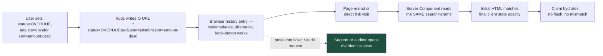

# The URL Is the View: Filterable Tables with nuqs

A support engineer asks a user to "click filter, then set status to overdue, then sort by amount descending" and hopes the screenshot matches. A shareable URL makes that entire conversation unnecessary.

## The Real-World Problem

Sentinel Insurance's claims-handling team filed a complaint that support could never reproduce what they were seeing. A handler would report "the overdue claims list looks wrong" — but "the overdue claims list" meant a specific combination of status filter, adjuster filter, date range, sort order, and page number, all held in `useState`, all invisible outside that one browser tab.

Support's usual fix was a 20-minute screen-share to reconstruct the view by hand. An auditor requesting "the exact list of claims Handler J. Okafor was working from on 14 March" got the same answer: nobody could produce it, because the view existed only in a component's memory for the duration of one session.

The fix is not a new feature. It is moving the same state one layer up, into the URL, where it was always supposed to live.

## The Concept

**Client state** (`useState`) disappears on refresh and cannot be shared. **URL state** survives refresh, is bookmarkable, and can be pasted into a support ticket or an audit request. For any state that answers "what is this screen currently showing", the URL is the correct home — not because it's more elegant, but because it is the only state mechanism that is inherently shareable without you building a "share this view" feature.

**nuqs** makes this practical by giving URL search params the same ergonomics as `useState`: typed values, sensible defaults, no manual `URLSearchParams` parsing.

Design decisions that matter for an enterprise table:

- **Defaults never appear in the URL.** A default sort order shouldn't turn every link into `?sort=createdAt&order=desc&status=all` — only deviations from default are worth encoding.
- **The page resets to 1 whenever a filter changes.** Otherwise a user filtering from page 4 lands on an empty page 4 of a 2-row result set.
- **Free-text search is throttled**, not debounced on every keystroke, so the URL doesn't rewrite on every character and the server isn't re-queried mid-word.
- **The server reads the same params for the initial render.** The client and the server must agree on what the URL means, or the first paint flashes the wrong data before the client "corrects" it.

## How It Works



The property that matters: `C` and `H` produce the same rendered table, because both are just the same URL evaluated twice.

## Practical Example

**Folder layout:**

```
src/
├── app/
│   └── claims/
│       └── page.tsx                    # Server Component — reads searchParams
├── features/
│   └── claims/
│       ├── claims-search-params.ts     # the single parser definition
│       ├── ClaimsFilterBar.tsx         # client — writes to the URL
│       ├── ClaimsTable.tsx             # renders whatever the URL currently says
│       └── claims-search-params.test.ts
```

**1. One parser definition, imported by both client and server — this is what keeps them in agreement.**

```ts
// features/claims/claims-search-params.ts
import {
  parseAsString,
  parseAsInteger,
  parseAsStringLiteral,
  parseAsIsoDate,
  parseAsArrayOf,
  createSearchParamsCache,
  createLoader,
} from 'nuqs/server'

const STATUSES = ['ALL', 'OPEN', 'OVERDUE', 'CLOSED'] as const

export const claimsSearchParams = {
  q: parseAsString.withDefault(''),
  status: parseAsStringLiteral(STATUSES).withDefault('ALL'),
  adjuster: parseAsString.withDefault(''),
  from: parseAsIsoDate,                                    // no default — null means unset
  to: parseAsIsoDate,
  sort: parseAsStringLiteral(['amount', 'openedAt', 'dueDate'] as const).withDefault('dueDate'),
  order: parseAsStringLiteral(['asc', 'desc'] as const).withDefault('asc'),
  page: parseAsInteger.withDefault(1),
  tags: parseAsArrayOf(parseAsString).withDefault([]),
}

// Server-side: read once per request, synchronously, no client round-trip
export const claimsSearchParamsCache = createSearchParamsCache(claimsSearchParams)
export const loadClaimsSearchParams = createLoader(claimsSearchParams)
```

**2. Server Component — the initial render is correct on first paint.**

```tsx
// app/claims/page.tsx
import { claimsSearchParamsCache } from '@/features/claims/claims-search-params'
import { ClaimsFilterBar } from '@/features/claims/ClaimsFilterBar'
import { ClaimsTable } from '@/features/claims/ClaimsTable'
import { fetchClaims } from '@/features/claims/api'

type PageProps = { searchParams: Promise<Record<string, string | string[] | undefined>> }

export default async function ClaimsPage({ searchParams }: PageProps) {
  const params = await claimsSearchParamsCache.parse(searchParams)   // same parser as the client

  const claims = await fetchClaims({
    query: params.q,
    status: params.status,
    adjuster: params.adjuster || undefined,
    dateFrom: params.from ?? undefined,
    dateTo: params.to ?? undefined,
    sort: params.sort,
    order: params.order,
    page: params.page,
    tags: params.tags,
  })

  return (
    <div className="space-y-4">
      <ClaimsFilterBar />
      <ClaimsTable claims={claims} currentPage={params.page} />
    </div>
  )
}
```

**3. Client filter bar — writes to the URL, never to local state that could drift from it.**

```tsx
'use client'

import { useQueryStates } from 'nuqs'
import { useTransition } from 'react'
import { claimsSearchParams } from './claims-search-params'

export function ClaimsFilterBar() {
  const [isPending, startTransition] = useTransition()
  const [params, setParams] = useQueryStates(claimsSearchParams, {
    shallow: false,          // false: a filter change must trigger a server re-fetch
    startTransition,         // pending state while the server re-renders
  })

  return (
    <div className="flex flex-wrap items-center gap-3" aria-busy={isPending}>
      <input
        type="search"
        placeholder="Search claim reference or claimant…"
        defaultValue={params.q}
        onChange={(e) =>
          // Throttled, not on every keystroke — avoids rewriting the URL mid-word
          setParams({ q: e.target.value || null, page: 1 }, { throttleMs: 400 })
        }
        className="rounded border px-3 py-1.5"
      />

      <select
        value={params.status}
        onChange={(e) =>
          setParams({ status: e.target.value as typeof params.status, page: 1 })   // reset page
        }
      >
        <option value="ALL">All statuses</option>
        <option value="OPEN">Open</option>
        <option value="OVERDUE">Overdue</option>
        <option value="CLOSED">Closed</option>
      </select>

      <input
        type="text"
        placeholder="Adjuster username"
        defaultValue={params.adjuster}
        onChange={(e) => setParams({ adjuster: e.target.value || null, page: 1 })}
      />

      <button
        type="button"
        onClick={() => setParams(null)}          // clear everything back to defaults, one call
        className="text-sm underline"
      >
        Reset filters
      </button>
    </div>
  )
}
```

Note `page: 1` accompanies every filter change — the rule from "The Concept" enforced at every call site that changes a filter, not left to chance.

**4. Sortable column header — a second, independent `useQueryStates` slice for sort state.**

```tsx
'use client'

import { useQueryStates } from 'nuqs'
import { claimsSearchParams } from './claims-search-params'

function SortableHeader({ field, label }: { field: 'amount' | 'openedAt' | 'dueDate'; label: string }) {
  const [{ sort, order }, setSort] = useQueryStates(
    { sort: claimsSearchParams.sort, order: claimsSearchParams.order },
    { shallow: false },
  )

  const isActive = sort === field
  const nextOrder = isActive && order === 'asc' ? 'desc' : 'asc'

  return (
    <th>
      <button
        onClick={() => setSort({ sort: field, order: nextOrder })}
        aria-sort={isActive ? (order === 'asc' ? 'ascending' : 'descending') : 'none'}
      >
        {label} {isActive && (order === 'asc' ? '↑' : '↓')}
      </button>
    </th>
  )
}
```

**5. The test that proves shareability — the URL round-trips the view, which is the entire point.**

```tsx
// features/claims/claims-search-params.test.ts
import { describe, it, expect } from 'vitest'
import { loadClaimsSearchParams } from './claims-search-params'

describe('claims URL state', () => {
  it('round-trips a filtered, sorted, paginated view exactly', async () => {
    const url = new URLSearchParams({
      status: 'OVERDUE',
      adjuster: 'jokafor',
      sort: 'amount',
      order: 'desc',
      page: '3',
    })

    const parsed = await loadClaimsSearchParams(url)

    // This is what a support engineer or auditor reconstructs by opening the URL —
    // no screen-share, no "can you click filter again" required.
    expect(parsed).toMatchObject({
      status: 'OVERDUE',
      adjuster: 'jokafor',
      sort: 'amount',
      order: 'desc',
      page: 3,
    })
  })

  it('omits default values so a plain visit produces a clean URL', async () => {
    const parsed = await loadClaimsSearchParams(new URLSearchParams())
    expect(parsed.status).toBe('ALL')      // default applied, but never written to the URL by nuqs
    expect(parsed.page).toBe(1)
  })
})
```

## Enterprise Trade-offs

| Approach | Pros | Cons | When to use (Banking / Insurance / Enterprise) |
|---|---|---|---|
| **URL state via nuqs, read identically on client and server** | Shareable, bookmarkable, survives refresh, auditable | Every param needs a parser; slightly more upfront wiring than `useState` | Default for any filter, sort, or pagination state on a list/search view |
| **Client-only state (`useState`)** | Simplest to write initially | Invisible to support and audit; lost on refresh; the complaint in the scenario above | Acceptable only for state nobody would ever need to reference outside the current interaction (a hover tooltip, an open/closed dropdown) |
| **Server-side "saved views" feature** | Persists beyond a single URL; can be named and reused | A feature you have to design, build, and maintain | Complementary, not a substitute — build it as "save this URL under a name" once URL state already exists |
| **Redux/Zustand for filter state** | Works, and is familiar to teams already using it | Duplicates what the URL already provides for free, and still isn't shareable without extra work | Only if the filter state must also drive behaviour with no URL representation at all (rare) |
| **`shallow: true` on a filter that must hit the server** | Faster perceived interaction — no navigation | Server-rendered content silently goes stale relative to the URL | Never for filters that change the dataset; fine for purely client-side UI toggles |

## Why This Still Matters Through 2030

URL-encoded state is one of the few frontend patterns that gets more valuable as regulatory and support expectations rise, rather than obsolete as frameworks change — a bookmarkable, precisely reproducible view is exactly the artifact an auditor or a support engineer needs, and it costs nothing extra to produce once state lives in the URL by default. The React ecosystem has also converged on treating the URL as first-class state rather than an afterthought bolted on with `URLSearchParams`, which is what makes a library like nuqs a thin, typed layer over a platform primitive instead of a framework-specific abstraction that will need replacing. The one discipline this pattern demands — keeping the client parser and the server parser identical — is exactly the kind of small, mechanical constraint that ages well: it doesn't get harder to satisfy as an application grows, it just needs one shared definition instead of two.

→ This is the final React example. Related: [../nextjs/orval-generated-client-example.md](../nextjs/orval-generated-client-example.md) · [../../07-frontend-best-practices/07-url-state-management-with-nuqs.md](../../07-frontend-best-practices/07-url-state-management-with-nuqs.md) · [tanstack-query-example.md](tanstack-query-example.md)
