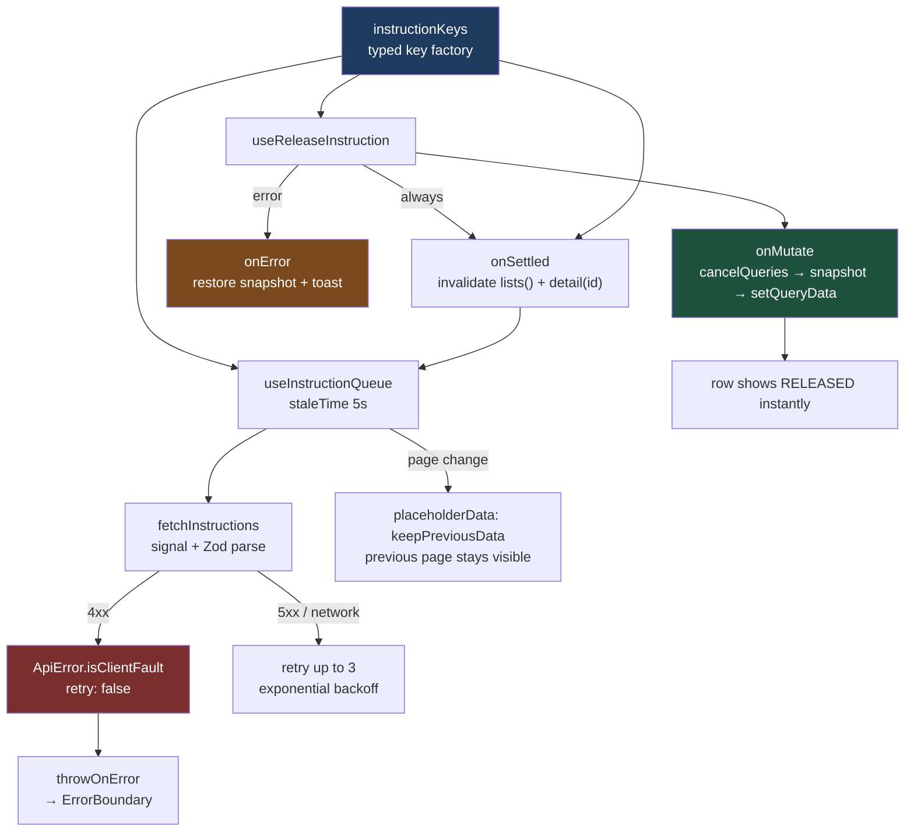

# The Dashboard That Stopped Lying: TanStack Query v5 With a Key Factory, Optimistic Rollback, and No Blanket Invalidation

`useEffect` + `fetch` looks like eight lines of honest code. It is actually a cache with no eviction policy, a race condition, and a memory leak wearing a trench coat. Here is the same screen written properly, and an exact list of what the eight-line version gets wrong.

## The Real-World Problem

**Ardmore Capital** runs a treasury operations dashboard. Around 60 operators watch a payment-instruction queue: instructions arriving from correspondent banks, each needing release, hold, or return before a cut-off. Volumes spike near cut-off; a stale queue means an operator releases something that was already released by a colleague.

The original screen was `useEffect` + `fetch` per panel. Four distinct incidents came out of it.

Two operators opened the queue and released the same instruction — the second saw a cached-in-component list from ninety seconds earlier and had no way to know. Typing in the search box fired one request per keystroke, and responses arrived out of order, so the visible rows sometimes matched a prefix of what was typed. A 403 from an expired session was retried in a loop, which tripped the gateway's rate limiter and locked the operator out for fifteen minutes. And paging from page 2 to page 3 blanked the table to a spinner and collapsed the layout, so the operator's mouse landed on a different row than the one they aimed at.

None of these is a data-fetching problem in the naive sense. They are all *cache-policy* problems, and the naive version has no cache policy at all.

## The Concept

Seven decisions, each visible in the code below.

1. **A query-key factory as a typed contract.** Keys are constructed in exactly one module. Nothing anywhere else writes an array literal starting with `'instructions'`. That makes targeted invalidation possible, because you can name the subtree you mean.
2. **Fetchers validate with Zod.** The generic parameter of `useQuery` is a promise from the developer; `schema.parse` is a fact from the server.
3. **`staleTime` and `gcTime` chosen per data type.** Reference data can be stale for an hour. A payment queue can be stale for five seconds. Picking one number for the whole app is how you get both a slow dashboard and a wrong one.
4. **`placeholderData: keepPreviousData` for pagination.** The previous page stays on screen while the next one loads, so the table never collapses.
5. **Optimistic update with a real rollback.** `onMutate` cancels in-flight refetches, snapshots the cache, and writes the expected state. `onError` restores the snapshot. `onSettled` invalidates so the server has the last word.
6. **Targeted invalidation only.** `invalidateQueries({ queryKey: instructionKeys.lists() })` — never bare `invalidateQueries()`, which on this dashboard refetches nine panels to update one row.
7. **A retry policy that never retries a 4xx**, and `throwOnError` so unexpected failures reach an error boundary instead of being open-coded into every component.

## How It Works



## Practical Example

### Folder layout

```
src/features/payment-instructions/
├── model/
│   └── instruction.schema.ts        # Zod + inferred types
├── api/
│   ├── instructions.api.ts          # transport + parse, no React
│   └── errors.ts                    # ApiError
├── query/
│   ├── keys.ts                      # the ONLY place keys are constructed
│   ├── useInstructionQueue.ts
│   ├── useInstructionDetail.ts
│   └── useReleaseInstruction.ts     # optimistic + rollback
├── components/
│   ├── InstructionQueue.tsx         # 'use client'
│   └── QueueErrorBoundary.tsx
├── __tests__/
│   └── InstructionQueue.test.tsx
└── index.ts
```

### The wrong version — and exactly what it gets wrong

```tsx
// ❌ components/InstructionQueue.tsx — the original Ardmore panel
import { useEffect, useState } from 'react'

export function InstructionQueue({ search, page }: { search: string; page: number }) {
  const [rows, setRows] = useState<Instruction[]>([])
  const [loading, setLoading] = useState(true)
  const [error, setError] = useState<string | null>(null)

  useEffect(() => {
    setLoading(true)
    fetch(`/api/instructions?search=${search}&page=${page}`)
      .then((r) => r.json())
      .then((data) => {
        setRows(data.items)
        setLoading(false)
      })
      .catch((e) => {
        setError(String(e))
        setLoading(false)
      })
  }, [search, page])

  if (loading) return <Spinner />
  if (error) return <p>{error}</p>
  return <Table rows={rows} />
}
```

What it gets wrong, precisely:

1. **No request cancellation.** No `AbortSignal`, so keystroke 3's response can land after keystroke 5's. `setRows` writes whichever finishes last. This is the out-of-order bug that made the table show a prefix of the query.
2. **No deduplication.** Two panels needing the same list issue two requests. Ten mounted components, ten requests.
3. **`r.json()` is unchecked.** `data.items` is `any`. When the envelope changed from `items` to `data`, `rows` became `undefined` and `Table` crashed — at render time, far from the cause.
4. **`!response.ok` is never checked.** A `403` with a JSON body resolves successfully, so an expired session renders an empty table instead of an auth error.
5. **No cache, so every mount refetches.** Navigating away and back is a full round trip and a spinner every time.
6. **No stale/fresh distinction.** The data is either absent or trusted forever within the component's life. There is no concept of "show this while I check".
7. **`loading` blanks the whole table on every page change.** This is the layout collapse. `placeholderData` exists precisely for this.
8. **Setting state after unmount.** No cleanup, so a fast navigation writes to a dead component.
9. **No retry policy at all — or, once someone adds one, no distinction between 4xx and 5xx.** The version that "fixed" the flakiness retried the 403 and got the operator rate-limited.
10. **No shared invalidation.** After a release mutation, this panel has no way to be told. The original fix was a `window.location.reload()`.
11. **No background refresh.** Nothing refetches on window focus, so a queue left open at lunch is an hour stale and looks current.
12. **Error handling is duplicated in every panel** with slightly different wording, and none of it reaches an error boundary or the monitoring tool.

Every item on that list is a default in the version below.

### `model/instruction.schema.ts`

```ts
import { z } from 'zod'

export const instructionStatusSchema = z.enum([
  'PENDING',
  'ON_HOLD',
  'RELEASED',
  'RETURNED',
])
export type InstructionStatus = z.infer<typeof instructionStatusSchema>

export const instructionSchema = z.object({
  id: z.string().uuid(),
  reference: z.string().regex(/^PI-\d{4}-\d{7}$/),
  counterparty: z.string(),
  amountMinor: z.number().int().nonnegative(),
  currency: z.enum(['EUR', 'USD', 'GBP']),
  valueDate: z.string().date(),
  status: instructionStatusSchema,
  cutOffAt: z.string().datetime(),
  version: z.number().int().nonnegative(), // optimistic-concurrency token
})
export type Instruction = z.infer<typeof instructionSchema>

export const instructionPageSchema = z.object({
  items: z.array(instructionSchema),
  page: z.number().int().positive(),
  pageSize: z.number().int().positive(),
  totalItems: z.number().int().nonnegative(),
})
export type InstructionPage = z.infer<typeof instructionPageSchema>
```

### `api/errors.ts`

```ts
export class ApiError extends Error {
  constructor(
    readonly status: number,
    message: string,
    readonly detail?: string,
  ) {
    super(message)
    this.name = 'ApiError'
  }

  /** 4xx means the request was wrong. Retrying an identical wrong request is waste. */
  get isClientFault(): boolean {
    return this.status >= 400 && this.status < 500
  }
}

export async function toApiError(response: Response): Promise<ApiError> {
  const body = (await response.json().catch(() => null)) as
    | { title?: string; detail?: string }
    | null
  return new ApiError(
    response.status,
    body?.title ?? `Request failed with ${response.status}`,
    body?.detail,
  )
}
```

### `api/instructions.api.ts`

```ts
import { toApiError } from './errors'
import {
  instructionPageSchema,
  instructionSchema,
  type Instruction,
  type InstructionPage,
} from '../model/instruction.schema'

export interface QueueFilters {
  readonly search: string
  readonly status: 'PENDING' | 'ON_HOLD' | 'ALL'
  readonly page: number
  readonly pageSize: number
}

export async function fetchInstructions(
  filters: QueueFilters,
  signal?: AbortSignal,
): Promise<InstructionPage> {
  const params = new URLSearchParams({
    status: filters.status,
    page: String(filters.page),
    pageSize: String(filters.pageSize),
  })
  if (filters.search) params.set('search', filters.search)

  const response = await fetch(`/api/instructions?${params.toString()}`, {
    headers: { accept: 'application/json' },
    // TanStack Query supplies the signal; the timeout is ours. Both must abort the request.
    signal: signal
      ? AbortSignal.any([signal, AbortSignal.timeout(10_000)])
      : AbortSignal.timeout(10_000),
    cache: 'no-store', // live money data: never served from the HTTP cache
  })

  if (!response.ok) throw await toApiError(response)
  // Parse, do not cast. A renamed envelope fails here with a readable path.
  return instructionPageSchema.parse(await response.json())
}

export async function fetchInstruction(
  id: string,
  signal?: AbortSignal,
): Promise<Instruction> {
  const response = await fetch(`/api/instructions/${id}`, {
    headers: { accept: 'application/json' },
    signal,
    cache: 'no-store',
  })
  if (!response.ok) throw await toApiError(response)
  return instructionSchema.parse(await response.json())
}

export interface ReleaseInstructionInput {
  readonly id: string
  /** Sent back so the server can reject a stale release. */
  readonly version: number
}

export async function releaseInstruction({
  id,
  version,
}: ReleaseInstructionInput): Promise<Instruction> {
  const response = await fetch(`/api/instructions/${id}/release`, {
    method: 'POST',
    headers: { 'content-type': 'application/json', accept: 'application/json' },
    body: JSON.stringify({ version }),
    signal: AbortSignal.timeout(15_000),
    cache: 'no-store',
  })
  if (!response.ok) throw await toApiError(response)
  return instructionSchema.parse(await response.json())
}
```

### `query/keys.ts` — the contract

```ts
import type { QueueFilters } from '../api/instructions.api'

/**
 * Every key in this feature is built here. Hierarchy is deliberate:
 * ['instructions'] > ['instructions','list'] > ['instructions','list',filters]
 * so invalidating `lists()` hits every filter combination and nothing else.
 */
export const instructionKeys = {
  all: ['instructions'] as const,

  lists: () => [...instructionKeys.all, 'list'] as const,
  list: (filters: QueueFilters) => [...instructionKeys.lists(), filters] as const,

  details: () => [...instructionKeys.all, 'detail'] as const,
  detail: (id: string) => [...instructionKeys.details(), id] as const,

  cutOffs: () => [...instructionKeys.all, 'cut-offs'] as const,
} as const

export type InstructionListKey = ReturnType<typeof instructionKeys.list>
export type InstructionDetailKey = ReturnType<typeof instructionKeys.detail>
```

### `query/useInstructionQueue.ts` — deliberate cache policy

```ts
import { keepPreviousData, useQuery } from '@tanstack/react-query'
import { ApiError } from '../api/errors'
import { fetchInstructions, type QueueFilters } from '../api/instructions.api'
import type { InstructionPage } from '../model/instruction.schema'
import { instructionKeys } from './keys'

/** Shared retry rule: a 4xx is never retried, a 5xx or network fault is. */
export function retryUnlessClientFault(failureCount: number, error: unknown): boolean {
  if (error instanceof ApiError && error.isClientFault) return false
  return failureCount < 3
}

export function useInstructionQueue(filters: QueueFilters) {
  return useQuery<InstructionPage, ApiError>({
    queryKey: instructionKeys.list(filters),
    queryFn: ({ signal }) => fetchInstructions(filters, signal),

    // Money in flight near a cut-off. Five seconds of staleness is the tolerance
    // operations agreed to; anything longer and two operators can double-release.
    staleTime: 5_000,
    // Keep an unused page around for two minutes so paging back is instant.
    gcTime: 2 * 60_000,

    refetchOnWindowFocus: true,
    refetchOnReconnect: true,
    // A queue left open must not silently rot. Backgrounded tabs are exempt.
    refetchInterval: 15_000,
    refetchIntervalInBackground: false,

    // The previous page stays rendered while the next loads: no spinner, no layout collapse.
    placeholderData: keepPreviousData,

    retry: retryUnlessClientFault,
    retryDelay: (attempt) => Math.min(1_000 * 2 ** attempt, 8_000),

    // Unexpected failures go to the error boundary. Expected ones (401) are handled by
    // the auth layer, so they are not re-thrown into the UI tree.
    throwOnError: (error) => !(error instanceof ApiError && error.status === 401),
  })
}

/**
 * Reference data with a completely different policy — same library, different numbers.
 * Cut-off times change at most once a day.
 */
export function useCutOffTimes() {
  return useQuery({
    queryKey: instructionKeys.cutOffs(),
    queryFn: async ({ signal }) => {
      const response = await fetch('/api/instructions/cut-offs', { signal })
      if (!response.ok) throw new Error('cut_offs_unavailable')
      return (await response.json()) as Record<string, string>
    },
    staleTime: 60 * 60_000,
    gcTime: 24 * 60 * 60_000,
    refetchOnWindowFocus: false,
    refetchInterval: false,
  })
}
```

### `query/useInstructionDetail.ts`

```ts
import { useQuery } from '@tanstack/react-query'
import type { ApiError } from '../api/errors'
import { fetchInstruction } from '../api/instructions.api'
import type { Instruction } from '../model/instruction.schema'
import { instructionKeys } from './keys'
import { retryUnlessClientFault } from './useInstructionQueue'

export function useInstructionDetail(id: string | null) {
  return useQuery<Instruction, ApiError>({
    queryKey: instructionKeys.detail(id ?? 'none'),
    queryFn: ({ signal }) => fetchInstruction(id as string, signal),
    enabled: id !== null,
    staleTime: 5_000,
    retry: retryUnlessClientFault,
  })
}
```

### `query/useReleaseInstruction.ts` — optimistic update with rollback

```ts
import { useMutation, useQueryClient } from '@tanstack/react-query'
import type { ApiError } from '../api/errors'
import { releaseInstruction, type ReleaseInstructionInput } from '../api/instructions.api'
import type { Instruction, InstructionPage } from '../model/instruction.schema'
import { instructionKeys } from './keys'

interface ReleaseContext {
  /** Every list page we touched, so rollback restores all of them. */
  readonly snapshots: ReadonlyArray<readonly [readonly unknown[], InstructionPage | undefined]>
  readonly detailSnapshot: Instruction | undefined
}

export function useReleaseInstruction() {
  const queryClient = useQueryClient()

  return useMutation<Instruction, ApiError, ReleaseInstructionInput, ReleaseContext>({
    mutationFn: releaseInstruction,
    retry: false, // releasing money is not idempotent from the UI's point of view

    onMutate: async ({ id }) => {
      // 1. Stop in-flight list refetches, or one could land after our optimistic write
      //    and overwrite it with pre-release data.
      await queryClient.cancelQueries({ queryKey: instructionKeys.lists() })

      // 2. Snapshot everything we are about to change.
      const snapshots = queryClient.getQueriesData<InstructionPage>({
        queryKey: instructionKeys.lists(),
      })
      const detailSnapshot = queryClient.getQueryData<Instruction>(instructionKeys.detail(id))

      // 3. Write the expected state into every cached page that contains this row.
      for (const [key] of snapshots) {
        queryClient.setQueryData<InstructionPage>(key, (page) =>
          page
            ? {
                ...page,
                items: page.items.map((item) =>
                  item.id === id ? { ...item, status: 'RELEASED' as const } : item,
                ),
              }
            : page,
        )
      }
      queryClient.setQueryData<Instruction>(instructionKeys.detail(id), (detail) =>
        detail ? { ...detail, status: 'RELEASED' } : detail,
      )

      return { snapshots, detailSnapshot }
    },

    onError: (_error, { id }, context) => {
      // Restore exactly what was there. Not a refetch — the operator must see their
      // row snap back so it is obvious the release did not happen.
      for (const [key, page] of context?.snapshots ?? []) {
        queryClient.setQueryData(key, page)
      }
      if (context?.detailSnapshot) {
        queryClient.setQueryData(instructionKeys.detail(id), context.detailSnapshot)
      }
    },

    onSettled: (_data, _error, { id }) => {
      // Success or failure, the server has the last word — but only for these two subtrees.
      // NOT queryClient.invalidateQueries(): that would refetch nine unrelated panels.
      void queryClient.invalidateQueries({ queryKey: instructionKeys.lists() })
      void queryClient.invalidateQueries({ queryKey: instructionKeys.detail(id) })
    },
  })
}
```

### `components/InstructionQueue.tsx`

```tsx
'use client'

import { useState } from 'react'
import { ApiError } from '../api/errors'
import type { QueueFilters } from '../api/instructions.api'
import { useInstructionQueue } from '../query/useInstructionQueue'
import { useReleaseInstruction } from '../query/useReleaseInstruction'

const money = (minor: number, currency: string) =>
  new Intl.NumberFormat('en-IE', { style: 'currency', currency }).format(minor / 100)

export function InstructionQueue({ search }: { search: string }) {
  const [page, setPage] = useState(1)
  const filters: QueueFilters = { search, status: 'PENDING', page, pageSize: 25 }

  const { data, isPending, isPlaceholderData, isFetching, error } = useInstructionQueue(filters)
  const release = useReleaseInstruction()
  const [notice, setNotice] = useState<string | null>(null)

  if (isPending) {
    return (
      <p role="status" className="p-6 text-slate-600">
        Loading payment instructions…
      </p>
    )
  }

  if (error?.status === 401) {
    return (
      <p role="alert" className="p-6 text-amber-800">
        Your session expired. Sign in again to continue — nothing was released.
      </p>
    )
  }

  const lastPage = Math.max(1, Math.ceil(data.totalItems / data.pageSize))

  return (
    <section aria-busy={isFetching} className="flex flex-col gap-3">
      <div aria-live="polite" className="min-h-6 text-sm text-red-700">
        {notice}
      </div>

      {/* Dim, do not blank. The rows stay in place and stay clickable-adjacent. */}
      <table
        className={`w-full border-collapse text-sm ${isPlaceholderData ? 'opacity-60' : ''}`}
      >
        <caption className="sr-only">Payment instructions pending release</caption>
        <thead>
          <tr>
            {['Reference', 'Counterparty', 'Amount', 'Value date', 'Status', ''].map((h) => (
              <th key={h} scope="col" className="px-3 py-2 text-left font-medium">
                {h}
              </th>
            ))}
          </tr>
        </thead>
        <tbody>
          {data.items.map((instruction) => (
            <tr key={instruction.id}>
              <td className="px-3 py-2 font-mono">{instruction.reference}</td>
              <td className="px-3 py-2">{instruction.counterparty}</td>
              <td className="px-3 py-2 text-right tabular-nums">
                {money(instruction.amountMinor, instruction.currency)}
              </td>
              <td className="px-3 py-2">{instruction.valueDate}</td>
              <td className="px-3 py-2">{instruction.status}</td>
              <td className="px-3 py-2">
                {instruction.status === 'PENDING' && (
                  <button
                    type="button"
                    disabled={release.isPending}
                    onClick={() => {
                      setNotice(null)
                      release.mutate(
                        { id: instruction.id, version: instruction.version },
                        {
                          onError: (mutationError) =>
                            setNotice(
                              mutationError instanceof ApiError && mutationError.status === 409
                                ? `${instruction.reference} was already actioned by another operator.`
                                : `Could not release ${instruction.reference}. It is unchanged.`,
                            ),
                        },
                      )
                    }}
                    className="rounded bg-emerald-700 px-3 py-1 text-white disabled:opacity-50"
                  >
                    Release
                  </button>
                )}
              </td>
            </tr>
          ))}
        </tbody>
      </table>

      <nav aria-label="Pagination" className="flex items-center justify-end gap-2">
        <button
          type="button"
          disabled={page <= 1}
          onClick={() => setPage((p) => p - 1)}
          className="rounded border px-3 py-1 disabled:opacity-40"
        >
          Previous
        </button>
        <span className="text-sm tabular-nums" aria-live="polite">
          Page {data.page} of {lastPage}
        </span>
        <button
          type="button"
          // isPlaceholderData means the next page is still loading — don't queue another jump.
          disabled={page >= lastPage || isPlaceholderData}
          onClick={() => setPage((p) => p + 1)}
          className="rounded border px-3 py-1 disabled:opacity-40"
        >
          Next
        </button>
      </nav>
    </section>
  )
}
```

### App-level defaults and the error boundary

```tsx
// app/providers.tsx
'use client'

import { useState, type ReactNode } from 'react'
import { QueryClient, QueryClientProvider } from '@tanstack/react-query'
import { ApiError } from '@/features/payment-instructions/api/errors'

export function Providers({ children }: { children: ReactNode }) {
  // One client per browser session, created in state so it survives re-render
  // but is never shared between server requests.
  const [queryClient] = useState(
    () =>
      new QueryClient({
        defaultOptions: {
          queries: {
            staleTime: 30_000, // conservative default; every feature states its own
            gcTime: 5 * 60_000,
            retry: (count, error) =>
              !(error instanceof ApiError && error.isClientFault) && count < 3,
            refetchOnWindowFocus: true,
          },
          mutations: { retry: false },
        },
      }),
  )

  return <QueryClientProvider client={queryClient}>{children}</QueryClientProvider>
}
```

```tsx
// components/QueueErrorBoundary.tsx
'use client'

import { ErrorBoundary, type FallbackProps } from 'react-error-boundary'
import { useQueryErrorResetBoundary } from '@tanstack/react-query'
import type { ReactNode } from 'react'

function Fallback({ error, resetErrorBoundary }: FallbackProps) {
  return (
    <div role="alert" className="rounded border border-red-300 bg-red-50 p-4">
      <h2 className="font-medium text-red-900">Instruction queue unavailable</h2>
      <p className="mt-1 text-sm text-red-800">{error.message}</p>
      <button
        type="button"
        onClick={resetErrorBoundary}
        className="mt-3 rounded bg-red-700 px-3 py-1 text-white"
      >
        Try again
      </button>
    </div>
  )
}

export function QueueErrorBoundary({ children }: { children: ReactNode }) {
  const { reset } = useQueryErrorResetBoundary()
  return (
    <ErrorBoundary FallbackComponent={Fallback} onReset={reset}>
      {children}
    </ErrorBoundary>
  )
}
```

### `__tests__/InstructionQueue.test.tsx`

```tsx
import { describe, expect, it, beforeAll, afterEach, afterAll } from 'vitest'
import { render, screen, waitFor } from '@testing-library/react'
import userEvent from '@testing-library/user-event'
import { QueryClient, QueryClientProvider } from '@tanstack/react-query'
import { http, HttpResponse } from 'msw'
import { setupServer } from 'msw/node'
import type { ReactElement } from 'react'
import { InstructionQueue } from '../components/InstructionQueue'
import type { Instruction } from '../model/instruction.schema'

function instruction(overrides: Partial<Instruction> = {}): Instruction {
  return {
    id: 'c4e91f20-0000-4000-8000-000000000001',
    reference: 'PI-2026-0004417',
    counterparty: 'Banque Fédérale Nord',
    amountMinor: 1_450_000,
    currency: 'EUR',
    valueDate: '2026-08-11',
    status: 'PENDING',
    cutOffAt: '2026-08-11T14:00:00Z',
    version: 3,
    ...overrides,
  }
}

const rows = [
  instruction(),
  instruction({
    id: 'c4e91f20-0000-4000-8000-000000000002',
    reference: 'PI-2026-0004418',
    counterparty: 'Nordic Clearing AB',
    amountMinor: 89_500,
  }),
]

const server = setupServer(
  http.get('/api/instructions', () =>
    HttpResponse.json({ items: rows, page: 1, pageSize: 25, totalItems: 2 }),
  ),
)

beforeAll(() => server.listen({ onUnhandledRequest: 'error' }))
afterEach(() => server.resetHandlers())
afterAll(() => server.close())

/** A fresh client per test: no cache leaks between tests, retries off so failures are immediate. */
function renderWithClient(ui: ReactElement) {
  const client = new QueryClient({
    defaultOptions: {
      queries: { retry: false, gcTime: Infinity, refetchInterval: false },
      mutations: { retry: false },
    },
  })
  return { client, ...render(<QueryClientProvider client={client}>{ui}</QueryClientProvider>) }
}

describe('InstructionQueue', () => {
  it('renders the validated page', async () => {
    renderWithClient(<InstructionQueue search="" />)

    expect(await screen.findByText('PI-2026-0004417')).toBeInTheDocument()
    expect(screen.getByText('€14,500.00')).toBeInTheDocument()
    expect(screen.getByText('Page 1 of 1')).toBeInTheDocument()
  })

  it('shows the release optimistically before the server responds', async () => {
    let resolveRelease: (() => void) | undefined
    server.use(
      http.post('/api/instructions/:id/release', async () => {
        await new Promise<void>((resolve) => {
          resolveRelease = resolve
        })
        return HttpResponse.json({ ...rows[0], status: 'RELEASED', version: 4 })
      }),
    )

    const user = userEvent.setup()
    renderWithClient(<InstructionQueue search="" />)

    await user.click((await screen.findAllByRole('button', { name: 'Release' }))[0])

    // The row already reads RELEASED while the request is still open.
    await waitFor(() => expect(screen.getByText('RELEASED')).toBeInTheDocument())

    resolveRelease?.()
  })

  it('rolls back to PENDING when the release is rejected as stale', async () => {
    server.use(
      http.post('/api/instructions/:id/release', () =>
        HttpResponse.json({ title: 'Conflict', status: 409 }, { status: 409 }),
      ),
    )

    const user = userEvent.setup()
    renderWithClient(<InstructionQueue search="" />)

    await user.click((await screen.findAllByRole('button', { name: 'Release' }))[0])

    expect(
      await screen.findByText(/PI-2026-0004417 was already actioned by another operator/),
    ).toBeInTheDocument()
    // Snapshot restored: two PENDING rows, no RELEASED row.
    await waitFor(() => expect(screen.getAllByText('PENDING')).toHaveLength(2))
    expect(screen.queryByText('RELEASED')).not.toBeInTheDocument()
  })

  it('does not retry a 403 and surfaces it through the boundary path', async () => {
    let calls = 0
    server.use(
      http.get('/api/instructions', () => {
        calls += 1
        return HttpResponse.json({ title: 'Forbidden', status: 403 }, { status: 403 })
      }),
    )

    const client = new QueryClient({
      defaultOptions: { queries: { gcTime: Infinity, refetchInterval: false } },
    })
    render(
      <QueryClientProvider client={client}>
        <InstructionQueue search="" />
      </QueryClientProvider>,
    )

    await waitFor(() => expect(calls).toBeGreaterThan(0))
    // The feature's retry rule short-circuits on 4xx, so exactly one call is made.
    await waitFor(() => expect(calls).toBe(1))
  })

  it('invalidates only the instruction subtrees after a release', async () => {
    server.use(
      http.post('/api/instructions/:id/release', () =>
        HttpResponse.json({ ...rows[0], status: 'RELEASED', version: 4 }),
      ),
    )

    const user = userEvent.setup()
    const { client } = renderWithClient(<InstructionQueue search="" />)

    // A sibling panel's cache entry that must survive the mutation.
    client.setQueryData(['fx-rates'], { EURUSD: 1.09 })

    await user.click((await screen.findAllByRole('button', { name: 'Release' }))[0])

    await waitFor(() => expect(screen.getByText('RELEASED')).toBeInTheDocument())
    expect(client.getQueryState(['fx-rates'])?.isInvalidated).toBe(false)
  })
})
```

## Enterprise Trade-offs

| Approach | Pros | Cons | When to use (Banking / Insurance / Enterprise) |
|---|---|---|---|
| **TanStack Query with per-feature `staleTime`/`gcTime`** | Dedup, cancellation, background refresh, focus refetch, and retry policy are defaults; cache policy is reviewable in one place | A real API surface to learn; wrong `staleTime` shows stale money data | Default for all server state in any operational dashboard |
| **`useEffect` + `fetch` + manual state** | No dependency; obvious to a newcomer | The twelve defects enumerated above, each rediscovered per panel | A single fire-and-forget call on a throwaway page. Not in a product |
| **Optimistic update + rollback** | Sub-100ms perceived latency on the action operators repeat all day | Two code paths to reason about; a wrong optimistic shape shows a state that never existed | High-frequency actions on a screen the same person uses for hours — release, assign, acknowledge |
| **Wait-for-server (no optimism)** | One source of truth; impossible to show a fictional state | Every click costs a round trip; feels slow at cut-off when the API is loaded | Irreversible or high-value operations where a momentary lie is unacceptable — a wire above a threshold, a policy cancellation |
| **Targeted invalidation via a key factory** | Refetches exactly the affected subtrees; predictable network cost per action | Requires the discipline that keys are never written inline | Always. The factory is what makes this possible at all |
| **Blanket `invalidateQueries()`** | One line, always "correct" | Refetches every mounted query; on a nine-panel dashboard one release becomes nine requests | Never in a dashboard. Acceptable only after sign-out, where you should `clear()` instead |
| **Polling every 15s vs. WebSocket/SSE push** | Trivial to operate; survives proxies and corporate networks | Wasted requests when nothing changes; up to 15s of staleness | Poll until measured load or a regulatory latency requirement justifies a push channel, then push and keep Query as the cache |

## Why This Still Matters Through 2030

Server state is not client state, and that distinction is what this library is really about — data you do not own, that can change without you, that arrives late or not at all. No amount of framework evolution removes the need for a cache with an eviction policy, request deduplication, cancellation, and a retry rule that distinguishes "you asked wrong" from "the network hiccupped". React Server Components shift *where* the first fetch happens, and that is genuinely useful — prefetch on the server, hydrate, and the first paint has data — but the moment a screen has an action, a filter, or a refresh, you are back to managing a client cache, and Query's role is unchanged. The pieces most worth internalising are the least fashionable: keys as a typed contract, because it is what makes invalidation surgical rather than nuclear; parsing responses instead of asserting them, because compile-time types are gone before the payload arrives; and 4xx-versus-5xx retry, because retrying an authorization failure is how a frontend takes itself offline. In regulated operations those choices are audit-relevant too — how stale a released-payment view may be, and what the UI shows when a release fails, are decisions someone will eventually ask you to point at in code.

→ Next: [nuqs-url-state-example.md](nuqs-url-state-example.md) · Related: [../../07-frontend-best-practices/06-data-fetching-and-caching-with-tanstack-query.md](../../07-frontend-best-practices/06-data-fetching-and-caching-with-tanstack-query.md) · [../../01-core-concepts/03-failure-modes-and-resilience.md](../../01-core-concepts/03-failure-modes-and-resilience.md) · [../../09-ux-ui-guidelines/04-loading-error-empty-states.md](../../09-ux-ui-guidelines/04-loading-error-empty-states.md) · [../nextjs/orval-generated-client-example.md](../nextjs/orval-generated-client-example.md)
