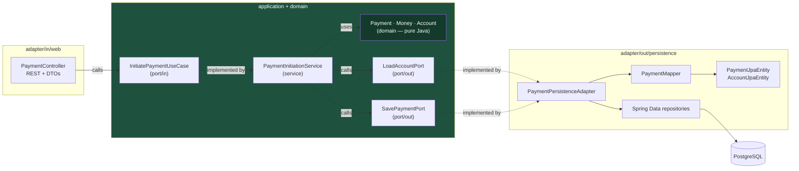

# A Hexagonal Payment Slice You Could Actually Ship

Most "hexagonal architecture" examples stop at a diagram with a hexagon in it. This one is a complete vertical slice — domain, ports, service, JPA adapter, web adapter, wiring, and the two tests that prove the boundary is real.

## The Real-World Problem

Nordbank's payments squad owns a service that initiates SEPA credit transfers between internal accounts. It started as three classes: a `PaymentController`, a `PaymentService`, and a `Payment` JPA entity with getters and setters.

Eighteen months later, the interesting rules — daily transfer limits, hold amounts, the rule that a payment can only be cancelled while it is `PENDING`, the rule that a debit cannot push an account past its overdraft ceiling — live scattered across the controller, the service, three `@Query` methods, and a database trigger nobody dares to touch. The `Payment` class carries `@Entity`, `@JsonProperty`, `@Version`, and a `@ManyToOne` fetch strategy that determines whether the limit check produces one query or four hundred.

The squad wants to add instant payments over a second rail. They cannot, because there is no place to put a business rule that both rails share. Every test that touches a limit needs a Spring context and a database.

The fix is not "add more layers." It is putting the rules in a plain Java object that knows nothing about Spring, and pushing every technology decision to the edge, behind an interface the domain owns.

## The Concept

Hexagonal architecture — ports and adapters — inverts the usual dependency direction. The application core defines the interfaces it needs; infrastructure implements them. Nothing in the core imports anything from a framework.

Three decisions carry the weight in the code below:

1. **The domain model is not the JPA entity.** `Payment` (domain) and `PaymentJpaEntity` (persistence) are two classes, and a mapper sits between them. This is the part teams skip, and skipping it is what re-couples the domain to the database — the moment your aggregate is an `@Entity`, its shape is negotiated with Hibernate rather than with the business.
2. **Ports come in two flavours.** Inbound ports (`port/in`) are use-case interfaces the outside world calls. Outbound ports (`port/out`) are dependencies the core needs, declared by the core, implemented outside.
3. **The boundary is enforced by a test, not by discipline.** An ArchUnit rule fails the build if anyone imports `jakarta.persistence` into `domain`.

## How It Works



Every arrow crossing into `CORE` points inward. The core has no outgoing arrow to a framework.

## Practical Example

### Package layout

```
payments-service/
├── build.gradle.kts
└── src
    ├── main/java/com/nordbank/payments/
    │   ├── PaymentsApplication.java
    │   ├── domain/
    │   │   ├── Money.java
    │   │   ├── AccountId.java
    │   │   ├── Account.java
    │   │   ├── Payment.java
    │   │   ├── PaymentId.java
    │   │   ├── PaymentStatus.java
    │   │   └── PaymentDeclinedException.java
    │   ├── application/
    │   │   ├── port/in/
    │   │   │   ├── InitiatePaymentUseCase.java
    │   │   │   └── InitiatePaymentCommand.java
    │   │   ├── port/out/
    │   │   │   ├── LoadAccountPort.java
    │   │   │   └── SavePaymentPort.java
    │   │   └── service/
    │   │       └── PaymentInitiationService.java
    │   └── adapter/
    │       ├── in/web/
    │       │   ├── PaymentController.java
    │       │   ├── InitiatePaymentRequest.java
    │       │   ├── PaymentResponse.java
    │       │   └── PaymentExceptionHandler.java
    │       └── out/persistence/
    │           ├── PaymentJpaEntity.java
    │           ├── AccountJpaEntity.java
    │           ├── PaymentRepository.java
    │           ├── AccountRepository.java
    │           ├── PaymentMapper.java
    │           └── PaymentPersistenceAdapter.java
    └── test/java/com/nordbank/payments/
        ├── ArchitectureTest.java
        └── application/service/PaymentInitiationServiceTest.java
```

### The domain — plain Java, behaviour included

```java
// domain/Money.java
package com.nordbank.payments.domain;

import java.math.BigDecimal;
import java.util.Currency;
import java.util.Objects;

public record Money(BigDecimal amount, Currency currency) {

    public Money {
        Objects.requireNonNull(amount, "amount");
        Objects.requireNonNull(currency, "currency");
        amount = amount.setScale(currency.getDefaultFractionDigits(), java.math.RoundingMode.UNNECESSARY);
    }

    public static Money of(String amount, String currencyCode) {
        return new Money(new BigDecimal(amount), Currency.getInstance(currencyCode));
    }

    public Money plus(Money other) {
        requireSameCurrency(other);
        return new Money(amount.add(other.amount), currency);
    }

    public Money minus(Money other) {
        requireSameCurrency(other);
        return new Money(amount.subtract(other.amount), currency);
    }

    public boolean isGreaterThan(Money other) {
        requireSameCurrency(other);
        return amount.compareTo(other.amount) > 0;
    }

    public boolean isPositive() {
        return amount.signum() > 0;
    }

    private void requireSameCurrency(Money other) {
        if (!currency.equals(other.currency)) {
            throw new IllegalArgumentException(
                "currency mismatch: %s vs %s".formatted(currency, other.currency));
        }
    }
}
```

```java
// domain/AccountId.java
package com.nordbank.payments.domain;

import java.util.UUID;

public record AccountId(UUID value) {
    public static AccountId of(String raw) {
        return new AccountId(UUID.fromString(raw));
    }
}
```

```java
// domain/PaymentId.java
package com.nordbank.payments.domain;

import java.util.UUID;

public record PaymentId(UUID value) {
    public static PaymentId newId() {
        return new PaymentId(UUID.randomUUID());
    }
}
```

```java
// domain/PaymentStatus.java
package com.nordbank.payments.domain;

public enum PaymentStatus {
    PENDING, SETTLED, CANCELLED
}
```

```java
// domain/PaymentDeclinedException.java
package com.nordbank.payments.domain;

public class PaymentDeclinedException extends RuntimeException {

    private final String reasonCode;

    public PaymentDeclinedException(String reasonCode, String message) {
        super(message);
        this.reasonCode = reasonCode;
    }

    public String reasonCode() {
        return reasonCode;
    }
}
```

```java
// domain/Account.java
package com.nordbank.payments.domain;

import java.util.Objects;

/**
 * Aggregate that owns the debit rules. No Spring, no JPA, no Jackson.
 */
public class Account {

    private final AccountId id;
    private final String tenantId;
    private Money balance;
    private final Money overdraftLimit;
    private final Money dailyTransferLimit;
    private Money debitedToday;

    public Account(AccountId id, String tenantId, Money balance,
                   Money overdraftLimit, Money dailyTransferLimit, Money debitedToday) {
        this.id = Objects.requireNonNull(id);
        this.tenantId = Objects.requireNonNull(tenantId);
        this.balance = Objects.requireNonNull(balance);
        this.overdraftLimit = Objects.requireNonNull(overdraftLimit);
        this.dailyTransferLimit = Objects.requireNonNull(dailyTransferLimit);
        this.debitedToday = Objects.requireNonNull(debitedToday);
    }

    /**
     * The rule that used to live in a controller.
     */
    public void debit(Money amount) {
        if (!amount.isPositive()) {
            throw new PaymentDeclinedException("AMOUNT_NOT_POSITIVE", "amount must be positive");
        }
        Money projected = balance.minus(amount);
        Money floor = new Money(overdraftLimit.amount().negate(), overdraftLimit.currency());
        if (floor.isGreaterThan(projected)) {
            throw new PaymentDeclinedException("OVERDRAFT_EXCEEDED",
                "debit would breach the overdraft ceiling on account " + id.value());
        }
        Money projectedDaily = debitedToday.plus(amount);
        if (projectedDaily.isGreaterThan(dailyTransferLimit)) {
            throw new PaymentDeclinedException("DAILY_LIMIT_EXCEEDED",
                "daily transfer limit reached on account " + id.value());
        }
        this.balance = projected;
        this.debitedToday = projectedDaily;
    }

    public AccountId id() { return id; }
    public String tenantId() { return tenantId; }
    public Money balance() { return balance; }
    public Money debitedToday() { return debitedToday; }
    public Money overdraftLimit() { return overdraftLimit; }
    public Money dailyTransferLimit() { return dailyTransferLimit; }
}
```

```java
// domain/Payment.java
package com.nordbank.payments.domain;

import java.time.Clock;
import java.time.Instant;
import java.util.Objects;

public class Payment {

    private final PaymentId id;
    private final String tenantId;
    private final AccountId source;
    private final AccountId target;
    private final Money amount;
    private final String reference;
    private PaymentStatus status;
    private final Instant initiatedAt;
    private Instant settledAt;

    private Payment(PaymentId id, String tenantId, AccountId source, AccountId target,
                    Money amount, String reference, PaymentStatus status,
                    Instant initiatedAt, Instant settledAt) {
        this.id = id;
        this.tenantId = tenantId;
        this.source = source;
        this.target = target;
        this.amount = amount;
        this.reference = reference;
        this.status = status;
        this.initiatedAt = initiatedAt;
        this.settledAt = settledAt;
    }

    /** Factory used by the use case. Enforces the invariants at creation. */
    public static Payment initiate(Account source, Account target, Money amount,
                                   String reference, Clock clock) {
        Objects.requireNonNull(reference, "reference");
        if (source.id().equals(target.id())) {
            throw new PaymentDeclinedException("SAME_ACCOUNT", "source and target must differ");
        }
        if (!source.tenantId().equals(target.tenantId())) {
            throw new PaymentDeclinedException("CROSS_TENANT",
                "cross-tenant transfer is not permitted");
        }
        source.debit(amount);                        // the rule lives in the aggregate
        return new Payment(PaymentId.newId(), source.tenantId(), source.id(), target.id(),
            amount, reference, PaymentStatus.PENDING, clock.instant(), null);
    }

    /** Rehydration used by the persistence adapter's mapper. */
    public static Payment rehydrate(PaymentId id, String tenantId, AccountId source,
                                    AccountId target, Money amount, String reference,
                                    PaymentStatus status, Instant initiatedAt, Instant settledAt) {
        return new Payment(id, tenantId, source, target, amount, reference,
            status, initiatedAt, settledAt);
    }

    public void settle(Clock clock) {
        if (status != PaymentStatus.PENDING) {
            throw new PaymentDeclinedException("NOT_PENDING",
                "only a PENDING payment can settle; was " + status);
        }
        this.status = PaymentStatus.SETTLED;
        this.settledAt = clock.instant();
    }

    public void cancel() {
        if (status != PaymentStatus.PENDING) {
            throw new PaymentDeclinedException("NOT_PENDING",
                "only a PENDING payment can be cancelled; was " + status);
        }
        this.status = PaymentStatus.CANCELLED;
    }

    public PaymentId id() { return id; }
    public String tenantId() { return tenantId; }
    public AccountId source() { return source; }
    public AccountId target() { return target; }
    public Money amount() { return amount; }
    public String reference() { return reference; }
    public PaymentStatus status() { return status; }
    public Instant initiatedAt() { return initiatedAt; }
    public Instant settledAt() { return settledAt; }
}
```

### The ports

```java
// application/port/in/InitiatePaymentCommand.java
package com.nordbank.payments.application.port.in;

import com.nordbank.payments.domain.AccountId;
import com.nordbank.payments.domain.Money;

public record InitiatePaymentCommand(
    String tenantId,
    AccountId source,
    AccountId target,
    Money amount,
    String reference,
    String idempotencyKey
) {}
```

```java
// application/port/in/InitiatePaymentUseCase.java
package com.nordbank.payments.application.port.in;

import com.nordbank.payments.domain.Payment;

public interface InitiatePaymentUseCase {
    Payment initiate(InitiatePaymentCommand command);
}
```

```java
// application/port/out/LoadAccountPort.java
package com.nordbank.payments.application.port.out;

import com.nordbank.payments.domain.Account;
import com.nordbank.payments.domain.AccountId;
import java.util.Optional;

public interface LoadAccountPort {
    /** Tenant is part of the lookup key — there is no unscoped load. */
    Optional<Account> load(AccountId id, String tenantId);
}
```

```java
// application/port/out/SavePaymentPort.java
package com.nordbank.payments.application.port.out;

import com.nordbank.payments.domain.Account;
import com.nordbank.payments.domain.Payment;
import java.util.Optional;

public interface SavePaymentPort {
    Payment save(Payment payment, Account debitedSource);
    Optional<Payment> findByIdempotencyKey(String key, String tenantId);
}
```

### The service — the only place the use case is orchestrated

```java
// application/service/PaymentInitiationService.java
package com.nordbank.payments.application.service;

import com.nordbank.payments.application.port.in.InitiatePaymentCommand;
import com.nordbank.payments.application.port.in.InitiatePaymentUseCase;
import com.nordbank.payments.application.port.out.LoadAccountPort;
import com.nordbank.payments.application.port.out.SavePaymentPort;
import com.nordbank.payments.domain.Account;
import com.nordbank.payments.domain.Payment;
import com.nordbank.payments.domain.PaymentDeclinedException;
import java.time.Clock;
import org.springframework.stereotype.Service;
import org.springframework.transaction.annotation.Transactional;

@Service
@Transactional
public class PaymentInitiationService implements InitiatePaymentUseCase {

    private final LoadAccountPort accounts;
    private final SavePaymentPort payments;
    private final Clock clock;

    public PaymentInitiationService(LoadAccountPort accounts, SavePaymentPort payments, Clock clock) {
        this.accounts = accounts;
        this.payments = payments;
        this.clock = clock;
    }

    @Override
    public Payment initiate(InitiatePaymentCommand command) {
        var replay = payments.findByIdempotencyKey(command.idempotencyKey(), command.tenantId());
        if (replay.isPresent()) {
            return replay.get();
        }

        Account source = accounts.load(command.source(), command.tenantId())
            .orElseThrow(() -> new PaymentDeclinedException("SOURCE_NOT_FOUND",
                "source account not found in this tenant"));
        Account target = accounts.load(command.target(), command.tenantId())
            .orElseThrow(() -> new PaymentDeclinedException("TARGET_NOT_FOUND",
                "target account not found in this tenant"));

        Payment payment = Payment.initiate(source, target, command.amount(),
            command.reference(), clock);

        return payments.save(payment, source);
    }
}
```

Note what the service does *not* do: no balance arithmetic, no limit comparison, no status transition. It loads, delegates, saves. Every rule is in `Account` and `Payment`.

### The outbound adapter — two classes, deliberately

```java
// adapter/out/persistence/PaymentJpaEntity.java
package com.nordbank.payments.adapter.out.persistence;

import com.nordbank.payments.domain.PaymentStatus;
import jakarta.persistence.Column;
import jakarta.persistence.Entity;
import jakarta.persistence.EnumType;
import jakarta.persistence.Enumerated;
import jakarta.persistence.Id;
import jakarta.persistence.Table;
import jakarta.persistence.Version;
import java.math.BigDecimal;
import java.time.Instant;
import java.util.UUID;

@Entity
@Table(name = "payment")
class PaymentJpaEntity {

    @Id
    @Column(name = "id", nullable = false)
    UUID id;

    @Column(name = "tenant_id", nullable = false)
    String tenantId;

    @Column(name = "source_account_id", nullable = false)
    UUID sourceAccountId;

    @Column(name = "target_account_id", nullable = false)
    UUID targetAccountId;

    @Column(name = "amount", nullable = false, precision = 19, scale = 4)
    BigDecimal amount;

    @Column(name = "currency", nullable = false, length = 3)
    String currency;

    @Column(name = "reference", nullable = false, length = 140)
    String reference;

    @Enumerated(EnumType.STRING)
    @Column(name = "status", nullable = false, length = 16)
    PaymentStatus status;

    @Column(name = "idempotency_key", nullable = false, length = 255)
    String idempotencyKey;

    @Column(name = "initiated_at", nullable = false)
    Instant initiatedAt;

    @Column(name = "settled_at")
    Instant settledAt;

    @Version
    @Column(name = "version", nullable = false)
    long version;

    protected PaymentJpaEntity() { }   // required by JPA

    PaymentJpaEntity(UUID id, String tenantId, UUID sourceAccountId, UUID targetAccountId,
                     BigDecimal amount, String currency, String reference,
                     PaymentStatus status, String idempotencyKey,
                     Instant initiatedAt, Instant settledAt) {
        this.id = id;
        this.tenantId = tenantId;
        this.sourceAccountId = sourceAccountId;
        this.targetAccountId = targetAccountId;
        this.amount = amount;
        this.currency = currency;
        this.reference = reference;
        this.status = status;
        this.idempotencyKey = idempotencyKey;
        this.initiatedAt = initiatedAt;
        this.settledAt = settledAt;
    }
}
```

```java
// adapter/out/persistence/AccountJpaEntity.java
package com.nordbank.payments.adapter.out.persistence;

import jakarta.persistence.Column;
import jakarta.persistence.Entity;
import jakarta.persistence.Id;
import jakarta.persistence.Table;
import jakarta.persistence.Version;
import java.math.BigDecimal;
import java.util.UUID;

@Entity
@Table(name = "account")
class AccountJpaEntity {

    @Id
    @Column(name = "id", nullable = false)
    UUID id;

    @Column(name = "tenant_id", nullable = false)
    String tenantId;

    @Column(name = "balance", nullable = false, precision = 19, scale = 4)
    BigDecimal balance;

    @Column(name = "currency", nullable = false, length = 3)
    String currency;

    @Column(name = "overdraft_limit", nullable = false, precision = 19, scale = 4)
    BigDecimal overdraftLimit;

    @Column(name = "daily_transfer_limit", nullable = false, precision = 19, scale = 4)
    BigDecimal dailyTransferLimit;

    @Column(name = "debited_today", nullable = false, precision = 19, scale = 4)
    BigDecimal debitedToday;

    @Version
    @Column(name = "version", nullable = false)
    long version;

    protected AccountJpaEntity() { }
}
```

```java
// adapter/out/persistence/PaymentRepository.java
package com.nordbank.payments.adapter.out.persistence;

import java.util.Optional;
import java.util.UUID;
import org.springframework.data.jpa.repository.JpaRepository;

interface PaymentRepository extends JpaRepository<PaymentJpaEntity, UUID> {
    Optional<PaymentJpaEntity> findByIdempotencyKeyAndTenantId(String idempotencyKey, String tenantId);
}
```

```java
// adapter/out/persistence/AccountRepository.java
package com.nordbank.payments.adapter.out.persistence;

import jakarta.persistence.LockModeType;
import java.util.Optional;
import java.util.UUID;
import org.springframework.data.jpa.repository.JpaRepository;
import org.springframework.data.jpa.repository.Lock;

interface AccountRepository extends JpaRepository<AccountJpaEntity, UUID> {

    @Lock(LockModeType.PESSIMISTIC_WRITE)
    Optional<AccountJpaEntity> findByIdAndTenantId(UUID id, String tenantId);
}
```

```java
// adapter/out/persistence/PaymentMapper.java
package com.nordbank.payments.adapter.out.persistence;

import com.nordbank.payments.domain.Account;
import com.nordbank.payments.domain.AccountId;
import com.nordbank.payments.domain.Money;
import com.nordbank.payments.domain.Payment;
import com.nordbank.payments.domain.PaymentId;
import java.util.Currency;
import org.springframework.stereotype.Component;

/**
 * The seam. Nothing else in the codebase knows both shapes.
 */
@Component
class PaymentMapper {

    Account toDomain(AccountJpaEntity e) {
        Currency ccy = Currency.getInstance(e.currency);
        return new Account(
            new AccountId(e.id),
            e.tenantId,
            new Money(e.balance, ccy),
            new Money(e.overdraftLimit, ccy),
            new Money(e.dailyTransferLimit, ccy),
            new Money(e.debitedToday, ccy));
    }

    void applyTo(AccountJpaEntity target, Account source) {
        target.balance = source.balance().amount();
        target.debitedToday = source.debitedToday().amount();
    }

    PaymentJpaEntity toEntity(Payment p, String idempotencyKey) {
        return new PaymentJpaEntity(
            p.id().value(), p.tenantId(), p.source().value(), p.target().value(),
            p.amount().amount(), p.amount().currency().getCurrencyCode(),
            p.reference(), p.status(), idempotencyKey, p.initiatedAt(), p.settledAt());
    }

    Payment toDomain(PaymentJpaEntity e) {
        return Payment.rehydrate(
            new PaymentId(e.id), e.tenantId,
            new AccountId(e.sourceAccountId), new AccountId(e.targetAccountId),
            new Money(e.amount, Currency.getInstance(e.currency)),
            e.reference, e.status, e.initiatedAt, e.settledAt);
    }
}
```

```java
// adapter/out/persistence/PaymentPersistenceAdapter.java
package com.nordbank.payments.adapter.out.persistence;

import com.nordbank.payments.application.port.out.LoadAccountPort;
import com.nordbank.payments.application.port.out.SavePaymentPort;
import com.nordbank.payments.domain.Account;
import com.nordbank.payments.domain.AccountId;
import com.nordbank.payments.domain.Payment;
import java.util.Optional;
import org.springframework.stereotype.Component;

@Component
class PaymentPersistenceAdapter implements LoadAccountPort, SavePaymentPort {

    private final AccountRepository accountRepository;
    private final PaymentRepository paymentRepository;
    private final PaymentMapper mapper;

    PaymentPersistenceAdapter(AccountRepository accountRepository,
                              PaymentRepository paymentRepository,
                              PaymentMapper mapper) {
        this.accountRepository = accountRepository;
        this.paymentRepository = paymentRepository;
        this.mapper = mapper;
    }

    @Override
    public Optional<Account> load(AccountId id, String tenantId) {
        return accountRepository.findByIdAndTenantId(id.value(), tenantId).map(mapper::toDomain);
    }

    @Override
    public Payment save(Payment payment, Account debitedSource) {
        AccountJpaEntity sourceEntity = accountRepository
            .findByIdAndTenantId(debitedSource.id().value(), debitedSource.tenantId())
            .orElseThrow(() -> new IllegalStateException("source vanished mid-transaction"));
        mapper.applyTo(sourceEntity, debitedSource);
        accountRepository.save(sourceEntity);

        PaymentJpaEntity saved = paymentRepository.save(
            mapper.toEntity(payment, payment.reference() + "|" + payment.id().value()));
        return mapper.toDomain(saved);
    }

    @Override
    public Optional<Payment> findByIdempotencyKey(String key, String tenantId) {
        return paymentRepository.findByIdempotencyKeyAndTenantId(key, tenantId)
            .map(mapper::toDomain);
    }
}
```

### The inbound adapter

```java
// adapter/in/web/InitiatePaymentRequest.java
package com.nordbank.payments.adapter.in.web;

import jakarta.validation.constraints.DecimalMin;
import jakarta.validation.constraints.NotBlank;
import jakarta.validation.constraints.NotNull;
import jakarta.validation.constraints.Pattern;
import jakarta.validation.constraints.Size;
import java.math.BigDecimal;
import java.util.UUID;

public record InitiatePaymentRequest(
    @NotNull UUID sourceAccountId,
    @NotNull UUID targetAccountId,
    @NotNull @DecimalMin("0.01") BigDecimal amount,
    @NotBlank @Pattern(regexp = "[A-Z]{3}") String currency,
    @NotBlank @Size(max = 140) String reference
) {}
```

```java
// adapter/in/web/PaymentResponse.java
package com.nordbank.payments.adapter.in.web;

import com.nordbank.payments.domain.Payment;
import java.math.BigDecimal;
import java.time.Instant;
import java.util.UUID;

public record PaymentResponse(
    UUID id, UUID sourceAccountId, UUID targetAccountId,
    BigDecimal amount, String currency, String reference,
    String status, Instant initiatedAt
) {
    static PaymentResponse from(Payment p) {
        return new PaymentResponse(
            p.id().value(), p.source().value(), p.target().value(),
            p.amount().amount(), p.amount().currency().getCurrencyCode(),
            p.reference(), p.status().name(), p.initiatedAt());
    }
}
```

```java
// adapter/in/web/PaymentController.java
package com.nordbank.payments.adapter.in.web;

import com.nordbank.payments.application.port.in.InitiatePaymentCommand;
import com.nordbank.payments.application.port.in.InitiatePaymentUseCase;
import com.nordbank.payments.domain.AccountId;
import com.nordbank.payments.domain.Money;
import com.nordbank.payments.domain.Payment;
import jakarta.validation.Valid;
import jakarta.validation.constraints.NotBlank;
import java.net.URI;
import java.util.Currency;
import org.springframework.http.ResponseEntity;
import org.springframework.security.access.prepost.PreAuthorize;
import org.springframework.security.core.annotation.AuthenticationPrincipal;
import org.springframework.security.oauth2.jwt.Jwt;
import org.springframework.web.bind.annotation.PostMapping;
import org.springframework.web.bind.annotation.RequestBody;
import org.springframework.web.bind.annotation.RequestHeader;
import org.springframework.web.bind.annotation.RequestMapping;
import org.springframework.web.bind.annotation.RestController;

@RestController
@RequestMapping("/api/v1/payments")
class PaymentController {

    private final InitiatePaymentUseCase initiatePayment;

    PaymentController(InitiatePaymentUseCase initiatePayment) {
        this.initiatePayment = initiatePayment;
    }

    @PostMapping
    @PreAuthorize("hasAuthority('SCOPE_payments:write')")
    ResponseEntity<PaymentResponse> initiate(
            @RequestHeader("Idempotency-Key") @NotBlank String idempotencyKey,
            @Valid @RequestBody InitiatePaymentRequest request,
            @AuthenticationPrincipal Jwt jwt) {

        var command = new InitiatePaymentCommand(
            jwt.getClaimAsString("tenant_id"),
            new AccountId(request.sourceAccountId()),
            new AccountId(request.targetAccountId()),
            new Money(request.amount(), Currency.getInstance(request.currency())),
            request.reference(),
            idempotencyKey);

        Payment payment = initiatePayment.initiate(command);

        return ResponseEntity
            .created(URI.create("/api/v1/payments/" + payment.id().value()))
            .body(PaymentResponse.from(payment));
    }
}
```

```java
// adapter/in/web/PaymentExceptionHandler.java
package com.nordbank.payments.adapter.in.web;

import com.nordbank.payments.domain.PaymentDeclinedException;
import org.springframework.http.HttpStatus;
import org.springframework.http.ProblemDetail;
import org.springframework.web.bind.annotation.ExceptionHandler;
import org.springframework.web.bind.annotation.RestControllerAdvice;

@RestControllerAdvice
class PaymentExceptionHandler {

    @ExceptionHandler(PaymentDeclinedException.class)
    ProblemDetail onDeclined(PaymentDeclinedException ex) {
        ProblemDetail problem = ProblemDetail.forStatusAndDetail(
            HttpStatus.UNPROCESSABLE_ENTITY, ex.getMessage());
        problem.setTitle("Payment declined");
        problem.setType(java.net.URI.create("https://api.nordbank.example/problems/payment-declined"));
        problem.setProperty("reasonCode", ex.reasonCode());
        return problem;
    }
}
```

### Wiring

```java
// PaymentsApplication.java
package com.nordbank.payments;

import java.time.Clock;
import org.springframework.boot.SpringApplication;
import org.springframework.boot.autoconfigure.SpringBootApplication;
import org.springframework.context.annotation.Bean;
import org.springframework.security.config.annotation.method.configuration.EnableMethodSecurity;

@SpringBootApplication
@EnableMethodSecurity
public class PaymentsApplication {

    public static void main(String[] args) {
        SpringApplication.run(PaymentsApplication.class, args);
    }

    /** Injected into the domain-facing service so time is testable. */
    @Bean
    Clock clock() {
        return Clock.systemUTC();
    }
}
```

The `@Service` and `@Component` annotations sit on the *implementations*, never on the interfaces the core owns. Swapping `PaymentPersistenceAdapter` for an event-sourced adapter is a one-class change with no edit inside `application/` or `domain/`.

### Test 1 — ArchUnit proves the boundary

```java
// test/java/com/nordbank/payments/ArchitectureTest.java
package com.nordbank.payments;

import static com.tngtech.archunit.lang.syntax.ArchRuleDefinition.noClasses;

import com.tngtech.archunit.core.importer.ImportOption;
import com.tngtech.archunit.junit.AnalyzeClasses;
import com.tngtech.archunit.junit.ArchTest;
import com.tngtech.archunit.lang.ArchRule;

@AnalyzeClasses(
    packages = "com.nordbank.payments",
    importOptions = ImportOption.DoNotIncludeTests.class)
class ArchitectureTest {

    @ArchTest
    static final ArchRule domain_is_framework_free = noClasses()
        .that().resideInAPackage("..domain..")
        .should().dependOnClassesThat().resideInAnyPackage(
            "org.springframework..",
            "jakarta.persistence..",
            "jakarta.validation..",
            "com.fasterxml.jackson..")
        .as("the domain must not depend on any framework");

    @ArchTest
    static final ArchRule application_does_not_depend_on_adapters = noClasses()
        .that().resideInAPackage("..application..")
        .should().dependOnClassesThat().resideInAPackage("..adapter..")
        .as("the application core must not know its adapters");

    @ArchTest
    static final ArchRule web_does_not_reach_into_persistence = noClasses()
        .that().resideInAPackage("..adapter.in.web..")
        .should().dependOnClassesThat().resideInAPackage("..adapter.out.persistence..")
        .as("adapters must talk through ports, not to each other");
}
```

### Test 2 — the use case, with fakes and no Spring context

```java
// test/java/com/nordbank/payments/application/service/PaymentInitiationServiceTest.java
package com.nordbank.payments.application.service;

import static org.assertj.core.api.Assertions.assertThat;
import static org.assertj.core.api.Assertions.assertThatThrownBy;

import com.nordbank.payments.application.port.in.InitiatePaymentCommand;
import com.nordbank.payments.application.port.out.LoadAccountPort;
import com.nordbank.payments.application.port.out.SavePaymentPort;
import com.nordbank.payments.domain.Account;
import com.nordbank.payments.domain.AccountId;
import com.nordbank.payments.domain.Money;
import com.nordbank.payments.domain.Payment;
import com.nordbank.payments.domain.PaymentDeclinedException;
import com.nordbank.payments.domain.PaymentStatus;
import java.time.Clock;
import java.time.Instant;
import java.time.ZoneOffset;
import java.util.HashMap;
import java.util.Map;
import java.util.Optional;
import java.util.UUID;
import org.junit.jupiter.api.BeforeEach;
import org.junit.jupiter.api.Test;

class PaymentInitiationServiceTest {

    private static final String TENANT = "nordbank-retail";
    private static final Clock FIXED =
        Clock.fixed(Instant.parse("2026-08-09T10:15:30Z"), ZoneOffset.UTC);

    private final AccountId sourceId = new AccountId(UUID.randomUUID());
    private final AccountId targetId = new AccountId(UUID.randomUUID());

    private FakeAccounts accounts;
    private FakePayments payments;
    private PaymentInitiationService service;

    /** Hand-written fakes: no Mockito, no context, milliseconds to run. */
    static final class FakeAccounts implements LoadAccountPort {
        final Map<String, Account> store = new HashMap<>();
        @Override public Optional<Account> load(AccountId id, String tenantId) {
            return Optional.ofNullable(store.get(tenantId + ":" + id.value()));
        }
        void put(Account a) { store.put(a.tenantId() + ":" + a.id().value(), a); }
    }

    static final class FakePayments implements SavePaymentPort {
        final Map<String, Payment> byKey = new HashMap<>();
        Payment lastSaved;
        Account lastDebitedSource;
        @Override public Payment save(Payment payment, Account debitedSource) {
            lastSaved = payment;
            lastDebitedSource = debitedSource;
            return payment;
        }
        @Override public Optional<Payment> findByIdempotencyKey(String key, String tenantId) {
            return Optional.ofNullable(byKey.get(tenantId + ":" + key));
        }
    }

    @BeforeEach
    void setUp() {
        accounts = new FakeAccounts();
        payments = new FakePayments();
        service = new PaymentInitiationService(accounts, payments, FIXED);

        accounts.put(new Account(sourceId, TENANT,
            Money.of("500.00", "EUR"), Money.of("100.00", "EUR"),
            Money.of("1000.00", "EUR"), Money.of("0.00", "EUR")));
        accounts.put(new Account(targetId, TENANT,
            Money.of("0.00", "EUR"), Money.of("0.00", "EUR"),
            Money.of("1000.00", "EUR"), Money.of("0.00", "EUR")));
    }

    private InitiatePaymentCommand command(String amount, String key) {
        return new InitiatePaymentCommand(TENANT, sourceId, targetId,
            Money.of(amount, "EUR"), "invoice 7781", key);
    }

    @Test
    void initiate_withinLimits_debitsSourceAndCreatesPendingPayment() {
        Payment result = service.initiate(command("250.00", "key-1"));

        assertThat(result.status()).isEqualTo(PaymentStatus.PENDING);
        assertThat(result.initiatedAt()).isEqualTo(Instant.parse("2026-08-09T10:15:30Z"));
        assertThat(result.amount().amount()).isEqualByComparingTo("250.00");
        assertThat(payments.lastDebitedSource.balance().amount()).isEqualByComparingTo("250.00");
        assertThat(payments.lastDebitedSource.debitedToday().amount()).isEqualByComparingTo("250.00");
    }

    @Test
    void initiate_beyondOverdraftCeiling_isDeclinedAndNothingIsSaved() {
        assertThatThrownBy(() -> service.initiate(command("650.00", "key-2")))
            .isInstanceOf(PaymentDeclinedException.class)
            .extracting(e -> ((PaymentDeclinedException) e).reasonCode())
            .isEqualTo("OVERDRAFT_EXCEEDED");

        assertThat(payments.lastSaved).isNull();
    }

    @Test
    void initiate_beyondDailyLimit_isDeclined() {
        accounts.put(new Account(sourceId, TENANT,
            Money.of("5000.00", "EUR"), Money.of("0.00", "EUR"),
            Money.of("1000.00", "EUR"), Money.of("900.00", "EUR")));

        assertThatThrownBy(() -> service.initiate(command("200.00", "key-3")))
            .isInstanceOf(PaymentDeclinedException.class)
            .extracting(e -> ((PaymentDeclinedException) e).reasonCode())
            .isEqualTo("DAILY_LIMIT_EXCEEDED");
    }

    @Test
    void initiate_replayedIdempotencyKey_returnsOriginalWithoutDebitingAgain() {
        Payment first = service.initiate(command("100.00", "key-4"));
        payments.byKey.put(TENANT + ":key-4", first);

        Payment replay = service.initiate(command("100.00", "key-4"));

        assertThat(replay.id()).isEqualTo(first.id());
        assertThat(payments.lastDebitedSource.balance().amount()).isEqualByComparingTo("400.00");
    }

    @Test
    void initiate_accountFromAnotherTenant_isNotVisible() {
        var foreign = new InitiatePaymentCommand("othertenant", sourceId, targetId,
            Money.of("10.00", "EUR"), "probe", "key-5");

        assertThatThrownBy(() -> service.initiate(foreign))
            .isInstanceOf(PaymentDeclinedException.class)
            .extracting(e -> ((PaymentDeclinedException) e).reasonCode())
            .isEqualTo("SOURCE_NOT_FOUND");
    }
}
```

### Build config

```kotlin
// build.gradle.kts
plugins {
    java
    id("org.springframework.boot") version "3.5.0"
    id("io.spring.dependency-management") version "1.1.7"
}

java {
    toolchain { languageVersion = JavaLanguageVersion.of(21) }
}

repositories { mavenCentral() }

dependencies {
    implementation("org.springframework.boot:spring-boot-starter-web")
    implementation("org.springframework.boot:spring-boot-starter-data-jpa")
    implementation("org.springframework.boot:spring-boot-starter-validation")
    implementation("org.springframework.boot:spring-boot-starter-oauth2-resource-server")
    implementation("org.liquibase:liquibase-core")
    runtimeOnly("org.postgresql:postgresql")

    testImplementation("org.springframework.boot:spring-boot-starter-test")
    testImplementation("com.tngtech.archunit:archunit-junit5:1.3.0")
}

tasks.withType<Test> { useJUnitPlatform() }
```

## Enterprise Trade-offs

| Approach | Pros | Cons | When to use (Banking / Insurance / Enterprise) |
|---|---|---|---|
| **Full hexagonal with separate domain and JPA models** | Rules testable in milliseconds; database and framework swappable; audit rules provably in one place | Two models plus a mapper; more files per feature | Core banking, payments, underwriting — anything whose rules are the product and are examined by auditors |
| **Hexagonal with the JPA entity as the domain model** | Fewer classes; faster to start | Hibernate dictates aggregate shape; lazy-loading leaks into rules; "pure domain" claim is false | Acceptable for internal CRUD services with thin rules; never for a rules-heavy aggregate |
| **Classic layered service + repository** | Every Java developer already knows it; minimal ceremony | Rules drift into controllers and queries; tests need a Spring context and a database | Reporting endpoints, admin back-office screens, short-lived integrations |
| **Ports and adapters without an ArchUnit rule** | No test infrastructure to maintain | The boundary erodes in about two sprints under delivery pressure | Never — the rule is fifteen lines and is the only thing that makes the architecture durable |
| **Modular monolith of hexagonal slices** | Independent modules; no distributed-transaction cost; extractable later | Requires discipline about cross-module calls going through ports | Default starting shape for a new banking platform in 2026 |

→ Next: [rest-api-crud-example.md](rest-api-crud-example.md) · Related: [../../03-architecture/02-hexagonal-architecture.md](../../03-architecture/02-hexagonal-architecture.md) · [../../03-architecture/03-clean-architecture.md](../../03-architecture/03-clean-architecture.md) · [../../01-core-concepts/01-solid-and-separation-of-concerns.md](../../01-core-concepts/01-solid-and-separation-of-concerns.md) · [testing-example.md](testing-example.md)
