# Locking Down a Banking API with Keycloak and Spring Security 6

Three lines of YAML will make Spring Boot validate a Keycloak JWT. Those three lines will also happily accept a token minted for a completely different application in the same realm. This is the full version.

## The Real-World Problem

Nordbank runs one Keycloak realm, `nordbank-retail`, for its retail estate: a customer web app, a mobile app, an internal servicing console for branch staff, and eleven backend services. The account-servicing API is one of those eleven.

The first release did the obvious thing — set `issuer-uri`, add `.authenticated()`, ship. Two problems surfaced in the next security review.

First, **any** access token from the realm passed validation. A token issued to the low-assurance public marketing widget, scoped only to read a rates table, was accepted by the account-servicing API. The signature was valid and the issuer was correct, so Spring said yes. The token's `aud` claim said it was never meant for this service, and nothing was reading it.

Second, authorization was a mess of `jwt.getClaimAsMap("realm_access")` casts sprinkled through controllers. Keycloak puts realm roles in `realm_access.roles` and per-client roles in `resource_access.<clientId>.roles`, and Spring Security's default converter reads neither — it maps the `scope` claim to `SCOPE_*` authorities and stops there. So every endpoint reimplemented role extraction, slightly differently, and one of them had an inverted condition that let a teller approve their own limit override.

Third, and quietly worse: when the servicing API called the downstream payments API, it used its own service account. Every payment appeared in the audit log as performed by `account-servicing-svc`. Nobody could tell which staff member did what.

This example fixes all three.

## The Concept

A resource server has exactly one job: decide whether a presented token authorises this request. Five decisions make that decision trustworthy.

1. **Validate more than the signature.** Issuer and expiry come free. Audience does not — you add an `OAuth2TokenValidator<Jwt>` that requires this service's identifier in `aud`. Without it, realm-wide token confusion is the default.
2. **Map Keycloak's role model into Spring authorities once.** A single `JwtAuthenticationConverter` reads `realm_access.roles` and `resource_access.<client>.roles` into `ROLE_*`, and leaves `scope` producing `SCOPE_*`. Roles say who the subject is; scopes say what the client was allowed to ask for. Sensitive endpoints require both.
3. **Deny by default.** `anyRequest().authenticated()` is the last matcher, sessions are stateless, CSRF is off because there is no cookie to steal, and CORS is an explicit allow-list.
4. **Tenant comes from the token, never the request.** A custom argument resolver turns a claim into a typed `BankingPrincipal` so no controller ever parses claims again.
5. **Propagate the user's token downstream.** Service-to-service calls carry the original subject, so the audit trail names a person.

## How It Works

```mermaid
sequenceDiagram
    autonumber
    participant U as "Branch staff (browser)"
    participant KC as "Keycloak 26 realm<br/>nordbank-retail"
    participant API as "account-servicing-api<br/>resource server"
    participant DS as "payments-api<br/>downstream"

    U->>KC: "Auth code + PKCE login"
    KC-->>U: "ID token + access token (aud: account-servicing-api)"
    U->>API: "GET /api/v1/accounts (Bearer JWT)"

    API->>KC: "GET /protocol/openid-connect/certs (cached JWKS)"
    KC-->>API: "Signing keys"

    Note over API: "1 signature<br/>2 issuer<br/>3 exp/nbf<br/>4 audience<br/>5 roles to authorities"

    API->>API: "@PreAuthorize scope + role"
    API->>DS: "GET /api/v1/payments (same Bearer token)"
    DS-->>API: "200 - audit names the staff member"
    API-->>U: "200 JSON"

    rect rgb(90, 34, 51)
    U->>API: "Token with aud: marketing-widget"
    API-->>U: "401 invalid_token - required audience missing"
    end
```



## Practical Example

### Package layout

```
account-servicing-api/
├── build.gradle.kts
├── docker-compose.yml
├── keycloak/account-servicing-api-client.json
└── src
    ├── main
    │   ├── java/com/nordbank/servicing/
    │   │   ├── ServicingApplication.java
    │   │   ├── config/
    │   │   │   ├── SecurityConfig.java
    │   │   │   ├── KeycloakJwtAuthenticationConverter.java
    │   │   │   ├── AudienceValidator.java
    │   │   │   ├── DownstreamClientConfig.java
    │   │   │   └── WebMvcConfig.java
    │   │   ├── security/
    │   │   │   ├── BankingPrincipal.java
    │   │   │   ├── CurrentUser.java
    │   │   │   └── BankingPrincipalArgumentResolver.java
    │   │   ├── downstream/
    │   │   │   ├── PaymentsClient.java
    │   │   │   └── PaymentSummary.java
    │   │   └── api/
    │   │       └── AccountController.java
    │   └── resources/application.yml
    └── test/java/com/nordbank/servicing/api/
        └── AccountControllerSecurityTest.java
```

### What the token actually looks like

Decode a real Keycloak 26 access token for a branch teller and you get this. Every field the code below reads is visible here:

```json
{
  "exp": 1786099200,
  "iat": 1786098900,
  "auth_time": 1786098880,
  "jti": "b0a4d9a1-7c2f-4a3e-9f21-6d4e8a9c1b57",
  "iss": "https://sso.nordbank.example/realms/nordbank-retail",
  "aud": ["account-servicing-api", "payments-api"],
  "sub": "3f2a91c4-88de-4b71-9f0c-7c5b1e2d4a66",
  "typ": "Bearer",
  "azp": "servicing-console",
  "sid": "9c1f4e7b-2a55-4d30-bb18-3e6f0a7d9c41",
  "acr": "1",
  "scope": "openid profile email accounts:read payments:write",
  "realm_access": {
    "roles": ["default-roles-nordbank-retail", "offline_access", "STAFF"]
  },
  "resource_access": {
    "account-servicing-api": {
      "roles": ["TELLER", "LIMIT_OVERRIDE_APPROVER"]
    },
    "payments-api": {
      "roles": ["PAYMENT_INITIATOR"]
    }
  },
  "organisation_id": "nordbank-retail-be",
  "branch_code": "BE-1042",
  "employee_id": "E-88431",
  "preferred_username": "t.okafor",
  "email": "t.okafor@nordbank.example",
  "email_verified": true
}
```

Note the two role locations, and note that `aud` is an array containing this service. Getting `aud` populated is a Keycloak configuration step, not a Spring one — see the client JSON below.

### application.yml

```yaml
# src/main/resources/application.yml
spring:
  application:
    name: account-servicing-api
  security:
    oauth2:
      resourceserver:
        jwt:
          # Spring fetches /.well-known/openid-configuration from here and
          # discovers the JWKS endpoint. Set jwk-set-uri instead only when the
          # issuer is unreachable at startup (air-gapped build, sidecar proxy).
          issuer-uri: ${KEYCLOAK_ISSUER_URI:http://localhost:8080/realms/nordbank-retail}
          jwk-set-uri: ${KEYCLOAK_JWKS_URI:http://localhost:8080/realms/nordbank-retail/protocol/openid-connect/certs}
          # Reject anything not signed with the expected algorithm.
          jws-algorithms: RS256

nordbank:
  security:
    # This service's audience identifier, matching the Keycloak client id.
    required-audience: account-servicing-api
    # Keycloak puts per-client roles under resource_access.<this key>.roles
    client-role-source: account-servicing-api
    allowed-origins:
      - https://console.nordbank.example
  downstream:
    payments-base-url: ${PAYMENTS_BASE_URL:http://localhost:8081}

server:
  error:
    include-message: never
  forward-headers-strategy: framework

logging:
  level:
    org.springframework.security: info
    org.springframework.security.oauth2.server.resource: debug
```

### Audience validation — the part that is missing by default

```java
// config/AudienceValidator.java
package com.nordbank.servicing.config;

import java.util.List;
import org.springframework.security.oauth2.core.OAuth2Error;
import org.springframework.security.oauth2.core.OAuth2ErrorCodes;
import org.springframework.security.oauth2.core.OAuth2TokenValidator;
import org.springframework.security.oauth2.core.OAuth2TokenValidatorResult;
import org.springframework.security.oauth2.jwt.Jwt;

/**
 * Spring's default validators check signature, issuer, exp and nbf — not aud.
 * Without this class, any token from the realm is accepted by this service.
 */
public final class AudienceValidator implements OAuth2TokenValidator<Jwt> {

    private final String requiredAudience;

    public AudienceValidator(String requiredAudience) {
        this.requiredAudience = requiredAudience;
    }

    @Override
    public OAuth2TokenValidatorResult validate(Jwt jwt) {
        List<String> audiences = jwt.getAudience();
        if (audiences != null && audiences.contains(requiredAudience)) {
            return OAuth2TokenValidatorResult.success();
        }
        OAuth2Error error = new OAuth2Error(
            OAuth2ErrorCodes.INVALID_TOKEN,
            "the required audience '%s' is missing from this token".formatted(requiredAudience),
            "https://datatracker.ietf.org/doc/html/rfc9068#section-2.2");
        return OAuth2TokenValidatorResult.failure(error);
    }
}
```

### Mapping Keycloak roles into Spring authorities

```java
// config/KeycloakJwtAuthenticationConverter.java
package com.nordbank.servicing.config;

import java.util.Collection;
import java.util.HashSet;
import java.util.List;
import java.util.Map;
import java.util.Set;
import java.util.stream.Collectors;
import org.springframework.core.convert.converter.Converter;
import org.springframework.security.authentication.AbstractAuthenticationToken;
import org.springframework.security.core.GrantedAuthority;
import org.springframework.security.core.authority.SimpleGrantedAuthority;
import org.springframework.security.oauth2.jwt.Jwt;
import org.springframework.security.oauth2.server.resource.authentication.JwtAuthenticationToken;
import org.springframework.security.oauth2.server.resource.authentication.JwtGrantedAuthoritiesConverter;

/**
 * Produces three families of authority from one Keycloak token:
 *   SCOPE_accounts:read      <- the "scope" claim (Spring's default converter)
 *   ROLE_STAFF               <- realm_access.roles
 *   ROLE_TELLER              <- resource_access.<clientRoleSource>.roles
 *
 * Roles answer "who is this subject"; scopes answer "what was the client permitted
 * to request". Sensitive endpoints demand both.
 */
public class KeycloakJwtAuthenticationConverter
        implements Converter<Jwt, AbstractAuthenticationToken> {

    private static final String REALM_ACCESS = "realm_access";
    private static final String RESOURCE_ACCESS = "resource_access";
    private static final String ROLES = "roles";
    private static final String ROLE_PREFIX = "ROLE_";

    /** Keycloak ships these to every user; they are noise in authorization rules. */
    private static final Set<String> IGNORED_ROLES = Set.of(
        "offline_access", "uma_authorization");

    private final JwtGrantedAuthoritiesConverter scopeConverter =
        new JwtGrantedAuthoritiesConverter();
    private final String clientRoleSource;
    private final String principalClaimName;

    public KeycloakJwtAuthenticationConverter(String clientRoleSource, String principalClaimName) {
        this.clientRoleSource = clientRoleSource;
        this.principalClaimName = principalClaimName;
        this.scopeConverter.setAuthorityPrefix("SCOPE_");
        this.scopeConverter.setAuthoritiesClaimName("scope");
    }

    @Override
    public AbstractAuthenticationToken convert(Jwt jwt) {
        Collection<GrantedAuthority> authorities = new HashSet<>(scopeConverter.convert(jwt));
        authorities.addAll(realmRoles(jwt));
        authorities.addAll(clientRoles(jwt));
        return new JwtAuthenticationToken(jwt, authorities, jwt.getClaimAsString(principalClaimName));
    }

    private Collection<GrantedAuthority> realmRoles(Jwt jwt) {
        Map<String, Object> realmAccess = jwt.getClaimAsMap(REALM_ACCESS);
        return toAuthorities(realmAccess);
    }

    @SuppressWarnings("unchecked")
    private Collection<GrantedAuthority> clientRoles(Jwt jwt) {
        Map<String, Object> resourceAccess = jwt.getClaimAsMap(RESOURCE_ACCESS);
        if (resourceAccess == null) {
            return List.of();
        }
        Object forThisClient = resourceAccess.get(clientRoleSource);
        if (!(forThisClient instanceof Map<?, ?> map)) {
            return List.of();
        }
        return toAuthorities((Map<String, Object>) map);
    }

    @SuppressWarnings("unchecked")
    private Collection<GrantedAuthority> toAuthorities(Map<String, Object> claimBlock) {
        if (claimBlock == null || !(claimBlock.get(ROLES) instanceof Collection<?> raw)) {
            return List.of();
        }
        return ((Collection<String>) raw).stream()
            .filter(role -> role != null && !role.isBlank())
            .filter(role -> !IGNORED_ROLES.contains(role))
            .filter(role -> !role.startsWith("default-roles-"))
            .map(role -> role.replace('-', '_').toUpperCase())
            .map(role -> new SimpleGrantedAuthority(ROLE_PREFIX + role))
            .collect(Collectors.toUnmodifiableSet());
    }
}
```

### The filter chain

```java
// config/SecurityConfig.java
package com.nordbank.servicing.config;

import java.util.List;
import org.springframework.beans.factory.annotation.Value;
import org.springframework.context.annotation.Bean;
import org.springframework.context.annotation.Configuration;
import org.springframework.http.HttpMethod;
import org.springframework.security.config.Customizer;
import org.springframework.security.config.annotation.method.configuration.EnableMethodSecurity;
import org.springframework.security.config.annotation.web.builders.HttpSecurity;
import org.springframework.security.config.annotation.web.configurers.HeadersConfigurer;
import org.springframework.security.config.http.SessionCreationPolicy;
import org.springframework.security.oauth2.core.DelegatingOAuth2TokenValidator;
import org.springframework.security.oauth2.core.OAuth2TokenValidator;
import org.springframework.security.oauth2.jwt.JwtDecoder;
import org.springframework.security.oauth2.jwt.JwtValidators;
import org.springframework.security.oauth2.jwt.NimbusJwtDecoder;
import org.springframework.security.web.SecurityFilterChain;
import org.springframework.web.cors.CorsConfiguration;
import org.springframework.web.cors.CorsConfigurationSource;
import org.springframework.web.cors.UrlBasedCorsConfigurationSource;

@Configuration
@EnableMethodSecurity   // turns on @PreAuthorize
public class SecurityConfig {

    private final String issuerUri;
    private final String jwkSetUri;
    private final String requiredAudience;
    private final String clientRoleSource;
    private final List<String> allowedOrigins;

    public SecurityConfig(
            @Value("${spring.security.oauth2.resourceserver.jwt.issuer-uri}") String issuerUri,
            @Value("${spring.security.oauth2.resourceserver.jwt.jwk-set-uri}") String jwkSetUri,
            @Value("${nordbank.security.required-audience}") String requiredAudience,
            @Value("${nordbank.security.client-role-source}") String clientRoleSource,
            @Value("${nordbank.security.allowed-origins}") List<String> allowedOrigins) {
        this.issuerUri = issuerUri;
        this.jwkSetUri = jwkSetUri;
        this.requiredAudience = requiredAudience;
        this.clientRoleSource = clientRoleSource;
        this.allowedOrigins = allowedOrigins;
    }

    @Bean
    JwtDecoder jwtDecoder() {
        NimbusJwtDecoder decoder = NimbusJwtDecoder
            .withJwkSetUri(jwkSetUri)
            .jwsAlgorithm(org.springframework.security.oauth2.jose.jws.SignatureAlgorithm.RS256)
            .build();

        // withIssuer() already gives signature + issuer + exp/nbf with 60s clock skew.
        // Audience is layered on top.
        OAuth2TokenValidator<org.springframework.security.oauth2.jwt.Jwt> validators =
            new DelegatingOAuth2TokenValidator<>(
                JwtValidators.createDefaultWithIssuer(issuerUri),
                new AudienceValidator(requiredAudience));

        decoder.setJwtValidator(validators);
        return decoder;
    }

    @Bean
    SecurityFilterChain apiFilterChain(HttpSecurity http, JwtDecoder jwtDecoder) throws Exception {
        var converter = new KeycloakJwtAuthenticationConverter(clientRoleSource, "preferred_username");

        return http
            .securityMatcher("/api/**", "/actuator/**")
            .authorizeHttpRequests(auth -> auth
                // CORS preflight must not require a token.
                .requestMatchers(HttpMethod.OPTIONS, "/**").permitAll()
                .requestMatchers("/actuator/health/**", "/actuator/info").permitAll()
                .requestMatchers("/actuator/**").hasRole("PLATFORM_OPERATOR")
                // Deny by default: everything else needs a valid token. This must be last.
                .anyRequest().authenticated())
            .oauth2ResourceServer(oauth2 -> oauth2
                .jwt(jwt -> jwt
                    .decoder(jwtDecoder)
                    .jwtAuthenticationConverter(converter)))
            .sessionManagement(session -> session
                .sessionCreationPolicy(SessionCreationPolicy.STATELESS))
            // No cookies, no session: CSRF tokens protect nothing here.
            .csrf(csrf -> csrf.disable())
            .cors(cors -> cors.configurationSource(corsConfigurationSource()))
            .headers(headers -> headers
                .contentTypeOptions(Customizer.withDefaults())
                .frameOptions(HeadersConfigurer.FrameOptionsConfig::deny)
                .httpStrictTransportSecurity(hsts -> hsts
                    .includeSubDomains(true)
                    .maxAgeInSeconds(31_536_000))
                .referrerPolicy(referrer -> referrer.policy(
                    org.springframework.security.web.header.writers
                        .ReferrerPolicyHeaderWriter.ReferrerPolicy.NO_REFERRER))
                .contentSecurityPolicy(csp -> csp
                    .policyDirectives("default-src 'none'; frame-ancestors 'none'"))
                .cacheControl(Customizer.withDefaults()))
            .build();
    }

    @Bean
    CorsConfigurationSource corsConfigurationSource() {
        CorsConfiguration config = new CorsConfiguration();
        config.setAllowedOrigins(allowedOrigins);          // explicit list, never "*"
        config.setAllowedMethods(List.of("GET", "POST", "PUT", "DELETE"));
        config.setAllowedHeaders(List.of("Authorization", "Content-Type", "Idempotency-Key"));
        config.setExposedHeaders(List.of("Location", "ETag"));
        config.setAllowCredentials(false);                  // bearer tokens, not cookies
        config.setMaxAge(1800L);

        UrlBasedCorsConfigurationSource source = new UrlBasedCorsConfigurationSource();
        source.registerCorsConfiguration("/api/**", config);
        return source;
    }
}
```

### A typed principal instead of claim-poking

```java
// security/BankingPrincipal.java
package com.nordbank.servicing.security;

import java.util.Set;

/**
 * Everything the application needs about the caller, resolved once.
 * Tenant identity comes from a signed claim — never from a header or query param.
 */
public record BankingPrincipal(
    String subjectId,
    String username,
    String organisationId,
    String branchCode,
    String employeeId,
    Set<String> roles,
    String rawTokenValue
) {
    public boolean hasRole(String role) {
        return roles.contains(role);
    }
}
```

```java
// security/CurrentUser.java
package com.nordbank.servicing.security;

import java.lang.annotation.ElementType;
import java.lang.annotation.Retention;
import java.lang.annotation.RetentionPolicy;
import java.lang.annotation.Target;

@Target(ElementType.PARAMETER)
@Retention(RetentionPolicy.RUNTIME)
public @interface CurrentUser { }
```

```java
// security/BankingPrincipalArgumentResolver.java
package com.nordbank.servicing.security;

import java.util.Set;
import java.util.stream.Collectors;
import org.springframework.core.MethodParameter;
import org.springframework.security.core.context.SecurityContextHolder;
import org.springframework.security.oauth2.server.resource.authentication.JwtAuthenticationToken;
import org.springframework.stereotype.Component;
import org.springframework.web.bind.support.WebDataBinderFactory;
import org.springframework.web.context.request.NativeWebRequest;
import org.springframework.web.method.support.HandlerMethodArgumentResolver;
import org.springframework.web.method.support.ModelAndViewContainer;

@Component
public class BankingPrincipalArgumentResolver implements HandlerMethodArgumentResolver {

    @Override
    public boolean supportsParameter(MethodParameter parameter) {
        return parameter.hasParameterAnnotation(CurrentUser.class)
            && BankingPrincipal.class.isAssignableFrom(parameter.getParameterType());
    }

    @Override
    public Object resolveArgument(MethodParameter parameter, ModelAndViewContainer mav,
                                  NativeWebRequest request, WebDataBinderFactory binderFactory) {
        var auth = SecurityContextHolder.getContext().getAuthentication();
        if (!(auth instanceof JwtAuthenticationToken token)) {
            throw new IllegalStateException("no JWT authentication in the security context");
        }
        var jwt = token.getToken();

        String organisationId = jwt.getClaimAsString("organisation_id");
        if (organisationId == null || organisationId.isBlank()) {
            // Fail closed: a token without a tenant must not be treated as "all tenants".
            throw new IllegalStateException("token carries no organisation_id claim");
        }

        Set<String> roles = token.getAuthorities().stream()
            .map(a -> a.getAuthority())
            .filter(a -> a.startsWith("ROLE_"))
            .map(a -> a.substring("ROLE_".length()))
            .collect(Collectors.toUnmodifiableSet());

        return new BankingPrincipal(
            jwt.getSubject(),
            jwt.getClaimAsString("preferred_username"),
            organisationId,
            jwt.getClaimAsString("branch_code"),
            jwt.getClaimAsString("employee_id"),
            roles,
            jwt.getTokenValue());
    }
}
```

```java
// config/WebMvcConfig.java
package com.nordbank.servicing.config;

import com.nordbank.servicing.security.BankingPrincipalArgumentResolver;
import java.util.List;
import org.springframework.context.annotation.Configuration;
import org.springframework.web.method.support.HandlerMethodArgumentResolver;
import org.springframework.web.servlet.config.annotation.WebMvcConfigurer;

@Configuration
public class WebMvcConfig implements WebMvcConfigurer {

    private final BankingPrincipalArgumentResolver principalResolver;

    public WebMvcConfig(BankingPrincipalArgumentResolver principalResolver) {
        this.principalResolver = principalResolver;
    }

    @Override
    public void addArgumentResolvers(List<HandlerMethodArgumentResolver> resolvers) {
        resolvers.add(principalResolver);
    }
}
```

### Propagating the token downstream

```java
// config/DownstreamClientConfig.java
package com.nordbank.servicing.config;

import org.springframework.beans.factory.annotation.Value;
import org.springframework.context.annotation.Bean;
import org.springframework.context.annotation.Configuration;
import org.springframework.web.client.RestClient;

@Configuration
public class DownstreamClientConfig {

    @Bean
    RestClient paymentsRestClient(RestClient.Builder builder,
                                  @Value("${nordbank.downstream.payments-base-url}") String baseUrl) {
        return builder
            .baseUrl(baseUrl)
            .defaultStatusHandler(status -> status.value() == 401, (req, res) -> {
                throw new IllegalStateException(
                    "payments-api rejected the propagated token — check its audience mapper");
            })
            .build();
    }
}
```

```java
// downstream/PaymentSummary.java
package com.nordbank.servicing.downstream;

import java.math.BigDecimal;
import java.time.Instant;
import java.util.UUID;

public record PaymentSummary(UUID id, BigDecimal amount, String currency,
                             String status, Instant initiatedAt) { }
```

```java
// downstream/PaymentsClient.java
package com.nordbank.servicing.downstream;

import com.nordbank.servicing.security.BankingPrincipal;
import java.util.List;
import org.springframework.core.ParameterizedTypeReference;
import org.springframework.http.HttpHeaders;
import org.springframework.stereotype.Component;
import org.springframework.web.client.RestClient;

/**
 * Token relay: the caller's own access token goes downstream, so the payments
 * audit log records the staff member, not this service's account.
 *
 * This works because Keycloak issued the token with both audiences. If the
 * downstream service is in another realm or requires a different audience,
 * use Keycloak's token-exchange grant instead of forwarding verbatim.
 */
@Component
public class PaymentsClient {

    private final RestClient paymentsRestClient;

    public PaymentsClient(RestClient paymentsRestClient) {
        this.paymentsRestClient = paymentsRestClient;
    }

    public List<PaymentSummary> recentPayments(String accountId, BankingPrincipal principal) {
        return paymentsRestClient.get()
            .uri("/api/v1/accounts/{accountId}/payments?limit=20", accountId)
            .header(HttpHeaders.AUTHORIZATION, "Bearer " + principal.rawTokenValue())
            .header("X-Organisation-Id", principal.organisationId())
            .retrieve()
            .body(new ParameterizedTypeReference<List<PaymentSummary>>() { });
    }
}
```

### The controller — scope and role together

```java
// api/AccountController.java
package com.nordbank.servicing.api;

import com.nordbank.servicing.downstream.PaymentSummary;
import com.nordbank.servicing.downstream.PaymentsClient;
import com.nordbank.servicing.security.BankingPrincipal;
import com.nordbank.servicing.security.CurrentUser;
import java.math.BigDecimal;
import java.util.List;
import org.springframework.http.ResponseEntity;
import org.springframework.security.access.prepost.PreAuthorize;
import org.springframework.web.bind.annotation.GetMapping;
import org.springframework.web.bind.annotation.PathVariable;
import org.springframework.web.bind.annotation.PostMapping;
import org.springframework.web.bind.annotation.RequestMapping;
import org.springframework.web.bind.annotation.RequestParam;
import org.springframework.web.bind.annotation.RestController;

@RestController
@RequestMapping("/api/v1/accounts")
public class AccountController {

    private final PaymentsClient payments;

    public AccountController(PaymentsClient payments) {
        this.payments = payments;
    }

    public record AccountView(String accountId, String organisationId,
                              String servicedBy, String branchCode) { }

    /** Scope alone: a read the console is allowed to request on any staff member's behalf. */
    @GetMapping("/{accountId}")
    @PreAuthorize("hasAuthority('SCOPE_accounts:read')")
    public AccountView get(@PathVariable String accountId, @CurrentUser BankingPrincipal user) {
        return new AccountView(accountId, user.organisationId(), user.username(), user.branchCode());
    }

    /** Scope AND role: the client must have asked for it and the human must be a teller. */
    @GetMapping("/{accountId}/payments")
    @PreAuthorize("hasAuthority('SCOPE_accounts:read') and hasRole('TELLER')")
    public List<PaymentSummary> payments(@PathVariable String accountId,
                                        @CurrentUser BankingPrincipal user) {
        return payments.recentPayments(accountId, user);
    }

    /** Two roles, one realm-wide and one client-specific — both mapped by the converter. */
    @PostMapping("/{accountId}/limit-overrides")
    @PreAuthorize("hasAuthority('SCOPE_payments:write')"
        + " and hasRole('STAFF') and hasRole('LIMIT_OVERRIDE_APPROVER')")
    public ResponseEntity<Void> approveOverride(@PathVariable String accountId,
                                                @RequestParam BigDecimal newLimit,
                                                @CurrentUser BankingPrincipal user) {
        // domain call omitted; the point is the authorization expression above
        return ResponseEntity.accepted().build();
    }
}
```

```java
// ServicingApplication.java
package com.nordbank.servicing;

import org.springframework.boot.SpringApplication;
import org.springframework.boot.autoconfigure.SpringBootApplication;

@SpringBootApplication
public class ServicingApplication {
    public static void main(String[] args) {
        SpringApplication.run(ServicingApplication.class, args);
    }
}
```

### Keycloak side: the client that actually emits `aud`

Keycloak does not add a service to `aud` just because a role exists. You attach an **audience mapper** to the client. Here is the relevant slice of the client export:

```json
{
  "clientId": "servicing-console",
  "name": "Branch Servicing Console",
  "protocol": "openid-connect",
  "publicClient": true,
  "standardFlowEnabled": true,
  "implicitFlowEnabled": false,
  "directAccessGrantsEnabled": false,
  "serviceAccountsEnabled": false,
  "redirectUris": ["https://console.nordbank.example/callback"],
  "webOrigins": ["https://console.nordbank.example"],
  "attributes": {
    "pkce.code.challenge.method": "S256",
    "access.token.lifespan": "300",
    "post.logout.redirect.uris": "https://console.nordbank.example/"
  },
  "defaultClientScopes": ["openid", "profile", "email", "accounts-read"],
  "optionalClientScopes": ["payments-write"],
  "protocolMappers": [
    {
      "name": "account-servicing-audience",
      "protocolMapper": "oidc-audience-mapper",
      "consentRequired": false,
      "config": {
        "included.client.audience": "account-servicing-api",
        "access.token.claim": "true",
        "id.token.claim": "false"
      }
    },
    {
      "name": "payments-audience",
      "protocolMapper": "oidc-audience-mapper",
      "config": {
        "included.client.audience": "payments-api",
        "access.token.claim": "true",
        "id.token.claim": "false"
      }
    },
    {
      "name": "organisation-id",
      "protocolMapper": "oidc-usermodel-attribute-mapper",
      "config": {
        "user.attribute": "organisation_id",
        "claim.name": "organisation_id",
        "jsonType.label": "String",
        "access.token.claim": "true",
        "id.token.claim": "true",
        "userinfo.token.claim": "true"
      }
    },
    {
      "name": "branch-code",
      "protocolMapper": "oidc-usermodel-attribute-mapper",
      "config": {
        "user.attribute": "branch_code",
        "claim.name": "branch_code",
        "jsonType.label": "String",
        "access.token.claim": "true"
      }
    },
    {
      "name": "employee-id",
      "protocolMapper": "oidc-usermodel-attribute-mapper",
      "config": {
        "user.attribute": "employee_id",
        "claim.name": "employee_id",
        "jsonType.label": "String",
        "access.token.claim": "true"
      }
    }
  ]
}
```

`account-servicing-api` itself is registered as a **bearer-only** client — no flows enabled — purely so its client roles (`TELLER`, `LIMIT_OVERRIDE_APPROVER`) have a home under `resource_access`.

### Local Keycloak 26

```yaml
# docker-compose.yml
services:
  keycloak-db:
    image: postgres:16-alpine
    environment:
      POSTGRES_DB: keycloak
      POSTGRES_USER: keycloak
      POSTGRES_PASSWORD: keycloak
    healthcheck:
      test: ["CMD-SHELL", "pg_isready -U keycloak"]
      interval: 5s
      retries: 12

  keycloak:
    image: quay.io/keycloak/keycloak:26.1
    command: ["start-dev", "--import-realm"]
    depends_on:
      keycloak-db:
        condition: service_healthy
    environment:
      KC_BOOTSTRAP_ADMIN_USERNAME: admin
      KC_BOOTSTRAP_ADMIN_PASSWORD: admin
      KC_DB: postgres
      KC_DB_URL: jdbc:postgresql://keycloak-db:5432/keycloak
      KC_DB_USERNAME: keycloak
      KC_DB_PASSWORD: keycloak
      KC_HTTP_ENABLED: "true"
      KC_HOSTNAME_STRICT: "false"
      KC_HEALTH_ENABLED: "true"
    ports:
      - "8080:8080"
    volumes:
      - ./keycloak:/opt/keycloak/data/import:ro
```

Grab a token to poke at the API by hand:

```bash
curl -s -X POST \
  http://localhost:8080/realms/nordbank-retail/protocol/openid-connect/token \
  -d grant_type=password \
  -d client_id=servicing-console-dev \
  -d username=t.okafor -d password=changeit \
  -d scope="openid accounts:read payments:write" | jq -r .access_token
```

The password grant is enabled on a **dev-only** client. OAuth 2.1 removes it; production uses authorization code with PKCE, which is what the `servicing-console` JSON above configures.

### The test — including the wrong-audience case

```java
// test/java/com/nordbank/servicing/api/AccountControllerSecurityTest.java
package com.nordbank.servicing.api;

import static org.springframework.security.test.web.servlet.request.SecurityMockMvcRequestPostProcessors.jwt;
import static org.springframework.test.web.servlet.request.MockMvcRequestBuilders.get;
import static org.springframework.test.web.servlet.request.MockMvcRequestBuilders.post;
import static org.springframework.test.web.servlet.result.MockMvcResultMatchers.jsonPath;
import static org.springframework.test.web.servlet.result.MockMvcResultMatchers.status;

import com.nordbank.servicing.config.AudienceValidator;
import com.nordbank.servicing.config.KeycloakJwtAuthenticationConverter;
import com.nordbank.servicing.config.SecurityConfig;
import com.nordbank.servicing.config.WebMvcConfig;
import com.nordbank.servicing.downstream.PaymentSummary;
import com.nordbank.servicing.downstream.PaymentsClient;
import com.nordbank.servicing.security.BankingPrincipalArgumentResolver;
import java.math.BigDecimal;
import java.time.Instant;
import java.util.ArrayList;
import java.util.Collection;
import java.util.List;
import java.util.Map;
import java.util.UUID;
import org.junit.jupiter.api.Test;
import org.mockito.BDDMockito;
import org.springframework.beans.factory.annotation.Autowired;
import org.springframework.boot.test.autoconfigure.web.servlet.WebMvcTest;
import org.springframework.core.convert.converter.Converter;
import org.springframework.security.core.GrantedAuthority;
import org.springframework.security.oauth2.core.OAuth2TokenValidatorResult;
import org.springframework.security.oauth2.jwt.Jwt;
import org.springframework.test.context.TestPropertySource;
import org.springframework.test.context.bean.override.mockito.MockitoBean;
import org.springframework.test.web.servlet.MockMvc;
import org.springframework.test.web.servlet.request.RequestPostProcessor;

import static org.assertj.core.api.Assertions.assertThat;

@WebMvcTest(AccountController.class)
@org.springframework.context.annotation.Import({
    SecurityConfig.class, WebMvcConfig.class, BankingPrincipalArgumentResolver.class })
@TestPropertySource(properties = {
    "spring.security.oauth2.resourceserver.jwt.issuer-uri=https://sso.nordbank.example/realms/nordbank-retail",
    "spring.security.oauth2.resourceserver.jwt.jwk-set-uri=https://sso.nordbank.example/realms/nordbank-retail/protocol/openid-connect/certs",
    "nordbank.security.required-audience=account-servicing-api",
    "nordbank.security.client-role-source=account-servicing-api",
    "nordbank.security.allowed-origins=https://console.nordbank.example",
    "nordbank.downstream.payments-base-url=http://localhost:9999"
})
class AccountControllerSecurityTest {

    @Autowired MockMvc mvc;

    @MockitoBean PaymentsClient payments;

    private static final KeycloakJwtAuthenticationConverter CONVERTER =
        new KeycloakJwtAuthenticationConverter("account-servicing-api", "preferred_username");

    /**
     * jwt() maps only the "scope" claim by default, which would silently skip the
     * production converter. Feeding it CONVERTER means these tests exercise the real
     * claim-to-authority mapping rather than a test-only approximation.
     */
    private static Converter<Jwt, Collection<GrantedAuthority>> realAuthorities() {
        return token -> new ArrayList<>(CONVERTER.convert(token).getAuthorities());
    }

    /** A teller token: realm role STAFF, client roles TELLER + LIMIT_OVERRIDE_APPROVER. */
    private static RequestPostProcessor teller() {
        return jwt()
            .authorities(realAuthorities())
            .jwt(builder -> builder
                .subject("3f2a91c4-88de-4b71-9f0c-7c5b1e2d4a66")
                .audience(List.of("account-servicing-api", "payments-api"))
                .claim("scope", "openid accounts:read payments:write")
                .claim("preferred_username", "t.okafor")
                .claim("organisation_id", "nordbank-retail-be")
                .claim("branch_code", "BE-1042")
                .claim("employee_id", "E-88431")
                .claim("realm_access", Map.of("roles",
                    List.of("default-roles-nordbank-retail", "offline_access", "STAFF")))
                .claim("resource_access", Map.of(
                    "account-servicing-api", Map.of("roles",
                        List.of("TELLER", "LIMIT_OVERRIDE_APPROVER")),
                    "payments-api", Map.of("roles", List.of("PAYMENT_INITIATOR")))));
    }

    /** Same shape, but no client roles at all. */
    private static RequestPostProcessor readOnlyUser() {
        return jwt().authorities(realAuthorities()).jwt(builder -> builder
            .audience(List.of("account-servicing-api"))
            .claim("scope", "openid accounts:read")
            .claim("preferred_username", "j.marsh")
            .claim("organisation_id", "nordbank-retail-be")
            .claim("realm_access", Map.of("roles", List.of("STAFF"))));
    }

    @Test
    void noToken_isUnauthorized() throws Exception {
        mvc.perform(get("/api/v1/accounts/ACC-1"))
            .andExpect(status().isUnauthorized());
    }

    @Test
    void tellerToken_readsAccountAndTenantComesFromTheClaim() throws Exception {
        mvc.perform(get("/api/v1/accounts/ACC-1").with(teller()))
            .andExpect(status().isOk())
            .andExpect(jsonPath("$.organisationId").value("nordbank-retail-be"))
            .andExpect(jsonPath("$.servicedBy").value("t.okafor"))
            .andExpect(jsonPath("$.branchCode").value("BE-1042"));
    }

    @Test
    void clientRoleFromResourceAccess_grantsThePaymentsEndpoint() throws Exception {
        BDDMockito.given(payments.recentPayments(BDDMockito.eq("ACC-1"), BDDMockito.any()))
            .willReturn(List.of(new PaymentSummary(UUID.randomUUID(),
                new BigDecimal("120.00"), "EUR", "SETTLED", Instant.parse("2026-08-09T08:00:00Z"))));

        mvc.perform(get("/api/v1/accounts/ACC-1/payments").with(teller()))
            .andExpect(status().isOk())
            .andExpect(jsonPath("$[0].currency").value("EUR"));
    }

    @Test
    void missingClientRole_isForbiddenEvenWithTheRightScope() throws Exception {
        mvc.perform(get("/api/v1/accounts/ACC-1/payments").with(readOnlyUser()))
            .andExpect(status().isForbidden());
    }

    @Test
    void missingScope_isForbiddenEvenWithTheRightRoles() throws Exception {
        var tellerWithoutWriteScope = jwt().authorities(realAuthorities()).jwt(builder -> builder
            .audience(List.of("account-servicing-api"))
            .claim("scope", "openid accounts:read")
            .claim("preferred_username", "t.okafor")
            .claim("organisation_id", "nordbank-retail-be")
            .claim("realm_access", Map.of("roles", List.of("STAFF")))
            .claim("resource_access", Map.of("account-servicing-api",
                Map.of("roles", List.of("TELLER", "LIMIT_OVERRIDE_APPROVER")))));

        mvc.perform(post("/api/v1/accounts/ACC-1/limit-overrides")
                .param("newLimit", "50000.00")
                .with(tellerWithoutWriteScope))
            .andExpect(status().isForbidden());
    }

    @Test
    void tokenWithoutOrganisationClaim_failsClosed() throws Exception {
        var noTenant = jwt().authorities(realAuthorities()).jwt(builder -> builder
            .audience(List.of("account-servicing-api"))
            .claim("scope", "accounts:read")
            .claim("preferred_username", "orphan"));

        mvc.perform(get("/api/v1/accounts/ACC-1").with(noTenant))
            .andExpect(status().is5xxServerError());
    }

    /**
     * The negative audience test. SecurityMockMvcRequestPostProcessors.jwt() bypasses
     * the decoder by design, so the validator is exercised directly — this is the unit
     * that would otherwise have no coverage, and the one whose absence caused the
     * original cross-client token confusion.
     */
    @Test
    void wrongAudience_isRejectedByTheValidator() {
        var validator = new AudienceValidator("account-servicing-api");

        Jwt marketingToken = Jwt.withTokenValue("token")
            .header("alg", "RS256")
            .issuer("https://sso.nordbank.example/realms/nordbank-retail")
            .subject("3f2a91c4-88de-4b71-9f0c-7c5b1e2d4a66")
            .audience(List.of("marketing-widget"))
            .claim("scope", "rates:read")
            .build();

        OAuth2TokenValidatorResult result = validator.validate(marketingToken);

        assertThat(result.hasErrors()).isTrue();
        assertThat(result.getErrors()).first()
            .extracting(err -> err.getDescription(), org.assertj.core.api.InstanceOfAssertFactories.STRING)
            .contains("required audience 'account-servicing-api' is missing");
    }

    @Test
    void correctAudience_passesTheValidator() {
        var validator = new AudienceValidator("account-servicing-api");

        Jwt good = Jwt.withTokenValue("token")
            .header("alg", "RS256")
            .audience(List.of("account-servicing-api", "payments-api"))
            .claim("scope", "accounts:read")
            .build();

        assertThat(validator.validate(good).hasErrors()).isFalse();
    }

    @Test
    void converterMapsBothRoleLocationsAndDropsKeycloakNoise() {
        var converter = new KeycloakJwtAuthenticationConverter(
            "account-servicing-api", "preferred_username");

        Jwt token = Jwt.withTokenValue("token")
            .header("alg", "RS256")
            .subject("sub-1")
            .claim("scope", "accounts:read payments:write")
            .claim("preferred_username", "t.okafor")
            .claim("realm_access", Map.of("roles",
                List.of("STAFF", "offline_access", "default-roles-nordbank-retail")))
            .claim("resource_access", Map.of(
                "account-servicing-api", Map.of("roles", List.of("TELLER")),
                "some-other-api", Map.of("roles", List.of("SHOULD_NOT_APPEAR"))))
            .build();

        var authorities = converter.convert(token).getAuthorities().stream()
            .map(a -> a.getAuthority()).toList();

        assertThat(authorities).containsExactlyInAnyOrder(
            "SCOPE_accounts:read", "SCOPE_payments:write", "ROLE_STAFF", "ROLE_TELLER");
    }
}
```

### Build config

```kotlin
// build.gradle.kts
plugins {
    java
    id("org.springframework.boot") version "3.5.0"
    id("io.spring.dependency-management") version "1.1.7"
}

java {
    toolchain { languageVersion = JavaLanguageVersion.of(21) }
}

repositories { mavenCentral() }

dependencies {
    implementation("org.springframework.boot:spring-boot-starter-web")
    implementation("org.springframework.boot:spring-boot-starter-security")
    implementation("org.springframework.boot:spring-boot-starter-oauth2-resource-server")
    implementation("org.springframework.boot:spring-boot-starter-actuator")

    testImplementation("org.springframework.boot:spring-boot-starter-test")
    testImplementation("org.springframework.security:spring-security-test")
}

tasks.withType<Test> { useJUnitPlatform() }
```

## Enterprise Trade-offs

| Approach | Pros | Cons | When to use (Banking / Insurance / Enterprise) |
|---|---|---|---|
| **Local JWT validation with cached JWKS** | No per-request call to the IdP; survives brief Keycloak outages; sub-millisecond | Revocation is only as fast as token lifetime; keys must rotate cleanly | Default for every internal banking API; pair with 5-minute access tokens |
| **Token introspection (RFC 7662)** | Instant revocation; opaque tokens never leak claims to clients | A network hop and a Keycloak dependency on the hot path | High-assurance actions — wire transfers above a threshold, standing-order changes |
| **Audience validation on top of issuer** | Blocks cross-client token replay inside one realm; costs one class | Requires an audience mapper on every client; a misconfiguration is a 401 storm | Always. A shared realm without audience checks has no service boundary |
| **Roles from `resource_access.<client>`** | Per-service role vocabulary; two services can both have `ADMIN` meaning different things | Role explosion; the converter must know its own client id | Multi-service estates — the normal banking case |
| **Roles from `realm_access` only** | One flat list; simplest mental model | Every service sees every role; no least privilege in the token itself | Small estates, or genuinely org-wide roles like `STAFF` |
| **Forwarding the user's token downstream** | Audit trail names the human; downstream re-checks scope | Only works if the token's `aud` covers both services; widens blast radius if a service is compromised | Same-realm service chains where end-user attribution is an audit requirement — otherwise use token exchange |

→ Next: [liquibase-changelog-example.md](liquibase-changelog-example.md) · Related: [../../04-security-and-authentication/05-keycloak-in-a-banking-sso-architecture.md](../../04-security-and-authentication/05-keycloak-in-a-banking-sso-architecture.md) · [../../04-security-and-authentication/04-keycloak-realms-clients-and-roles.md](../../04-security-and-authentication/04-keycloak-realms-clients-and-roles.md) · [../../04-security-and-authentication/01-oauth2-fundamentals.md](../../04-security-and-authentication/01-oauth2-fundamentals.md) · [../../04-security-and-authentication/03-openid-connect-vs-oauth2.md](../../04-security-and-authentication/03-openid-connect-vs-oauth2.md) · [../../01-core-concepts/05-security-by-default.md](../../01-core-concepts/05-security-by-default.md)
