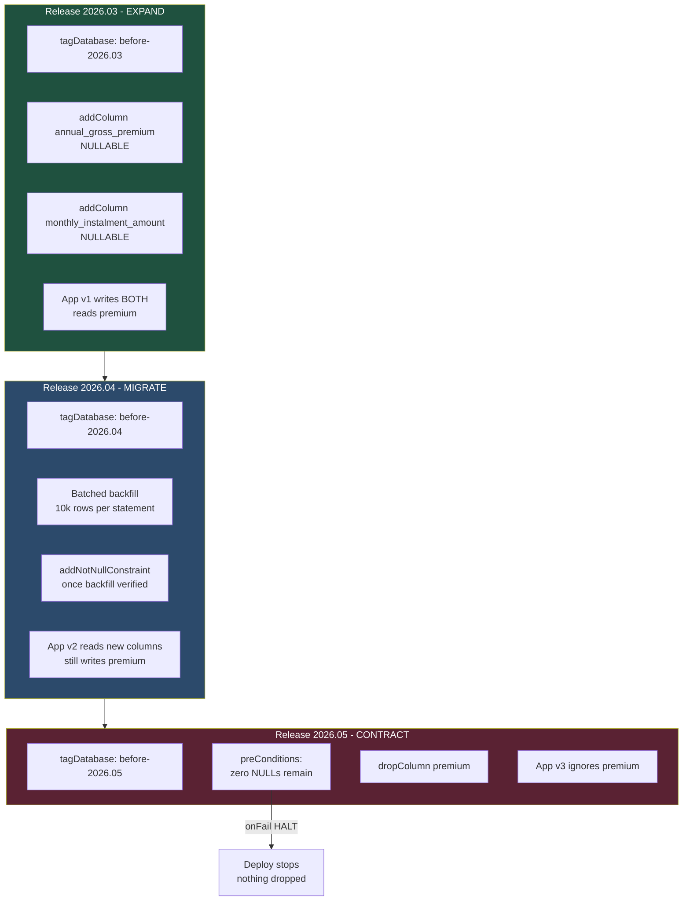

# Three Releases to Rename a Column Without Downtime

Renaming a column in an insurance policy table is a one-line SQL statement and a three-release project. This is the changelog set that makes the difference visible.

## The Real-World Problem

Caledonia Life runs its policy administration on a single `policy` table with 84 million rows. Two things about it are true at once: it is the system of record that the regulator inspects, and it has a column named `premium` whose meaning nobody agrees on.

Half the code treats `premium` as the annual gross premium. The actuarial extract treats it as the monthly instalment. A reconciliation in Q1 found £3.1m of apparent discrepancy that turned out to be twelve months of arithmetic. The fix agreed with the business: split it into `annual_gross_premium` and `monthly_instalment_amount`, with `premium` retired.

The obvious changelog is one changeset:

```sql
ALTER TABLE policy RENAME COLUMN premium TO annual_gross_premium;
```

That statement fails for three separate reasons. It takes an `ACCESS EXCLUSIVE` lock — brief in PostgreSQL for a rename, but the deploy is rolling, so the currently-running application version still selects `premium` and starts throwing `column does not exist` mid-request. There is no rollback that recovers data if the column is dropped and something downstream was still writing it. And the audit trail shows a column vanishing with no evidence of what the values were or who authorised the change — the control the auditor asks for is "show me the migration, its approval, and its reversal plan", and "we renamed it" is not an answer.

The pattern that does work is expand/contract, spread across three releases, with every step reversible and the destructive step guarded by a precondition that refuses to run if the world is not as expected.

## The Concept

Liquibase's value is not that it runs SQL. It is that every change is an **identified, checksummed, ordered, reversible** unit recorded in `databasechangelog`. That record is the audit evidence.

The decisions embedded in the changelogs below:

- **YAML is the primary format.** It reads well in a pull request, which is where schema changes get reviewed. One XML equivalent is shown for comparison because some tooling and some teams still standardise on it.
- **One changeset does one thing, and never changes after it has run.** Editing a deployed changeset breaks its checksum and fails the next deploy — correctly. You add a new changeset instead.
- **Every changeset has an explicit `rollback`.** Liquibase auto-generates rollback for `createTable` and `addColumn`, but not for `sql`, `update`, or `dropColumn`. Where it can generate one, being explicit still documents intent; where it cannot, its absence is a production trap.
- **The destructive step is guarded by `preConditions`.** A `dropColumn` runs only if the backfill genuinely finished. `onFail: HALT` means the deploy stops rather than proceeding on a false assumption.
- **`contexts` and `labels` separate concerns.** `context` decides *where* a changeset runs (dev seed data never reaches production). `label` decides *which subset* a given command targets (`--labels=expand` for the safe half of a release).
- **`tagDatabase` before each release** creates the named point `rollback` can return to.

## How It Works



Each release is independently deployable and independently reversible. At no point is there a version of the application in production that cannot read the schema in production.

## Practical Example

### File layout

```
policy-admin/
├── build.gradle.kts
├── liquibase.properties
└── src/main/resources/db/changelog/
    ├── db.changelog-master.yaml
    ├── releases/
    │   ├── 2026.02/
    │   │   ├── 001-create-policy-table.yaml
    │   │   ├── 002-policy-indexes.yaml
    │   │   └── 003-create-policy-premium-audit.yaml
    │   ├── 2026.03/
    │   │   └── 001-expand-add-premium-columns.yaml
    │   ├── 2026.04/
    │   │   ├── 001-backfill-premium-columns.yaml
    │   │   └── 002-enforce-not-null.yaml
    │   └── 2026.05/
    │       └── 001-contract-drop-premium.yaml
    ├── reference-data/
    │   ├── 001-product-codes.yaml
    │   └── 002-dev-sample-policies.yaml
    └── xml-comparison/
        └── 001-create-policy-table.xml
```

### The master changelog

```yaml
# db/changelog/db.changelog-master.yaml
databaseChangeLog:

  # Release folders are listed explicitly and in order. `include` beats `includeAll`
  # here because the deploy order of releases is a decision, not an alphabetical accident.
  - include:
      file: releases/2026.02/001-create-policy-table.yaml
      relativeToChangelogFile: true
  - include:
      file: releases/2026.02/002-policy-indexes.yaml
      relativeToChangelogFile: true
  - include:
      file: releases/2026.02/003-create-policy-premium-audit.yaml
      relativeToChangelogFile: true

  - include:
      file: releases/2026.03/001-expand-add-premium-columns.yaml
      relativeToChangelogFile: true

  - include:
      file: releases/2026.04/001-backfill-premium-columns.yaml
      relativeToChangelogFile: true
  - include:
      file: releases/2026.04/002-enforce-not-null.yaml
      relativeToChangelogFile: true

  - include:
      file: releases/2026.05/001-contract-drop-premium.yaml
      relativeToChangelogFile: true

  # Reference data is idempotent and order-independent, so includeAll is safe and
  # means a new lookup table does not require editing the master file.
  - includeAll:
      path: reference-data/
      relativeToChangelogFile: true
      errorIfMissingOrEmpty: true
```

`includeAll` is used only where alphabetical order is genuinely irrelevant. Anywhere order carries meaning, `include` makes the sequence reviewable in the diff.

### Release 2026.02 — the table

```yaml
# releases/2026.02/001-create-policy-table.yaml
databaseChangeLog:

  - changeSet:
      id: 2026.02-001-tag
      author: mengty.lim
      changes:
        - tagDatabase:
            tag: before-2026.02
      rollback: []          # tagging is a no-op to reverse

  - changeSet:
      id: 2026.02-001-create-policy
      author: mengty.lim
      labels: schema,release-2026.02
      comment: >
        Policy system of record. Ref CHG-20261-0044, approved by
        the Data Governance board 2026-02-04.
      changes:
        - createTable:
            tableName: policy
            remarks: One row per issued life or protection policy
            columns:
              - column:
                  name: id
                  type: uuid
                  constraints:
                    primaryKey: true
                    primaryKeyName: pk_policy
                    nullable: false
              - column:
                  name: policy_number
                  type: varchar(24)
                  constraints:
                    nullable: false
                    unique: true
                    uniqueConstraintName: uq_policy_policy_number
              - column:
                  name: product_code
                  type: varchar(16)
                  constraints:
                    nullable: false
                    foreignKeyName: fk_policy_product_code
                    references: product_code(code)
              - column:
                  name: policyholder_id
                  type: uuid
                  constraints:
                    nullable: false
              - column:
                  name: status
                  type: varchar(20)
                  defaultValue: QUOTED
                  constraints:
                    nullable: false
              - column:
                  name: inception_date
                  type: date
                  constraints:
                    nullable: false
              - column:
                  name: expiry_date
                  type: date
              - column:
                  name: sum_assured
                  type: numeric(19,2)
                  constraints:
                    nullable: false
              # The ambiguous column this whole article is about.
              - column:
                  name: premium
                  type: numeric(19,2)
                  remarks: DEPRECATED 2026.03 - ambiguous annual vs monthly
                  constraints:
                    nullable: false
              - column:
                  name: currency
                  type: char(3)
                  defaultValue: GBP
                  constraints:
                    nullable: false
              - column:
                  name: created_at
                  type: timestamp with time zone
                  defaultValueComputed: now()
                  constraints:
                    nullable: false
              - column:
                  name: updated_at
                  type: timestamp with time zone
                  defaultValueComputed: now()
                  constraints:
                    nullable: false
              - column:
                  name: version
                  type: bigint
                  defaultValueNumeric: 0
                  constraints:
                    nullable: false

        - addCheckConstraint:
            tableName: policy
            constraintName: ck_policy_status
            constraintBody: >
              status IN ('QUOTED','ACTIVE','LAPSED','SURRENDERED','CLAIMED','CANCELLED')

        - addCheckConstraint:
            tableName: policy
            constraintName: ck_policy_dates
            constraintBody: expiry_date IS NULL OR expiry_date > inception_date

        - addCheckConstraint:
            tableName: policy
            constraintName: ck_policy_sum_assured_positive
            constraintBody: sum_assured > 0

      rollback:
        - dropTable:
            tableName: policy
            cascadeConstraints: true
```

### Release 2026.02 — indexes, separately

```yaml
# releases/2026.02/002-policy-indexes.yaml
databaseChangeLog:

  - changeSet:
      id: 2026.02-002-idx-policyholder
      author: mengty.lim
      labels: index,release-2026.02
      comment: Supports the customer portal's "my policies" query.
      changes:
        - createIndex:
            indexName: idx_policy_policyholder_status
            tableName: policy
            columns:
              - column:
                  name: policyholder_id
              - column:
                  name: status
      rollback:
        - dropIndex:
            indexName: idx_policy_policyholder_status
            tableName: policy

  - changeSet:
      id: 2026.02-002-idx-renewals
      author: mengty.lim
      labels: index,release-2026.02
      comment: >
        Partial index for the nightly renewals batch. Only ACTIVE policies
        are ever scanned, so indexing the rest wastes write throughput on
        an 84m-row table.
      changes:
        - sql:
            splitStatements: false
            sql: >
              CREATE INDEX CONCURRENTLY idx_policy_active_expiry
              ON policy (expiry_date)
              WHERE status = 'ACTIVE'
      rollback:
        - sql:
            sql: DROP INDEX CONCURRENTLY IF EXISTS idx_policy_active_expiry
      # CREATE INDEX CONCURRENTLY cannot run inside a transaction block.
      runInTransaction: false
```

`CREATE INDEX CONCURRENTLY` on an 84-million-row table is the difference between a five-minute write outage and no outage at all. It requires `runInTransaction: false`, which is why it lives in its own changeset — a failure here must not roll back anything else.

```yaml
# releases/2026.02/003-create-policy-premium-audit.yaml
databaseChangeLog:

  - changeSet:
      id: 2026.02-003-premium-audit
      author: mengty.lim
      labels: schema,release-2026.02,audit
      comment: >
        Immutable record of premium value changes. The regulator asks who
        changed a premium and when; the application cannot be the only witness.
      changes:
        - createTable:
            tableName: policy_premium_audit
            columns:
              - column:
                  name: id
                  type: bigint
                  autoIncrement: true
                  constraints:
                    primaryKey: true
                    primaryKeyName: pk_policy_premium_audit
              - column:
                  name: policy_id
                  type: uuid
                  constraints:
                    nullable: false
              - column:
                  name: old_value
                  type: numeric(19,2)
              - column:
                  name: new_value
                  type: numeric(19,2)
              - column:
                  name: column_name
                  type: varchar(64)
                  constraints:
                    nullable: false
              - column:
                  name: changed_by
                  type: varchar(128)
                  constraints:
                    nullable: false
              - column:
                  name: changed_at
                  type: timestamp with time zone
                  defaultValueComputed: now()
                  constraints:
                    nullable: false
              - column:
                  name: change_reference
                  type: varchar(64)
      rollback:
        - dropTable:
            tableName: policy_premium_audit
```

### The same changeset in XML

For teams standardised on XML, or tooling that only consumes it, the create-table changeset above is byte-for-byte equivalent to this. Liquibase treats the two identically — the `id`/`author` pair is the identity, and the format is a serialisation detail:

```xml
<!-- xml-comparison/001-create-policy-table.xml -->
<?xml version="1.0" encoding="UTF-8"?>
<databaseChangeLog
    xmlns="http://www.liquibase.org/xml/ns/dbchangelog"
    xmlns:xsi="http://www.w3.org/2001/XMLSchema-instance"
    xsi:schemaLocation="http://www.liquibase.org/xml/ns/dbchangelog
        http://www.liquibase.org/xml/ns/dbchangelog/dbchangelog-4.31.xsd">

    <changeSet id="2026.02-001-create-policy" author="mengty.lim" labels="schema,release-2026.02">
        <comment>
            Policy system of record. Ref CHG-20261-0044, approved by
            the Data Governance board 2026-02-04.
        </comment>

        <createTable tableName="policy" remarks="One row per issued life or protection policy">
            <column name="id" type="uuid">
                <constraints primaryKey="true" primaryKeyName="pk_policy" nullable="false"/>
            </column>
            <column name="policy_number" type="varchar(24)">
                <constraints nullable="false" unique="true"
                             uniqueConstraintName="uq_policy_policy_number"/>
            </column>
            <column name="product_code" type="varchar(16)">
                <constraints nullable="false"
                             foreignKeyName="fk_policy_product_code"
                             references="product_code(code)"/>
            </column>
            <column name="policyholder_id" type="uuid">
                <constraints nullable="false"/>
            </column>
            <column name="status" type="varchar(20)" defaultValue="QUOTED">
                <constraints nullable="false"/>
            </column>
            <column name="inception_date" type="date">
                <constraints nullable="false"/>
            </column>
            <column name="expiry_date" type="date"/>
            <column name="sum_assured" type="numeric(19,2)">
                <constraints nullable="false"/>
            </column>
            <column name="premium" type="numeric(19,2)"
                    remarks="DEPRECATED 2026.03 - ambiguous annual vs monthly">
                <constraints nullable="false"/>
            </column>
            <column name="currency" type="char(3)" defaultValue="GBP">
                <constraints nullable="false"/>
            </column>
            <column name="created_at" type="timestamp with time zone" defaultValueComputed="now()">
                <constraints nullable="false"/>
            </column>
            <column name="updated_at" type="timestamp with time zone" defaultValueComputed="now()">
                <constraints nullable="false"/>
            </column>
            <column name="version" type="bigint" defaultValueNumeric="0">
                <constraints nullable="false"/>
            </column>
        </createTable>

        <addCheckConstraint tableName="policy" constraintName="ck_policy_status"
            constraintBody="status IN ('QUOTED','ACTIVE','LAPSED','SURRENDERED','CLAIMED','CANCELLED')"/>
        <addCheckConstraint tableName="policy" constraintName="ck_policy_dates"
            constraintBody="expiry_date IS NULL OR expiry_date &gt; inception_date"/>
        <addCheckConstraint tableName="policy" constraintName="ck_policy_sum_assured_positive"
            constraintBody="sum_assured &gt; 0"/>

        <rollback>
            <dropTable tableName="policy" cascadeConstraints="true"/>
        </rollback>
    </changeSet>
</databaseChangeLog>
```

The XML costs you `&gt;` escaping and 40% more lines; it buys you XSD validation in the IDE, which catches a misspelled attribute before you run anything. Pick one per repository and do not mix.

### Release 2026.03 — expand

```yaml
# releases/2026.03/001-expand-add-premium-columns.yaml
databaseChangeLog:

  - changeSet:
      id: 2026.03-000-tag
      author: mengty.lim
      changes:
        - tagDatabase:
            tag: before-2026.03
      rollback: []

  - changeSet:
      id: 2026.03-001-add-premium-columns
      author: mengty.lim
      labels: expand,release-2026.03
      comment: >
        EXPAND step of premium split, CHG-20263-0117. Both columns are
        nullable so the currently-deployed application version keeps working
        untouched. Adding a nullable column with no default is metadata-only
        in PostgreSQL 11+ — no table rewrite, no long lock.
      changes:
        - addColumn:
            tableName: policy
            columns:
              - column:
                  name: annual_gross_premium
                  type: numeric(19,2)
                  remarks: Gross premium for a full policy year
              - column:
                  name: monthly_instalment_amount
                  type: numeric(19,2)
                  remarks: Amount collected per monthly instalment, if applicable
      rollback:
        - dropColumn:
            tableName: policy
            columns:
              - column:
                  name: annual_gross_premium
              - column:
                  name: monthly_instalment_amount

  - changeSet:
      id: 2026.03-002-backfill-marker
      author: mengty.lim
      labels: expand,release-2026.03
      comment: >
        Progress marker so the batched backfill in 2026.04 is resumable and
        auditable rather than a script someone ran from a laptop.
      changes:
        - createTable:
            tableName: premium_backfill_progress
            columns:
              - column:
                  name: id
                  type: int
                  constraints:
                    primaryKey: true
                    primaryKeyName: pk_premium_backfill_progress
              - column:
                  name: rows_updated
                  type: bigint
                  defaultValueNumeric: 0
                  constraints:
                    nullable: false
              - column:
                  name: completed_at
                  type: timestamp with time zone
      rollback:
        - dropTable:
            tableName: premium_backfill_progress
```

The application released alongside this writes **both** the old and new columns and reads only the old one. That dual-write window is what makes the next release safe.

### Release 2026.04 — batched backfill and constraint

```yaml
# releases/2026.04/001-backfill-premium-columns.yaml
databaseChangeLog:

  - changeSet:
      id: 2026.04-000-tag
      author: mengty.lim
      changes:
        - tagDatabase:
            tag: before-2026.04
      rollback: []

  - changeSet:
      id: 2026.04-001-backfill-premium
      author: mengty.lim
      labels: migrate,release-2026.04
      comment: >
        MIGRATE step, CHG-20264-0203. 84m rows updated in 10k batches so no
        single transaction holds locks or bloats WAL. A single UPDATE across
        the whole table locked out the renewals batch for 40 minutes in the
        2024 rehearsal - that is why this loops.
      runInTransaction: false
      preConditions:
        - onFail: HALT
        - onError: HALT
        - columnExists:
            tableName: policy
            columnName: annual_gross_premium
        - columnExists:
            tableName: policy
            columnName: premium
      changes:
        - sql:
            splitStatements: false
            stripComments: false
            sql: |
              DO $$
              DECLARE
                  batch_size CONSTANT int := 10000;
                  touched    bigint := 0;
                  total      bigint := 0;
              BEGIN
                  LOOP
                      WITH candidate AS (
                          SELECT id
                          FROM policy
                          WHERE annual_gross_premium IS NULL
                          ORDER BY id
                          LIMIT batch_size
                          FOR UPDATE SKIP LOCKED
                      )
                      UPDATE policy p
                         SET annual_gross_premium = p.premium,
                             monthly_instalment_amount =
                                 round(p.premium / 12.0, 2),
                             updated_at = now()
                        FROM candidate c
                       WHERE p.id = c.id;

                      GET DIAGNOSTICS touched = ROW_COUNT;
                      total := total + touched;
                      EXIT WHEN touched = 0;
                      COMMIT;                       -- release locks between batches
                      PERFORM pg_sleep(0.05);       -- yield to online traffic
                  END LOOP;

                  INSERT INTO premium_backfill_progress (id, rows_updated, completed_at)
                  VALUES (1, total, now())
                  ON CONFLICT (id) DO UPDATE
                     SET rows_updated = EXCLUDED.rows_updated,
                         completed_at = EXCLUDED.completed_at;
              END $$;
      rollback:
        # Data rollback must be explicit: Liquibase cannot infer how to un-backfill.
        # Nulling the new columns is safe because nothing reads them until 2026.05.
        - sql:
            sql: |
              UPDATE policy
                 SET annual_gross_premium = NULL,
                     monthly_instalment_amount = NULL;
              DELETE FROM premium_backfill_progress WHERE id = 1;

  - changeSet:
      id: 2026.04-002-record-backfill-in-audit
      author: mengty.lim
      labels: migrate,release-2026.04,audit
      comment: Audit evidence that the migration, not a human, set these values.
      changes:
        - sql:
            sql: |
              INSERT INTO policy_premium_audit
                  (policy_id, old_value, new_value, column_name, changed_by, change_reference)
              SELECT id, premium, annual_gross_premium,
                     'annual_gross_premium', 'liquibase:2026.04-001', 'CHG-20264-0203'
                FROM policy
               WHERE annual_gross_premium IS NOT NULL;
      rollback:
        - sql:
            sql: DELETE FROM policy_premium_audit WHERE change_reference = 'CHG-20264-0203'
```

```yaml
# releases/2026.04/002-enforce-not-null.yaml
databaseChangeLog:

  - changeSet:
      id: 2026.04-003-not-null-annual-premium
      author: mengty.lim
      labels: migrate,release-2026.04
      comment: >
        Only safe once the backfill has left zero NULLs. The precondition is the
        gate - if a row slipped through, the deploy stops instead of failing
        halfway through a table rewrite.
      preConditions:
        - onFail: HALT
        - onFailMessage: >
            Backfill incomplete - annual_gross_premium still has NULL rows.
            Re-run changeset 2026.04-001 before deploying this release.
        - sqlCheck:
            expectedResult: 0
            sql: SELECT count(*) FROM policy WHERE annual_gross_premium IS NULL
      changes:
        - addNotNullConstraint:
            tableName: policy
            columnName: annual_gross_premium
            columnDataType: numeric(19,2)
      rollback:
        - dropNotNullConstraint:
            tableName: policy
            columnName: annual_gross_premium
            columnDataType: numeric(19,2)
```

### Release 2026.05 — contract

```yaml
# releases/2026.05/001-contract-drop-premium.yaml
databaseChangeLog:

  - changeSet:
      id: 2026.05-000-tag
      author: mengty.lim
      changes:
        - tagDatabase:
            tag: before-2026.05
      rollback: []

  - changeSet:
      id: 2026.05-001-drop-premium
      author: mengty.lim
      labels: contract,release-2026.05,destructive
      comment: >
        CONTRACT step, CHG-20265-0261. Runs only after application v3 - which
        no longer references `premium` - has been in production for one full
        renewals cycle. Four preconditions must all hold.
      preConditions:
        - onFail: HALT
        - onError: HALT
        - onFailMessage: >
            Refusing to drop policy.premium: the new columns are not fully
            populated, or the backfill was never recorded as complete.
        - columnExists:
            tableName: policy
            columnName: premium
        - sqlCheck:
            expectedResult: 0
            sql: SELECT count(*) FROM policy WHERE annual_gross_premium IS NULL
        - sqlCheck:
            expectedResult: 0
            sql: >
              SELECT count(*) FROM policy
               WHERE premium IS NOT NULL
                 AND annual_gross_premium <> premium
        - sqlCheck:
            expectedResult: 1
            sql: >
              SELECT count(*) FROM premium_backfill_progress
               WHERE id = 1 AND completed_at IS NOT NULL
      changes:
        - dropColumn:
            tableName: policy
            columnName: premium
      rollback:
        # Structure comes back; values come back from the new column. This is only
        # correct because the migration was value-preserving - which the third
        # precondition above proves.
        - addColumn:
            tableName: policy
            columns:
              - column:
                  name: premium
                  type: numeric(19,2)
        - sql:
            sql: UPDATE policy SET premium = annual_gross_premium
        - addNotNullConstraint:
            tableName: policy
            columnName: premium
            columnDataType: numeric(19,2)

  - changeSet:
      id: 2026.05-002-drop-backfill-progress
      author: mengty.lim
      labels: contract,release-2026.05
      comment: Scaffolding removal. Kept in its own changeset so it can be deferred.
      preConditions:
        - onFail: MARK_RAN
        - tableExists:
            tableName: premium_backfill_progress
      changes:
        - dropTable:
            tableName: premium_backfill_progress
      rollback:
        - createTable:
            tableName: premium_backfill_progress
            columns:
              - column:
                  name: id
                  type: int
                  constraints:
                    primaryKey: true
              - column:
                  name: rows_updated
                  type: bigint
              - column:
                  name: completed_at
                  type: timestamp with time zone
```

### Reference data, separated by context

```yaml
# reference-data/001-product-codes.yaml
databaseChangeLog:

  - changeSet:
      id: ref-001-product-code-table
      author: mengty.lim
      labels: reference-data
      changes:
        - createTable:
            tableName: product_code
            columns:
              - column:
                  name: code
                  type: varchar(16)
                  constraints:
                    primaryKey: true
                    primaryKeyName: pk_product_code
              - column:
                  name: description
                  type: varchar(120)
                  constraints:
                    nullable: false
              - column:
                  name: active
                  type: boolean
                  defaultValueBoolean: true
                  constraints:
                    nullable: false
      rollback:
        - dropTable:
            tableName: product_code

  - changeSet:
      id: ref-002-product-code-values
      author: mengty.lim
      labels: reference-data
      # No context: these codes are identical in every environment.
      changes:
        - loadUpdateData:
            tableName: product_code
            primaryKey: code
            file: reference-data/product-codes.csv
            relativeToChangelogFile: true
            columns:
              - column: { name: code, type: STRING }
              - column: { name: description, type: STRING }
              - column: { name: active, type: BOOLEAN }
      rollback:
        - sql:
            sql: DELETE FROM product_code WHERE code IN ('TERM-L1','TERM-L2','WOL-01','CI-01')
```

```yaml
# reference-data/002-dev-sample-policies.yaml
databaseChangeLog:

  - changeSet:
      id: ref-003-sample-policies
      author: mengty.lim
      # `context` gates WHERE this runs. Production never sees synthetic policyholders,
      # which is also how you keep PII-shaped test data out of a regulated database.
      contextFilter: dev or test
      labels: seed-data
      changes:
        - insert:
            tableName: policy
            columns:
              - column: { name: id, value: 11111111-1111-1111-1111-111111111111 }
              - column: { name: policy_number, value: "POL-DEV-000001" }
              - column: { name: product_code, value: "TERM-L1" }
              - column: { name: policyholder_id, value: 22222222-2222-2222-2222-222222222222 }
              - column: { name: status, value: "ACTIVE" }
              - column: { name: inception_date, valueDate: "2026-01-01" }
              - column: { name: expiry_date, valueDate: "2046-01-01" }
              - column: { name: sum_assured, valueNumeric: 250000.00 }
              - column: { name: premium, valueNumeric: 480.00 }
              - column: { name: currency, value: "GBP" }
      rollback:
        - delete:
            tableName: policy
            where: policy_number = 'POL-DEV-000001'
```

### Spring Boot wiring

```yaml
# src/main/resources/application.yml
spring:
  application:
    name: policy-admin
  datasource:
    url: jdbc:postgresql://localhost:5432/policy
    username: policy_app          # runtime user: DML only, no DDL
    password: ${DB_PASSWORD}
  jpa:
    hibernate:
      ddl-auto: validate          # Liquibase owns the schema; Hibernate only checks it
    open-in-view: false
  liquibase:
    enabled: true
    change-log: classpath:/db/changelog/db.changelog-master.yaml
    contexts: ${LIQUIBASE_CONTEXTS:prod}
    default-schema: public
    # A separate, higher-privileged credential for DDL. The application's own
    # runtime user must not be able to alter the schema.
    user: ${LIQUIBASE_DB_USER:policy_migrator}
    password: ${LIQUIBASE_DB_PASSWORD}
    # Fail fast if two pods try to migrate at once, rather than waiting forever.
    database-change-log-lock-table: databasechangeloglock

---
spring:
  config:
    activate:
      on-profile: local
  liquibase:
    contexts: dev
```

In production the recommendation is stronger: set `spring.liquibase.enabled: false` and run migrations as a distinct pipeline step before the new pods roll. An application that migrates on startup cannot have its migration reviewed, approved, or held.

### Gradle plugin and CLI

```kotlin
// build.gradle.kts
plugins {
    java
    id("org.springframework.boot") version "3.5.0"
    id("io.spring.dependency-management") version "1.1.7"
    id("org.liquibase.gradle") version "3.0.2"
}

java {
    toolchain { languageVersion = JavaLanguageVersion.of(21) }
}

repositories { mavenCentral() }

dependencies {
    implementation("org.springframework.boot:spring-boot-starter-data-jpa")
    implementation("org.liquibase:liquibase-core:4.31.1")
    runtimeOnly("org.postgresql:postgresql")

    liquibaseRuntime("org.liquibase:liquibase-core:4.31.1")
    liquibaseRuntime("org.postgresql:postgresql:42.7.4")
    liquibaseRuntime("info.picocli:picocli:4.7.6")

    testImplementation("org.springframework.boot:spring-boot-starter-test")
    testImplementation("org.testcontainers:postgresql:1.20.4")
}

liquibase {
    activities.register("main") {
        arguments = mapOf(
            "changelogFile" to "src/main/resources/db/changelog/db.changelog-master.yaml",
            "url" to (System.getenv("DB_URL") ?: "jdbc:postgresql://localhost:5432/policy"),
            "username" to (System.getenv("LIQUIBASE_DB_USER") ?: "policy_migrator"),
            "password" to (System.getenv("LIQUIBASE_DB_PASSWORD") ?: ""),
            "contexts" to (System.getenv("LIQUIBASE_CONTEXTS") ?: "prod"),
            "logLevel" to "info"
        )
    }
}
```

```properties
# liquibase.properties — for the standalone CLI
changelogFile=src/main/resources/db/changelog/db.changelog-master.yaml
url=jdbc:postgresql://localhost:5432/policy
username=policy_migrator
liquibase.hub.mode=off
```

The commands that matter, in the order a regulated change actually uses them:

```bash
# 1. What is pending? Run this in CI on every PR that touches a changelog.
liquibase status --verbose --contexts=prod

# 2. Generate the SQL for review and attach it to the change record.
#    Nothing is executed. This artefact is the approval evidence.
liquibase update-sql --contexts=prod > CHG-20265-0261-forward.sql

# 3. Generate the reversal SQL too. A change without a printed rollback
#    does not get approved.
liquibase rollback-sql --tag=before-2026.05 --contexts=prod \
  > CHG-20265-0261-rollback.sql

# 4. Tag before touching anything, so there is a named point to return to.
liquibase tag --tag=before-2026.05

# 5. Apply. In a pipeline, not from a laptop.
liquibase update --contexts=prod

# 6. Confirm.
liquibase history
liquibase status --verbose --contexts=prod   # expect "0 changesets have not been applied"

# --- if it goes wrong ---

# Roll back to the tag taken in step 4.
liquibase rollback --tag=before-2026.05

# Or roll back a precise number of changesets.
liquibase rollback-count --count=2

# Deploy only the non-destructive half of a release.
liquibase update --labels=expand --contexts=prod

# Prove the checksums in the database still match the changelogs in git.
liquibase validate
```

`update-sql` is the single most valuable command in a regulated environment. It turns "trust the tool" into a reviewable SQL file that goes into the change ticket, and it catches the class of error where a changeset looks right in YAML and generates something surprising.

## Enterprise Trade-offs

| Approach | Pros | Cons | When to use (Banking / Insurance / Enterprise) |
|---|---|---|---|
| **YAML changelogs** | Readable in a PR diff; no escaping; less noise per change | No XSD validation, so typos surface at runtime; deep nesting gets indent-sensitive | Default for new projects — schema review happens in pull requests, and readability is what makes review real |
| **XML changelogs** | XSD autocomplete and validation in the IDE; the most mature tooling path | Verbose; `&gt;` escaping in every check constraint; harder to skim | Long-lived estates already on XML, or teams whose generators emit it — do not migrate a working repo for aesthetics |
| **Raw SQL changesets** | Full access to `CONCURRENTLY`, `DO $$` blocks, vendor features | Database-specific; rollback must be hand-written; Liquibase cannot reason about it | Exactly where needed — batched backfills, concurrent indexes — never as the default style |
| **Expand/contract across three releases** | Zero downtime; every step reversible; rolling deploys safe throughout | Three releases and a dual-write window; two columns coexist for months | Any table an always-on system reads — which in banking and insurance is all of them |
| **Single-release rename** | Done in one afternoon | Breaks the running application version mid-deploy; no safe rollback; fails audit | Only on a table with a genuine maintenance window and no downstream consumers |
| **Liquibase on application startup** | One artefact, nothing extra to orchestrate | Migration cannot be reviewed or approved separately; N pods race for the lock; a bad changeset becomes a crash loop | Local and CI only. Production runs migrations as their own gated pipeline stage |

→ Next: [testing-example.md](testing-example.md) · Related: [../../06-database-strategies/05-liquibase-yaml-vs-xml-changelogs.md](../../06-database-strategies/05-liquibase-yaml-vs-xml-changelogs.md) · [../../06-database-strategies/06-schema-migrations-in-a-regulated-environment.md](../../06-database-strategies/06-schema-migrations-in-a-regulated-environment.md) · [../../01-core-concepts/04-data-integrity-and-migrations.md](../../01-core-concepts/04-data-integrity-and-migrations.md) · [../../00-project-setup-roadmap/06-cd-and-deployment.md](../../00-project-setup-roadmap/06-cd-and-deployment.md)
