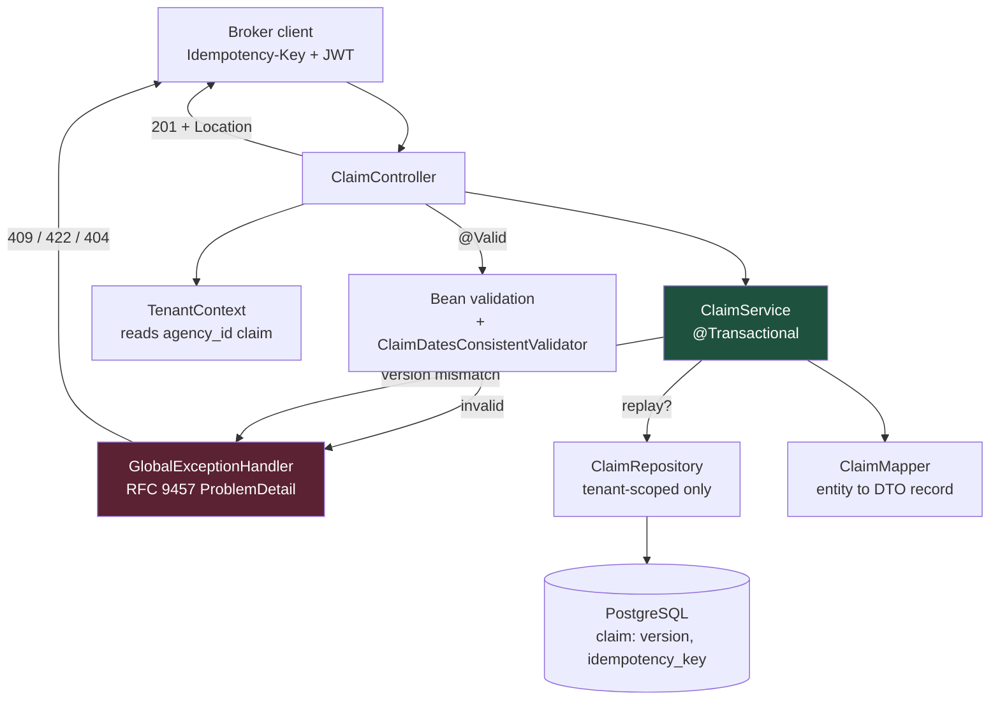

# A CRUD Resource That Survives an Insurance Audit

Everyone can write a `@RestController` with five methods. This is the version that survives concurrent editors, a tenant-isolation review, a leaked-field incident, and a client that retries every POST twice.

## The Real-World Problem

Meridian Assurance runs a broker portal. Brokers from roughly 400 independent agencies file and amend motor claims against policies held by Meridian. Every agency is a tenant; a broker at Agency A must never see a claim belonging to Agency B.

The first version of the claims API shipped in a hurry and accumulated five specific failures:

1. The controller returned the `Claim` JPA entity directly. When someone added an `internalFraudScore` column, it appeared in the public JSON within a single deploy — nobody noticed for eleven days.
2. `claimRepository.findById(id)` was called in fourteen places. Exactly one of them checked the tenant. That one was found during a penetration test.
3. Two adjusters editing the same claim silently overwrote each other. The audit log showed a reserve amount changing from 12,000 to 4,000 with no explanation.
4. `GET /claims?size=100000` pulled the entire table into heap and paged the database out of its buffer cache.
5. A broker's mobile client retried on timeout. The insurer logged 30,000 duplicate claims in one quarter.

None of these are exotic. All five are prevented by decisions you make in the first hour of writing the resource.

## The Concept

This example is a single CRUD resource built with six non-negotiables baked into the code:

- **DTO records in, DTO records out.** The JPA entity never crosses the controller boundary in either direction. Adding a column cannot leak it.
- **Bean validation including a cross-field rule.** `incidentDate` must not be after `reportedDate`, and neither may be in the future — a rule no single-field annotation can express, so it becomes a class-level `@ClaimDatesConsistent` validator.
- **RFC 9457 `ProblemDetail` for every error**, produced centrally by a `@RestControllerAdvice`. One error shape, machine-readable `type` URIs.
- **A narrow repository base interface.** `ClaimRepository` does *not* extend `JpaRepository`. It extends a minimal `Repository<Claim, UUID>` and declares only tenant-scoped methods. An unscoped `findById` does not exist to be called by accident.
- **Optimistic locking with `@Version`.** The client sends the version it read; a mismatch is a `409 Conflict` with the current version in the body, not a silent overwrite.
- **Idempotent create.** `Idempotency-Key` is a unique column. A replay returns the original resource and `200`, not a second claim.

Pagination is capped server-side. Requesting 100,000 rows gets you 200.

## How It Works



## Practical Example

### Package layout

```
claims-api/
├── build.gradle.kts
└── src
    ├── main
    │   ├── java/com/meridian/claims/
    │   │   ├── ClaimsApplication.java
    │   │   ├── api/
    │   │   │   ├── ClaimController.java
    │   │   │   ├── CreateClaimRequest.java
    │   │   │   ├── UpdateClaimRequest.java
    │   │   │   ├── ClaimResponse.java
    │   │   │   ├── PageResponse.java
    │   │   │   ├── ClaimDatesConsistent.java
    │   │   │   ├── ClaimDatesConsistentValidator.java
    │   │   │   └── GlobalExceptionHandler.java
    │   │   ├── domain/
    │   │   │   ├── Claim.java
    │   │   │   ├── ClaimStatus.java
    │   │   │   ├── ClaimNotFoundException.java
    │   │   │   └── ClaimVersionConflictException.java
    │   │   ├── repository/
    │   │   │   └── ClaimRepository.java
    │   │   ├── service/
    │   │   │   ├── ClaimService.java
    │   │   │   └── ClaimMapper.java
    │   │   └── security/
    │   │       └── TenantContext.java
    │   └── resources/
    │       ├── application.yml
    │       └── db/changelog/db.changelog-master.yaml
    └── test/java/com/meridian/claims/api/
        └── ClaimControllerTest.java
```

### The entity — internal only, never serialised

```java
// domain/Claim.java
package com.meridian.claims.domain;

import jakarta.persistence.Column;
import jakarta.persistence.Entity;
import jakarta.persistence.EnumType;
import jakarta.persistence.Enumerated;
import jakarta.persistence.Id;
import jakarta.persistence.Table;
import jakarta.persistence.Version;
import java.math.BigDecimal;
import java.time.Instant;
import java.time.LocalDate;
import java.util.UUID;

@Entity
@Table(name = "claim")
public class Claim {

    @Id
    @Column(name = "id", nullable = false)
    private UUID id;

    @Column(name = "agency_id", nullable = false, length = 64)
    private String agencyId;

    @Column(name = "policy_number", nullable = false, length = 32)
    private String policyNumber;

    @Column(name = "incident_date", nullable = false)
    private LocalDate incidentDate;

    @Column(name = "reported_date", nullable = false)
    private LocalDate reportedDate;

    @Column(name = "reserve_amount", nullable = false, precision = 19, scale = 2)
    private BigDecimal reserveAmount;

    @Column(name = "currency", nullable = false, length = 3)
    private String currency;

    @Column(name = "description", nullable = false, length = 2000)
    private String description;

    @Enumerated(EnumType.STRING)
    @Column(name = "status", nullable = false, length = 24)
    private ClaimStatus status;

    @Column(name = "idempotency_key", nullable = false, length = 200)
    private String idempotencyKey;

    /** Never exposed. Present to prove DTOs matter. */
    @Column(name = "internal_fraud_score")
    private Integer internalFraudScore;

    @Column(name = "created_at", nullable = false)
    private Instant createdAt;

    @Column(name = "updated_at", nullable = false)
    private Instant updatedAt;

    @Version
    @Column(name = "version", nullable = false)
    private long version;

    protected Claim() { }   // JPA

    public Claim(UUID id, String agencyId, String policyNumber, LocalDate incidentDate,
                 LocalDate reportedDate, BigDecimal reserveAmount, String currency,
                 String description, String idempotencyKey, Instant now) {
        this.id = id;
        this.agencyId = agencyId;
        this.policyNumber = policyNumber;
        this.incidentDate = incidentDate;
        this.reportedDate = reportedDate;
        this.reserveAmount = reserveAmount;
        this.currency = currency;
        this.description = description;
        this.status = ClaimStatus.RECEIVED;
        this.idempotencyKey = idempotencyKey;
        this.createdAt = now;
        this.updatedAt = now;
    }

    /** The only mutation path. Status transitions are validated here, not in the controller. */
    public void amend(BigDecimal reserveAmount, String description,
                      ClaimStatus newStatus, Instant now) {
        if (this.status == ClaimStatus.CLOSED) {
            throw new IllegalStateException("a CLOSED claim cannot be amended");
        }
        if (newStatus != null && !this.status.canTransitionTo(newStatus)) {
            throw new IllegalStateException(
                "illegal transition %s -> %s".formatted(this.status, newStatus));
        }
        this.reserveAmount = reserveAmount;
        this.description = description;
        if (newStatus != null) {
            this.status = newStatus;
        }
        this.updatedAt = now;
    }

    public UUID getId() { return id; }
    public String getAgencyId() { return agencyId; }
    public String getPolicyNumber() { return policyNumber; }
    public LocalDate getIncidentDate() { return incidentDate; }
    public LocalDate getReportedDate() { return reportedDate; }
    public BigDecimal getReserveAmount() { return reserveAmount; }
    public String getCurrency() { return currency; }
    public String getDescription() { return description; }
    public ClaimStatus getStatus() { return status; }
    public Instant getCreatedAt() { return createdAt; }
    public Instant getUpdatedAt() { return updatedAt; }
    public long getVersion() { return version; }
}
```

```java
// domain/ClaimStatus.java
package com.meridian.claims.domain;

import java.util.EnumSet;
import java.util.Set;

public enum ClaimStatus {
    RECEIVED, UNDER_ASSESSMENT, AWAITING_DOCUMENTS, APPROVED, REJECTED, CLOSED;

    public boolean canTransitionTo(ClaimStatus target) {
        return allowedNext().contains(target);
    }

    private Set<ClaimStatus> allowedNext() {
        return switch (this) {
            case RECEIVED -> EnumSet.of(UNDER_ASSESSMENT, REJECTED);
            case UNDER_ASSESSMENT -> EnumSet.of(AWAITING_DOCUMENTS, APPROVED, REJECTED);
            case AWAITING_DOCUMENTS -> EnumSet.of(UNDER_ASSESSMENT, REJECTED);
            case APPROVED, REJECTED -> EnumSet.of(CLOSED);
            case CLOSED -> EnumSet.noneOf(ClaimStatus.class);
        };
    }
}
```

```java
// domain/ClaimNotFoundException.java
package com.meridian.claims.domain;

import java.util.UUID;

public class ClaimNotFoundException extends RuntimeException {
    public ClaimNotFoundException(UUID id) {
        super("claim %s does not exist in this agency".formatted(id));
    }
}
```

```java
// domain/ClaimVersionConflictException.java
package com.meridian.claims.domain;

import java.util.UUID;

public class ClaimVersionConflictException extends RuntimeException {

    private final UUID claimId;
    private final long expectedVersion;
    private final long actualVersion;

    public ClaimVersionConflictException(UUID claimId, long expectedVersion, long actualVersion) {
        super("claim %s was modified by another user".formatted(claimId));
        this.claimId = claimId;
        this.expectedVersion = expectedVersion;
        this.actualVersion = actualVersion;
    }

    public UUID claimId() { return claimId; }
    public long expectedVersion() { return expectedVersion; }
    public long actualVersion() { return actualVersion; }
}
```

### The repository — no unscoped lookup exists

```java
// repository/ClaimRepository.java
package com.meridian.claims.repository;

import com.meridian.claims.domain.Claim;
import java.util.Optional;
import java.util.UUID;
import org.springframework.data.domain.Page;
import org.springframework.data.domain.Pageable;
import org.springframework.data.repository.Repository;

/**
 * Deliberately NOT a JpaRepository. Extending the narrow Repository marker means
 * findById(id), findAll(), deleteById(id) and every other unscoped inherited method
 * simply do not exist. Tenant is a mandatory parameter on every query.
 */
public interface ClaimRepository extends Repository<Claim, UUID> {

    Optional<Claim> findByIdAndAgencyId(UUID id, String agencyId);

    Page<Claim> findByAgencyIdOrderByReportedDateDesc(String agencyId, Pageable pageable);

    Page<Claim> findByAgencyIdAndPolicyNumberOrderByReportedDateDesc(
        String agencyId, String policyNumber, Pageable pageable);

    Optional<Claim> findByAgencyIdAndIdempotencyKey(String agencyId, String idempotencyKey);

    boolean existsByAgencyIdAndPolicyNumber(String agencyId, String policyNumber);

    Claim save(Claim claim);

    void delete(Claim claim);
}
```

### Request and response DTOs

```java
// api/CreateClaimRequest.java
package com.meridian.claims.api;

import jakarta.validation.constraints.DecimalMax;
import jakarta.validation.constraints.DecimalMin;
import jakarta.validation.constraints.NotBlank;
import jakarta.validation.constraints.NotNull;
import jakarta.validation.constraints.Pattern;
import jakarta.validation.constraints.Size;
import java.math.BigDecimal;
import java.time.LocalDate;

@ClaimDatesConsistent
public record CreateClaimRequest(

    @NotBlank
    @Pattern(regexp = "MTR-[0-9]{8}", message = "policyNumber must match MTR-########")
    String policyNumber,

    @NotNull
    LocalDate incidentDate,

    @NotNull
    LocalDate reportedDate,

    @NotNull
    @DecimalMin(value = "0.00", inclusive = true)
    @DecimalMax(value = "5000000.00")
    BigDecimal reserveAmount,

    @NotBlank
    @Pattern(regexp = "[A-Z]{3}")
    String currency,

    @NotBlank
    @Size(max = 2000)
    String description

) implements DatedClaimPayload { }
```

```java
// api/UpdateClaimRequest.java
package com.meridian.claims.api;

import com.meridian.claims.domain.ClaimStatus;
import jakarta.validation.constraints.DecimalMin;
import jakarta.validation.constraints.NotBlank;
import jakarta.validation.constraints.NotNull;
import jakarta.validation.constraints.PositiveOrZero;
import jakarta.validation.constraints.Size;
import java.math.BigDecimal;

public record UpdateClaimRequest(

    @NotNull @DecimalMin("0.00") BigDecimal reserveAmount,

    @NotBlank @Size(max = 2000) String description,

    /** Optional: null means "leave the status alone". */
    ClaimStatus status,

    /** The version the client last read. Mandatory — no blind writes. */
    @NotNull @PositiveOrZero Long expectedVersion

) { }
```

```java
// api/ClaimResponse.java
package com.meridian.claims.api;

import java.math.BigDecimal;
import java.time.Instant;
import java.time.LocalDate;
import java.util.UUID;

/**
 * The public contract. internalFraudScore and agencyId are absent by construction —
 * a new entity column cannot appear here without someone editing this file.
 */
public record ClaimResponse(
    UUID id,
    String policyNumber,
    LocalDate incidentDate,
    LocalDate reportedDate,
    BigDecimal reserveAmount,
    String currency,
    String description,
    String status,
    Instant createdAt,
    Instant updatedAt,
    long version
) { }
```

```java
// api/PageResponse.java
package com.meridian.claims.api;

import java.util.List;
import org.springframework.data.domain.Page;

public record PageResponse<T>(
    List<T> content,
    int page,
    int size,
    long totalElements,
    int totalPages,
    boolean hasNext
) {
    public static <E, T> PageResponse<T> from(Page<E> page, java.util.function.Function<E, T> mapper) {
        return new PageResponse<>(
            page.getContent().stream().map(mapper).toList(),
            page.getNumber(),
            page.getSize(),
            page.getTotalElements(),
            page.getTotalPages(),
            page.hasNext());
    }
}
```

### The cross-field validator

```java
// api/DatedClaimPayload.java  (small interface so the validator is reusable)
package com.meridian.claims.api;

import java.time.LocalDate;

public interface DatedClaimPayload {
    LocalDate incidentDate();
    LocalDate reportedDate();
}
```

```java
// api/ClaimDatesConsistent.java
package com.meridian.claims.api;

import jakarta.validation.Constraint;
import jakarta.validation.Payload;
import java.lang.annotation.Documented;
import java.lang.annotation.ElementType;
import java.lang.annotation.Retention;
import java.lang.annotation.RetentionPolicy;
import java.lang.annotation.Target;

@Documented
@Target({ ElementType.TYPE })
@Retention(RetentionPolicy.RUNTIME)
@Constraint(validatedBy = ClaimDatesConsistentValidator.class)
public @interface ClaimDatesConsistent {
    String message() default "incidentDate must not be after reportedDate, and neither may be in the future";
    Class<?>[] groups() default { };
    Class<? extends Payload>[] payload() default { };
}
```

```java
// api/ClaimDatesConsistentValidator.java
package com.meridian.claims.api;

import jakarta.validation.ConstraintValidator;
import jakarta.validation.ConstraintValidatorContext;
import java.time.Clock;
import java.time.LocalDate;

public class ClaimDatesConsistentValidator
        implements ConstraintValidator<ClaimDatesConsistent, DatedClaimPayload> {

    private final Clock clock;

    /** Constructor injection works in validators too — Spring is the ConstraintValidatorFactory. */
    public ClaimDatesConsistentValidator(Clock clock) {
        this.clock = clock;
    }

    @Override
    public boolean isValid(DatedClaimPayload payload, ConstraintValidatorContext context) {
        if (payload == null || payload.incidentDate() == null || payload.reportedDate() == null) {
            return true;   // @NotNull reports those separately
        }
        LocalDate today = LocalDate.now(clock);
        context.disableDefaultConstraintViolation();
        boolean valid = true;

        if (payload.incidentDate().isAfter(payload.reportedDate())) {
            context.buildConstraintViolationWithTemplate(
                    "incidentDate must not be after reportedDate")
                .addPropertyNode("incidentDate").addConstraintViolation();
            valid = false;
        }
        if (payload.reportedDate().isAfter(today)) {
            context.buildConstraintViolationWithTemplate("reportedDate must not be in the future")
                .addPropertyNode("reportedDate").addConstraintViolation();
            valid = false;
        }
        if (payload.incidentDate().isBefore(today.minusYears(6))) {
            context.buildConstraintViolationWithTemplate(
                    "incidentDate is outside the 6-year limitation period")
                .addPropertyNode("incidentDate").addConstraintViolation();
            valid = false;
        }
        return valid;
    }
}
```

### Mapper and service

```java
// service/ClaimMapper.java
package com.meridian.claims.service;

import com.meridian.claims.api.ClaimResponse;
import com.meridian.claims.domain.Claim;
import org.springframework.stereotype.Component;

@Component
public class ClaimMapper {

    public ClaimResponse toResponse(Claim c) {
        return new ClaimResponse(
            c.getId(), c.getPolicyNumber(), c.getIncidentDate(), c.getReportedDate(),
            c.getReserveAmount(), c.getCurrency(), c.getDescription(),
            c.getStatus().name(), c.getCreatedAt(), c.getUpdatedAt(), c.getVersion());
    }
}
```

```java
// service/ClaimService.java
package com.meridian.claims.service;

import com.meridian.claims.api.CreateClaimRequest;
import com.meridian.claims.api.UpdateClaimRequest;
import com.meridian.claims.domain.Claim;
import com.meridian.claims.domain.ClaimNotFoundException;
import com.meridian.claims.domain.ClaimVersionConflictException;
import com.meridian.claims.repository.ClaimRepository;
import java.time.Clock;
import java.time.Instant;
import java.util.UUID;
import org.springframework.data.domain.Page;
import org.springframework.data.domain.Pageable;
import org.springframework.stereotype.Service;
import org.springframework.transaction.annotation.Transactional;

@Service
public class ClaimService {

    private final ClaimRepository claims;
    private final Clock clock;

    public ClaimService(ClaimRepository claims, Clock clock) {
        this.claims = claims;
        this.clock = clock;
    }

    /** Returns the claim plus whether it was newly created, so the controller can pick 201 vs 200. */
    public record CreateResult(Claim claim, boolean created) { }

    @Transactional
    public CreateResult create(String agencyId, String idempotencyKey, CreateClaimRequest request) {
        var replay = claims.findByAgencyIdAndIdempotencyKey(agencyId, idempotencyKey);
        if (replay.isPresent()) {
            return new CreateResult(replay.get(), false);
        }
        Instant now = clock.instant();
        Claim claim = new Claim(
            UUID.randomUUID(), agencyId, request.policyNumber(),
            request.incidentDate(), request.reportedDate(),
            request.reserveAmount(), request.currency(), request.description(),
            idempotencyKey, now);
        return new CreateResult(claims.save(claim), true);
    }

    @Transactional(readOnly = true)
    public Claim get(String agencyId, UUID id) {
        return claims.findByIdAndAgencyId(id, agencyId)
            .orElseThrow(() -> new ClaimNotFoundException(id));
    }

    @Transactional(readOnly = true)
    public Page<Claim> list(String agencyId, String policyNumber, Pageable pageable) {
        return policyNumber == null || policyNumber.isBlank()
            ? claims.findByAgencyIdOrderByReportedDateDesc(agencyId, pageable)
            : claims.findByAgencyIdAndPolicyNumberOrderByReportedDateDesc(
                agencyId, policyNumber, pageable);
    }

    @Transactional
    public Claim update(String agencyId, UUID id, UpdateClaimRequest request) {
        Claim claim = claims.findByIdAndAgencyId(id, agencyId)
            .orElseThrow(() -> new ClaimNotFoundException(id));

        // Explicit pre-check gives a clean 409 with both versions in the body.
        // The @Version column still guards the true race at flush time.
        if (claim.getVersion() != request.expectedVersion()) {
            throw new ClaimVersionConflictException(id, request.expectedVersion(), claim.getVersion());
        }
        claim.amend(request.reserveAmount(), request.description(), request.status(), clock.instant());
        return claims.save(claim);
    }

    @Transactional
    public void delete(String agencyId, UUID id) {
        Claim claim = claims.findByIdAndAgencyId(id, agencyId)
            .orElseThrow(() -> new ClaimNotFoundException(id));
        claims.delete(claim);
    }
}
```

### Tenant resolution

```java
// security/TenantContext.java
package com.meridian.claims.security;

import org.springframework.security.oauth2.jwt.Jwt;
import org.springframework.stereotype.Component;

@Component
public class TenantContext {

    /**
     * The agency comes from a signed claim, never from a header or query parameter.
     * A missing claim is a configuration failure and must fail loudly.
     */
    public String agencyIdOf(Jwt jwt) {
        String agencyId = jwt.getClaimAsString("agency_id");
        if (agencyId == null || agencyId.isBlank()) {
            throw new IllegalStateException("token carries no agency_id claim");
        }
        return agencyId;
    }
}
```

### The controller

```java
// api/ClaimController.java
package com.meridian.claims.api;

import com.meridian.claims.domain.Claim;
import com.meridian.claims.security.TenantContext;
import com.meridian.claims.service.ClaimMapper;
import com.meridian.claims.service.ClaimService;
import jakarta.validation.Valid;
import jakarta.validation.constraints.NotBlank;
import jakarta.validation.constraints.Size;
import java.net.URI;
import java.util.UUID;
import org.springframework.data.domain.Page;
import org.springframework.data.domain.PageRequest;
import org.springframework.data.domain.Pageable;
import org.springframework.http.ResponseEntity;
import org.springframework.security.access.prepost.PreAuthorize;
import org.springframework.security.core.annotation.AuthenticationPrincipal;
import org.springframework.security.oauth2.jwt.Jwt;
import org.springframework.web.bind.annotation.DeleteMapping;
import org.springframework.web.bind.annotation.GetMapping;
import org.springframework.web.bind.annotation.PathVariable;
import org.springframework.web.bind.annotation.PostMapping;
import org.springframework.web.bind.annotation.PutMapping;
import org.springframework.web.bind.annotation.RequestBody;
import org.springframework.web.bind.annotation.RequestHeader;
import org.springframework.web.bind.annotation.RequestMapping;
import org.springframework.web.bind.annotation.RequestParam;
import org.springframework.web.bind.annotation.RestController;

@RestController
@RequestMapping("/api/v1/claims")
public class ClaimController {

    /** The cap that stops `?size=100000`. Enforced here, not trusted from the client. */
    private static final int MAX_PAGE_SIZE = 100;
    private static final int DEFAULT_PAGE_SIZE = 25;

    private final ClaimService service;
    private final ClaimMapper mapper;
    private final TenantContext tenants;

    public ClaimController(ClaimService service, ClaimMapper mapper, TenantContext tenants) {
        this.service = service;
        this.mapper = mapper;
        this.tenants = tenants;
    }

    @PostMapping
    @PreAuthorize("hasAuthority('SCOPE_claims:write') and hasRole('BROKER')")
    public ResponseEntity<ClaimResponse> create(
            @RequestHeader("Idempotency-Key") @NotBlank @Size(max = 200) String idempotencyKey,
            @Valid @RequestBody CreateClaimRequest request,
            @AuthenticationPrincipal Jwt jwt) {

        var result = service.create(tenants.agencyIdOf(jwt), idempotencyKey, request);
        ClaimResponse body = mapper.toResponse(result.claim());
        URI location = URI.create("/api/v1/claims/" + result.claim().getId());

        return result.created()
            ? ResponseEntity.created(location).eTag("\"" + body.version() + "\"").body(body)
            : ResponseEntity.ok().location(location).eTag("\"" + body.version() + "\"").body(body);
    }

    @GetMapping("/{id}")
    @PreAuthorize("hasAuthority('SCOPE_claims:read')")
    public ResponseEntity<ClaimResponse> get(@PathVariable UUID id,
                                             @AuthenticationPrincipal Jwt jwt) {
        Claim claim = service.get(tenants.agencyIdOf(jwt), id);
        return ResponseEntity.ok()
            .eTag("\"" + claim.getVersion() + "\"")
            .body(mapper.toResponse(claim));
    }

    @GetMapping
    @PreAuthorize("hasAuthority('SCOPE_claims:read')")
    public PageResponse<ClaimResponse> list(
            @RequestParam(defaultValue = "0") int page,
            @RequestParam(defaultValue = "" + DEFAULT_PAGE_SIZE) int size,
            @RequestParam(required = false) String policyNumber,
            @AuthenticationPrincipal Jwt jwt) {

        Pageable pageable = PageRequest.of(Math.max(page, 0), clampSize(size));
        Page<Claim> result = service.list(tenants.agencyIdOf(jwt), policyNumber, pageable);
        return PageResponse.from(result, mapper::toResponse);
    }

    @PutMapping("/{id}")
    @PreAuthorize("hasAuthority('SCOPE_claims:write') and hasRole('ADJUSTER')")
    public ResponseEntity<ClaimResponse> update(@PathVariable UUID id,
                                                @Valid @RequestBody UpdateClaimRequest request,
                                                @AuthenticationPrincipal Jwt jwt) {
        Claim updated = service.update(tenants.agencyIdOf(jwt), id, request);
        return ResponseEntity.ok()
            .eTag("\"" + updated.getVersion() + "\"")
            .body(mapper.toResponse(updated));
    }

    @DeleteMapping("/{id}")
    @PreAuthorize("hasAuthority('SCOPE_claims:write') and hasRole('CLAIMS_ADMIN')")
    public ResponseEntity<Void> delete(@PathVariable UUID id, @AuthenticationPrincipal Jwt jwt) {
        service.delete(tenants.agencyIdOf(jwt), id);
        return ResponseEntity.noContent().build();
    }

    private static int clampSize(int requested) {
        if (requested < 1) {
            return DEFAULT_PAGE_SIZE;
        }
        return Math.min(requested, MAX_PAGE_SIZE);
    }
}
```

### One error shape for the whole API

```java
// api/GlobalExceptionHandler.java
package com.meridian.claims.api;

import com.meridian.claims.domain.ClaimNotFoundException;
import com.meridian.claims.domain.ClaimVersionConflictException;
import jakarta.servlet.http.HttpServletRequest;
import java.net.URI;
import java.time.Instant;
import java.util.LinkedHashMap;
import java.util.List;
import java.util.Map;
import org.springframework.dao.OptimisticLockingFailureException;
import org.springframework.http.HttpStatus;
import org.springframework.http.ProblemDetail;
import org.springframework.validation.FieldError;
import org.springframework.web.bind.MethodArgumentNotValidException;
import org.springframework.web.bind.annotation.ExceptionHandler;
import org.springframework.web.bind.annotation.RestControllerAdvice;

/**
 * RFC 9457 Problem Details. Every non-2xx body in this service has this shape:
 * type, title, status, detail, instance, plus typed extensions.
 */
@RestControllerAdvice
public class GlobalExceptionHandler {

    private static final String BASE = "https://api.meridian-assurance.example/problems/";

    @ExceptionHandler(MethodArgumentNotValidException.class)
    ProblemDetail onValidation(MethodArgumentNotValidException ex, HttpServletRequest req) {
        List<Map<String, String>> errors = ex.getBindingResult().getAllErrors().stream()
            .map(err -> {
                Map<String, String> entry = new LinkedHashMap<>();
                entry.put("field", err instanceof FieldError fe ? fe.getField() : err.getObjectName());
                entry.put("message", err.getDefaultMessage());
                return entry;
            })
            .toList();

        ProblemDetail problem = base(HttpStatus.UNPROCESSABLE_ENTITY,
            "Validation failed", "the request body did not satisfy the claim schema",
            "validation-failed", req);
        problem.setProperty("errors", errors);
        return problem;
    }

    @ExceptionHandler(ClaimNotFoundException.class)
    ProblemDetail onNotFound(ClaimNotFoundException ex, HttpServletRequest req) {
        // Same response whether the claim is absent or belongs to another agency:
        // a 403 here would confirm the id exists elsewhere.
        return base(HttpStatus.NOT_FOUND, "Claim not found", ex.getMessage(), "claim-not-found", req);
    }

    @ExceptionHandler(ClaimVersionConflictException.class)
    ProblemDetail onConflict(ClaimVersionConflictException ex, HttpServletRequest req) {
        ProblemDetail problem = base(HttpStatus.CONFLICT, "Version conflict", ex.getMessage(),
            "version-conflict", req);
        problem.setProperty("claimId", ex.claimId());
        problem.setProperty("expectedVersion", ex.expectedVersion());
        problem.setProperty("currentVersion", ex.actualVersion());
        problem.setProperty("remedy", "re-read the claim, re-apply your change, retry");
        return problem;
    }

    /** The genuine race: two writers passed the pre-check, Hibernate caught it at flush. */
    @ExceptionHandler(OptimisticLockingFailureException.class)
    ProblemDetail onOptimisticLock(OptimisticLockingFailureException ex, HttpServletRequest req) {
        return base(HttpStatus.CONFLICT, "Version conflict",
            "the claim was modified concurrently; re-read and retry", "version-conflict", req);
    }

    @ExceptionHandler(IllegalStateException.class)
    ProblemDetail onIllegalState(IllegalStateException ex, HttpServletRequest req) {
        return base(HttpStatus.UNPROCESSABLE_ENTITY, "Illegal claim transition",
            ex.getMessage(), "illegal-transition", req);
    }

    private ProblemDetail base(HttpStatus status, String title, String detail,
                               String slug, HttpServletRequest req) {
        ProblemDetail problem = ProblemDetail.forStatusAndDetail(status, detail);
        problem.setTitle(title);
        problem.setType(URI.create(BASE + slug));
        problem.setInstance(URI.create(req.getRequestURI()));
        problem.setProperty("timestamp", Instant.now());
        return problem;
    }
}
```

A `409` on the wire looks like this:

```json
{
  "type": "https://api.meridian-assurance.example/problems/version-conflict",
  "title": "Version conflict",
  "status": 409,
  "detail": "claim 8f1c... was modified by another user",
  "instance": "/api/v1/claims/8f1c8f3e-6d21-4a55-9e7b-2c0f9a1b4d33",
  "timestamp": "2026-08-10T09:12:44.113Z",
  "claimId": "8f1c8f3e-6d21-4a55-9e7b-2c0f9a1b4d33",
  "expectedVersion": 3,
  "currentVersion": 5,
  "remedy": "re-read the claim, re-apply your change, retry"
}
```

### Wiring and config

```java
// ClaimsApplication.java
package com.meridian.claims;

import java.time.Clock;
import org.springframework.boot.SpringApplication;
import org.springframework.boot.autoconfigure.SpringBootApplication;
import org.springframework.context.annotation.Bean;
import org.springframework.security.config.annotation.method.configuration.EnableMethodSecurity;

@SpringBootApplication
@EnableMethodSecurity
public class ClaimsApplication {

    public static void main(String[] args) {
        SpringApplication.run(ClaimsApplication.class, args);
    }

    @Bean
    Clock clock() {
        return Clock.systemUTC();
    }
}
```

```yaml
# src/main/resources/application.yml
spring:
  application:
    name: claims-api
  datasource:
    url: jdbc:postgresql://localhost:5432/claims
    username: claims_app
    password: ${DB_PASSWORD}
  jpa:
    open-in-view: false          # never leave a session open across the view layer
    hibernate:
      ddl-auto: validate         # Liquibase owns the schema
    properties:
      hibernate.jdbc.batch_size: 50
  liquibase:
    change-log: classpath:/db/changelog/db.changelog-master.yaml
  security:
    oauth2:
      resourceserver:
        jwt:
          issuer-uri: https://sso.meridian-assurance.example/realms/brokers

server:
  error:
    include-message: never       # the advice owns error bodies

logging:
  level:
    org.hibernate.SQL: warn
```

### The test

```java
// test/java/com/meridian/claims/api/ClaimControllerTest.java
package com.meridian.claims.api;

import static org.springframework.security.test.web.servlet.request.SecurityMockMvcRequestPostProcessors.jwt;
import static org.springframework.test.web.servlet.request.MockMvcRequestBuilders.get;
import static org.springframework.test.web.servlet.request.MockMvcRequestBuilders.post;
import static org.springframework.test.web.servlet.request.MockMvcRequestBuilders.put;
import static org.springframework.test.web.servlet.result.MockMvcResultMatchers.header;
import static org.springframework.test.web.servlet.result.MockMvcResultMatchers.jsonPath;
import static org.springframework.test.web.servlet.result.MockMvcResultMatchers.status;

import com.fasterxml.jackson.databind.ObjectMapper;
import com.meridian.claims.domain.Claim;
import com.meridian.claims.domain.ClaimVersionConflictException;
import com.meridian.claims.security.TenantContext;
import com.meridian.claims.service.ClaimMapper;
import com.meridian.claims.service.ClaimService;
import java.math.BigDecimal;
import java.time.Clock;
import java.time.Instant;
import java.time.LocalDate;
import java.time.ZoneOffset;
import java.util.List;
import java.util.UUID;
import org.junit.jupiter.api.Test;
import org.mockito.BDDMockito;
import org.springframework.beans.factory.annotation.Autowired;
import org.springframework.boot.test.autoconfigure.web.servlet.WebMvcTest;
import org.springframework.boot.test.context.TestConfiguration;
import org.springframework.context.annotation.Bean;
import org.springframework.context.annotation.Import;
import org.springframework.data.domain.PageImpl;
import org.springframework.data.domain.PageRequest;
import org.springframework.http.MediaType;
import org.springframework.test.context.bean.override.mockito.MockitoBean;
import org.springframework.test.web.servlet.MockMvc;

@WebMvcTest(ClaimController.class)
@Import({ ClaimMapper.class, TenantContext.class, ClaimControllerTest.FixedClockConfig.class })
class ClaimControllerTest {

    private static final Instant NOW = Instant.parse("2026-08-10T09:00:00Z");

    @TestConfiguration
    static class FixedClockConfig {
        @Bean
        Clock clock() {
            return Clock.fixed(NOW, ZoneOffset.UTC);
        }
    }

    @Autowired MockMvc mvc;
    @Autowired ObjectMapper json;

    @MockitoBean ClaimService service;

    private static final UUID CLAIM_ID = UUID.fromString("8f1c8f3e-6d21-4a55-9e7b-2c0f9a1b4d33");

    private static Claim sampleClaim() {
        return new Claim(CLAIM_ID, "agency-114", "MTR-20260041",
            LocalDate.of(2026, 7, 28), LocalDate.of(2026, 7, 30),
            new BigDecimal("12000.00"), "EUR", "Rear-end collision, A4 near Ghent",
            "idem-001", NOW);
    }

    private static org.springframework.security.test.web.servlet.request
            .SecurityMockMvcRequestPostProcessors.JwtRequestPostProcessor broker() {
        return jwt()
            .jwt(builder -> builder.claim("agency_id", "agency-114"))
            .authorities(new org.springframework.security.core.authority
                .SimpleGrantedAuthority("SCOPE_claims:write"),
                new org.springframework.security.core.authority
                    .SimpleGrantedAuthority("SCOPE_claims:read"),
                new org.springframework.security.core.authority
                    .SimpleGrantedAuthority("ROLE_BROKER"));
    }

    @Test
    void create_returns201WithLocationHeaderAndNoInternalFields() throws Exception {
        BDDMockito.given(service.create(BDDMockito.eq("agency-114"), BDDMockito.eq("idem-001"),
                BDDMockito.any(CreateClaimRequest.class)))
            .willReturn(new ClaimService.CreateResult(sampleClaim(), true));

        var body = new CreateClaimRequest("MTR-20260041",
            LocalDate.of(2026, 7, 28), LocalDate.of(2026, 7, 30),
            new BigDecimal("12000.00"), "EUR", "Rear-end collision, A4 near Ghent");

        mvc.perform(post("/api/v1/claims")
                .with(broker())
                .header("Idempotency-Key", "idem-001")
                .contentType(MediaType.APPLICATION_JSON)
                .content(json.writeValueAsString(body)))
            .andExpect(status().isCreated())
            .andExpect(header().string("Location", "/api/v1/claims/" + CLAIM_ID))
            .andExpect(jsonPath("$.policyNumber").value("MTR-20260041"))
            .andExpect(jsonPath("$.status").value("RECEIVED"))
            .andExpect(jsonPath("$.internalFraudScore").doesNotExist())
            .andExpect(jsonPath("$.agencyId").doesNotExist());
    }

    @Test
    void create_replayedIdempotencyKey_returns200NotASecondClaim() throws Exception {
        BDDMockito.given(service.create(BDDMockito.anyString(), BDDMockito.anyString(),
                BDDMockito.any(CreateClaimRequest.class)))
            .willReturn(new ClaimService.CreateResult(sampleClaim(), false));

        var body = new CreateClaimRequest("MTR-20260041",
            LocalDate.of(2026, 7, 28), LocalDate.of(2026, 7, 30),
            new BigDecimal("12000.00"), "EUR", "Rear-end collision, A4 near Ghent");

        mvc.perform(post("/api/v1/claims")
                .with(broker())
                .header("Idempotency-Key", "idem-001")
                .contentType(MediaType.APPLICATION_JSON)
                .content(json.writeValueAsString(body)))
            .andExpect(status().isOk())
            .andExpect(jsonPath("$.id").value(CLAIM_ID.toString()));
    }

    @Test
    void create_incidentAfterReported_returns422ProblemDetailNamingTheField() throws Exception {
        var body = new CreateClaimRequest("MTR-20260041",
            LocalDate.of(2026, 7, 31), LocalDate.of(2026, 7, 30),
            new BigDecimal("12000.00"), "EUR", "dates reversed");

        mvc.perform(post("/api/v1/claims")
                .with(broker())
                .header("Idempotency-Key", "idem-002")
                .contentType(MediaType.APPLICATION_JSON)
                .content(json.writeValueAsString(body)))
            .andExpect(status().isUnprocessableEntity())
            .andExpect(header().string("Content-Type", "application/problem+json"))
            .andExpect(jsonPath("$.type").value(
                "https://api.meridian-assurance.example/problems/validation-failed"))
            .andExpect(jsonPath("$.errors[0].field").value("incidentDate"));
    }

    @Test
    void list_sizeAbove100IsClampedTo100() throws Exception {
        BDDMockito.given(service.list(BDDMockito.eq("agency-114"), BDDMockito.isNull(),
                BDDMockito.eq(PageRequest.of(0, 100))))
            .willReturn(new PageImpl<>(List.of(sampleClaim()), PageRequest.of(0, 100), 1));

        mvc.perform(get("/api/v1/claims").param("size", "100000").with(broker()))
            .andExpect(status().isOk())
            .andExpect(jsonPath("$.size").value(100))
            .andExpect(jsonPath("$.content.length()").value(1));
    }

    @Test
    void update_staleVersion_returns409WithCurrentVersion() throws Exception {
        BDDMockito.given(service.update(BDDMockito.anyString(), BDDMockito.eq(CLAIM_ID),
                BDDMockito.any(UpdateClaimRequest.class)))
            .willThrow(new ClaimVersionConflictException(CLAIM_ID, 3L, 5L));

        var body = new UpdateClaimRequest(new BigDecimal("4000.00"), "reserve reduced", null, 3L);

        mvc.perform(put("/api/v1/claims/" + CLAIM_ID)
                .with(broker().authorities(new org.springframework.security.core.authority
                        .SimpleGrantedAuthority("SCOPE_claims:write"),
                    new org.springframework.security.core.authority
                        .SimpleGrantedAuthority("ROLE_ADJUSTER")))
                .contentType(MediaType.APPLICATION_JSON)
                .content(json.writeValueAsString(body)))
            .andExpect(status().isConflict())
            .andExpect(jsonPath("$.expectedVersion").value(3))
            .andExpect(jsonPath("$.currentVersion").value(5));
    }

    @Test
    void update_brokerWithoutAdjusterRole_isForbidden() throws Exception {
        var body = new UpdateClaimRequest(new BigDecimal("4000.00"), "attempt", null, 3L);

        mvc.perform(put("/api/v1/claims/" + CLAIM_ID)
                .with(broker())
                .contentType(MediaType.APPLICATION_JSON)
                .content(json.writeValueAsString(body)))
            .andExpect(status().isForbidden());
    }
}
```

### Build config

```kotlin
// build.gradle.kts
plugins {
    java
    id("org.springframework.boot") version "3.5.0"
    id("io.spring.dependency-management") version "1.1.7"
}

java {
    toolchain { languageVersion = JavaLanguageVersion.of(21) }
}

repositories { mavenCentral() }

dependencies {
    implementation("org.springframework.boot:spring-boot-starter-web")
    implementation("org.springframework.boot:spring-boot-starter-data-jpa")
    implementation("org.springframework.boot:spring-boot-starter-validation")
    implementation("org.springframework.boot:spring-boot-starter-oauth2-resource-server")
    implementation("org.liquibase:liquibase-core")
    runtimeOnly("org.postgresql:postgresql")

    testImplementation("org.springframework.boot:spring-boot-starter-test")
    testImplementation("org.springframework.security:spring-security-test")
}

tasks.withType<Test> { useJUnitPlatform() }
```

## Enterprise Trade-offs

| Approach | Pros | Cons | When to use (Banking / Insurance / Enterprise) |
|---|---|---|---|
| **DTO records + explicit mapper** | New columns cannot leak; request and response shapes evolve independently; OpenAPI matches reality | One more class and mapping method per resource | Always for external or partner-facing APIs — this is the control an insurance data-protection review asks about first |
| **Returning the JPA entity directly** | Zero mapping code; fastest to prototype | Every schema change is a contract change; lazy proxies serialise as errors; internal fields leak | Throwaway internal admin tooling behind the VPN, never a broker or customer surface |
| **Narrow `Repository` base with tenant on every method** | An unscoped query is a compile error, not a review finding; the isolation control is provable | Cannot use the convenient inherited `findAll`/`findById`; a few more declared methods | Any multi-tenant system — brokers, partner portals, shared-schema SaaS |
| **`JpaRepository` + a Hibernate filter or RLS** | Isolation applies everywhere at once, including reports | Silent when misconfigured; RLS needs session-variable plumbing per connection | Strong choice when you also control the database; pair with the narrow interface, do not substitute it |
| **Optimistic locking with client-supplied version** | No held locks; conflicts are visible and explainable to the user | Client must round-trip the version; conflicts must be handled in the UI | Adjuster and back-office screens where two humans genuinely edit the same record |
| **Pessimistic locking (`SELECT … FOR UPDATE`)** | Second writer waits instead of failing | Lock contention and deadlock risk under load; poor fit for HTTP request lifetimes | Short, hot, money-moving transactions — balance updates, reserve postings |

→ Next: [keycloak-oauth2-resource-server-example.md](keycloak-oauth2-resource-server-example.md) · Related: [../../05-apis-and-integration/01-rest-api-design-principles.md](../../05-apis-and-integration/01-rest-api-design-principles.md) · [../../03-architecture/01-layered-architecture.md](../../03-architecture/01-layered-architecture.md) · [../../01-core-concepts/05-security-by-default.md](../../01-core-concepts/05-security-by-default.md) · [hexagonal-architecture-example.md](hexagonal-architecture-example.md)
