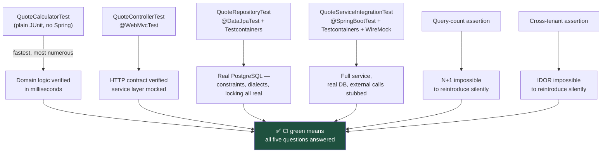

# The Test Pyramid, Built Once and Argued About Never Again

A test suite that only ever runs against H2 will pass right up until the day PostgreSQL rejects something H2 quietly allowed. This is the full pyramid for one Spring Boot service, built against the real engine at every level that touches the database.

## The Real-World Problem

Meridian Underwriting's quote service had 340 passing tests and a production incident in the same quarter. The tests ran against H2 in-memory mode; production ran PostgreSQL. H2 accepted a `CHECK` constraint referencing a function PostgreSQL doesn't have, silently downgrading it to a no-op. A negative premium reached the ledger. Separately, a `@GetMapping("/api/v1/quotes/{id}")` had no tenant scoping — every test in the suite authenticated as the same single broker, so cross-tenant access was never exercised and never failed.

Both defects were catchable by tests that either didn't run against the real engine or never modelled a second tenant. This article builds the suite that catches both, layer by layer.

## The Concept

Five layers, each answering a different question, each using the cheapest tool that can answer it honestly:

| Layer | Question it answers | Tool | Spring context? |
|---|---|---|---|
| Unit | Is the domain rule correct? | JUnit 5 + AssertJ | No |
| Web slice | Does the controller's HTTP contract hold? | `@WebMvcTest` | Partial (web layer only) |
| Data slice | Do queries behave against the real engine? | `@DataJpaTest` + Testcontainers | Partial (persistence layer only) |
| Full integration | Does the whole service work end to end, including external calls? | `@SpringBootTest` + Testcontainers + WireMock | Full |
| Regression guards | Are two specific classes of bug structurally impossible? | Query-count assertion, cross-tenant assertion | Varies |

**Never use H2, or any in-memory substitute, to test against "a database".** It is a different engine with different constraint behaviour, different locking, and different SQL dialect quirks. Testcontainers gives you the real PostgreSQL version you run in production, for a few extra seconds per test class — a trade every regulated system should take without debate.

## How It Works



Layers run cheapest-first in CI; the two regression-guard assertions live inside the data-slice and integration layers rather than as a separate stage.

## Practical Example

**Package layout:**

```
src/main/java/com/meridian/quotes/
├── domain/
│   ├── Quote.java
│   └── QuoteCalculator.java
├── web/
│   └── QuoteController.java
└── persistence/
    ├── QuoteRepository.java
    └── QuoteService.java

src/test/java/com/meridian/quotes/
├── domain/QuoteCalculatorTest.java
├── web/QuoteControllerTest.java
└── persistence/QuoteRepositoryTest.java

src/integrationTest/java/com/meridian/quotes/
└── QuoteServiceIntegrationTest.java

src/testFixtures/java/com/meridian/quotes/
└── PostgresTestContainer.java
```

**1. Unit test — no Spring context, milliseconds to run.**

```java
package com.meridian.quotes.domain;

import org.junit.jupiter.api.Test;
import static org.assertj.core.api.Assertions.*;

class QuoteCalculatorTest {

    private final QuoteCalculator calculator = new QuoteCalculator();

    @Test
    void calculate_belowMinimumPremiumFloor_returnsFloorValue() {
        var premium = calculator.calculate(RiskProfile.of(BigDecimal.valueOf(50_000), 0.001));

        assertThat(premium.amount()).isEqualByComparingTo("120.00");   // the regulatory floor
    }

    @Test
    void calculate_negativeSumInsured_throwsRatherThanReturningNegativePremium() {
        assertThatThrownBy(() -> calculator.calculate(RiskProfile.of(BigDecimal.valueOf(-1), 0.001)))
            .isInstanceOf(IllegalArgumentException.class)
            .hasMessageContaining("sumInsured must be positive");
    }
}
```

The negative-premium incident is exactly what the second test guards. This is where that guard belongs — not in an integration test that takes seconds to run and might not even reach this branch.

**2. Web slice — controller contract, service layer faked.**

```java
package com.meridian.quotes.web;

import org.junit.jupiter.api.Test;
import org.springframework.beans.factory.annotation.Autowired;
import org.springframework.boot.test.autoconfigure.web.servlet.WebMvcTest;
import org.springframework.security.test.context.support.WithMockUser;
import org.springframework.test.web.servlet.MockMvc;
import org.springframework.test.context.bean.override.mockito.MockitoBean;
import static org.mockito.BDDMockito.given;
import static org.springframework.security.test.web.servlet.request.SecurityMockMvcRequestPostProcessors.jwt;
import static org.springframework.test.web.servlet.request.MockMvcRequestBuilders.get;
import static org.springframework.test.web.servlet.result.MockMvcResultMatchers.*;

@WebMvcTest(QuoteController.class)
class QuoteControllerTest {

    @Autowired MockMvc mockMvc;
    @MockitoBean QuoteService quoteService;   // real service, real DB — tested elsewhere

    @Test
    void get_existingQuoteForOwningBroker_returns200WithPremium() throws Exception {
        given(quoteService.findForBroker(QUOTE_ID, BROKER_A))
            .willReturn(Optional.of(aQuote().withPremium("340.00").build()));

        mockMvc.perform(get("/api/v1/quotes/{id}", QUOTE_ID)
                .with(jwt().jwt(j -> j.claim("broker_id", BROKER_A.toString()))))
            .andExpect(status().isOk())
            .andExpect(jsonPath("$.premium").value("340.00"));
    }

    @Test
    void get_missingQuote_returns404WithProblemDetail() throws Exception {
        given(quoteService.findForBroker(QUOTE_ID, BROKER_A)).willReturn(Optional.empty());

        mockMvc.perform(get("/api/v1/quotes/{id}", QUOTE_ID)
                .with(jwt().jwt(j -> j.claim("broker_id", BROKER_A.toString()))))
            .andExpect(status().isNotFound())
            .andExpect(jsonPath("$.type").exists());   // RFC 9457, not a raw stack trace
    }
}
```

**3. Data slice — Testcontainers PostgreSQL, no substitute engine.**

```java
package com.meridian.quotes.persistence;

import org.junit.jupiter.api.Test;
import org.springframework.beans.factory.annotation.Autowired;
import org.springframework.boot.test.autoconfigure.orm.jpa.DataJpaTest;
import org.springframework.boot.testcontainers.service.connection.ServiceConnection;
import org.springframework.test.context.DynamicPropertySource;
import org.testcontainers.containers.PostgreSQLContainer;
import org.testcontainers.junit.jupiter.Container;
import org.testcontainers.junit.jupiter.Testcontainers;
import static org.assertj.core.api.Assertions.*;

@DataJpaTest
@Testcontainers
class QuoteRepositoryTest {

    @Container
    @ServiceConnection                          // Spring Boot 3.1+ wires the datasource automatically
    static final PostgreSQLContainer<?> POSTGRES =
        new PostgreSQLContainer<>("postgres:16.4");   // the exact version running in production

    @Autowired QuoteRepository repo;

    @Test
    void save_negativePremium_rejectedByDatabaseConstraintNotJustJava() {
        // Same CHECK constraint that H2 silently ignored. This is the assertion
        // that would have caught the incident: the constraint is real here.
        var quote = aQuote().withPremiumMinorUnits(-100L).build();

        assertThatThrownBy(() -> repo.saveAndFlush(quote))
            .isInstanceOf(org.springframework.dao.DataIntegrityViolationException.class)
            .hasMessageContaining("chk_premium_non_negative");
    }

    @Test
    void findByIdAndBrokerId_quoteBelongingToAnotherBroker_returnsEmpty() {
        var quote = repo.saveAndFlush(aQuote().forBroker(BROKER_A).build());

        var result = repo.findByIdAndBrokerId(quote.getId(), BROKER_B);   // wrong broker

        assertThat(result).isEmpty();   // proves the query itself enforces the scope
    }
}
```

**4. Full integration — real DB, external dependency stubbed, query count and cross-tenant guards live here too.**

```java
package com.meridian.quotes;

import org.junit.jupiter.api.Test;
import org.springframework.beans.factory.annotation.Autowired;
import org.springframework.boot.test.context.SpringBootTest;
import org.springframework.boot.testcontainers.service.connection.ServiceConnection;
import org.testcontainers.containers.PostgreSQLContainer;
import org.testcontainers.junit.jupiter.Container;
import org.testcontainers.junit.jupiter.Testcontainers;
import com.github.tomakehurst.wiremock.junit5.WireMockExtension;
import org.junit.jupiter.api.extension.RegisterExtension;
import org.hibernate.SessionFactory;
import org.hibernate.stat.Statistics;
import jakarta.persistence.EntityManagerFactory;
import static com.github.tomakehurst.wiremock.client.WireMock.*;
import static org.assertj.core.api.Assertions.*;

@SpringBootTest(webEnvironment = SpringBootTest.WebEnvironment.RANDOM_PORT)
@Testcontainers
class QuoteServiceIntegrationTest {

    @Container
    @ServiceConnection
    static final PostgreSQLContainer<?> POSTGRES = new PostgreSQLContainer<>("postgres:16.4");

    @RegisterExtension
    static WireMockExtension riskEngine = WireMockExtension.newInstance()
        .options(wireMockConfig().port(8089)).build();   // stands in for the external risk-scoring API

    @Autowired QuoteService quoteService;
    @Autowired EntityManagerFactory emf;

    @Test
    void listQuotesForBroker_withTenColleagueQuotes_issuesConstantQueryCount() {
        fixtures.tenQuotesFor(BROKER_A);
        var stats = emf.unwrap(SessionFactory.class).getStatistics();
        stats.setStatisticsEnabled(true);
        stats.clear();

        var page = quoteService.listForBroker(BROKER_A, PageRequest.of(0, 25));
        page.forEach(q -> q.getRiskProfile().getCategory());   // touch the lazy association

        // A JOIN FETCH keeps this at 2 regardless of page size. Without it,
        // this grows linearly with result size — the classic N+1.
        assertThat(stats.getPrepareStatementCount())
            .as("query count must not scale with result size")
            .isLessThanOrEqualTo(2);
    }

    @Test
    void calculateQuote_riskEngineReturnsHighRiskScore_appliesLoading() {
        riskEngine.stubFor(post(urlEqualTo("/v2/score"))
            .willReturn(okJson("""{"score": 0.82, "band": "HIGH"}""")));

        var quote = quoteService.calculate(aQuoteRequest().forBroker(BROKER_A).build());

        assertThat(quote.premium().amount()).isGreaterThan(new BigDecimal("500.00"));
    }

    @Test
    void get_quoteCreatedByAnotherBroker_isUnreachableThroughTheServiceLayer() {
        var quote = quoteService.calculate(aQuoteRequest().forBroker(BROKER_A).build());

        var result = quoteService.findForBroker(quote.id(), BROKER_B);   // BROKER_B, not the owner

        assertThat(result).isEmpty();   // proves the whole path, not just the repository, is scoped
    }
}
```

**5. Gradle — integration tests as their own suite, so they never slow the unit run.**

```kotlin
// build.gradle.kts
testing {
    suites {
        val test by getting(JvmTestSuite::class) {
            useJUnitJupiter("5.11.3")
            dependencies {
                implementation("org.springframework.boot:spring-boot-starter-test")
                implementation("org.testcontainers:postgresql:1.20.4")
                implementation("org.testcontainers:junit-jupiter:1.20.4")
            }
        }

        val integrationTest by registering(JvmTestSuite::class) {
            useJUnitJupiter("5.11.3")
            dependencies {
                implementation(project())
                implementation("org.springframework.boot:spring-boot-starter-test")
                implementation("org.testcontainers:postgresql:1.20.4")
                implementation("org.wiremock:wiremock-standalone:3.9.2")
            }
            targets.all {
                testTask.configure {
                    shouldRunAfter(test)
                    maxHeapSize = "1g"
                }
            }
        }
    }
}

tasks.test {
    useJUnitPlatform()
    maxParallelForks = (Runtime.getRuntime().availableProcessors() / 2).coerceAtLeast(1)
}

tasks.named("check") { dependsOn(testing.suites.named("integrationTest")) }
```

## Enterprise Trade-offs

| Approach | Pros | Cons | When to use (Banking / Insurance / Enterprise) |
|---|---|---|---|
| **Testcontainers at every DB-touching layer** | Constraints, dialects, and locking behave exactly as in production | Each test class pays container startup (~1–2s, reused across a class) | Default for any service where a schema constraint carries business or regulatory meaning |
| **H2 or another in-memory substitute** | Millisecond startup, no Docker dependency | Silently accepts SQL the real engine rejects — the incident above | Never for anything past a disposable prototype |
| **Query-count assertions on critical list endpoints** | Turns a load-dependent production incident into a deterministic CI failure | Requires enabling Hibernate statistics and knowing the expected count | Every paginated endpoint over a table that will grow |
| **Cross-tenant assertions on every scoped repository method** | Turns IDOR into a compile-time-adjacent guarantee | Requires fixtures for at least two tenants, which most legacy suites lack | Mandatory for any multi-tenant data access |
| **Mocking the repository in a "unit test" of the service layer** | Fast, no infrastructure | Verifies nothing about real query behaviour; gives false confidence | Acceptable only when the service logic under test has no DB interaction worth verifying |

→ Next: this is the final Spring Boot example. Related: [../../08-testing-strategies/02-unit-and-integration-testing.md](../../08-testing-strategies/02-unit-and-integration-testing.md) · [../../01-core-concepts/05-security-by-default.md](../../01-core-concepts/05-security-by-default.md) · [rest-api-crud-example.md](rest-api-crud-example.md)
