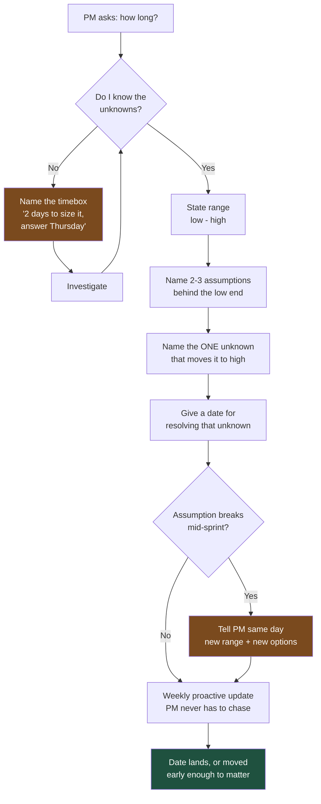

# Talking to Product Managers: Estimates That Survive Contact With a Roadmap

A Product Manager's currency is credibility with people who control money. Every number you hand them gets repeated in a room you are not in, stripped of caveats. Give them numbers that survive that journey.

## The Real-World Problem

A corporate banking platform team was building a bulk-payments upload feature — CSV in, 5,000 payments out, with maker-checker approval. In a Tuesday refinement session the PM asked, "Roughly how long?" The lead engineer, wanting to be helpful, said: "Probably three weeks, give or take."

The PM heard "three weeks." They took it to the quarterly business review on Thursday and committed to a 14 March launch, because two corporate clients had been promised bulk payments since January and the relationship managers were losing patience.

What "probably three weeks" had actually meant was: three weeks *if* the existing payment-initiation API accepted batches, *if* the sanctions-screening service could handle 5,000 checks in one submission window, and *if* the maker-checker workflow engine supported approving a batch as a single unit. None of those were true. Sanctions screening rate-limited at 50 requests per second and the workflow engine modelled approvals per-payment only. Real elapsed time: nine weeks.

The cost was not the six extra weeks. It was that the PM had to walk back a public commitment to two named clients, in front of their own director. From that point on the PM stopped asking the team for estimates and started asking for "worst case, and I'll add 50%" — which meant every subsequent plan was padded, slower, and less trusted in both directions. One careless sentence cost a working relationship 18 months of friction.

## The Concept

### What a PM is actually measured on

| They are measured on | Which means they need from you | What they do *not* need |
|---|---|---|
| Outcomes (adoption, revenue, retention, cost saved) | Which option moves the metric fastest | A tour of the architecture |
| Roadmap credibility — did the quarter land as promised | Dates with named assumptions, and early warning when one breaks | A perfect date guessed early |
| Stakeholder confidence in the team | Being able to answer their leadership's questions without you in the room | Answers only you can defend |
| Prioritisation quality | Cost and risk of each option in comparable terms | "It depends" |
| Scope discipline | A path to "yes" when you say "not now" | A flat refusal |

### What they hear when you say certain things

| You say | They hear | Say instead |
|---|---|---|
| "Probably three weeks" | "Three weeks. Committed." | "Two to four weeks. Two if the batch API already accepts arrays; four if I have to add batching. I'll know by Thursday." |
| "It's more complicated than it looks" | "You're about to be told no" | "There are two things underneath this that add time. Here they are, with cost." |
| "We need to refactor first" | "Engineering wants a month of invisible work" | "There's a change that cuts the cost of the next four payment features roughly in half. Worth 5 days now." |
| "That's technically impossible" | "You're not trying" | "Not possible in that form. Here's the version that is, and what we'd lose." |
| "I'm blocked" | "Nothing is happening and I don't know why" | "Blocked on X since Tuesday. I need a decision from Ops by Friday or the date moves to the 21st." |

### Estimates: ranges, assumptions, and the one unknown

Never give a single date to a PM. A single date is a promise; a range with named assumptions is information. The format that survives:

> **[Range]**, assuming **[2–3 specific assumptions]**. The one thing that would change this is **[the specific unknown]**. I'll know that by **[date]**.

The final sentence is what makes this professional rather than evasive. Uncertainty with a resolution date is planning input. Uncertainty without one is just hedging, and PMs correctly discount it.

### Saying "no" without saying no

A PM cannot accept a flat "no" — they have someone above them who asked for the thing. Give them a currency they can spend:

1. **Trade** — "Yes, and it displaces the reporting export by a sprint. Your call."
2. **Split** — "The half that serves the two clients waiting: 1 week. The full version: 5 weeks."
3. **Defer with a trigger** — "Not this quarter. Revisit when more than 20 clients are uploading, which is when the manual process actually breaks."
4. **Cheaper substitute** — "Not the automated version. A supported manual process solves it on Friday for the two clients who care."

### Raising a technical concern in business terms

Technical concerns die in PM conversations when framed as technical concerns. Reframe on one of three axes — cost, risk, or customer impact — and attach a number, even a rough one.

| Technical framing (dies) | Business framing (lands) |
|---|---|
| "The batch endpoint has no idempotency key" | "If the upload times out and a client retries, we may pay some invoices twice. Recovery is a manual reconciliation with the client. Two days to prevent." |
| "Sanctions screening is rate-limited" | "At current limits a 5,000-payment file takes 100 seconds to clear. Clients will think it hung and re-upload. One day to add a progress state; four days to raise the limit with the vendor." |

## How It Works



The critical branch is the middle one: an assumption breaking is not a failure, it is the plan working. Failure is the PM learning about it in the sprint review.

## Practical Example

**BAD — the message that caused the nine-week slip:**

```
Probably three weeks, give or take. Should be fine, it's mostly just
plumbing on top of the payments API. I'll shout if anything comes up.
```

Three failures: a single number disguised as a range, "mostly just plumbing" asserting confidence the engineer did not have, and "I'll shout if anything comes up" putting the burden of follow-up on nobody.

**GOOD — the same information, same day, same knowledge:**

```
Bulk payments upload — sizing, not yet a commitment.

Two to four weeks of build, and I want to check one thing before either
number is safe to plan against.

Two weeks if all three of these hold:
  - The payment-initiation API already accepts an array of payments
  - Sanctions screening can clear 5,000 checks inside one submission window
  - The approval workflow can treat a batch as one approvable item

Four weeks if the workflow engine only approves payment-by-payment —
then we're building batch approval, not just an upload screen.

Sanctions throughput is the one I can't answer from the code. I'm testing
it with a 5,000-row file on Wednesday and will give you a firm range
Thursday morning.

If you need something for the two clients waiting: a supported manual
upload — they email the file, our ops team runs it through the existing
screen — is available in 3 days and covers them until the real feature
ships. Say the word and I'll spec it.
```

Why it works: the PM can now brief their director on Thursday with real content ("range firms up Thursday, and we have a client stopgap available in 3 days"), the assumptions are written down so a broken one is visible rather than embarrassing, and the escape hatch means the answer to "what do I tell the clients?" is not "wait."

**Raising the idempotency concern — paste-ready:**

```
One risk on bulk payments I want on your radar before we commit the date.

If a client's upload times out halfway and they re-upload the same file,
today's design would submit the successful payments a second time.
Realistically: a corporate client sees duplicate outbound payments and we
run a manual reconciliation with their treasury team.

Two days of work removes the possibility entirely — we tag each payment
line so a repeat submission is recognised and ignored.

My recommendation: include it. Two days against a duplicate-payment
incident with a named corporate client is not a close call. It's inside
the range I gave you, so the date doesn't move.
```

**The proactive weekly update that stops status-chasing:**

```
Bulk payments — week 2 of 4. On track for 21 March.

Done: CSV parse and validation, 5,000-row file clears in 8 seconds.
In progress: batch approval screen (the four-week branch turned out to
be the real one — workflow engine is per-payment, as feared).
Next: sanctions batching, then end-to-end with a real client file.

No decisions needed from you this week. Next update Friday; if 21 March
becomes at risk you'll hear from me the same day, not on the Friday.
```

Send this unprompted, same day and time each week. A PM who is confident an update is coming stops asking for one — and every "quick check-in" you prevent is 20 minutes back for both of you.

## Enterprise Trade-offs

| Approach | Pros | Cons | When to use (Banking / Insurance / Enterprise) |
|---|---|---|---|
| **Range + named assumptions + resolution date** | Survives being repeated; broken assumptions surface early | Takes 10 minutes to compose | Default for anything a PM will commit externally — client dates, regulatory deadlines, board commitments |
| **Single date, high confidence** | Easy to plan around | Zero tolerance for surprise; one miss costs credibility for a year | Only for work you have done before in the same codebase, with no external dependency |
| **Timebox the estimate itself** ("2 days to size it") | Honest; protects both parties from a guess | Feels slow to a PM under pressure | Anything touching an unfamiliar system, a vendor limit, or a regulated workflow |
| **T-shirt sizes (S/M/L)** | Fast; good for roadmap-level shaping | Useless once a date is needed; L means different things to different people | Quarterly planning and prioritisation only — never for a commitment |
| **Confidence percentage** ("80% by the 21st") | Communicates real uncertainty honestly | Most non-engineers round 80% to 100% | Mature PM relationships, or where a formal risk register already uses this language |
| **Padded single date** | Often lands | Destroys trust in both directions once noticed; hides the real risks | Never — pad the range's upper bound visibly instead |

## Why This Still Matters Through 2030

The estimation conversation is not being automated away, it is getting harder. As AI tooling compresses the time to write code, the proportion of a delivery timeline consumed by things it cannot compress — vendor rate limits, change-advisory windows, regulatory sign-off, sanctions and KYC integrations, data-migration validation — grows as a share of the total. That widens the gap between "how long to build it" and "how long until a customer can use it," and closing that gap in a PM's head is a communication task, not an engineering one. Meanwhile enterprise governance is pushing the other way: operational-resilience and third-party-risk regimes mean more commitments are made formally, in writing, to regulators and named clients, and a walked-back date now carries documented consequences. An engineer who reliably produces ranges with named assumptions — and who flags a broken assumption the same day — becomes the person whose numbers get planned around. That reputation compounds, and no tool grants it.

→ Next: [02-talking-to-po.md](02-talking-to-po.md) · Related: [../01-core-concepts/08-technical-debt-tracking.md](../01-core-concepts/08-technical-debt-tracking.md) · [04-technical-to-business-translation-table.md](04-technical-to-business-translation-table.md)
