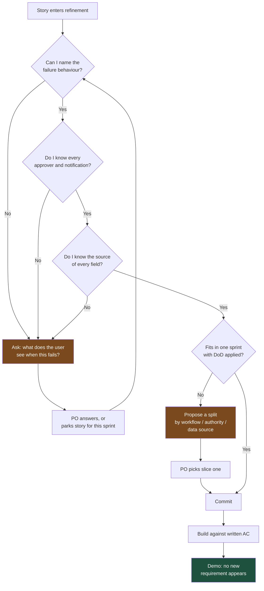

# Talking to Product Owners: Acceptance Criteria Are a Contract, Not Paperwork

The Product Owner owns the backlog and the definition of "done for this story." Every ambiguity you accept at refinement, you pay for at demo — with interest, in front of an audience.

## The Real-World Problem

A motor-insurance claims team was replacing a paper-based total-loss workflow. The story read:

> *As a claims handler, I want to record a total-loss decision so the customer can be paid out.*
>
> **AC:** Handler can mark a claim as total loss and trigger settlement.

Nobody objected. Two engineers picked it up, built a clean screen with a decision field, a settlement amount, and a submit button, and demoed it eleven days later.

The demo lasted four minutes before it stopped being a demo. The claims operations manager, invited as a guest, asked what happened above the handler's authority limit. Total-loss decisions above €25,000 require a team-leader countersignature — a regulatory requirement in their market, not a nice-to-have. Then: what about salvage value, which is deducted from settlement and comes from a third-party auction feed? And where does the write-off notification to the national vehicle register go, because that has a statutory 7-day window?

None of it was in the story. All of it was mandatory. The screen was rebuilt over the following three weeks and the original build was largely discarded.

The interesting part is the aftermath. The PO's reaction was to write much longer stories, which slowed refinement to a crawl. The engineers' reaction was to stop reading them carefully, because they were now walls of text. Six sprints later the team's velocity was down and both sides privately blamed the other. The actual root cause was a single unasked question at refinement: *who else has to touch this before the customer sees money?*

## The Concept

### What a PO is measured on, and how that differs from a PM

| | Product Manager | Product Owner |
|---|---|---|
| Horizon | Quarter to year | Sprint to release |
| Owns | Outcome, roadmap, market case | Backlog order, story detail, acceptance |
| Measured on | Adoption, revenue, roadmap credibility | Predictable sprint delivery, backlog readiness, stakeholder acceptance without rework |
| Fears | A missed external commitment | A demo where a stakeholder finds a gap |
| Needs from you | Ranges, options, cost of risk | Precise questions *before* commitment, and no surprises at acceptance |

The PO's nightmare is the demo above. That makes them your natural ally in tightening a story — but only if you raise the gap before the sprint starts. Raised at refinement, you are rigorous. Raised at demo, you look like you did not read the ticket.

### Push back before committing, not after

The three questions that catch the majority of underspecified enterprise stories:

| Question | What it catches |
|---|---|
| "Who else has to approve, see, or be notified before this is complete?" | Approval limits, four-eyes rules, downstream notifications, regulator filings |
| "What happens when this fails halfway — what does the user see, and what state is the record left in?" | Error handling, partial writes, timeouts, reconciliation |
| "Where does each of these numbers come from, and what if it's missing?" | Hidden integrations, third-party feeds, default and fallback values |

Add two more for regulated domains: *"Does anything here need to be reconstructable for an auditor two years from now?"* and *"Is any of this data subject to retention or residency rules?"*

Ask them as clarifying questions, not challenges. "I want to make sure I don't build half of this" is collaborative. "This story is too vague" is a complaint.

### Negotiate by splitting, not refusing

"This won't fit in the sprint" is a problem you have handed to the PO. "Here are two pieces, the first fits and delivers something usable" is a solution. Splits that work in enterprise systems:

| Split axis | Example (total-loss claim) |
|---|---|
| **By workflow step** | Record the decision this sprint; settlement trigger next |
| **By authority tier** | Under €25,000 (no countersignature) this sprint; above next |
| **By data source** | Manual salvage-value entry this sprint; auction-feed integration next |
| **Happy path vs. exceptions** | Single-vehicle claim now; multi-vehicle and disputed claims later |
| **Manual vs. automated** | Register notification as a generated PDF an operator sends; API filing later |
| **Read then write** | Show the total-loss view now; allow editing next |

Every one of these leaves something demonstrable at the end of the sprint. Splitting by technical layer ("backend this sprint, UI next") does not — it produces a sprint with nothing to show, and POs learn to distrust it.

### Definition of Done as a shared contract

The Definition of Done stops being an argument when it is agreed once, written down, and applied to every story without renegotiation. The argument that a DoD prevents: *"Is it done, or done-done?"* Agreed in advance, "done" means one thing and nobody litigates it at 4pm on the last day of the sprint.

Reference the DoD, never invent it in the moment. "Our DoD includes an audit-log entry for every state change on a claim — that's part of the 5 points, not extra" ends the conversation. "I think we should probably also log this" reopens it.

### Making technical debt and non-functional work visible in backlog terms

Work the PO cannot see does not get prioritised. Translate it into the same shape as a feature: a beneficiary, an outcome, and a cost of not doing it.

| Don't write | Write |
|---|---|
| "Refactor the claims settlement service" | "Reduce the cost of adding a new claim type from ~8 days to ~3 by consolidating the three duplicated settlement calculators. Unblocks the four claim types on the H2 roadmap." |
| "Add indexes to claim_event" | "Claims search currently takes 9 seconds at month-end volumes; handlers are opening duplicate claims because they assume it failed. Brings it under 1 second." |
| "Upgrade the framework" | "Current framework version loses security support in November. After that, any published vulnerability is unpatchable and becomes an audit finding. 6 days, best spent before September." |

Give non-functional work an acceptance criterion the PO can verify, exactly like a feature: *"Claims search returns in under 1 second for a handler with 5,000 open claims."* Verifiable beats virtuous.

## How It Works



Every loop back to the questions is cheap. The path that skips them costs a rebuild — and a rebuild is discovered in public.

## Practical Example

**BAD — pushing back the way engineers usually do:**

```
This story is way too vague, there's no way we can estimate it. Total loss
has a load of edge cases and the AC doesn't cover any of them. Can someone
write proper requirements before it comes to refinement?
```

It is correct and it is useless. It names no gap the PO can close, blames the process, and gives them nothing to act on before the sprint starts.

**GOOD — same concern, made actionable in the same meeting:**

```
Total-loss decision — three questions before I'd size this, because the
answers change it a lot.

1. Approval. Is there an authority limit on a total-loss decision? If a
   team leader has to countersign above a threshold, that's a second
   screen and a second role, not a field on this one.

2. Settlement amount. Where does it come from? If salvage value is
   deducted and salvage comes from the auction feed, we're integrating a
   third party, not adding a number field.

3. Downstream. Does anyone outside the claims team need to know — the
   vehicle register, the reinsurer, the customer's finance provider? If
   there's a statutory notification window, that's in scope for "the
   customer can be paid out."

If the answer to all three is "no, it's just the handler's decision" this
is a 3-point story and I'll take it this sprint. If approval and salvage
are in, it's closer to 13 and I'd want to split it.

Suggested split either way:
  Slice 1 (this sprint) — record and view the decision, claims under the
    authority limit, salvage entered manually. Demonstrable, and covers
    the majority of total losses by volume.
  Slice 2 — countersignature workflow above the limit.
  Slice 3 — auction-feed integration and register notification.

Slice 1 gives handlers something real in two weeks. Happy to write the AC
for it now if that helps.
```

Why it works: three specific, answerable questions instead of a verdict; each one tied to a concrete consequence for size; a split already drafted so the PO's decision is a choice, not homework; and an offer to do the writing, which removes the last reason to defer.

**Making the settlement-calculator debt visible — paste-ready backlog item:**

```
Title: Consolidate the three settlement calculators

Why now: We have three copies of settlement calculation — motor, home,
and the legacy total-loss path. The last two rate changes had to be made
in all three, and in April one was missed for nine days, which produced
14 incorrect settlement figures that Ops corrected manually.

Outcome: One calculator. A rate change is made once.

Value: Adding a new claim type drops from roughly 8 days to 3. Four new
claim types are on the H2 roadmap, so this pays for itself twice over
before December. It also removes a recurring source of incorrect
customer-facing figures, which is the part that would show up in an
audit.

Acceptance criteria:
  - Motor, home and total-loss settlements all resolve through one
    calculator
  - Existing settlement figures reproduce exactly for the last 12 months
    of closed claims (regression harness over production-derived,
    anonymised data)
  - A rate change requires editing one configuration entry

Cost: 6 days. No customer-visible change, so no release-note or training
impact.

Risk of deferring: Every rate change stays a 3-place edit with a
demonstrated 30% miss rate.
```

Note what makes this fundable: a real past incident with a number attached, a roadmap link, and an acceptance criterion the PO can hold you to. "It's messy" would have been declined.

## Enterprise Trade-offs

| Approach | Pros | Cons | When to use (Banking / Insurance / Enterprise) |
|---|---|---|---|
| **Refuse to commit until AC is complete** | No mid-sprint surprises; forces quality upstream | Can stall a sprint; reads as obstructive if overused | Regulated workflows with approval limits, statutory notifications, or audit obligations |
| **Commit to a slice, defer the rest** | Something ships; the unknowns get answered by real use | Requires genuine splitting skill; slice 2 can get deprioritised and orphaned | Default for large stories in claims, onboarding, and payments flows |
| **Commit with a written assumption list** | Fast; keeps momentum | Assumptions must be revisited or they become silent decisions | Time-boxed regulatory deadlines where waiting is not an option |
| **Spike first, story next sprint** | Removes the biggest unknown cheaply | Costs a sprint of elapsed time; POs dislike sprints with no feature | Unfamiliar third-party integrations — auction feeds, register APIs, reinsurer files |
| **Non-functional work as its own backlog item** | Visible, prioritisable, has its own AC | Competes with features and often loses | Debt with a named cost or a hard deadline, such as end-of-support dates |
| **Non-functional work folded into feature estimates** | Always gets done; no separate negotiation | Invisible; inflates feature estimates and erodes trust when noticed | Small, unavoidable hygiene only — never for multi-day work |

→ Next: [03-talking-to-operations.md](03-talking-to-operations.md) · Related: [../00-project-setup-roadmap/10-definition-of-done.md](../00-project-setup-roadmap/10-definition-of-done.md) · [../08-testing-strategies/05-testing-in-regulated-enterprise-systems.md](../08-testing-strategies/05-testing-in-regulated-enterprise-systems.md)
