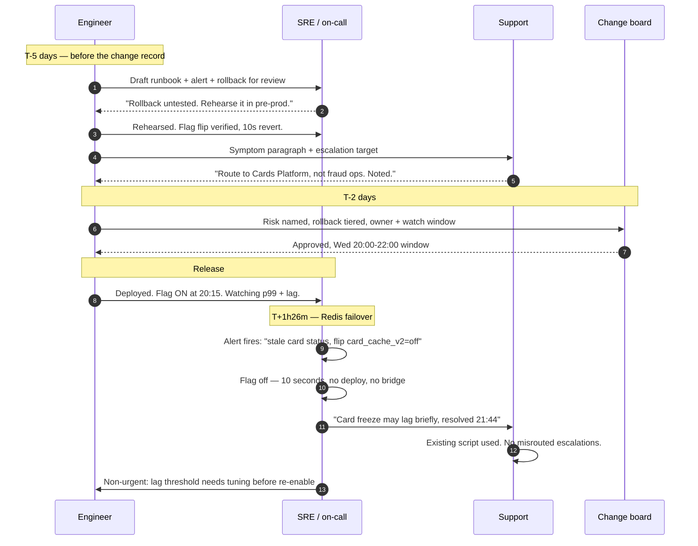

# Talking to Operations: The People Who Get Paged for Your Code

Ops and support carry your release at 3am, and they carry it with whatever information you gave them at 5pm. "It works in staging" is not information they can act on.

## The Real-World Problem

A retail bank replaced the card-authorisation caching layer behind its mobile app. The change was clean: swap a per-instance in-memory cache for a shared Redis cluster, which fixed a long-standing bug where a customer freezing their card saw it unfrozen again if the next request hit a different instance.

The engineer wrote a good PR. Two reviewers approved it. It passed CI, cleared UAT, and went out on a Wednesday evening release with the change record reading: *"Migrate card status cache to Redis. Low risk, no schema change, no API change."*

At 21:40 the Redis cluster's failover promoted a replica that was 90 seconds behind. For roughly four minutes, card-status reads served stale data. Around 300 customers who had just frozen a card saw it as active; a smaller number who unfroze saw a declined transaction.

What made it a two-hour incident instead of a four-minute one:

- The on-call SRE saw a latency alert on the card service and had no idea Redis was new. The change record said "low risk, no API change," so they spent 35 minutes investigating the card scheme's gateway.
- There was no runbook. The engineer had written `docs/redis-migration.md` in the repo. The SRE searched the runbook wiki, found the 2023 page for the in-memory cache, and followed it. It was wrong.
- There was no rollback procedure. Reverting meant redeploying the previous artefact, which nobody had confirmed was still compatible with the new configuration — so nobody was willing to do it during an incident.
- The change was behind a feature flag, but the flag's name was `card_cache_v2` and its state was not recorded anywhere the SRE could see. They did not know it existed, let alone that flipping it was a 10-second fix.
- Support took 90 calls describing a symptom nobody had briefed them on. Their script for "my card freeze isn't working" said *escalate to fraud operations* — the wrong team, who then also joined the bridge.

The Redis failover was a four-minute infrastructure event. The outage was two hours and eleven minutes, and every additional minute came from missing handover, not missing engineering. At the post-incident review the engineer said, accurately, "the code was fine." That was the problem: they had shipped code and not shipped an operable change.

## The Concept

### What Ops, SRE, and support are actually measured on

| Role | Measured on | Which means they need |
|---|---|---|
| **SRE / platform** | Availability against an SLO, error budget burn | To know what changed, when, and how to undo it |
| **On-call engineer** | MTTA and MTTR | An alert that names an owner and links a runbook — not a graph |
| **Change management** | Change success rate, failed-change ratio, audit completeness | Risk stated honestly, rollback tested, blast radius bounded |
| **Support / contact centre** | Ticket volume, first-contact resolution, average handling time | The symptom in customer words, before the calls start |
| **Capacity / infra** | Cost, headroom, saturation | Expected load delta, in requests and in resource terms |

Notice that none of them are measured on your feature shipping. They are measured on what happens after it ships. Frame everything accordingly.

### The six things Ops needs *before* a release

**Never** treat these as documentation to be written afterwards. A release without them is a release someone else has to reverse-engineer under pressure.

| Artefact | What "good" looks like | Failure it prevents |
|---|---|---|
| **Runbook** | In the runbook system Ops actually searches, dated, with the three most likely symptoms and the exact command per symptom | The SRE following a 2023 page for a component you replaced |
| **Alert with a named owner** | Threshold tied to customer impact, links the runbook, routes to a named team, and has been fired once in a test | An alert nobody owns, muted within a month |
| **Rollback procedure** | Written, *rehearsed at least once in a lower environment*, with the data-compatibility question answered explicitly | Nobody willing to press the button mid-incident |
| **Feature-flag state** | Flag name, current value per environment, who may flip it, and the exact effect of flipping | A 10-second fix nobody knows exists |
| **Expected load change** | "+18% reads on card-status, ~400 rps peak, no write change" | A capacity surprise attributed to your release for the wrong reason |
| **Support-facing symptom description** | One paragraph in customer language, with the correct escalation path | 90 calls routed to fraud operations |

### Write the alert around impact, not around a metric

An alert that says `redis_replication_lag > 60s` tells an SRE that a number is large. An alert that says *customers may see stale card-freeze status; flip `card_cache_v2` to `off` to serve from the database* tells them what to do.

| Weak alert | Actionable alert |
|---|---|
| "CPU > 85% on card-service" | "Card-status p99 above 800ms for 5 min — customers see spinners on the card screen. Runbook: RB-241. Owner: Cards Platform." |
| "Redis replication lag high" | "Card status may be stale up to 90s after a Redis failover — freeze/unfreeze may appear not to apply. Mitigation: set flag `card_cache_v2=off` (10s, no deploy). Runbook: RB-244." |

**Always** make an alert answerable in one action by someone who has never seen your code. If you cannot write that sentence, the alert is not ready and neither is the release.

### The support-facing description is the one engineers always skip

Support does not need your architecture. They need the sentence a customer will say, and what to do when they hear it. Three lines:

1. **What a customer might report** — in their words, not yours.
2. **What is actually happening** — one sentence, no jargon.
3. **What support should do** — including the escalation target by team name.

This is the cheapest artefact on the list and it removes the most call-handling time.

### Why "it works in staging" is not actionable

Ops discounts it, correctly, because staging differs in the exact dimensions that cause incidents:

| Staging has | Production has |
|---|---|
| One node, no failover | Clusters that fail over mid-request |
| Synthetic data, hundreds of rows | Years of real data, skewed distributions, edge-case records |
| No concurrency | Thousands of concurrent sessions and lock contention |
| Stubbed third parties | Real vendors with rate limits, maintenance windows, and outages |
| No traffic pattern | Payday spikes, month-end batch, market-open bursts |
| Nobody watching | Customers, regulators, and an error budget |

**Never** offer "it works in staging" as reassurance. Offer instead what you *tested for*: the failure mode you injected, the load you applied, and the specific thing you could not test and how you have bounded it. "We could not test a Redis failover, so it is behind a flag that reverts to database reads in 10 seconds" is a sentence a change board can approve.

### Change-advisory conversations

A CAB is not an obstacle; it is a group asking three questions in a formal register. Answer them before being asked.

| They ask | They mean | Answer with |
|---|---|---|
| "What's the risk?" | What is the worst realistic outcome? | The named failure mode, its customer impact, and its probability |
| "How do you back it out?" | Can we be safe in minutes? | Flag flip (seconds) → redeploy (minutes) → data restore (hours), and which applies |
| "Who's watching it?" | Who owns this after we approve? | A named person, a window, and the metric they are watching |

**Always** volunteer the risk yourself. A change record that names its own worst case gets approved faster than one claiming "low risk, no impact" — because the second one is never true and the board knows it.

## How It Works



Compare the real incident: the same infrastructure event, resolved in one action by someone who had never read the code, because the alert contained the mitigation and support already had the words.

## Practical Example

**BAD — the pre-release message that produced the two-hour incident:**

```
Heads up, we're releasing the card cache change tonight at 8.

It moves card status caching to Redis so the freeze bug is finally fixed.
Low risk — no API changes, no schema changes. It's been in staging for a
week and works fine. Shout if you see anything weird.
```

Four failures: "low risk" asserted rather than argued, staging offered as evidence, no rollback, and "shout if you see anything weird" delegating detection to people who do not know what weird looks like.

**GOOD — the same release, same engineer, same knowledge:**

```
Card status cache → Redis. Release Wed 20:00-22:00. CHG-11482.

WHAT CHANGES
Card freeze/unfreeze status is now read from a shared Redis cluster instead
of per-instance memory. This fixes the long-standing bug where a freeze
appeared not to apply if the next request hit a different app instance.
No API change, no schema change.

THE RISK I'M MOST WORRIED ABOUT
If the Redis cluster fails over, a promoted replica can be up to 90 seconds
behind. During that window card status reads can be stale: a customer who
has just frozen their card may still see it as active, and an unfreeze may
appear not to have applied. Realistic blast radius: customers who changed
card status in the 90s before a failover. Probability low, impact directly
customer-visible.

ROLLBACK — three tiers, tier 1 is 10 seconds
  1. Flag flip: set card_cache_v2=off in LaunchDarkly. Reads fall back to
     the database immediately. No deploy. Rehearsed in pre-prod on Monday,
     took 8 seconds. Any on-call SRE may do this without approval.
  2. Redeploy previous artefact (build 4471) — 6 minutes. Confirmed
     compatible: the flag-off path is the old code path, unchanged.
  3. No data rollback needed. Redis is a cache; nothing authoritative
     lives there.

ALERT
New alert "Card status possibly stale" — fires on replication lag > 30s OR
card-status p99 > 800ms for 5 min. Routes to Cards Platform. Links RB-244,
which opens with the flag flip. I fired it deliberately in pre-prod on
Monday so you've seen what it looks like.

RUNBOOK
RB-244 in the runbook wiki (not the repo). It supersedes RB-118 — I've
marked RB-118 deprecated so nobody follows the in-memory version.

EXPECTED LOAD CHANGE
Card-status reads move off local memory onto Redis: ~400 rps at peak,
+18% network on the card service, no additional database load. Redis
cluster is at 12% utilisation, so no capacity action needed.

WATCHING IT
I'm on until 22:30 and reachable until midnight. Watching card-status p99,
Redis replication lag, and freeze/unfreeze success rate. If anything moves
I'll flip the flag myself and tell you rather than investigating first.
```

Why it works: the SRE can resolve the exact failure that occurred without paging the author; the risk is named by the person who understands it best, which is why the change board trusts the rest; and "flip the flag first, investigate second" gives explicit permission to prioritise customers over root cause.

**GOOD — the support-facing paragraph, sent separately to the contact centre:**

```
For your Wednesday-evening briefing — new card cache release.

What a customer might say
"I froze my card in the app but it still says active." Or: "I unfroze my
card and my payment was still declined."

What's happening
Card freeze/unfreeze may take up to a minute and a half to show correctly
if it lands during a specific infrastructure event. The change the customer
made HAS been saved — the app is showing an out-of-date status, not losing
the instruction.

What to do
1. Ask them to pull down to refresh the card screen. This resolves it in
   almost every case.
2. If it's still wrong after a refresh, raise a ticket to Cards Platform
   (NOT fraud operations) with the card's last four digits and the time
   they made the change.
3. If several customers report it inside 10 minutes, tell the duty manager
   — that's a pattern, not an individual issue.

Reassurance you can give: no money moves because of this, and no card is
left unprotected — a frozen card is frozen at the payment network even if
the app display lags.
```

**GOOD — the live incident update to Ops (the audience that acts, not the audience that worries):**

```
INCIDENT-2291 — card status stale. UPDATE 1, 21:46.

Status: MITIGATED. Monitoring.
What happened: Redis cluster failed over at 21:40, promoted replica ~90s
behind. Card status reads served stale data for ~4 minutes.
Action taken: card_cache_v2 flipped off at 21:44 by on-call. Reads now
served from the database. Freeze/unfreeze success rate back to baseline
since 21:45.
Customer impact: est. 300 customers saw an incorrect card status between
21:40 and 21:44. No financial impact — freezes were applied at the network
regardless of app display.
Support: briefed, using the refresh script. 90 calls so far, tapering.
Still open: cache stays off overnight. Not re-enabling until the lag
threshold is tuned and we've tested a failover deliberately.
Next update: 22:15 or on any change.
Owner: me (Cards Platform). No decisions needed from anyone right now.
```

Note the last line. Ops updates should always end with either a specific ask or an explicit "nothing needed from you" — the ambiguity is what generates six people joining a bridge.

## Enterprise Trade-offs

| Approach | Pros | Cons | When to use (Banking / Insurance / Enterprise) |
|---|---|---|---|
| **Full operability package (runbook, owned alert, rehearsed rollback, flag state, load delta, support brief)** | MTTR drops to one action; change board approves faster; audit evidence exists by default | Half a day to a day per significant change | Default for anything in a customer-facing regulated path — payments, cards, claims settlement, onboarding |
| **Feature flag as primary rollback** | Seconds to revert; no deploy; on-call needs no approval | Flag debt accumulates; both code paths must stay working and tested | Any change to a live read/write path where the old behaviour is still safe |
| **Deploy-and-revert as primary rollback** | No flag machinery; one code path | Minutes not seconds; needs artefact and data compatibility confirmed | Low-frequency batch and back-office systems, or where flags are unavailable |
| **Progressive rollout (canary / percentage)** | Bounds blast radius by construction; real production signal | Needs routing support and per-cohort observability; slower to full release | High-volume retail journeys — mobile app, internet banking, quote engines |
| **Engineer on-call for their own change (watch window)** | Fastest possible diagnosis; strong feedback loop | Does not scale; burns the author; fails when they are unavailable | The first 24–48 hours after a significant change, alongside normal on-call |
| **Ship it and let Ops discover it** | Zero upfront cost | MTTR measured in hours; misrouted escalations; a failed-change audit finding | The scenario above |

→ Next: [04-technical-to-business-translation-table.md](04-technical-to-business-translation-table.md) · Related: [../00-project-setup-roadmap/07-observability.md](../00-project-setup-roadmap/07-observability.md) · [../00-project-setup-roadmap/06-cd-and-deployment.md](../00-project-setup-roadmap/06-cd-and-deployment.md) · [../01-core-concepts/03-failure-modes-and-resilience.md](../01-core-concepts/03-failure-modes-and-resilience.md)
