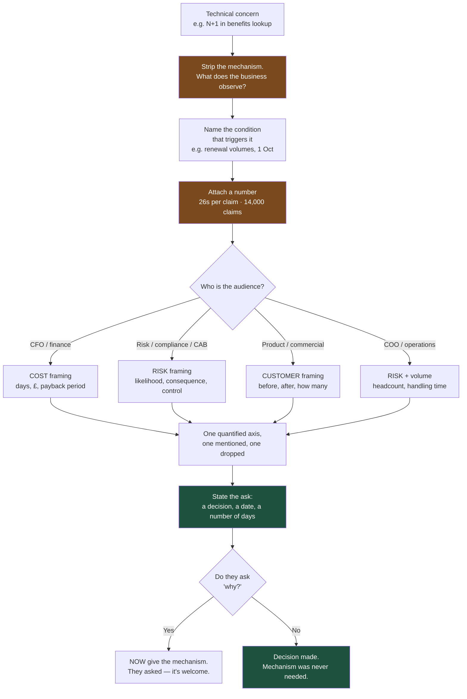

# Say It in Their Currency: A Translation Table for Engineering Language

Non-engineers are not less intelligent than you; they are optimising a different function. Every technical term you use is either translated into cost, risk, or customer impact — or it is discarded. You choose which.

## The Real-World Problem

A health insurer's claims platform team spent six months asking for time to fix the claims-adjudication query layer. Every quarter they made the same case in the same words:

> *"We have significant technical debt in the adjudication service. There's an N+1 query problem in the benefits-lookup path, the caching is inconsistent, and we need to refactor before adding new benefit types. We're also carrying a race condition in concurrent claim edits."*

It was accurate, complete, and declined four quarters in a row. The finance director's summary in one steering meeting was: *"Engineering wants a quarter to tidy up."*

In October the thing they were describing happened. A large employer group went live with 31,000 members on 1 October — the annual renewal peak. The benefits lookup issued one query per benefit line per claim; at renewal volumes, adjudication went from 400ms to 26 seconds, and the batch that normally cleared overnight was still running at 09:00. Two adjudicators editing the same claim simultaneously — now common because the queue was backed up — produced 61 claims with two settlement amounts written and one silently overwritten.

The bill: 14,000 claims outside the contractual 5-working-day settlement window, a regulatory notification, £180,000 of goodwill payments, three weeks of a manual reconciliation team, and the loss of the group's renewal the following year at £2.1M annual premium.

The engineering fix, done in November under duress, took nine days.

At the post-mortem the CFO asked why nobody had raised it. Four written requests existed. All four had used the words "technical debt," "N+1," "refactor," and "race condition," and not one had used the words "claims settled outside the contractual window at renewal volumes" or "two adjudicators can overwrite each other's settlement figure." The information had been transmitted every quarter for a year and received exactly zero times.

## The Concept

### The translation table

Read the middle column as what actually arrives, not what you intended. **Never** assume a term of art carries its meaning outside engineering.

| What you'd say to an engineer | What the stakeholder hears | What to say instead | Why it lands |
|---|---|---|---|
| "We have technical debt in adjudication" | "Engineering made a mess and wants time to tidy it" | "Every new benefit type costs 8 days instead of 3 because the same logic exists in three places. Four are on the roadmap — this pays for itself twice before December." | Converts an abstraction into a unit cost against work they already want |
| "We need to refactor this service" | "A month of invisible work with nothing to show" | "One change that halves the cost of the next four features. 5 days now, and I can show you the before/after delivery estimates." | Refactoring becomes an investment with a return, not housekeeping |
| "There's an N+1 query in the benefits lookup" | Nothing at all | "One claim currently triggers 40 separate database reads instead of one. Fine at 400 claims a day; at renewal volumes it's 26 seconds per claim and the overnight batch doesn't finish." | Names the volume at which it breaks — a business condition, not a code property |
| "There's a race condition on claim edits" | "A rare bug, probably theoretical" | "If two adjudicators open the same claim within a few seconds, one person's settlement figure silently overwrites the other's. It happened 61 times in October. It's more likely the busier we get." | "Silently overwrites a settlement figure" is a data-integrity statement anyone can price |
| "This is a breaking change to the API" | "A change. Fine." | "Any partner still on the old version stops working the day we ship this. Three brokers are on it, covering 9,000 members. They need 6 weeks' notice and a test window." | Converts a version number into named partners and a notice period |
| "We need to run a data migration" | "You copy the data over. A weekend job." | "We're changing the shape of 40 million claim records with no read-only window allowed. Four weeks: two of validation against production copies, then a staged switchover where both shapes are live at once so we can reverse it." | Explains why elapsed time exceeds effort — validation and reversibility |
| "It's behind a feature flag" | "It isn't really finished" | "It's deployed but switched off. We can turn it on for one employer group, watch it, and switch it off in seconds if it misbehaves — no release needed." | Reframes a flag as controlled exposure, which is a risk *reduction* |
| "We'll roll it back if there's a problem" | "You'll press undo and everything is fine" | "We can revert the code in under a minute. Any claims already adjudicated by the new logic stay adjudicated — we'd re-check those 300 manually. That's the part rollback doesn't cover." | Sets an honest boundary before they rely on a false one |
| "The vendor call is timing out" | "Their system is down" | "The eligibility provider is accepting our requests but not answering. We wait 30 seconds then give up, so adjudication is slow rather than broken. It's their side; our fallback is holding." | Distinguishes slow from down, and locates ownership without blaming |
| "We need to invalidate the cache" | "Delete something. Sounds risky." | "We keep a fast local copy of benefit tables. When a benefit changes, the copy has to be told, or adjudicators see yesterday's cover for up to an hour." | Makes the stale-data consequence the subject |
| "The table needs an index" | "A small technical thing" | "Claim search takes 9 seconds because the database reads every row. An index is a lookup shortcut — half a day of work takes it under a second. Adjudicators are currently opening duplicate claims because they assume it failed." | Half-day cost against a behaviour the business has already noticed |
| "We're being rate-limited" | "We're doing something wrong" | "Our eligibility provider's contract allows 50 checks a second. A 5,000-member renewal file needs 100 seconds just to clear checks. Either we show progress so nobody re-submits, or we buy a higher tier." | Turns a technical ceiling into a contract-and-procurement decision |
| "We should load test it" | "Extra testing. Can we skip it?" | "Renewal day is 40× normal volume. Two days to prove the system holds at that level — or we find out on 1 October with 31,000 members watching." | Names the date and the volume that make it non-optional |
| "We need a spike" | "You want to research instead of deliver" | "Two days to answer one question — whether the provider's API can handle batch checks — because the answer changes the estimate from 2 weeks to 6. I'd rather spend 2 days than be wrong by a month." | Time-boxed, with the decision it unlocks stated |
| "These are non-functional requirements" | "Optional. Nice-to-have." | "Requirements nobody writes down but everyone assumes: claims settle in 5 working days at renewal volume, the audit trail reconstructs any decision for 7 years, and no PII reaches a test system. Miss one and it's a regulatory finding, not a bug." | Reframes them as unstated contractual obligations |
| "We need to upgrade a dependency" | "Churn. Why change what works?" | "The framework version we're on loses security support in November. After that, any published vulnerability is unpatchable and becomes an audit finding at the next assessment. 6 days, best spent before September." | Attaches a hard external date and an audit consequence |
| "That test is flaky" | "Your tests don't work" | "One test fails around 5% of the time for reasons unrelated to the change, so people have started re-running the pipeline until it passes — which means we're now ignoring real failures too. Fixing it is a day." | The cost is eroded trust in the safety net, not the test itself |
| "We have environment drift" | "Some technical config thing" | "Our test system no longer matches production — different provider version, no failover, 1/50th of the data. So 'it passed testing' is worth less than you think, and we should say so on change records." | Explains why testing evidence is weaker than assumed |
| "These modules are too tightly coupled" | Nothing at all | "Changing the settlement calculation forces us to retest membership, billing, and reporting, because all four share the same code. That's why a one-line change takes two weeks to release safely." | Coupling becomes a release-cost multiplier |
| "We have an observability gap" | "You want more monitoring tools" | "If adjudication slows down tonight, we'd find out from an adjudicator tomorrow morning, not from an alert. We can't currently tell you how many claims are late right now — that's the number you asked for in October and we couldn't answer." | Ties it to a specific question they already asked and did not get answered |
| "We should add idempotency keys" | Nothing at all | "If a renewal file upload times out and someone re-submits it, we may settle the same claims twice. Recovery is a manual reconciliation with the employer group. Two days to make a repeat submission harmless." | Duplicate payments is a number a finance audience can price instantly |
| "We need to shard the claims table" | "An expensive rebuild" | "One table holds 8 years of claims and is now big enough that maintenance windows are outgrowing the overnight slot. Splitting it by year keeps queries fast and lets us archive cleanly for the 7-year retention rule." | Connects a scaling change to retention obligations they already own |
| "The queue is backing up" | "Something is broken" | "Claims are arriving faster than we can process them — 2,000 waiting, growing by 300 an hour. Nothing is lost, but the oldest is 4 hours behind, and the 5-day window starts to be at risk tomorrow morning." | Backlog expressed in the SLA clock, not in queue depth |
| "We need to deprecate the v1 endpoint" | "You want to break something that works" | "Maintaining two versions doubles the testing on every change. Three brokers use v1; if we give them 6 months and help them move, every future change gets ~30% cheaper." | Deprecation becomes a scheduled saving with a migration plan |

### The three framings that always work

Every technical concern is expressible as **cost**, **risk**, or **customer impact**. Pick one deliberately — using all three at once dilutes all three.

| Framing | The sentence shape | Lands with |
|---|---|---|
| **Cost** | "X currently costs N days/£. This change makes it M. It pays back after K uses." | CFO, finance director, procurement, delivery managers with a budget |
| **Risk** | "If Y happens — probability P — the consequence is Z. This control reduces it to W." | Risk officers, compliance, audit, CISO, change boards, regulators |
| **Customer impact** | "Today the customer experiences A. After this they experience B. It affects N customers." | Product leads, commercial and sales, operations directors, customer-service leadership |

**Always** choose by audience, not by which framing is most true:

- A **CFO** hears cost. Give them a unit cost and a payback period. "Nine days now against £180,000 of goodwill payments and a manual reconciliation team" is a complete argument.
- A **risk officer or compliance lead** hears risk. Give them likelihood, consequence, and the control. Never soften the consequence; they are professionally trained to discount softened consequences.
- A **product lead** hears customer impact. Give them the customer-visible before and after, and the number of customers. "14,000 claims outside the contractual window" beats any architecture diagram.
- A **COO or operations director** hears both risk and volume. Frame around headcount and handling time: "this is what puts three people on manual reconciliation for three weeks."

The rule: **quantify one axis, mention the second, drop the third.** Two numbers in a sentence is persuasive; four is a report nobody finishes.

### Three habits that make translation automatic

1. **Delete the mechanism from the first sentence.** Say the consequence, then offer the mechanism if asked. "Adjudication takes 26 seconds at renewal volumes" first; "because of an N+1 query" second, and only if they want it.
2. **Attach a number, even a rough one.** "Roughly 40 database reads per claim" is infinitely better than "a lot." An unquantified concern reads as a preference.
3. **Name the condition under which it breaks.** Most enterprise problems are conditional — at renewal volumes, above 5,000 rows, during month-end, after the support date. The condition is what turns a theoretical issue into a scheduled one.

## How It Works



The step engineers skip is the first one. Leading with the mechanism forces the listener to translate, and most will simply stop.

## Practical Example

**BAD — the request declined four quarters running:**

```
Subject: Adjudication service technical debt

We need to allocate time next quarter to address technical debt in the
claims adjudication service. Key items:

- N+1 query problem in the benefits-lookup path
- Inconsistent caching between the benefits and eligibility services
- Refactoring needed before we can add new benefit types cleanly
- A race condition in concurrent claim edits

This has been outstanding for some time and is getting worse. Estimated
2-3 weeks of engineering effort. Happy to discuss.
```

Every fact is correct. It contains no volume, no date, no cost, no customer, and no consequence — so the only available reading is "engineering wants time to tidy up," which is exactly how it was read.

**GOOD — same four items, same engineer, framed for a steering committee that includes finance, risk, and commercial:**

```
Subject: Two adjudication risks I want funded before the 1 October renewal peak

THE ASK
Nine engineering days, before 1 September.

WHY THAT DATE
On 1 October the Meridian Group renewal brings 31,000 new members live in
a single day — roughly 40× a normal day's claim volume. Two problems in
adjudication are invisible at today's volumes and become severe at that one.

PROBLEM 1 — adjudication does not scale to renewal volume  (customer impact)
Processing one claim currently makes about 40 separate database reads
instead of one. At 400 claims a day that's 400ms and nobody notices. At
renewal volume it's an estimated 20-30 seconds per claim, which means the
overnight adjudication batch will not finish before adjudicators start
work. Claims then breach the contractual 5-working-day settlement window,
which is a reportable service failure and a goodwill-payment conversation
per employer group.
Fix: 5 days. Measured effect in our load test: 26s → 0.4s per claim.

PROBLEM 2 — two adjudicators can overwrite each other  (risk)
If two adjudicators open the same claim within a few seconds of each other,
the second save silently overwrites the first — including the settlement
amount. Today this is rare because the queue is short. At renewal volumes
the queue is long and the same claims get picked up concurrently, so the
likelihood rises sharply.
Consequence if it happens: incorrect settlement figures written with no
error and no alert. We would find them during reconciliation, not at the
time. That is a data-integrity finding, not a bug.
Fix: 4 days. Concurrent edits are rejected with a clear message instead of
silently accepted.

COST OF NOT DOING IT
Nine days now. If either lands on 1 October: manual reconciliation staffing,
goodwill payments per affected member, a service-failure notification, and
the renewal conversation with Meridian happens against that backdrop.

WHAT I NEED FROM THIS MEETING
A yes or no on nine days in the August sprint. If it's no, I'd like the
renewal risk recorded on the risk register with this note attached, so the
decision is visible rather than mine.

Happy to walk through the technical detail with anyone who wants it —
it's an N+1 query and a missing optimistic-lock check — but the numbers
above are the decision.
```

Why it works: it opens with the ask and the date, uses customer impact for the first item and risk for the second rather than mixing them, quantifies both, prices inaction, and ends with a single binary decision. The technical terms appear once, at the end, clearly marked as optional detail — which is where they belong. The final paragraph is also the professional version of covering yourself: if the answer is no, the decision is documented as an organisational one.

**The 30-second verbal version, for when you get a corridor rather than a meeting:**

```
"Two things in adjudication break at renewal volume, not at today's volume.
One makes claims miss the 5-day settlement window; the other lets two
adjudicators overwrite the same settlement figure without an error. Nine
days fixes both, and it has to land before September because Meridian goes
live on 1 October. Can I get that into the August sprint, or should I put
the renewal risk on the register instead?"
```

Four sentences: consequence, consequence, cost and deadline, binary ask. No jargon, no mechanism, and an explicit alternative if the answer is no.

## Enterprise Trade-offs

| Approach | Pros | Cons | When to use (Banking / Insurance / Enterprise) |
|---|---|---|---|
| **Consequence-first, one framing, quantified** | Understood on first read; decision-ready; survives being forwarded | 20–30 minutes to compose; requires you to actually know the numbers | Default for anything needing funding, a date, or a risk decision |
| **Cost framing (days, £, payback)** | Directly comparable to feature work; finance can act immediately | Requires a defensible estimate; weak when the real issue is a rare catastrophic event | Debt reduction, tooling, dependency upgrades, deprecations |
| **Risk framing (likelihood, consequence, control)** | The native language of CABs, compliance, and audit; creates a record | Overuse reads as crying wolf; must be honest about probability | Data integrity, security, regulatory windows, third-party dependencies |
| **Customer-impact framing** | Most persuasive with product and commercial; easy to repeat upward | Weak for internal-only problems with no customer-visible symptom | Performance, availability, error handling, anything a user experiences |
| **Technical framing, unaccompanied** | Precise; fast to write; fine among engineers | Reliably discarded outside engineering — four quarters of evidence above | Engineer-to-engineer only: PRs, design docs, architecture reviews |
| **Analogy without numbers** ("it's like a leaky pipe") | Accessible; good for a first explanation | Not decision-grade; invites debate about the analogy instead of the problem | Verbal warm-up only, and only when followed immediately by a number |

→ Next: [05-meeting-scripts.md](05-meeting-scripts.md) · Related: [01-talking-to-pm.md](01-talking-to-pm.md) · [../01-core-concepts/08-technical-debt-tracking.md](../01-core-concepts/08-technical-debt-tracking.md) · [../03-architecture/06-choosing-the-right-architecture.md](../03-architecture/06-choosing-the-right-architecture.md)
