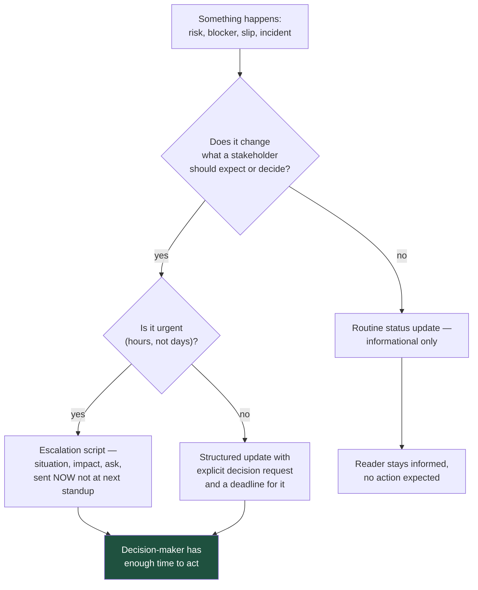

# Eight Scripts for the Conversations You'd Rather Not Have

Every one of these conversations goes better when you've already decided what you're going to say. Improvising an escalation, a pushback, or bad news under time pressure is how "we're a bit behind" becomes the headline instead of the actual risk.

## The Real-World Problem

A platform engineer at a mid-size insurer, Halvard Group, discovered three weeks before a regulatory go-live that a data migration would not finish inside the maintenance window. She raised it in the daily stand-up as: "Just a heads up, the migration might take longer than we thought, we're looking into it." The programme director heard "minor delay, being handled" and told the steering committee the date was safe.

Nine days later, with no script for escalation and no clear ask, she was still "looking into it" in stand-up. The actual risk — a hard compliance deadline that would be missed without a scope cut agreed *now* — never reached anyone who could make that call. When it finally did reach them, four days remained instead of twenty, and the resulting scope cut was worse than the one available three weeks earlier.

The problem was never technical. It was that "heads up" is not an escalation, and nobody had a script for turning a risk into a decision request.

## The Concept

Every script below follows the same shape, because the shape is what a stakeholder can act on:

1. **Situation** — one sentence, no throat-clearing.
2. **Impact** — what it means for them, in terms they're measured on.
3. **Ask** — the specific decision or action you need, by when.
4. **Options** (where relevant) — a small number, with your recommendation named.

Never send a status update with no ask. If there is nothing you need from the reader, that's fine — say so explicitly ("no action needed, sharing for visibility") so they don't have to guess whether you're waiting on them.

## How It Works



The failure in the scenario above happened at `B`: a genuine decision point was routed through `C` instead of `D`, so it never generated an ask.

## Practical Example

### 1. Weekly status update

**Situation:** Routine, no crisis, but silence invites status-chasing.

```
Subject: Claims Intake API — Week of Mar 9

Status: On track for Mar 28 release.

- Done: Validation schema finalised and reviewed with Compliance.
- In progress: Server Action wiring, ~60% complete.
- Next: Integration testing against the sandbox KYC provider (starts Mar 16).
- Risk: None currently. If the sandbox provider's certificate renewal (due Mar 14,
  owned by their team) slips, testing slips with it — flagging so it's on your radar,
  no action needed from you yet.

No action needed. Will flag immediately if the certificate renewal slips.
```

**Never say:** "Making good progress" with no specifics — it answers nothing and invites a follow-up meeting to get the actual details.

### 2. "I am blocked" escalation

**Situation:** A dependency outside your control is stopping work, right now.

```
Subject: BLOCKED — Claims Intake API — need a decision by EOD Wed

Situation: The sandbox KYC provider's API has been returning 500s since Monday.
Their support ticket (REF-88213) has had no response in 48 hours.

Impact: Integration testing cannot start. If unresolved by Wednesday, the Mar 28
release date is not achievable — we lose roughly one day of the test window for
every day this continues.

Ask: I need one of two decisions by end of day Wednesday:
  (a) Compliance escalates directly to the provider's account team (they have a
      relationship we don't), or
  (b) We agree now to slip the release by the number of days lost, so Comms can
      plan the customer notification early rather than late.

I recommend (a) first, with (b) as the fallback if there's no response by Wednesday.
```

**Never say:** "I'll keep trying and let you know" — that is not an ask, and it is what turns a one-day blocker into a nine-day one.

### 3. Pushing back on an unrealistic date

**Situation:** You're asked to commit to a date you know is not achievable as scoped.

```
Subject: Re: Can we have the fraud-scoring integration by Apr 1?

Short answer: not at full scope. Here's why, and what I can commit to.

The integration needs three things: the new scoring endpoint (owned by Risk Eng,
currently in their Q2 backlog), our consumption code (2 weeks once their endpoint
is stable), and a shadow-mode validation period before we trust the score in
production (regulatory requirement, minimum 2 weeks — this isn't negotiable on
our side).

Even if our code were done today, the shadow-mode window alone pushes this past
Apr 1.

What I can commit to: full integration live by May 15, assuming Risk Eng's
endpoint is stable by Apr 15. Alternative: if Apr 1 is a hard date for a specific
reason, I can scope a version that flags high-risk claims for manual review
instead of auto-scoring them — that's achievable by Apr 1, with fraud scoring
replacing manual review by May 15.

Which of those fits what you need?
```

**Never say:** "I'll try" or "we'll do our best" to a date you already know is wrong — it commits you to nothing and commits the reader to a date that will slip anyway, just later and with less warning.

### 4. Live incident update to non-technical stakeholders

**Situation:** Something is broken in production, right now, and stakeholders need to know without a technical debrief.

```
Subject: [INCIDENT] Payment processing degraded — update 1 of N

What's happening: Since 14:12, roughly 1 in 5 card payments are failing on first
attempt. Customers see an error and can retry — most retries succeed.

Who's affected: Card payments only. Direct debit and bank transfer are unaffected.

What we're doing: Engineering has identified the likely cause (a downstream
provider) and is applying a fix. ETA for full resolution: 15:00, next update by then
regardless of outcome.

What you can tell customers if asked: "We're aware of an intermittent issue with
card payments and are actively resolving it. Other payment methods are unaffected."

Next update: 15:00, or sooner if anything changes.
```

**Never say:** anything containing "root cause", "microservice", or "connection pool" — save the technical detail for the postmortem; this update exists to answer "should I be worried and what do I tell people," not "what broke."

### 5. Post-incident summary

**Situation:** The incident is resolved; stakeholders need the close-out, not the runbook.

```
Subject: Incident closed — Payment processing degradation, Mar 11

Summary: Card payments failed intermittently for 48 minutes (14:12–15:00). Roughly
1,200 customers were affected; 94% succeeded on retry without contacting support.
No data was lost and no payment was charged twice.

Cause: A third-party payment provider had a partial outage. Our system did not
fail over to the backup provider automatically as designed.

Fix already applied: Automatic failover has been corrected and tested.

Preventing recurrence: We're adding a monthly automated test that verifies
failover actually works, rather than trusting that it will (ticket PAY-2201, done
by Mar 25).

Customer impact requiring follow-up: None expected — no double charges occurred.
Support has a list of the ~70 customers who contacted them, for awareness only.
```

**Never say:** a summary with no "preventing recurrence" section — a post-incident summary that only explains what happened, without what changes, invites the same incident again and reads as if nothing was learned.

### 6. Asking for time to address technical debt

**Situation:** You need capacity allocated to fix something that has no feature attached to it.

```
Subject: Request: 2 sprints on the rating module — here's the business case

Ask: 2 sprints (1 engineer) to add test coverage and extract the factor
calculation in the legacy rating module.

Why now: Rating changes in this module take a median of 11 days, versus 2.4 days
everywhere else, and 38% need a follow-up fix versus 9% elsewhere. That's roughly
120 engineer-days/year of avoidable delay, based on last year's change volume.

Why it matters beyond engineering time: The next mandated regulatory rating change
typically comes with an 8–12 week statutory deadline. At the current 11-day/change,
38%-rework baseline, we would not deliver a multi-factor change inside that window.

Cost to fix vs. cost of not fixing: 2 sprints now vs. an estimated 3-month delivery
risk on the next mandated change, whenever it lands.

I'm not asking for a "refactoring sprint later" — I'm asking for 2 sprints now,
because "later" is when the mandated change usually arrives.
```

**Never say:** "the code is a mess and we should clean it up" — it has no number attached and will lose to any feature request that does.

### 7. Delivering bad news about a slipped commitment

**Situation:** You said a date was achievable and it no longer is.

```
Subject: The Mar 28 date is no longer achievable — here's what happened and the new plan

I told you Mar 28 was achievable three weeks ago. It isn't, and I want to tell you
now rather than let it slip quietly.

What changed: The sandbox KYC provider's outage cost us 6 working days we hadn't
planned for, and their fix introduced a response-format change that needs 3 more
days of rework on our side.

New date: Apr 9, with the outage risk now behind us and the rework already
underway. I'm confident in this date because the remaining work is fully scoped
and doesn't depend on any external party.

What I'm doing differently: I should have flagged the provider outage as a release
risk on day one instead of day three — noted for next time.
```

**Never say:** "we're a bit behind" as a substitute for a new date — vague slippage language is what erodes trust; a specific new date with a stated reason rebuilds it.

### 8. Declining a mid-sprint scope addition

**Situation:** A stakeholder asks for "just one more small thing" mid-sprint.

```
Subject: Re: Can we add CSV export to this sprint?

I can't add it to this sprint without either dropping something already
committed, or extending the sprint — neither of which I'd do without checking
with you first.

What I can do: Add it to next sprint's planning (starts Mon Mar 16), where it's a
2-day item based on a first look. Or, if it's genuinely more urgent than what's
already committed, tell me which committed item to drop and I'll swap it today.

Which would you prefer?
```

**Never say:** a bare "yes" that quietly turns into unpaid overtime, or a bare "no" with no path forward — both create the impression that scope management is either absent or arbitrary.

## Enterprise Trade-offs

| Approach | Pros | Cons | When to use (Banking / Insurance / Enterprise) |
|---|---|---|---|
| **Situation → impact → ask, every time** | Reader can act without a follow-up meeting; ambiguity about urgency disappears | Takes longer to write than "just a heads up" | Default for anything that could change a stakeholder's plan or a deadline |
| **Escalating immediately vs. waiting for the next standup** | Decision-makers get maximum lead time to act | Feels like "crying wolf" if overused on non-urgent items | Use only when hours, not days, matter — calibrate against the actual deadline math |
| **Naming a recommendation vs. presenting neutral options** | Faster decisions; stakeholders trust engineers who commit to a view | Wrong occasionally, and visibly so | Default — a neutral options list without a recommendation just relocates the decision-making work to someone with less context |
| **A specific new date vs. "as soon as possible"** | Rebuildable trust; lets other teams plan around it | Requires confidence in the estimate, which requires having actually re-scoped | Always prefer a specific date; only use a range when the uncertainty itself is the honest answer, and say why |
| **"No action needed" explicitly stated** | Removes the ambiguity of whether you're waiting on the reader | One extra line | Include on every informational update — the absence of this line is what causes readers to sit on messages waiting for a cue that was never coming |

## Why This Still Matters Through 2030

None of these scripts depend on a particular tool, methodology, or org chart, which is why they don't age the way process fads do — situation-impact-ask is as valid in a Slack thread as it was in a memo. What does keep rising is the cost of the alternative: as delivery timelines compress and regulatory deadlines get less negotiable, the gap between "flagged three weeks early with time to act" and "flagged three weeks early but not really" is exactly the gap the scenario above illustrates, and it only gets more expensive as slack in the schedule shrinks. The other trend worth naming is that more written communication is now drafted with AI assistance, which makes the discipline of stating a real ask more valuable, not less — a fluently-written update with no decision request is easier than ever to produce and exactly as useless as it always was.

→ Next: [06-golden-rules-confident-communication.md](06-golden-rules-confident-communication.md) · Related: [01-talking-to-pm.md](01-talking-to-pm.md) · [03-talking-to-operations.md](03-talking-to-operations.md) · [../01-core-concepts/07-observability-mindset.md](../01-core-concepts/07-observability-mindset.md)
