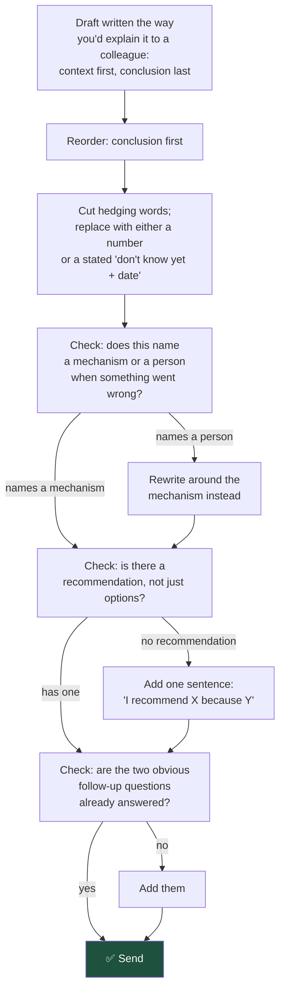

# Say the Conclusion First: The Rules That Make You Sound Like You Know

Two engineers can know exactly the same amount and be trusted completely differently, purely because of how they structure what they say. Confidence, in writing, is a set of habits — not a personality trait.

## The Real-World Problem

An infrastructure engineer at a logistics-software vendor, Anders Reyes, was technically the strongest person on his team and consistently the last person leadership trusted with an ambiguous problem. His updates read like this: "So I looked into the deployment issue, and there might be a few things going on — it could be related to the connection pool settings, though I'm not 100% sure, and there's also a chance it's something with the load balancer config, we might need to dig into that more, but I think we're probably okay for now, though I'd want to double check."

Everything in that sentence was accurate. None of it was usable. His manager read it three times trying to extract an answer to "are we at risk for tomorrow's release," found none, and scheduled a call to ask him directly — the exact conversation the written update should have made unnecessary. Reyes was doing the analytical work correctly and destroying its value in the delivery.

Six months of deliberately restructuring his updates — leading with the conclusion, separating what he knew from what he didn't, giving a single recommendation instead of a tour of possibilities — changed nothing about his technical judgment and everything about how much of it leadership actually used.

## The Concept

### Lead with the conclusion (BLUF — bottom line up front)

State the answer in the first sentence. Everything after that is support for a conclusion the reader already has, not suspense building toward one. "We're on track for Friday" or "we will miss Friday by two days" belongs in sentence one, not paragraph three.

### State impact before mechanism

A stakeholder needs to know *what it means for them* before they need to know *why it happened*. "Checkout will be slower for EU customers during peak hours" comes before "we're seeing connection pool exhaustion on the payments service." Lead with mechanism and most readers stop paying attention before they reach the part that matters to them.

### Give a recommendation, not an options dump

Three options with no stated preference is not analysis — it's relocating the decision to someone with less context than you have. If you've done the thinking, say what you'd do. "I recommend B because—" is a sentence a reader can act on in five seconds. A neutral list of pros and cons for A, B, and C is a homework assignment you're handing back to them.

### Quantify, or say plainly that you cannot yet — with a date

"It's slow" is not information. "p95 latency is 340ms against a 200ms target" is. When you genuinely don't have a number yet, the honest version is "I don't have a number yet; I'll have one by Thursday" — not a vague qualitative substitute dressed up to sound like an answer.

### Own uncertainty with a resolution date, not with hedging

There is a real difference between hedging and honest uncertainty, and the difference is whether a date is attached. "This might work, we'll see" is hedging — it commits to nothing and resolves nothing. "I'm not certain this fixes it; I'll know for sure after the load test finishes Thursday" is uncertainty stated honestly, with a plan to remove it.

### Never blame a person or team in writing

Name the mechanism, not the person. "The deploy failed because the migration script wasn't tested against production data volumes" is useful and calm. "Priya's migration script broke prod" is neither useful nor calm, and it is the sentence people remember and stop trusting you around.

### Answer the question asked before adding anything else

If someone asks "will we hit Friday," the first sentence answers yes or no. Context, caveats, and next steps come after that sentence exists, not instead of it.

### Pre-empt the two obvious follow-up questions

Before you send an update, ask: what will the reader ask next? Usually it's "what does this mean for me" and "what do you need from me." Answer both before they have to ask, and you've saved a reply cycle that often takes a day to complete.

## How It Works



This is a five-minute edit pass, not a rewrite from scratch — most drafts already contain the right information in the wrong order.

## Practical Example

**Hedging words that destroy credibility, and what to say instead:**

| Instead of | Say |
|---|---|
| "It might be an issue with…" | "The most likely cause is X; I'll confirm by [date]" |
| "We should probably look into…" | "I'm investigating X, expect an answer by [date]" |
| "This could potentially cause problems" | "This will cause [specific problem] if [specific condition]" |
| "I think it's mostly working" | "It's working for [specific case]; [specific case] still fails" |
| "There's a chance we might slip" | "We will slip by [N days] unless [specific condition changes]" |
| "It's kind of complicated" | "There are two moving parts: [X] and [Y]. Here's how they interact." |
| "We'll try to have it done by Friday" | "It will be done by Friday, assuming [named dependency] lands on time" |
| "I'm not 100% sure but I think…" | "My best estimate is [X], confidence [high/medium/low], because [reason]" |

The right column isn't more confident by tone — it's more confident because it contains something the hedged version doesn't: a number, a date, or a named condition.

**Full before/after rewrite of Reyes's message:**

```
BEFORE:
So I looked into the deployment issue, and there might be a few things going
on — it could be related to the connection pool settings, though I'm not
100% sure, and there's also a chance it's something with the load balancer
config, we might need to dig into that more, but I think we're probably okay
for now, though I'd want to double check.
```

```
AFTER:
We are not at risk for tomorrow's release.

The deployment issue is caused by connection pool exhaustion under load — I
confirmed this by reproducing it in staging at 2x expected traffic. It does
not affect normal traffic levels, which is why it hasn't shown up in
production yet.

Fix: increasing the pool size from 20 to 50 connections, deploying today.
I'll confirm the fix holds by re-running the same load test this afternoon
and will flag immediately if it doesn't.

No action needed from you unless the afternoon test fails — I'll send an
update either way by 4pm.
```

The second version states the answer to "are we at risk" in sentence one, gives one cause instead of two speculative ones, names a specific fix with a number, and tells the reader exactly when they'll hear more and what would change their world if they did.

## Enterprise Trade-offs

| Approach | Pros | Cons | When to use (Banking / Insurance / Enterprise) |
|---|---|---|---|
| **BLUF with a stated recommendation** | Fast for the reader to act on; builds trust over time | Feels exposed the first few times — you're visibly committing to a view | Default for all written updates to stakeholders |
| **Exhaustive options with no recommendation** | Feels safer — nothing to be "wrong" about | Relocates the decision to someone with less context; slower for everyone | Only when you genuinely have no basis to prefer one option, and say so explicitly |
| **Hedged, qualitative language ("might", "could", "probably")** | Feels lower-risk to write | Unusable by the reader; erodes trust faster than being occasionally wrong with a clear number | Never as a default; reserve genuine uncertainty for cases where a number truly isn't available yet, and attach a date for when it will be |
| **Naming the mechanism, not the person, when things go wrong** | Keeps the conversation focused on fixing the system; preserves trust across the team | Occasionally feels like it's letting someone "off the hook" | Always in writing; a direct 1:1 conversation about individual performance is a different conversation, held separately |
| **A specific date vs. "soon" / "shortly"** | Lets other people and teams plan around it | Requires you to have actually thought it through before committing | Always prefer a date; use a stated range only when the range itself is the honest, calculated answer |

→ Domain complete. Related: [05-meeting-scripts.md](05-meeting-scripts.md) · [04-technical-to-business-translation-table.md](04-technical-to-business-translation-table.md) · [01-talking-to-pm.md](01-talking-to-pm.md)
