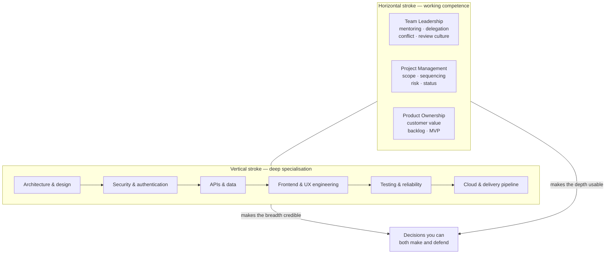

# The T-Shaped Technical Leader: One Career, Not Four

Every senior engineer eventually hits the same fork in the road: go deeper into the code, or step away from it into management. The framing is wrong. The engineers who end up hardest to replace did neither — they kept one deep specialisation and added enough leadership, delivery, and product judgment to make that depth usable by the rest of the organisation.

## The Real-World Problem

A payments platform team at a mid-size retail bank has a senior engineer — eight years in, owns the transaction-ledger service, the person everyone pings when a settlement job behaves strangely. Two offers land in the same quarter.

The first is a staff-engineer track: stay on the tools, go deeper into distributed systems, own the ledger and eventually the whole payments data model. The second is an engineering-manager track: hand the ledger to someone else, pick up six direct reports, own headcount and performance reviews.

Both look like promotions. Both are also traps in their pure form. The staff track, taken narrowly, produces someone whose influence stops at the boundary of one service — brilliant in design review, silent when the steering committee decides which quarter the migration lands in. The manager track, taken abruptly, produces someone whose technical judgment has an expiry date; two years after their last commit they are approving architecture decisions on the strength of what was true in 2026.

The engineer takes neither exclusively. They stay the deepest person on the ledger *and* start running the design reviews, writing the delivery status the steering committee reads, and arguing the customer case for which settlement features ship first. Eighteen months later they are the person the bank puts in front of the regulator, the vendor, and the board — because they are the only one who can answer questions from all four directions without a translator.

## The Concept

### What the T actually means

The vertical stroke is depth: one domain you can be held accountable for at the level of implementation detail. For the audience of this knowledge base, that is software engineering — architecture, security, APIs, data, frontend, testing, operations.

The horizontal stroke is working competence — not mastery — across three adjacent disciplines:

- **Team leadership** — growing other engineers, running review culture, resolving conflict, making a team faster than the sum of its members.
- **Project management** — scope, sequencing, dependencies, risk, and the honest status report.
- **Product ownership** — customer value, backlog priority, deciding what is worth building at all.

The vertical stroke is what makes the horizontal credible. The horizontal stroke is what makes the vertical matter to anyone outside the engineering room.

### Working competence is a real and finite bar

The most common misreading of the T is that it demands four careers in parallel. It does not. Working competence means:

- You can produce the artefact yourself at acceptable quality — a project charter, a risk log, a well-formed user story, a delegation plan.
- You can tell a good one from a bad one when a specialist produces it.
- You know when to stop and hand the work to a specialist, and you know what to ask them for.

You are not competing with a full-time project manager on earned-value analysis or with a product manager on pricing strategy. You are removing the translation layer between engineering reality and the decisions made about it.

### Why the pure paths get brittle

Pure depth is fragile against technology cycles and reorganisations. The most valuable specialist on a technology stack is exposed the moment the organisation decides to move off that stack — and the decision to move is made in rooms they are not in.

Pure management is fragile against credibility decay. Authority over engineers that is not backed by the ability to read their design document erodes quietly, and it erodes fastest in exactly the moments it is needed: an incident, an audit, a vendor negotiation where the vendor knows more than you do.

The T is durable because both strokes reinforce each other. Depth earns you the right to be heard; breadth gets you into the room where being heard changes something.

## How It Works

Read the diagram as a claim about direction of influence, not a hierarchy. Depth flowing upward is credibility: nobody accepts a delivery estimate from someone who cannot read the code it is based on. Breadth flowing downward is reach: nobody funds an architecture your stakeholders cannot connect to a customer outcome.

## Practical Example

Take the bank's ledger engineer through a single decision — the settlement service must migrate off a shared database before the next audit cycle — and watch which stroke does the work at each step.

**Step 1 — the technical assessment (depth).** They map the coupling: four services read the settlement tables directly, two of them write. They know without asking that one of those writers is a nightly reconciliation job whose failure mode is silent. This is not researchable in a week; it is accumulated depth. Cross-reference: [`01-core-concepts/04-data-integrity-and-migrations.md`](../01-core-concepts/04-data-integrity-and-migrations.md).

**Step 2 — the delivery shape (project management).** They break it into an expand/contract sequence with three milestones, name the dependency on the reconciliation team's release window, and log the top risk as *"reconciliation job writes to the old schema after cutover — detection is silent."* That risk entry is what gets the reconciliation team's attention six weeks early, which is the entire point.

**Step 3 — the value case (product ownership).** The steering committee does not fund "decoupling." They fund "settlement disputes currently take four days to investigate because the audit trail is spread across two schemas; after this we can answer a disputed transaction the same day." Same work, framed as the outcome someone outside engineering can defend in their own meeting.

**Step 4 — the team (leadership).** They do not do the migration themselves. Two mid-level engineers do it, with the ledger engineer running the design review and taking the on-call escalation during cutover weekend. Their measure of success is that the second migration, six months later, happens without them.

Four strokes of the T on one piece of work. A pure specialist stops after step 1 and wonders why the work never gets prioritised. A pure manager starts at step 3 and gets the risk wrong.

## Enterprise Trade-offs

| Path | Pros | Cons | When it fits in Banking / Insurance / Enterprise SaaS |
|---|---|---|---|
| **Deep specialist (pure IC)** | Highest technical authority; irreplaceable on a specific system; no people-management overhead | Influence bounded by one system; excluded from funding and sequencing decisions; exposed to stack and reorg changes | Deep-platform work with a long horizon — core banking engines, actuarial calculation kernels, HSM/crypto layers |
| **People manager (pure)** | Formal authority; owns headcount and career paths; clear org-chart progression | Technical credibility decays within ~2 years; weak in incident, audit, and vendor-negotiation moments | Large stable orgs with a strong separate architect function that supplies technical judgment |
| **T-shaped technical leader** | Credible in both directions; no translation layer; durable across reorgs and stack changes | Slower depth accumulation than a pure IC; requires deliberate practice in three unfamiliar disciplines; easy to stall at shallow-in-everything | Regulated, multi-stakeholder delivery — the default for enterprise SaaS, insurance platforms, and bank transformation programmes |
| **Sequential (deep first, then manage)** | Depth is banked before the switch; common and well-understood path | The switch is abrupt; leadership skills get learned live, on a real team, under delivery pressure | Works when the org offers a genuine tech-lead stepping stone rather than a straight jump to line management |

---

**Next:** [`02-skill-framework-overview.md`](02-skill-framework-overview.md) breaks the two strokes into five concrete skill clusters.
