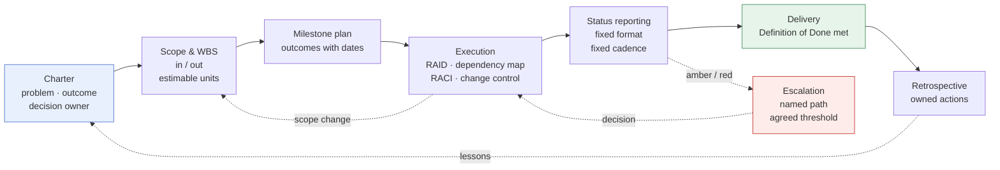

# Delivery You Can Defend: Project Management for Engineers

Engineers are taught to distrust project management, usually after meeting it in its worst form — a spreadsheet of dates nobody believes, maintained by someone who cannot read the code. Done properly it is the opposite: the discipline of making commitments you can actually keep, and being able to say early and precisely when you cannot.

## The Real-World Problem

A wholesale bank is replacing the reporting layer that feeds its regulatory submissions. The deadline is not negotiable — a regulator-mandated reporting standard takes effect at the end of Q3, and late means a formal finding. Four teams are involved: the data platform team, two product teams that own the source systems, and an external vendor supplying the submission gateway.

Twelve weeks in, the programme is reported green. In week fourteen it goes red in a single meeting, and the reason turns out to have been true since week three: the vendor's gateway only accepts submissions signed with a certificate issued by the bank's internal PKI, and the PKI team's onboarding process takes eight weeks and had never been started. Nobody hid it. Nobody owned it either. It was mentioned once, in a channel, by an engineer who assumed the programme manager had it.

The failure is not the certificate. It is that a hard external dependency with an eight-week lead time was never written down anywhere that forced someone's name against it. That is the specific job the artefacts in this article do — not ceremony, but converting things that are known by someone into things that are owned by someone.

## The Concept

Project management for a technical leader is three groups of artefacts. Each exists to answer one question that will otherwise be answered late and expensively.

### Planning artefacts — *what are we committing to?*

- [ ] **Project charter** — one page: the problem, the outcome, what success is measured by, who decides, and who is accountable. If it takes more than a page, the scope is not agreed yet.
- [ ] **Scope statement, with an explicit out-of-scope list** — the out-of-scope list is the half that prevents arguments in month four
- [ ] **Work breakdown** — decompose to units small enough to be estimated with a straight face, typically under two weeks
- [ ] **Milestone plan** — outcomes with dates, not activities with dates. "Submission gateway signs and accepts a test payload" is a milestone; "integration work" is not.
- [ ] **Estimates with a stated basis and a stated uncertainty** — say what could make it double
- [ ] **Definition of Done agreed before the work starts** — see [`00-project-setup-roadmap/10-definition-of-done.md`](../00-project-setup-roadmap/10-definition-of-done.md)

### Execution artefacts — *what could stop us, and who owns each thing?*

- [ ] **Risk log / RAID** — Risks, Assumptions, Issues, Dependencies. Every entry has an owner, an impact, a likelihood, and a mitigation or a decision to accept it. A risk with no named owner is a rumour.
- [ ] **Dependency map** — every external thing you need, with its lead time and the date you must have started asking. This is the artefact that saves the bank in the scenario above.
- [ ] **RACI** — who is Responsible, Accountable, Consulted, Informed for each significant decision. Worth doing once, at the start, precisely for the decisions people assume are someone else's.
- [ ] **Change control** — a written route for scope changes, so "small additions" are visible rather than absorbed silently by the team
- [ ] **Decision log** — what was decided, when, by whom, and why. In regulated programmes this doubles as audit evidence — see [`00-project-setup-roadmap/08-documentation-baseline.md`](../00-project-setup-roadmap/08-documentation-baseline.md)

### Reporting artefacts — *does everyone have the same picture?*

- [ ] **Regular written status** in a fixed format (template below) — same shape every time, so readers can diff it against last week
- [ ] **Escalation path** — named, agreed in advance, with the threshold that triggers it written down
- [ ] **Stakeholder map** — who needs what information, at what depth, how often — see [`11-stakeholder-communication/01-talking-to-pm.md`](../11-stakeholder-communication/01-talking-to-pm.md)
- [ ] **Retrospectives** that produce owned actions, and a review of the previous retrospective's actions before generating new ones

### The status report template

Fixed sections, same order every time. Fits on one screen; if it does not, the programme has a bigger problem than reporting.

```markdown
## <Programme name> — Status, week ending <date>

**Overall status:** 🟢 Green / 🟡 Amber / 🔴 Red
**Change since last report:** <Green→Amber, and why — or "no change">

### Completed this period
- <Outcome, not activity. "Gateway accepts signed test payload" not "worked on gateway".>

### Next period
- <What will be true by the next report, specific enough to be verifiably wrong.>

### Risks
| Risk | Impact | Likelihood | Owner | Mitigation |
|---|---|---|---|---|
| <what could go wrong> | H/M/L | H/M/L | <name> | <action, with a date> |

### Blockers
- <What is stopped right now, who can unblock it, and by when it must be unblocked.>

### Decisions needed
- <The decision, the options, your recommendation, and the date after which the
  default answer applies. Never present a decision without a recommendation.>
```

Two rules make this template work. **Status colour is about confidence in the commitment, not about mood** — a programme with an unmitigated eight-week dependency is amber even if everyone is busy and cheerful. And **"decisions needed" always carries a recommendation and a deadline**, because a decision request without a recommendation is work you have pushed onto someone with less context than you.

## How It Works



The dotted lines matter more than the solid ones. The solid path is what a plan looks like on a slide; the dotted paths — escalation, scope change, and lessons feeding the next charter — are what actually happens, and a programme without them just discovers the same problems later.

## Practical Example

Rewind the bank's regulatory reporting programme to week one and apply the artefacts. The work is roughly a day and a half of effort in total.

**Charter (half a day, week 1).** One page. Problem: the current reporting layer cannot produce the new mandated submission format. Outcome: signed submissions accepted by the regulator's gateway from the effective date. Success measure: three consecutive successful production dry-runs before the deadline. Decision owner: the Head of Regulatory Reporting. Out of scope, stated explicitly: decommissioning the legacy reporting path, which is deferred to the following year.

**Dependency map (two hours, week 1).** Listing every external need with its lead time is where the certificate surfaces:

| Dependency | Owner | Lead time | Must start by | Status |
|---|---|---|---|---|
| Vendor gateway sandbox access | Vendor account manager | 2 weeks | Week 3 | Requested |
| **PKI certificate for submission signing** | **Internal PKI team** | **8 weeks** | **Week 4** | **Not started** |
| Source-system extract for product B | Product B team | 4 weeks | Week 6 | Not started |
| Production firewall rule to gateway | Network security | 3 weeks | Week 10 | Not started |

Nobody had to be clever. The question "what do we need from outside this room, and how long does it take to get?" asked once, in week one, converts an eight-week silent killer into a line item with a name and a date.

**RAID entry (week 1).**

> **R-04 (Dependency).** Submission signing requires a certificate from the internal PKI, whose issuance process takes ~8 weeks and has not started. *Impact:* High — no submission is possible without it. *Likelihood:* High if unowned. *Owner:* programme technical lead. *Mitigation:* raise the PKI request in week 2; confirm in writing whether the sandbox can use a self-signed certificate so integration work can proceed in parallel. *Review:* weekly until issued.

**Status report, week 3.** Overall status **amber**, not green, with the reason stated: *"Certificate issuance is on the critical path with no float. Programme returns to green when the certificate is issued or a parallel path is confirmed."* Reporting amber in week three is what makes the difference — it is not bad news, it is the whole value of the exercise. The escalation to the PKI team's head happens in week four instead of week fourteen, and eight weeks of lead time turns out to be available when it starts in month one rather than month four.

**Retrospective.** The action is not "communicate better." It is a control: *every programme charter in this portfolio now requires a dependency map with lead times before funding is released.* That change outlives the programme.

## Enterprise Trade-offs

| Delivery approach | Pros | Cons | When to use it in Banking / Insurance / Enterprise SaaS |
|---|---|---|---|
| **Lightweight (charter + risk log + written status)** | Roughly a day of setup; catches the majority of avoidable failures; teams tolerate it | Insufficient for large multi-vendor programmes; no formal change control | Default for single-team or two-team work — this is where most technical leads should operate |
| **Full formal PM (WBS, RACI, change control, stage gates)** | Auditable; scales across many teams and vendors; expected by regulators and PMOs | Heavy; can substitute reporting for delivery; needs a dedicated PM to sustain | Regulatory programmes, core banking migrations, multi-vendor integrations with contractual dates |
| **Agile-only (backlog and sprint goals, no programme layer)** | Fast feedback; minimal overhead; strong for product discovery | Blind to long-lead external dependencies — a sprint board has nowhere to put an eight-week certificate | Product-team work with few external dependencies and a movable date |
| **Hybrid (agile execution inside a milestone and RAID frame)** | Keeps team-level agility while making external commitments visible | Requires the lead to genuinely work both layers rather than only the comfortable one | The realistic default for enterprise SaaS and most insurance delivery |

## Why This Still Matters Through 2030

The parts of delivery that fail are not the parts that get faster. Tooling has compressed how long it takes to build a thing; it has not compressed how long a certificate authority takes to issue a certificate, how long a vendor takes to provision a sandbox, or how long a security review takes to schedule. As implementation time shrinks, the proportion of a delivery date that is coordination rather than construction rises — which makes the dependency map, the named risk owner, and the honest status colour *more* decisive over the next five years, not less.

---

**Next:** [`06-product-owner-skills.md`](06-product-owner-skills.md) — deciding whether the thing is worth building at all.
