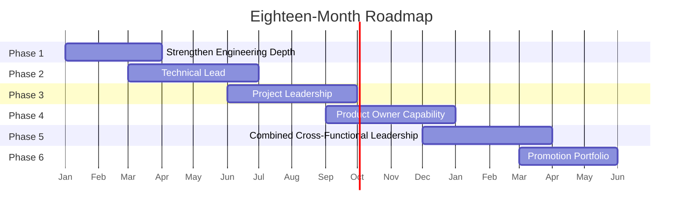

# The Eighteen-Month Roadmap to a T-Shaped Technical Leader

Five skill clusters and a well-argued case for why they matter do not by themselves change anyone's Tuesday. This article sequences them into six phases with real outputs and real readiness signals, so the plan survives contact with an actual job.

## The Real-World Problem

A senior engineer at a regional insurance group's platform team wants the Principal Engineer track, but the org's only other visible path is engineering management, which she does not want. She asks her skip-level what the Principal track actually requires and gets "broader technical influence and some leadership," which is not something she can act on next Monday.

Left without a plan, the default outcome is drift: she picks up leadership-shaped work opportunistically whenever it appears, gets partial credit for several half-finished efforts, and eighteen months later has anecdotes instead of evidence. The alternative is to build the roadmap herself, propose it to her manager as a two-way agreement, and use it to convert ambient opportunity into a sequence with checkpoints. That is what this article provides — not because eighteen months is a magic number, but because it is roughly what it takes to build genuine (not performed) competence in three adjacent disciplines without abandoning the depth that got you invited to try.

## The Concept

### Why this order

The six phases below are sequenced, not parallel, for a specific reason: each phase produces the credibility or the vocabulary the next phase needs. Leading a team before your engineering judgment is trusted produces a lead nobody follows. Taking on project delivery before you can lead a team produces a project manager with no team to execute the plan. Product ownership before delivery credibility produces a roadmap nobody believes will actually ship. The order compounds; skipping ahead does not save time, it produces a shallower version of every later phase.

### The six phases

**Phase 1 — Strengthen Engineering Depth (Months 1–3)**
Consolidate the vertical stroke before adding breadth. See [`03-expert-developer-skills.md`](03-expert-developer-skills.md) for the full checklist.
- [ ] Reach teach-and-review level in your primary sub-domain and implement level in at least one adjacent one
- [ ] Own one significant design end to end — document, review, ship, operate
- [ ] Establish a visible pattern of catching real issues in code review, not stylistic ones
- [ ] Write one architecture decision record that a future team will actually consult

**Phase 2 — Technical Lead (Months 3–7)**
Start the identity shift described in [`04-team-lead-skills.md`](04-team-lead-skills.md).
- [ ] Take informal or formal lead responsibility for one workstream or team
- [ ] Delegate at least one piece of work you would previously have done yourself, through to the point where you review rather than write it
- [ ] Run a mentoring relationship with at least one engineer, with a stated goal and a visible outcome
- [ ] Establish or improve a team practice — review standard, onboarding doc, incident process — that outlives your direct involvement

**Phase 3 — Project Leadership (Months 6–10, overlapping Phase 2)**
Apply the artefacts in [`05-project-management-skills.md`](05-project-management-skills.md) to real, funded work.
- [ ] Write a charter and milestone plan for a genuine cross-team piece of work
- [ ] Maintain a risk log with at least one entry that materialises and was mitigated because it was logged early
- [ ] Deliver fortnightly written status reports in the standard format for one full delivery cycle
- [ ] Run one retrospective that produces an owned, completed action

**Phase 4 — Product Owner Capability (Months 9–13, overlapping Phase 3)**
Apply [`06-product-owner-skills.md`](06-product-owner-skills.md) to a real backlog.
- [ ] Run at least three customer or stakeholder discovery conversations and document what you learned
- [ ] Write and ship one feature from a properly formed user story with acceptance criteria, framed around a named riskiest assumption
- [ ] Measure adoption or outcome after release, not just delivery
- [ ] Say no to one request, in writing, with the reasoning and an alternative

**Phase 5 — Combined Cross-Functional Leadership (Months 12–16, overlapping Phase 4)**
Hold more than one cluster simultaneously on the same piece of work, using [`07-shared-leadership-skills.md`](07-shared-leadership-skills.md) as the connective tissue.
- [ ] Run one initiative where you are simultaneously the technical authority, the delivery owner, and a meaningful voice in what gets built
- [ ] Present the same piece of work to an engineering audience and an executive or customer audience, adapting register without changing substance
- [ ] Handle one negotiation or escalation personally rather than routing it to a PM or PO
- [ ] Have at least one instance where your written status or recommendation was accepted without a follow-up meeting to re-explain it

**Phase 6 — Promotion Portfolio (Months 15–18)**
Convert eighteen months of real artefacts into the case, rather than writing the case from memory at the end.
- [ ] Assemble the artefacts actually produced in Phases 1–5 — the ADR, the charter, the user story, the status reports, the mentoring outcome
- [ ] Collect specific, dated feedback from people in each of the four audiences: engineers, your manager, a PM/PO peer, and a business stakeholder
- [ ] Write the portfolio around outcomes ("the team ships the intake service without me in the loop") not activities ("I led a workstream")
- [ ] Have the promotion conversation with evidence already familiar to the panel, not encountered for the first time in the room

## How It Works

Read the overlaps as intentional, not schedule slippage. Phase 2 starts while Phase 1's habits are still being consolidated because a design record and a delegation attempt reinforce each other. Phases 3 and 4 overlap deliberately with the phase before, because a genuine cross-team initiative is usually where both project and product skills get exercised together — manufacturing a separate initiative for each would be slower, not faster.

| Phase | Primary focus | Key deliverable | Readiness signal for the next phase |
|---|---|---|---|
| 1. Strengthen Engineering Depth | Consolidate the vertical stroke | One end-to-end owned design + one durable ADR | Peers route design questions to you before you offer an opinion |
| 2. Technical Lead | Team multiplier, not solver | A delegated outcome someone else now owns end to end | A pull request ships in your area without you touching the code |
| 3. Project Leadership | Delivery you can defend | Charter, milestone plan, risk log tested against reality | Your written status is trusted without a verbal follow-up |
| 4. Product Owner Capability | What's worth building | One shipped feature with a measured outcome | You have said no to a real request and it stuck |
| 5. Combined Cross-Functional Leadership | Holding it all on one initiative | One initiative run across all three horizontal clusters at once | Executives and engineers both come to you directly, not through a translator |
| 6. Promotion Portfolio | Evidence, assembled | A portfolio built from artefacts already produced | The promotion conversation confirms a case the panel has already seen pieces of |

## Practical Example

The insurance platform engineer, applying the roadmap against real work rather than manufactured exercises.

**Months 1–3.** She already owns the claims-intake service technically; she formalises it by writing the ADR for a redesign she had been carrying informally, and starts being the person two other teams ask before touching the intake schema.

**Months 3–7.** She takes de facto tech-lead responsibility on the intake-automation workstream from [`04-team-lead-skills.md`](04-team-lead-skills.md) — this is the same scenario as that article. She delegates the document-classifier work rather than doing it herself, and by month six a second engineer is reviewing pull requests in that area without her.

**Months 6–10.** The intake-automation workstream itself becomes the vehicle for Phase 3: she writes its charter, maintains its risk log — including the PKI-style dependency that would otherwise have surfaced late — and sends fortnightly status. This is not separate work bolted onto her calendar; it is the same initiative viewed through a second lens.

**Months 9–13.** She pushes back on a stakeholder request to add optical-character-recognition support for handwritten claim forms, on the grounds that fewer than 2% of submissions are handwritten and the OCR accuracy on cursive is unproven — instead proposing a manual triage queue for that 2%, in writing, with the reasoning attached. The push-back is accepted. That is the "say no and have it stick" checkbox, and it is more valuable to the portfolio than any feature she shipped.

**Months 12–16.** By month fourteen the workstream needs a decision on whether to extend automation to a second document channel — a genuine build/buy/defer call with cost, timeline, and customer-value dimensions all in play. She runs that decision herself: technical estimate, delivery plan, and business case, presented once to the steering committee in decision order, accepted without a follow-up meeting.

**Months 15–18.** The promotion portfolio is not written from scratch. It is assembled from the ADR, the charter, the risk log entry that caught a real dependency, the declined OCR request, and the single steering-committee presentation — five real artefacts spanning fifteen months of one continuous piece of work, not five disconnected exercises invented to fill a template.

## Enterprise Trade-offs

| Pacing approach | Pros | Cons | When to use it |
|---|---|---|---|
| **Sequential, one cluster fully before the next (as above, with overlap)** | Depth in each cluster is real; artefacts compound on real work | Eighteen months is a real commitment; requires a manager willing to hold the agreement | The default for regulated, slower-moving orgs — banking, insurance |
| **Compressed (all clusters attempted within 6–9 months)** | Faster visible breadth; can suit a genuinely fast-growing team with more opportunity per month | High risk of shallow competence in all four; burns out the vertical stroke | Startups and small teams where the opportunity genuinely arrives faster than 18 months allows |
| **Opportunistic (no plan, take what appears)** | Zero overhead to start | Produces the "anecdotes not evidence" failure mode from the opening scenario | Acceptable only as a fallback in orgs that structurally will not support a formal plan |
| **Manager-led (org assigns each phase)** | Removes the burden of self-direction; institutionally legible | Depends entirely on the manager having a real framework, which most do not — hence this article existing | Large orgs with a genuine, staffed technical leadership development programme |

## Why This Still Matters Through 2030

Eighteen months is long enough that the specific tools inside Phase 1 will have shifted by the time Phase 6 arrives, and that is fine — the roadmap was never about the tools. It is about accumulating four kinds of trust in sequence: trust in your technical judgment, trust that your team improves under your lead, trust that your delivery commitments hold, and trust that your calls on what to build are worth funding. Those four kinds of trust do not get faster to earn as the underlying technology accelerates; if anything, an organisation moving faster needs someone holding all four more urgently, not less.

---

**Next:** [`09-weekly-practice-system-and-metrics.md`](09-weekly-practice-system-and-metrics.md) — the cadence that sustains the roadmap week to week.
